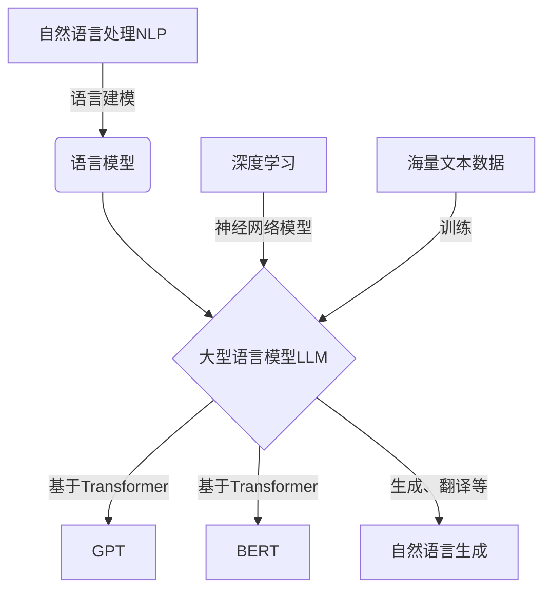
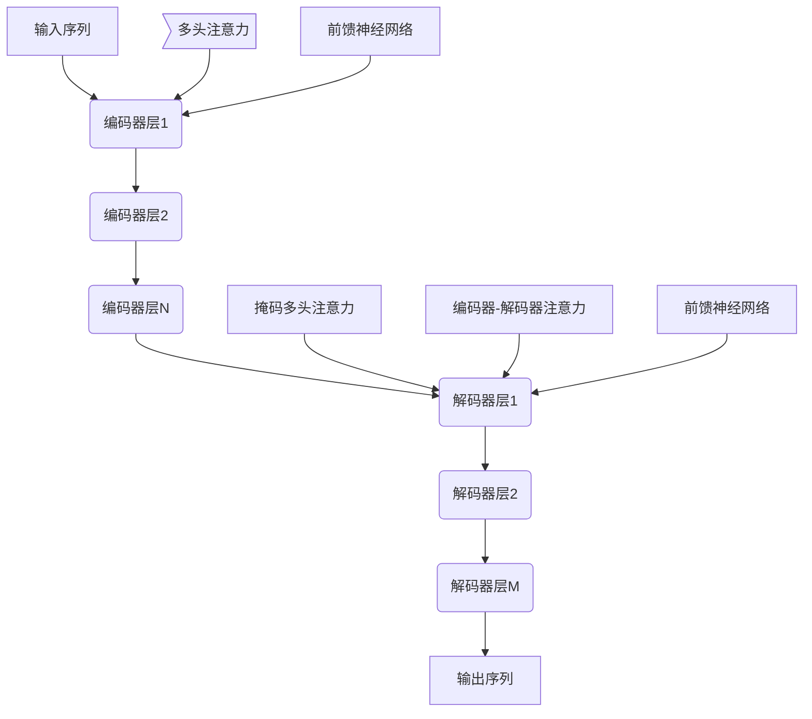

# 基于AI大模型的自然语言生成：写作的未来

## 1.背景介绍

随着人工智能技术的不断进步,尤其是自然语言处理(NLP)和大型语言模型(LLM)的飞速发展,基于AI的自动文本生成正在改变着人类的写作方式。传统的写作过程通常需要作者投入大量的时间和精力,而现在,AI写作助手可以根据简单的提示或关键词生成高质量、连贯的文本内容,极大地提高了写作效率。

人工智能写作技术的兴起源于两个关键因素:一是海量文本数据的积累,二是强大的深度学习算法。通过对大量书籍、新闻报道、网络文章等文本数据进行训练,AI模型可以捕捉语言的模式和规律,掌握语法、语义和上下文关系。利用这些知识,AI系统能够生成看似人工创作的高质量文本。

目前,AI写作助手已经广泛应用于各个领域,如新闻报道、营销文案、小说创作、学术论文撰写等。一些知名的AI写作工具包括GPT-3、DALL-E、ProsePro等。这些系统不仅可以生成连贯流畅的文字,还能根据上下文生成相关图像、代码等多模态内容。

尽管AI写作技术取得了长足进步,但其潜力远未完全发掘。未来,AI写作助手将变得更加智能、个性化,能够捕捉用户的写作风格和偏好,提供更加人性化的写作体验。同时,AI写作也面临着版权、伦理和隐私等挑战,需要制定相应的法规和准则来规范其发展。

## 2.核心概念与联系

### 2.1 自然语言处理(NLP)

自然语言处理是人工智能的一个重要分支,旨在使计算机能够理解和生成人类语言。NLP技术包括语言建模、机器翻译、文本摘要、情感分析等多个方向。语言模型是NLP的核心,通过对大量文本数据进行训练,学习语言的统计规律,从而实现文本生成、机器翻译等任务。

### 2.2 深度学习

深度学习是机器学习的一个新兴方向,其核心是利用神经网络模型对数据进行特征提取和模式识别。与传统的机器学习算法相比,深度学习模型具有更强的表达能力和泛化性,能够从复杂的高维数据中自动学习有用的特征表示。

### 2.3 大型语言模型(LLM)

大型语言模型是指使用海量文本数据训练的巨大神经网络模型,如GPT-3、PaLM等。这些模型能够捕捉语言的深层次结构和语义信息,生成高质量、多样化的文本内容。LLM的出现极大地推动了NLP技术的发展,为自然语言生成、问答系统、机器翻译等应用提供了强大的支持。

上图展示了自然语言处理(NLP)、深度学习、大型语言模型(LLM)和自然语言生成之间的关系。NLP中的语言建模任务催生了语言模型,而深度学习算法和海量文本数据的支持则使得大型语言模型(如GPT、BERT等)成为可能。这些LLM模型可以用于自然语言生成、机器翻译等多种应用场景。

## 3.核心算法原理具体操作步骤

### 3.1 Transformer模型

Transformer是一种全新的基于注意力机制的序列到序列(Seq2Seq)模型,由Google的Vaswani等人在2017年提出。与传统的基于RNN或CNN的模型不同,Transformer完全基于注意力机制来捕捉输入和输出序列之间的长程依赖关系,避免了梯度消失和梯度爆炸的问题,在长序列场景下表现出色。

Transformer的核心组件包括编码器(Encoder)、解码器(Decoder)和注意力机制(Attention Mechanism)三个部分。编码器用于处理输入序列,解码器用于生成输出序列,而注意力机制则负责捕捉输入和输出序列之间的依赖关系。

1. **编码器(Encoder)**

编码器由多个相同的层组成,每一层包括两个子层:多头注意力机制(Multi-Head Attention)和前馈神经网络(Feed-Forward Neural Network)。

- 多头注意力机制负责计算输入序列中每个单词与其他单词之间的注意力权重,捕捉它们之间的依赖关系。
- 前馈神经网络对每个单词的表示进行非线性映射,提供"理解"能力。

2. **解码器(Decoder)**

解码器的结构与编码器类似,也由多个相同的层组成,每一层包括三个子层:

- 掩码多头注意力机制(Masked Multi-Head Attention)用于捕捉已生成的输出序列中单词之间的依赖关系。
- 编码器-解码器注意力机制(Encoder-Decoder Attention)用于捕捉输入序列与输出序列之间的依赖关系。
- 前馈神经网络对每个单词的表示进行非线性映射,提供"理解"能力。

3. **注意力机制(Attention Mechanism)**

注意力机制是Transformer的核心,它允许模型在编码和解码时动态地关注输入序列的不同部分,捕捉长程依赖关系。具体来说,对于每个目标位置的单词表示,注意力机制会计算它与输入序列中所有单词的注意力权重,然后根据这些权重对输入序列进行加权求和,得到该位置单词的注意力表示。

上图展示了Transformer模型的整体结构。输入序列首先经过N个编码器层的处理,得到其编码表示。然后该编码表示被送入M个解码器层,最终生成输出序列。每个编码器层包括多头注意力机制和前馈神经网络两个子层,而每个解码器层包括掩码多头注意力机制、编码器-解码器注意力机制和前馈神经网络三个子层。

### 3.2 自回归语言模型

自回归语言模型(Autoregressive Language Model)是一种常用的语言模型,它根据给定的文本前缀(prompt)生成下一个单词或字符,从而逐步构建出完整的文本序列。这种生成方式与人类写作的过程非常相似,因此自回归语言模型在自然语言生成任务中表现出色。

自回归语言模型的训练过程可以形式化为最大化下一个单词的条件概率的目标函数:

$$P(x_1, x_2, ..., x_n) = \prod_{t=1}^{n}P(x_t|x_1, x_2, ..., x_{t-1})$$

其中$x_1, x_2, ..., x_n$表示文本序列中的单词或字符。模型的目标是最大化生成整个序列的联合概率,即最大化上式的乘积项。

在推理(生成)阶段,给定一个文本前缀$x_1, x_2, ..., x_{t-1}$,模型需要预测下一个最可能的单词$x_t$:

$$x_t = \arg\max_{x}P(x|x_1, x_2, ..., x_{t-1})$$

这个过程将重复进行,直到达到终止条件(如生成了特定的结束标记)。

常见的自回归语言模型包括:

- **基于RNN的模型**:如LSTM、GRU等,利用循环神经网络捕捉序列依赖关系。
- **基于Transformer的模型**:如GPT、OPT等,使用Transformer编码器-解码器架构。
- **生成式预训练Transformer(GPT)**:由OpenAI提出,在大规模无监督语料上预训练,再针对下游任务如机器翻译、文本生成等进行微调(fine-tuning)。

GPT模型家族(GPT、GPT-2、GPT-3等)就是基于自回归语言模型和Transformer架构训练的,在自然语言生成任务上表现卓越。

### 3.3 PPLM算法

尽管大型语言模型能够生成高质量的文本,但其输出往往缺乏针对特定主题或属性的控制能力。为了解决这一问题,研究人员提出了可控文本生成(Controlled Text Generation)的概念和相关算法。

PPLM(Plug and Play Language Model)就是一种简单有效的可控文本生成算法,它通过将一组单词或短语(即属性discriminator)与生成的文本序列进行匹配,从而引导语言模型生成满足特定属性的文本。

PPLM算法的核心思想是在语言模型原有的损失函数基础上,增加一个与属性discriminator相关的损失项,使得生成的文本不仅要符合语言模型本身的概率分布,还要尽可能地满足属性discriminator所描述的属性。

具体来说,PPLM算法在每一步生成新单词时,会计算当前生成的文本序列与属性discriminator之间的相似度分数,并将其作为一个加权损失项,与原始的语言模型损失函数相加。通过调整这个加权系数,可以在语言模型的流畅性和属性匹配程度之间进行权衡。

PPLM算法的优点在于,它是一种"即插即用"的方法,可以与任何预训练的语言模型(如GPT-2、GPT-3等)相结合,无需重新训练模型。同时,通过设计不同的属性discriminator,PPLM可以控制生成文本的多种属性,如主题、情感、风格等,为可控文本生成提供了一种简单而有效的解决方案。

## 4.数学模型和公式详细讲解举例说明

### 4.1 Transformer中的注意力机制

注意力机制(Attention Mechanism)是Transformer模型的核心部分,它允许模型在编码和解码时动态地关注输入序列的不同部分,捕捉长程依赖关系。我们将详细介绍注意力机制的数学原理。

给定一个长度为$m$的查询序列(query sequence) $\boldsymbol{q} = (q_1, q_2, ..., q_m)$和一个长度为$n$的键值对序列(key-value pair sequence) $(\boldsymbol{k}, \boldsymbol{v}) = \{(k_1, v_1), (k_2, v_2), ..., (k_n, v_n)\}$,注意力机制的计算过程如下:

1. **计算注意力分数**

   对于每个查询$q_i$,计算它与所有键$k_j$之间的注意力分数:
   
   $$\text{Score}(q_i, k_j) = q_i^\top k_j$$

   这里使用了查询向量和键向量之间的点积运算。

2. **计算注意力权重**

   将注意力分数通过Softmax函数转化为注意力权重:

   $$\alpha_{ij} = \frac{\exp(\text{Score}(q_i, k_j))}{\sum_{l=1}^{n}\exp(\text{Score}(q_i, k_l))}$$

   其中$\alpha_{ij}$表示查询$q_i$对键$k_j$的注意力权重。

3. **计算注意力输出**

   根据注意力权重对值向量$\boldsymbol{v}$进行加权求和,得到注意力输出:

   $$\text{Attention}(q_i) = \sum_{j=1}^{n}\alpha_{ij}v_j$$

   即注意力输出是所有值向量的加权和,其中权重由查询和键之间的相似性决定。

在实际应用中,Transformer使用了多头注意力机制(Multi-Head Attention),它允许模型同时关注输入序列的不同位置子空间,从而