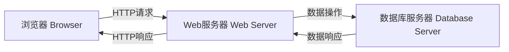
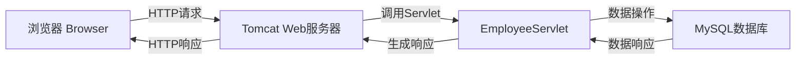

# 基于BS架构的信息管理系统设计与实现

## 1. 背景介绍

在当今信息时代,信息管理系统已经成为各行业不可或缺的重要工具。随着业务需求的不断扩展和数据量的快速增长,传统的单机应用程序已经无法满足企业对信息管理系统的需求。因此,基于BS(Browser/Server,浏览器/服务器)架构的信息管理系统应运而生,它能够有效地解决分布式环境下的数据共享、远程访问等问题,为企业提供高效、灵活的信息管理解决方案。

### 1.1 BS架构概述

BS架构是一种将Web浏览器作为客户端,将应用程序的执行逻辑完全部署在服务器端的架构模式。在这种架构下,客户端只需要一个浏览器,就可以访问服务器上的应用程序,实现数据的查询、修改等操作。BS架构的主要优势包括:

- **跨平台性**: 由于客户端只需要一个浏览器,因此可以在任何操作系统上运行,避免了客户端软件的安装和升级困扰。
- **易于维护**: 应用程序的更新和升级只需要在服务器端进行,无需分发客户端软件包,降低了维护成本。
- **数据安全**: 所有数据都存储在服务器端,客户端只能访问和操作数据,无法直接修改数据源,提高了数据安全性。

### 1.2 BS架构与CS架构对比

与传统的CS(Client/Server,客户端/服务器)架构相比,BS架构具有以下优势:

- **部署灵活**: CS架构需要在每台客户端计算机上安装专用的客户端软件,而BS架构只需要一个浏览器即可访问应用程序。
- **跨平台性强**: CS架构的客户端软件通常只能运行在特定的操作系统上,而BS架构可以在任何操作系统上运行,只要有浏览器即可。
- **维护成本低**: CS架构需要定期更新和升级每台客户端计算机上的软件,而BS架构只需要在服务器端进行升级和维护。

然而,BS架构也存在一些缺陷,如对网络带宽的依赖性较高、对客户端浏览器的兼容性要求较高等。因此,在实际应用中,需要根据具体的业务需求和系统环境,权衡BS架构和CS架构的优缺点,选择最适合的架构方案。

## 2. 核心概念与联系

### 2.1 BS架构的核心组成部分

基于BS架构的信息管理系统通常由以下三个核心组成部分构成:

1. **浏览器(Browser)**: 作为客户端,提供用户界面,接收用户的输入并将请求发送给服务器。
2. **Web服务器(Web Server)**: 负责接收客户端的请求,处理请求并返回相应的响应数据。
3. **数据库服务器(Database Server)**: 用于存储和管理系统中的数据,提供数据访问和操作的接口。

这三个核心组成部分通过网络协议(如HTTP)进行通信和交互,实现了信息管理系统的功能。



### 2.2 BS架构的工作流程

在BS架构的信息管理系统中,典型的工作流程如下:

1. 用户通过浏览器发送HTTP请求到Web服务器。
2. Web服务器接收请求,根据请求的URL和参数调用相应的程序逻辑。
3. 程序逻辑可能需要访问数据库服务器,进行数据查询、插入、更新或删除操作。
4. 数据库服务器执行相应的数据操作,并将结果返回给Web服务器。
5. Web服务器将处理结果生成HTML、XML或JSON等格式的响应数据。
6. 浏览器接收响应数据,并在用户界面上渲染显示。

整个过程中,用户只需要通过浏览器与Web服务器进行交互,而所有的业务逻辑和数据操作都在服务器端完成,实现了"薄客户端"的设计理念。

## 3. 核心算法原理具体操作步骤

在BS架构的信息管理系统中,核心算法主要体现在以下几个方面:

### 3.1 请求处理算法

当Web服务器接收到客户端的HTTP请求时,需要对请求进行解析和处理,以确定调用哪些程序逻辑。常见的请求处理算法包括:

1. **URL映射算法**: 根据请求的URL,将其映射到相应的程序逻辑。例如,在Java Web应用中,可以使用Servlet或Spring MVC等框架实现URL映射。
2. **请求参数解析算法**: 解析HTTP请求中的参数,如查询字符串、表单数据等,并将其转换为程序可以处理的数据结构。
3. **会话管理算法**: 通过会话ID或Cookie等机制,跟踪用户的会话状态,实现用户身份认证、购物车等功能。

### 3.2 数据操作算法

在与数据库服务器进行交互时,需要使用各种数据操作算法,如:

1. **查询算法**: 根据用户的查询条件,构建SQL语句,从数据库中检索符合条件的数据。常见的查询算法包括全表扫描、索引扫描、连接查询等。
2. **插入算法**: 将新数据插入到数据库中,需要处理数据完整性、唯一性约束等问题。
3. **更新算法**: 根据特定条件修改数据库中的现有数据,需要考虑并发控制、事务一致性等问题。
4. **删除算法**: 从数据库中删除符合条件的数据,同样需要处理并发控制和事务一致性。

### 3.3 数据缓存算法

为了提高系统的响应速度和并发处理能力,通常需要采用数据缓存技术,将热点数据缓存在内存中。常见的数据缓存算法包括:

1. **LRU(Least Recently Used)算法**: 根据数据的历史访问记录,将最近最少使用的数据从缓存中淘汰。
2. **LFU(Least Frequently Used)算法**: 根据数据的访问频率,将访问频率最低的数据从缓存中淘汰。
3. **FIFO(First In First Out)算法**: 按照数据进入缓存的顺序,将最先进入的数据淘汰。

### 3.4 数据同步算法

在分布式环境下,多个Web服务器需要共享缓存数据,因此需要采用数据同步算法,保证缓存数据的一致性。常见的数据同步算法包括:

1. **广播算法**: 当任一节点的缓存数据发生变化时,将变化广播给所有其他节点。
2. **主从复制算法**: 将一个节点设置为主节点,其他节点作为从节点,从节点定期从主节点获取最新的缓存数据。
3. **一致性哈希算法**: 通过哈希算法将数据映射到不同的节点,实现数据的均匀分布和自动负载均衡。

## 4. 数学模型和公式详细讲解举例说明

在BS架构的信息管理系统中,常常需要使用各种数学模型和公式来优化系统的性能和效率。以下是一些常见的数学模型和公式:

### 4.1 查询优化模型

在处理数据库查询时,查询优化是一个非常重要的环节。常见的查询优化模型包括:

1. **代价模型(Cost Model)**: 用于估计执行查询所需的代价,包括CPU代价、I/O代价等。常用的代价模型公式如下:

$$
Cost = C_{CPU} \times CPU\_Time + C_{IO} \times IO\_Count
$$

其中,$$C_{CPU}$$和$$C_{IO}$$分别表示CPU和I/O的单位代价,$$CPU\_Time$$表示CPU执行时间,$$IO\_Count$$表示I/O操作次数。

2. **选择性估计模型(Selectivity Estimation Model)**: 用于估计查询条件的选择性,即满足条件的数据占总数据的比例。常用的选择性估计公式如下:

$$
selectivity = \frac{distinct\_values}{total\_values}
$$

其中,$$distinct\_values$$表示满足条件的不同值的数量,$$total\_values$$表示总的不同值的数量。

### 4.2 缓存命中率模型

在使用缓存技术时,缓存命中率是衡量缓存效率的重要指标。常用的缓存命中率模型包括:

1. **LRU命中率模型**: 对于LRU算法,命中率可以近似表示为:

$$
hit\_rate = 1 - \frac{1}{1 + \frac{C}{N}}
$$

其中,$$C$$表示缓存大小,$$N$$表示不同数据项的数量。

2. **LFU命中率模型**: 对于LFU算法,命中率可以近似表示为:

$$
hit\_rate = \sum_{i=1}^{C} \frac{f_i}{N} \cdot \left(1 - \left(\frac{C-i+1}{C}\right)^{f_i}\right)
$$

其中,$$C$$表示缓存大小,$$N$$表示不同数据项的数量,$$f_i$$表示访问频率为$$i$$的数据项的数量。

### 4.3 负载均衡模型

在分布式环境下,负载均衡是保证系统高可用性和可扩展性的关键。常用的负载均衡模型包括:

1. **轮询调度模型(Round-Robin Scheduling Model)**: 将请求按顺序均匀分配给各个服务器,公式如下:

$$
server\_index = (request\_index \bmod server\_count) + 1
$$

其中,$$server\_index$$表示选择的服务器编号,$$request\_index$$表示请求的序号,$$server\_count$$表示服务器的总数。

2. **加权轮询调度模型(Weighted Round-Robin Scheduling Model)**: 根据服务器的权重分配请求,公式如下:

$$
server\_index = \left\lfloor\frac{request\_index}{\sum_{i=1}^{n}w_i}\right\rfloor \bmod n + 1
$$

其中,$$server\_index$$表示选择的服务器编号,$$request\_index$$表示请求的序号,$$n$$表示服务器的总数,$$w_i$$表示第$$i$$个服务器的权重。

通过合理应用这些数学模型和公式,可以有效优化BS架构信息管理系统的性能和效率。

## 5. 项目实践:代码实例和详细解释说明

为了更好地理解BS架构的实现,我们将通过一个简单的示例项目来进行实践。该项目是一个基于Java Web技术的员工信息管理系统,包括员工信息的增删改查等功能。

### 5.1 系统架构

该系统采用典型的BS架构,包括以下几个核心组件:

1. **浏览器(Browser)**: 用户通过浏览器访问系统,发送HTTP请求并接收响应。
2. **Web服务器(Web Server)**: 使用Apache Tomcat作为Web服务器,负责接收请求并调用相应的Servlet进行处理。
3. **数据库服务器(Database Server)**: 使用MySQL作为数据库服务器,存储员工信息数据。



### 5.2 核心代码实现

#### 5.2.1 EmployeeServlet

`EmployeeServlet`是系统的核心Servlet,负责处理员工信息的增删改查操作。以下是`EmployeeServlet`的核心代码:

```java
@WebServlet("/employee")
public class EmployeeServlet extends HttpServlet {
    private EmployeeDAO employeeDAO;

    @Override
    public void init() throws ServletException {
        employeeDAO = new EmployeeDAO();
    }

    @Override
    protected void doGet(HttpServletRequest request, HttpServletResponse response) throws ServletException, IOException {
        String action = request.getParameter("action");
        switch (action) {
            case "list":
                listEmployees(request, response);
                break;
            case "edit":
                showEditForm(request, response);
                break;
            // 其他操作...
        }
    }

    @Override
    protected void doPost(HttpServletRequest request, HttpServletResponse response) throws ServletException, IOException {
        String action = request.getParameter("action");
        switch (action) {
            case "insert":
                insertEmployee(request, response);
                break;
            case "update