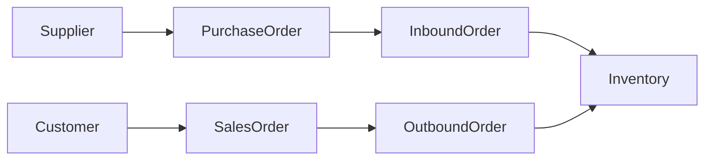
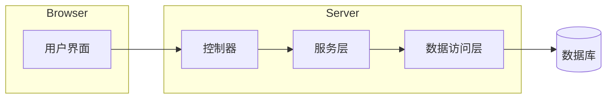

# 基于BS模式的服装进销存管理系统详细设计与具体代码实现

## 1.背景介绍

在当今快节奏的商业环境中,服装行业的竞争日益激烈。为了保持竞争优势,企业需要高效地管理库存、销售和采购流程。传统的手工操作方式不仅效率低下,而且容易出现人为错误。因此,开发一个基于BS(Browser/Server,浏览器/服务器)模式的服装进销存管理系统势在必行,以提高企业的运营效率和决策能力。

### 1.1 BS模式简介

BS模式是一种将Web浏览器作为客户端,将应用程序的执行逻辑完全集中在服务器端的架构模式。用户通过浏览器访问服务器上的应用程序,服务器端接收请求,处理数据并返回结果。这种模式具有以下优势:

1. **跨平台性**: 只需要一个支持标准的Web浏览器,就可以在任何操作系统上运行应用程序。
2. **易于维护和升级**: 所有更新和升级都集中在服务器端,无需分发和安装客户端软件。
3. **数据安全性**: 所有数据都存储在服务器端,降低了数据泄露的风险。

### 1.2 服装进销存管理系统的必要性

服装进销存管理系统是服装企业的核心业务系统,涵盖了采购、库存、销售等多个环节。一个高效的进销存管理系统可以带来以下好处:

1. **实时库存管理**: 准确掌握各种服装的库存数量和状态,避免库存积压或缺货。
2. **优化采购决策**: 根据历史销售数据和库存情况,制定合理的采购计划。
3. **提高销售效率**: 快速查询库存,满足客户需求,提高销售转化率。
4. **数据分析和报表**: 生成各种统计报表,为企业决策提供依据。

## 2.核心概念与联系

在设计和实现服装进销存管理系统之前,我们需要了解一些核心概念及其之间的关系。

### 2.1 核心概念

1. **商品(Product)**: 指服装企业生产或销售的各种服装产品,每种商品都有唯一的编码、名称、规格、价格等属性。
2. **供应商(Supplier)**: 向服装企业提供商品的上游企业或个人,供应商信息包括名称、联系方式等。
3. **客户(Customer)**: 购买服装企业商品的下游企业或个人,客户信息包括名称、联系方式等。
4. **采购单(Purchase Order)**: 服装企业向供应商下达的采购商品的单据,包括采购商品清单、数量、价格等信息。
5. **入库单(Inbound Order)**: 记录从供应商处收到的商品信息,包括商品名称、数量、价格等。
6. **销售单(Sales Order)**: 客户向服装企业下达的购买商品的单据,包括购买商品清单、数量、价格等信息。
7. **出库单(Outbound Order)**: 记录向客户发货的商品信息,包括商品名称、数量、价格等。
8. **库存(Inventory)**: 服装企业仓库中存放的各种商品及其数量。

### 2.2 核心概念关系

上述核心概念之间存在着紧密的关联关系,如下图所示:



1. 供应商提供采购单,采购单生成入库单。
2. 入库单更新库存信息。
3. 客户下达销售单,销售单生成出库单。
4. 出库单更新库存信息。

通过这些概念和关系,我们可以设计出完整的进销存管理流程。

## 3.核心算法原理具体操作步骤

在服装进销存管理系统中,核心算法主要包括库存更新算法和订单处理算法。

### 3.1 库存更新算法

库存更新算法负责根据入库单和出库单,更新各种商品的库存数量。算法步骤如下:

1. 获取入库单或出库单中的商品信息,包括商品编码和数量。
2. 查询数据库中对应商品的当前库存数量。
3. 如果是入库单,将商品数量加到当前库存上;如果是出库单,将商品数量从当前库存中减去。
4. 更新数据库中该商品的库存数量。
5. 如果库存数量小于设定的最低库存阈值,触发库存预警。

该算法的时间复杂度为O(1),因为只需要对单个商品进行库存更新操作。

### 3.2 订单处理算法

订单处理算法负责处理采购单和销售单,生成相应的入库单和出库单。算法步骤如下:

1. 获取采购单或销售单中的商品清单。
2. 遍历商品清单,对每种商品执行以下操作:
    a. 查询数据库中该商品的当前库存数量。
    b. 如果是采购单,生成入库单记录;如果是销售单,检查库存是否足够,足够则生成出库单记录,否则标记为缺货。
3. 将入库单或出库单记录保存到数据库中。
4. 如果有缺货情况,触发缺货处理流程(如自动采购或人工处理)。

该算法的时间复杂度为O(n),其中n是商品清单的长度。

## 4.数学模型和公式详细讲解举例说明

在服装进销存管理系统中,我们可以使用一些数学模型和公式来优化库存管理和采购决策。

### 4.1 经济订货量(EOQ)模型

经济订货量模型是一种帮助确定最优采购批量的模型,旨在minimized the total cost of inventory management。模型公式如下:

$$EOQ = \sqrt{\frac{2DC_o}{C_c}}$$

其中:
- $EOQ$: 经济订货量
- $D$: 年度需求量
- $C_o$: 每次采购的固定成本
- $C_c$: 每单位商品的存储成本

例如,某款服装年度需求量为10000件,每次采购的固定成本为500元,每件商品的存储成本为2元,则经济订货量为:

$$EOQ = \sqrt{\frac{2 \times 10000 \times 500}{2}} = 1000 \text{ (件)}$$

因此,最优的采购批量是1000件。

### 4.2 安全库存量模型

由于存在供需波动和交货延迟等不确定因素,企业通常需要保持一定的安全库存量。安全库存量模型公式如下:

$$SS = Z \times \sigma_L \times \sqrt{L}$$

其中:
- $SS$: 安全库存量
- $Z$: 服务水平对应的标准正态分布值
- $\sigma_L$: 需求量的标准差
- $L$: 交货延迟时间(以同一时间单位计)

例如,某款服装的需求量标准差为50件/周,交货延迟时间为2周,如果要达到95%的服务水平(对应$Z=1.645$),则安全库存量为:

$$SS = 1.645 \times 50 \times \sqrt{2} \approx 115 \text{ (件)}$$

因此,该款服装的安全库存量应设置为115件。

通过合理设置安全库存量,企业可以在一定程度上应对供需波动,提高服务水平。

## 5.项目实践:代码实例和详细解释说明

在本节中,我们将提供一些核心功能的代码实例,并进行详细解释说明。

### 5.1 系统架构

服装进销存管理系统采用典型的BS架构,包括:

- **前端(Browser)**: 基于HTML/CSS/JavaScript开发的用户界面,运行在浏览器中。
- **后端(Server)**: 基于Java开发的应用服务器,负责处理业务逻辑和数据交互。
- **数据库(Database)**: 使用MySQL数据库存储系统数据。



### 5.2 商品管理模块

商品管理模块负责维护商品信息,包括增加、修改、删除和查询商品。

#### 5.2.1 商品实体类

```java
@Entity
@Table(name = "product")
public class Product {
    @Id
    @GeneratedValue(strategy = GenerationType.IDENTITY)
    private Long id;

    @Column(nullable = false, unique = true)
    private String code;

    @Column(nullable = false)
    private String name;

    @Column(nullable = false)
    private BigDecimal price;

    // 省略 getter/setter 方法
}
```

该类使用JPA注解映射到数据库中的`product`表,包含了商品编码、名称和价格等基本属性。

#### 5.2.2 商品Repository接口

```java
@Repository
public interface ProductRepository extends JpaRepository<Product, Long> {
    Optional<Product> findByCode(String code);
}
```

`ProductRepository`接口继承自Spring Data JPA提供的`JpaRepository`接口,提供了基本的CRUD操作方法。同时,我们还定义了一个`findByCode`方法,用于根据商品编码查询商品信息。

#### 5.2.3 商品Service层

```java
@Service
public class ProductService {
    private final ProductRepository productRepository;

    public ProductService(ProductRepository productRepository) {
        this.productRepository = productRepository;
    }

    public Product addProduct(Product product) {
        // 检查商品编码是否已存在
        Optional<Product> existingProduct = productRepository.findByCode(product.getCode());
        if (existingProduct.isPresent()) {
            throw new IllegalArgumentException("商品编码已存在");
        }
        return productRepository.save(product);
    }

    // 省略其他方法
}
```

`ProductService`类提供了商品管理的业务逻辑,例如在添加商品时,需要检查商品编码是否已存在。其他方法如修改、删除和查询商品也可以在此类中实现。

### 5.3 采购管理模块

采购管理模块负责处理采购订单,生成入库单并更新库存。

#### 5.3.1 采购订单实体类

```java
@Entity
@Table(name = "purchase_order")
public class PurchaseOrder {
    @Id
    @GeneratedValue(strategy = GenerationType.IDENTITY)
    private Long id;

    @Column(nullable = false)
    private LocalDate orderDate;

    @ManyToOne
    @JoinColumn(name = "supplier_id", nullable = false)
    private Supplier supplier;

    @OneToMany(mappedBy = "purchaseOrder", cascade = CascadeType.ALL, orphanRemoval = true)
    private List<PurchaseOrderItem> items = new ArrayList<>();

    // 省略 getter/setter 方法
}
```

`PurchaseOrder`类表示一个采购订单,包含了订单日期、供应商信息和采购商品清单。其中,`items`属性是一个`PurchaseOrderItem`列表,用于存储订单中的每一种商品及其数量。

#### 5.3.2 采购订单处理

```java
@Service
public class PurchaseOrderService {
    private final PurchaseOrderRepository purchaseOrderRepository;
    private final ProductService productService;
    private final InboundOrderService inboundOrderService;

    public PurchaseOrderService(PurchaseOrderRepository purchaseOrderRepository,
                                ProductService productService,
                                InboundOrderService inboundOrderService) {
        this.purchaseOrderRepository = purchaseOrderRepository;
        this.productService = productService;
        this.inboundOrderService = inboundOrderService;
    }

    @Transactional
    public PurchaseOrder createPurchaseOrder(PurchaseOrder purchaseOrder) {
        PurchaseOrder savedOrder = purchaseOrderRepository.save(purchaseOrder);

        // 生成入库单并更新库存
        InboundOrder inboundOrder = new InboundOrder();
        inboundOrder.setPurchaseOrder(savedOrder);
        inboundOrder.setInboundDate(LocalDate.now());

        List<InboundOrderItem> inboundItems = new ArrayList<>();
        for (PurchaseOrderItem item : savedOrder.getItems()) {
            Product product = productService.getProductByCode(item.getProduct().getCode());
            InboundOrderItem inboundItem = new InboundOrderItem();
            inboundItem.setProduct(product);
            inboundItem.setQuantity(item.getQuantity());
            inboundItems.add(inboundItem);

            // 更新库存
            productService.updateInventory(product, item.getQuantity());
        }
        inboundOrder.setItems(inboundItems);
        inboundOrderService.createInboundOrder(inboundOrder);

        return savedOrder;
    }
}
```

在`createPurchaseOrder`方法中,我们首先保存采购订单到数据库。然后,根据订单中的商品清单,生