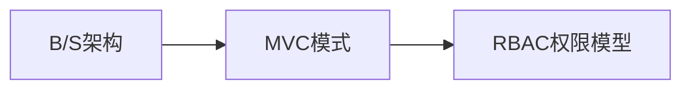
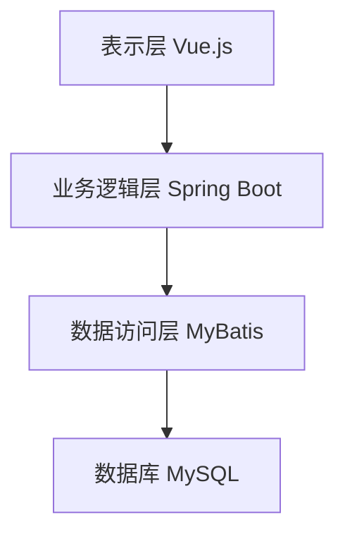
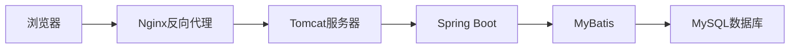

# 基于B/S结构的车辆管理系统详细设计与具体代码实现

## 1. 背景介绍

随着信息技术的快速发展和普及应用,传统的车辆管理模式已经无法满足现代化管理的需求。基于B/S结构的车辆管理系统应运而生,它利用互联网技术,实现了车辆信息的网络化管理,极大地提高了管理效率和质量。本文将详细介绍基于B/S结构的车辆管理系统的设计与实现。

### 1.1 传统车辆管理模式的局限性

传统的车辆管理主要采用纸质档案和人工管理的方式,存在以下局限性:

- 信息查询困难,效率低下
- 数据统计分析能力差
- 信息共享难度大
- 数据安全性无法保障

### 1.2 基于B/S结构车辆管理系统的优势

相比传统模式,基于B/S结构的车辆管理系统具有以下优势:

- 信息查询便捷高效
- 强大的数据统计分析功能 
- 信息共享方便,利于协同管理
- 数据安全性高,有完善的权限控制

### 1.3 系统开发技术选型

本系统采用目前流行的B/S架构,使用Java语言开发,主要用到的技术和框架包括:

- 前端:HTML、CSS、JavaScript、Vue.js
- 后端:Spring Boot、MyBatis、MySQL
- 服务器:Tomcat
- 开发工具:IDEA、Git

## 2. 核心概念与关联

在介绍系统设计与实现之前,我们先来了解几个核心概念:

### 2.1 B/S结构

B/S结构即Browser/Server(浏览器/服务器)结构,是一种基于Web的应用架构。用户通过浏览器访问应用,服务器负责处理请求和存储数据。相比C/S架构,B/S具有安装部署简单、跨平台、易于维护等优点。

### 2.2 MVC模式

MVC即Model-View-Controller,是一种软件架构模式:

- Model(模型):管理数据和业务逻辑
- View(视图):负责数据展示
- Controller(控制器):接收请求,协调模型和视图

MVC模式使代码结构清晰,易于扩展和维护。

### 2.3 RBAC权限模型

RBAC即Role-Based Access Control,基于角色的访问控制。通过给用户分配角色,角色拥有权限,从而控制用户对资源的访问。RBAC易于管理,可以有效保证系统安全。

以下是这几个概念之间的关系:



## 3. 系统架构设计

本系统采用分层架构设计,主要分为表示层、业务逻辑层和数据访问层。

### 3.1 系统架构图



### 3.2 技术架构图



### 3.3 系统功能模块划分

系统分为以下几个主要模块:

- 车辆信息管理
- 车辆调度管理 
- 车辆维修保养
- 统计分析
- 系统管理

## 4. 数据库设计

数据库采用MySQL,主要有以下几个核心表:

### 4.1 车辆信息表(vehicle)

|字段|类型|说明|
|---|---|---|
|id|int|主键|
|plate_number|varchar|车牌号|
|type|varchar|车辆类型|
|brand|varchar|品牌|
|model|varchar|型号|
|purchase_date|date|购买日期|
|mileage|double|行驶里程|
|status|int|状态|

### 4.2 车辆调度表(dispatch)

|字段|类型|说明|
|---|---|---|
|id|int|主键|
|vehicle_id|int|车辆ID|
|driver_id|int|司机ID|
|start_time|datetime|开始时间|
|end_time|datetime|结束时间|
|departure|varchar|出发地|
|destination|varchar|目的地|

### 4.3 维修保养记录表(maintenance)

|字段|类型|说明|
|---|---|---|
|id|int|主键|
|vehicle_id|int|车辆ID|
|type|int|维修保养类型|
|cost|decimal|费用|
|content|varchar|内容|
|create_time|datetime|创建时间|

## 5. 核心功能实现

下面介绍系统几个核心功能的具体实现。

### 5.1 车辆信息管理

#### 5.1.1 车辆列表

后端Controller:

```java
@GetMapping("/list")
public Result list() {
    List<Vehicle> list = vehicleService.list();
    return Result.ok(list);
}
```

前端Vue.js:

```vue
<template>
  <el-table :data="list">
    <el-table-column prop="plateNumber" label="车牌号"></el-table-column>
    <el-table-column prop="type" label="车辆类型"></el-table-column>
    <el-table-column prop="brand" label="品牌"></el-table-column>
    <el-table-column prop="model" label="型号"></el-table-column>
    <el-table-column prop="status" label="状态"></el-table-column>
    <el-table-column label="操作">
      <template slot-scope="scope">
        <el-button @click="edit(scope.row.id)">编辑</el-button>
        <el-button @click="del(scope.row.id)">删除</el-button>
      </template>
    </el-table-column>
  </el-table>
</template>

<script>
export default {
  data() {
    return {
      list: []
    }
  },
  created() {
    this.fetchData()
  },
  methods: {
    fetchData() {
      this.$http.get('/vehicle/list').then(res => {
        this.list = res.data
      })
    },
    edit(id) {
      // 编辑
    },
    del(id) {
      // 删除
    }
  }
}
</script>
```

#### 5.1.2 车辆新增

后端Controller:

```java
@PostMapping("/add")
public Result add(@RequestBody Vehicle vehicle) {
    vehicleService.save(vehicle);
    return Result.ok();
}
```

前端Vue.js:

```vue
<template>
  <el-form ref="form" :model="vehicle">
    <el-form-item label="车牌号">
      <el-input v-model="vehicle.plateNumber"></el-input>
    </el-form-item>
    <el-form-item label="车辆类型">
      <el-select v-model="vehicle.type">
        <el-option label="轿车" value="1"></el-option>
        <el-option label="货车" value="2"></el-option>
      </el-select>
    </el-form-item>
    <el-form-item label="品牌">
      <el-input v-model="vehicle.brand"></el-input>
    </el-form-item>
    <el-form-item label="型号">
      <el-input v-model="vehicle.model"></el-input>
    </el-form-item>
    <el-form-item>
      <el-button type="primary" @click="submit">提交</el-button>
    </el-form-item>
  </el-form>
</template>

<script>
export default {
  data() {
    return {
      vehicle: {}
    }
  },
  methods: {
    submit() {
      this.$refs.form.validate(valid => {
        if (valid) {
          this.$http.post('/vehicle/add', this.vehicle).then(res => {
            this.$message.success('添加成功')
            this.$router.push('/vehicle/list')
          })
        }
      })
    }
  }
}
</script>
```

### 5.2 车辆调度管理

#### 5.2.1 车辆调度列表

后端Controller:

```java
@GetMapping("/list")
public Result list(Integer page, Integer size) {
    Page<Dispatch> pageInfo = dispatchService.page(new Page<>(page, size));
    return Result.ok(pageInfo);
}
```

前端Vue.js:

```vue
<template>
  <el-table :data="list">
    <el-table-column prop="vehiclePlateNumber" label="车牌号"></el-table-column>
    <el-table-column prop="driverName" label="司机"></el-table-column>
    <el-table-column prop="startTime" label="开始时间"></el-table-column>
    <el-table-column prop="endTime" label="结束时间"></el-table-column>
    <el-table-column prop="departure" label="出发地"></el-table-column>
    <el-table-column prop="destination" label="目的地"></el-table-column>
  </el-table>
  
  <el-pagination
    @current-change="fetchData"
    :current-page.sync="page"
    :page-size="size"
    layout="total, prev, pager, next"
    :total="total">
  </el-pagination>
</template>

<script>
export default {
  data() {
    return {
      list: [],
      page: 1,
      size: 10,
      total: 0
    }
  },
  created() {
    this.fetchData()
  },
  methods: {
    fetchData() {
      this.$http.get('/dispatch/list', {
        params: {
          page: this.page,
          size: this.size
        }
      }).then(res => {
        this.list = res.data.records
        this.total = res.data.total
      })
    }
  }
}
</script>
```

#### 5.2.2 车辆调度新增

后端Controller:

```java
@PostMapping("/add")
public Result add(@RequestBody Dispatch dispatch) {
    dispatchService.save(dispatch);
    return Result.ok();
}
```

前端Vue.js:

```vue
<template>
  <el-form ref="form" :model="dispatch">
    <el-form-item label="车辆">
      <el-select v-model="dispatch.vehicleId">
        <el-option v-for="item in vehicles" :key="item.id" :label="item.plateNumber" :value="item.id"></el-option>
      </el-select>
    </el-form-item>
    <el-form-item label="司机">
      <el-select v-model="dispatch.driverId">
        <el-option v-for="item in drivers" :key="item.id" :label="item.name" :value="item.id"></el-option>
      </el-select>
    </el-form-item>
    <el-form-item label="开始时间">
      <el-date-picker v-model="dispatch.startTime" type="datetime"></el-date-picker>
    </el-form-item>
    <el-form-item label="结束时间">
      <el-date-picker v-model="dispatch.endTime" type="datetime"></el-date-picker>
    </el-form-item>
    <el-form-item label="出发地">
      <el-input v-model="dispatch.departure"></el-input>
    </el-form-item>
    <el-form-item label="目的地">
      <el-input v-model="dispatch.destination"></el-input>
    </el-form-item>
    <el-form-item>
      <el-button type="primary" @click="submit">提交</el-button>
    </el-form-item>
  </el-form>
</template>

<script>
export default {
  data() {
    return {
      dispatch: {},
      vehicles: [],
      drivers: []
    }
  },
  created() {
    this.fetchVehicles()
    this.fetchDrivers()
  },
  methods: {
    fetchVehicles() {
      this.$http.get('/vehicle/list').then(res => {
        this.vehicles = res.data
      })
    },
    fetchDrivers() {
      this.$http.get('/driver/list').then(res => {
        this.drivers = res.data
      })
    },
    submit() {
      this.$refs.form.validate(valid => {
        if (valid) {
          this.$http.post('/dispatch/add', this.dispatch).then(res => {
            this.$message.success('添加成功')
            this.$router.push('/dispatch/list')
          })
        }
      })
    }
  }
}
</script>
```

### 5.3 车辆维修保养

#### 5.3.1 维修保养记录列表

后端Controller:

```java
@GetMapping("/list")
public Result list(Integer vehicleId) {
    List<Maintenance> list = maintenanceService.list(new QueryWrapper<Maintenance>().eq("vehicle_id", vehicleId));
    return Result.ok(list);
}
```

前端Vue.js:

```vue
<template>
  <el-table :data="list">
    <el-table-column prop="type" label="类型"></el-table-column>
    <el-table-column prop="cost" label="费用"></el-table-column>
    <el-table-column prop="content" label="内容"></el-table-column>
    <el-table-column prop="createTime" label="时间"></el-table-column>
  </el-table>
</template>

<script>
export default {
  data() {
    return {
      list: []
    }
  },
  created() {
    this.fetchData()
  },
  methods: {
    fetchData() {
      this.$http.get('/maintenance/list', {
        params: {
          vehicleId: this.$route.query.vehicleId
        }
      }).then(res => {
        this.list = res.data
      })
    }
  }
}
</script>
```

#### 5.3.2 