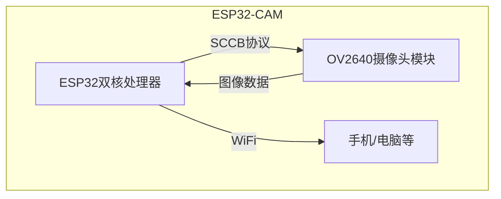
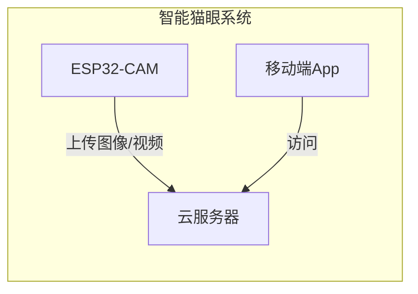
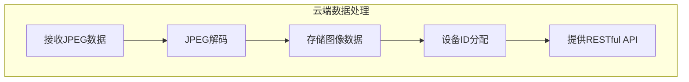

# 基于ESP32-CAM的智能猫眼设计与实现

## 1.背景介绍

### 1.1 智能家居的兴起

随着物联网技术的不断发展,智能家居已经成为了一种新兴的生活方式。智能家居旨在通过将各种智能设备互联,实现对家居环境的自动化控制和远程监控,从而提高生活质量和家庭安全性。在智能家居系统中,视频监控作为一项重要功能,可以让用户随时随地了解家中情况,提高了家庭安全性。

### 1.2 传统猫眼的局限性

传统的猫眼虽然可以让我们通过门上的小孔观察门外情况,但存在一些明显的缺陷:

1. 视野狭窄,只能看到有限的区域
2. 需要亲自上前观察,不能远程监控
3. 夜间能见度差,难以分辨来访者

因此,有必要设计一种智能化的猫眼系统,以弥补传统猫眼的不足。

### 1.3 ESP32-CAM的优势

ESP32-CAM是一款低功耗、高性能的系统级芯片,集成了WiFi和双核处理器,并内置了一个OV2640相机模块。它体积小巧、功能强大、价格低廉,非常适合用于智能视频监控等物联网应用场景。利用ESP32-CAM开发智能猫眼系统,可以突破传统猫眼的局限,实现远程实时监控、移动端查看、夜视功能等,极大提升了用户体验。

## 2.核心概念与联系

### 2.1 ESP32-CAM工作原理

ESP32-CAM的核心是ESP32芯片和OV2640摄像头模块。ESP32是一款主频高达240MHz的双核处理器,拥有丰富的外设接口,可以连接各种传感器。OV2640是一款低功耗CMOS图像传感器,最高可输出200万像素的图像分辨率。

ESP32-CAM通过SCCB(串行摄像头控制总线)协议控制OV2640摄像头模块,获取图像数据。图像数据由ESP32的图像处理单元进行处理,并可通过WiFi无线传输到其他设备上,实现远程监控。



### 2.2 智能猫眼系统架构

智能猫眼系统主要由ESP32-CAM、云服务器和移动端App三个部分组成:

1. ESP32-CAM负责获取现场图像/视频,并通过WiFi上传到云服务器。
2. 云服务器负责存储和管理接收到的图像/视频数据,为移动端提供访问接口。
3. 移动端App可以通过访问云服务器,实时查看门外的监控画面,也可以查看历史记录。



该系统架构具有良好的扩展性,可以方便地添加更多的功能模块,如人形检测、运动跟踪等,从而进一步提升智能猫眼的性能。

## 3.核心算法原理具体操作步骤  

### 3.1 图像采集

ESP32-CAM通过SCCB协议控制OV2640摄像头采集图像数据,具体步骤如下:

1. 初始化SCCB接口,设置I2C通信参数
2. 对OV2640芯片进行上电复位
3. 写入芯片寄存器,配置图像参数(如分辨率、曝光时间等)
4. 通过SCCB总线读取图像数据


### 3.2 图像编码与传输

为了节省传输带宽,通常需要对采集到的图像进行压缩编码。ESP32-CAM支持JPEG编码格式,编码步骤如下:

1. 初始化JPEG编码器
2. 设置编码参数(如图像尺寸、质量等级)
3. 读取图像数据,喂入编码器
4. 获取编码后的JPEG数据流
5. 通过WiFi发送JPEG数据到云服务器


### 3.3 云端数据处理

云服务器接收到ESP32-CAM发来的JPEG数据流后,需要进行解码、存储和管理,为移动端提供访问接口。处理流程如下:

1. 解码JPEG数据,恢复原始图像
2. 将图像数据存储到云端数据库
3. 为每个智能猫眼设备分配唯一ID
4. 提供RESTful API接口,供移动端查询和获取图像数据



## 4.数学模型和公式详细讲解举例说明

在图像处理过程中,常常需要借助数学模型和公式来描述和优化图像质量。以下是一些常用的数学模型:

### 4.1 图像直方图

图像直方图是反映图像灰度分布的统计数据,可用于分析图像对比度、曝光情况等。对于一幅8位灰度图像,其灰度级范围为0~255,直方图可表示为:

$$
H(r_k) = n_k \qquad k=0,1,2,...,L-1
$$

其中:
- $L$为灰度级总数(对于8位灰度图像,L=256)
- $r_k$为第k个灰度级
- $n_k$为具有灰度值$r_k$的像素个数
- $H(r_k)$为第k个灰度级的直方图值

### 4.2 图像增强

图像增强是指通过某些运算,使图像的某些特性更加突出,以便于人眼或机器分析识别。常用的增强方法有直方图均衡化、对数变换、伽马变换等。

直方图均衡化的目的是将原始图像的直方图变换为近似均匀分布,以扩展动态范围,增强对比度。其变换函数为:

$$
s_k = T(r_k) = \sum_{j=0}^{k} \frac{n_j}{n} \qquad k=0,1,2,...,L-1
$$

其中:
- $r_k$为原始图像的灰度级
- $s_k$为变换后的灰度级
- $n_j$为具有灰度值$r_j$的像素个数
- $n$为图像总像素数

### 4.3 图像压缩编码

JPEG编码是一种有损压缩编码方式,主要基于离散余弦变换(DCT)和霍夫曼编码。DCT可将图像从空间域变换到频率域,并减小高频分量的重要性。

对于一个8x8的图像块,二维DCT变换公式为:

$$
F(u,v) = \frac{1}{4}C(u)C(v)\sum_{x=0}^{7}\sum_{y=0}^{7}f(x,y)\cos\frac{(2x+1)u\pi}{16}\cos\frac{(2y+1)v\pi}{16}
$$

其中:
- $F(u,v)$为DCT系数
- $f(x,y)$为原始图像像素值
- $C(u),C(v)$为尺度因子

通过量化和熵编码,DCT系数可高效压缩存储,从而减小图像文件大小。

## 5.项目实践:代码实例和详细解释说明

以下是基于ESP32-CAM的智能猫眼系统的关键代码实现,使用的是Arduino IDE和ESP32开发板:

### 5.1 初始化摄像头

```cpp
#include "esp_camera.h"

// 摄像头配置
#define PWDN_GPIO_NUM     32
#define RESET_GPIO_NUM    -1
#define XCLK_GPIO_NUM      0
#define SIOD_GPIO_NUM     26
#define SIOC_GPIO_NUM     27
#define Y9_GPIO_NUM        35
#define Y8_GPIO_NUM        34
#define Y7_GPIO_NUM        39
#define Y6_GPIO_NUM        36
#define Y5_GPIO_NUM        21
#define Y4_GPIO_NUM        19
#define Y3_GPIO_NUM        18
#define Y2_GPIO_NUM         5
#define VSYNC_GPIO_NUM     25
#define HREF_GPIO_NUM      23
#define PCLK_GPIO_NUM      22

void initCamera(){
  camera_config_t config;
  config.ledc_channel = LEDC_CHANNEL_0;
  config.ledc_timer = LEDC_TIMER_0;
  config.pin_d0 = Y2_GPIO_NUM;
  ... // 其他引脚配置
  
  config.pixel_format = PIXFORMAT_JPEG; // 图像格式为JPEG
  config.frame_size = FRAMESIZE_UXGA; // 图像分辨率
  config.jpeg_quality = 10; // 图像质量
  config.fb_count = 2; // 帧缓冲区个数
  
  esp_err_t err = esp_camera_init(&config);
  if (err != ESP_OK) {
    return;
  }
}
```

这段代码初始化了ESP32-CAM的摄像头,设置了图像格式、分辨率、质量等参数。

### 5.2 获取图像并编码

```cpp
camera_fb_t * fb = NULL;
fb = esp_camera_fb_get();
if(!fb) {
  return;
}

// 将图像数据编码为JPEG格式
size_t jpg_buf_len = 0;
uint8_t * jpg_buf = NULL;
bool jpeg_converted = frame2jpg(fb->buf, fb->len, fb->width, fb->height, JPEG_QUALITY, &jpg_buf, &jpg_buf_len);
esp_camera_fb_return(fb);

if(!jpeg_converted){
  return;
}
```

这段代码从摄像头获取一帧图像数据,并将其编码为JPEG格式。`frame2jpg`函数是一个自定义函数,用于执行JPEG编码。

### 5.3 通过WiFi上传图像

```cpp
WiFiClient client;
const char* serverName = "http://example.com/upload";
  
if (client.connect(serverName, 80)) {
  String getRequest = "--RandomNddBoundary\r\nContent-Disposition: form-data; name=\"imageFile\"; filename=\"image.jpg\"\r\nContent-Type: image/jpeg\r\n\r\n";
  client.print("POST /upload HTTP/1.1\r\n");
  client.print("Host: " + String(serverName) + "\r\n");
  client.print("Content-Length: " + String(getRequest.length() + jpg_buf_len + 3) + "\r\n");
  client.print("Content-Type: multipart/form-data; boundary=--RandomNddBoundary\r\n");
  client.print("\r\n");
  client.print(getRequest);
  
  uint8_t *fbBuf = jpg_buf;
  size_t fbLen = jpg_buf_len;
  for (size_t n=0; n<fbLen; n=n+1024) {
    if (n+1024 < fbLen) {
      client.write(fbBuf, 1024);
      fbBuf += 1024;
    }
    else if (fbLen%1024>0) {
      size_t remainder = fbLen%1024;
      client.write(fbBuf, remainder);
    }
  }  
  
  client.print("\r\n--RandomNddBoundary--\r\n");
}

free(jpg_buf);
```

这段代码通过WiFi将编码后的JPEG图像数据上传到云服务器。首先建立TCP连接,然后按照HTTP协议的规范,构造POST请求体,将图像数据作为multipart/form-data的一部分发送出去。

### 5.4 移动端App实现

移动端App可以通过访问云服务器的RESTful API,获取智能猫眼的实时监控画面和历史记录。以下是一个使用Flutter框架实现的简单示例:

```dart
import 'package:http/http.dart' as http;

class CatEyeScreen extends StatefulWidget {
  @override
  _CatEyeScreenState createState() => _CatEyeScreenState();
}

class _CatEyeScreenState extends State<CatEyeScreen> {
  String _imageUrl = '';

  @override
  void initState() {
    super.initState();
    _fetchCatEyeImage();
  