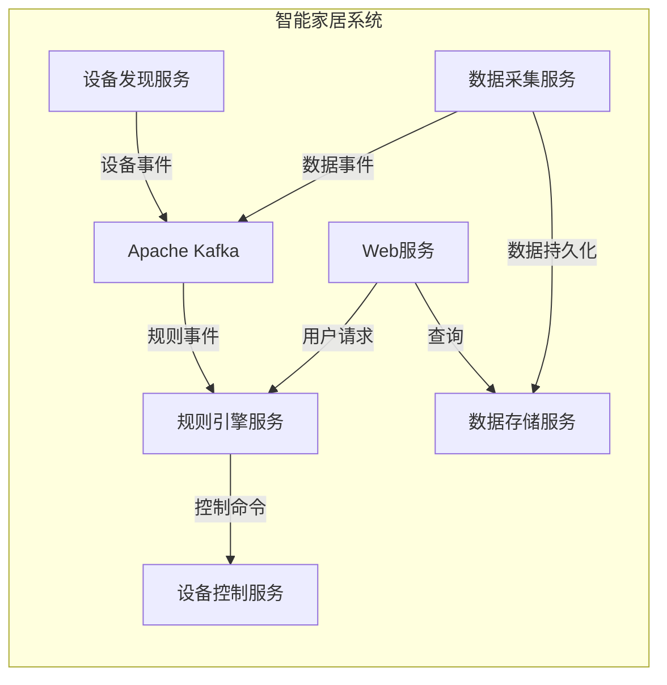

# 基于Java的智能家居设计：通过Java提升智能家居系统的可靠性

## 1. 背景介绍

### 1.1 智能家居的兴起

随着物联网技术的快速发展,智能家居系统逐渐走进千家万户。智能家居系统旨在通过集成各种智能设备和传感器,实现对家居环境的自动化控制和智能管理,为居民带来更加舒适、便利和节能的生活体验。

### 1.2 智能家居系统的挑战

然而,构建一个可靠、高效的智能家居系统并非易事。它需要处理来自多个异构设备的海量数据,并实时响应用户的指令和环境变化。此外,系统的安全性和隐私保护也是不容忽视的重要因素。

### 1.3 Java在智能家居中的作用

Java作为一种成熟、跨平台的编程语言,在智能家居系统的开发中扮演着重要角色。Java的面向对象特性、丰富的类库和强大的并发处理能力,使其成为构建可靠、可扩展的智能家居系统的理想选择。

## 2. 核心概念与联系

### 2.1 物联网(IoT)

物联网是智能家居系统的基础,它将各种物理设备(如传感器、执行器等)连接到互联网,实现设备与设备之间、设备与云端之间的通信和数据交换。

### 2.2 边缘计算(Edge Computing)

边缘计算是一种将计算资源分散到网络边缘的架构,它可以减轻云端的计算压力,提高系统的响应速度和可靠性。在智能家居系统中,边缘计算可以用于实时处理本地设备数据,降低网络延迟。

### 2.3 微服务架构

微服务架构是一种将系统拆分为多个独立的小型服务的设计模式。每个微服务负责系统的一个特定功能,并通过轻量级通信机制相互协作。这种架构有利于提高系统的可维护性、可扩展性和容错能力。

### 2.4 事件驱动架构

事件驱动架构是一种基于事件的系统设计范式。在智能家居系统中,各种设备状态变化、用户操作等都可以视为事件源,系统通过响应和处理这些事件来执行相应的逻辑。事件驱动架构有助于提高系统的灵活性和响应能力。

### 2.5 Java生态系统

Java拥有丰富的生态系统,包括Spring、Apache Kafka、Akka等众多优秀的框架和中间件。这些工具可以帮助开发人员更高效地构建智能家居系统,实现各种功能和非功能需求。

## 3. 核心算法原理具体操作步骤

### 3.1 设备发现和连接

智能家居系统需要自动发现并连接家中的各种智能设备。常见的发现协议包括SSDP(简单服务发现协议)、mDNS(多播DNS)等。Java可以使用开源库如JmDNS来实现设备发现功能。

设备连接通常基于标准协议,如Wi-Fi、Bluetooth、Zigbee等。Java提供了丰富的网络编程API,可以方便地实现设备连接和数据传输。

```java
// 使用JmDNS发现设备
JmmDNS jmdns = JmDNS.create();
ServiceListener listener = new SampleListener();
jmdns.addServiceListener("_http._tcp.local.", listener);

// 连接设备
Socket socket = new Socket(deviceIP, devicePort);
```

### 3.2 数据采集与处理

智能家居系统需要从各种传感器(如温度计、运动传感器等)采集数据,并对这些数据进行处理和分析。Java提供了多线程和并发编程支持,可以高效地处理来自多个设备的数据流。

```java
// 多线程读取传感器数据
ExecutorService executor = Executors.newFixedThreadPool(10);
for (Sensor sensor : sensors) {
    executor.submit(new SensorReader(sensor));
}

// 使用RxJava处理数据流
Observable<SensorData> dataStream = sensor.getDataStream();
dataStream
    .buffer(1, TimeUnit.SECONDS)
    .filter(window -> window.size() > 0)
    .flatMap(window -> Observable.from(window))
    .subscribe(data -> processData(data));
```

### 3.3 规则引擎与自动化

智能家居系统通常需要根据用户设置的规则自动执行相应的操作。例如,当温度过高时开启空调,或在夜间自动关闭不需要的电器。Java可以使用规则引擎框架(如Drools)来实现这一功能。

```java
// 定义规则
Rule rule = new Rule("TurnOnAC")
    .when(
        exists(SensorData(
            type == "Temperature",
            value > 30
        ))
    )
    .then(
        executeCommand(new TurnOnAC())
    );

// 执行规则引擎
RuleEngine engine = RuleEngineBuilder.newBuilder().build();
engine.fireRules(sensorData);
```

### 3.4 设备控制与协调

智能家居系统需要控制和协调各种智能设备的工作,如开关电器、调节温度等。Java可以使用设备厂商提供的API或标准协议(如MQTT)与设备通信。

```java
// 使用MQTT控制设备
MqttClient client = new MqttClient(brokerUri, clientId);
client.connect();

// 发送控制命令
MqttMessage message = new MqttMessage(command.getBytes());
message.setQos(2);
client.publish(deviceTopic, message);
```

### 3.5 数据存储与分析

智能家居系统需要持久化存储设备数据,以便进行历史数据分析和建模。Java可以使用关系型或非关系型数据库来存储这些数据。

```java
// 使用JDBC存储数据
Connection conn = DriverManager.getConnection(dbUrl);
String sql = "INSERT INTO SensorData (type, value, timestamp) VALUES (?, ?, ?)";
PreparedStatement stmt = conn.prepareStatement(sql);
stmt.setString(1, data.getType());
stmt.setDouble(2, data.getValue());
stmt.setTimestamp(3, data.getTimestamp());
stmt.executeUpdate();
```

对于大数据分析,Java可以与Apache Spark、Hadoop等大数据框架集成,实现分布式数据处理和机器学习建模。

## 4. 数学模型和公式详细讲解举例说明

在智能家居系统中,数学模型和算法可以应用于多个领域,如能源优化、用户行为建模、预测性维护等。以下是一些常见的数学模型和公式:

### 4.1 线性回归

线性回归是一种常用的监督学习算法,可以用于建立连续型目标变量(如能源消耗)与一个或多个自变量(如温度、人数等)之间的线性关系模型。

线性回归模型的数学表达式为:

$$y = \beta_0 + \beta_1x_1 + \beta_2x_2 + ... + \beta_nx_n + \epsilon$$

其中,$y$是目标变量,$x_1, x_2, ..., x_n$是自变量,$\beta_0, \beta_1, ..., \beta_n$是回归系数,$\epsilon$是随机误差项。

通过最小二乘法,我们可以估计出回归系数$\beta$,从而得到预测模型:

$$\hat{y} = \hat{\beta_0} + \hat{\beta_1}x_1 + \hat{\beta_2}x_2 + ... + \hat{\beta_n}x_n$$

以能源消耗预测为例,我们可以建立如下线性回归模型:

$$\text{EnergyConsumption} = \beta_0 + \beta_1 \times \text{Temperature} + \beta_2 \times \text{NumPeople} + \epsilon$$

根据历史数据训练得到的回归系数$\hat{\beta_0}, \hat{\beta_1}, \hat{\beta_2}$,就可以预测未来的能源消耗情况。

### 4.2 马尔可夫决策过程(MDP)

马尔可夫决策过程是一种用于sequentialdecision making的数学框架,常用于智能体与环境交互的建模和优化。在智能家居系统中,MDP可以应用于自动化决策和控制,如根据环境状态和用户偏好自动调节温度、照明等。

MDP由以下几个要素组成:

- 状态集合$S$
- 动作集合$A$
- 状态转移概率$P(s' | s, a)$,表示在状态$s$执行动作$a$后,转移到状态$s'$的概率
- 奖励函数$R(s, a, s')$,表示在状态$s$执行动作$a$后,转移到状态$s'$所获得的即时奖励

目标是找到一个策略$\pi: S \rightarrow A$,使得期望的累积奖励最大化:

$$\max_\pi \mathbb{E}\left[\sum_{t=0}^\infty \gamma^t R(s_t, a_t, s_{t+1})\right]$$

其中,$\gamma \in [0, 1]$是折现因子,用于平衡当前奖励和未来奖励的权重。

常用的求解MDP的算法包括价值迭代(Value Iteration)、策略迭代(Policy Iteration)、Q-Learning等。

### 4.3 时间序列分析

时间序列分析是一种研究随时间变化的数据序列的统计方法,在智能家居系统中可以应用于对用户行为、能源消耗等时间序列数据进行建模和预测。

一种常用的时间序列模型是ARIMA(自回归移动平均模型),其数学表达式为:

$$y_t = c + \phi_1 y_{t-1} + \phi_2 y_{t-2} + ... + \phi_p y_{t-p} + \theta_1 \epsilon_{t-1} + \theta_2 \epsilon_{t-2} + ... + \theta_q \epsilon_{t-q} + \epsilon_t$$

其中,$y_t$是时间$t$的观测值,$c$是常数项,$\phi_1, \phi_2, ..., \phi_p$是自回归系数,$\theta_1, \theta_2, ..., \theta_q$是移动平均系数,$\epsilon_t$是白噪声项。

通过对历史数据进行ARIMA模型拟合,我们可以捕捉时间序列的自相关和趋势特征,并对未来进行预测。

以用户在家的时间序列为例,我们可以建立如下ARIMA模型:

$$\text{AtHome}_t = c + \phi_1 \text{AtHome}_{t-1} + \phi_2 \text{AtHome}_{t-2} + ... + \phi_p \text{AtHome}_{t-p} + \theta_1 \epsilon_{t-1} + \theta_2 \epsilon_{t-2} + ... + \theta_q \epsilon_{t-q} + \epsilon_t$$

根据模型预测的未来在家时间,智能家居系统可以相应地调节温度、照明等,以提高能源利用效率和用户体验。

## 5. 项目实践: 代码实例和详细解释说明

为了更好地理解如何使用Java构建智能家居系统,我们将通过一个简单的示例项目来演示核心功能的实现。

### 5.1 项目概述

我们将开发一个基于Java的智能家居系统原型,它可以:

1. 自动发现并连接家中的智能设备
2. 从温度、运动传感器等设备采集数据
3. 根据用户设置的规则自动控制电器设备
4. 将设备数据持久化存储到数据库中
5. 提供Web界面供用户查看和配置

### 5.2 系统架构

我们将采用微服务架构和事件驱动架构,将系统拆分为以下几个微服务:

- 设备发现服务(Device Discovery Service)
- 数据采集服务(Data Ingestion Service)
- 规则引擎服务(Rule Engine Service)
- 设备控制服务(Device Control Service)
- 数据存储服务(Data Storage Service)
- Web服务(Web Service)

这些微服务通过消息队列(如Apache Kafka)进行事件驱动的通信。



### 5.3 核心代码示例

以下是一些核心代码示例,展示了如何使用Java实现智能家居系统的关键功能。

#### 5.3.1 设备发现

```java
// 使用JmDNS发现设备
JmDNS jmdns = JmDNS.create();
ServiceListener listener = new SampleListener() {
    @Override
    public void serviceAdded(ServiceEvent event) {
        // 