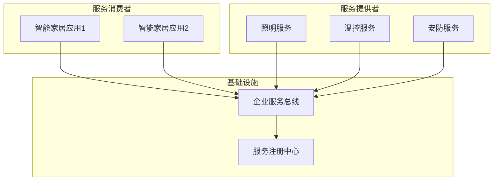

# 基于Java的智能家居设计：面向服务的智能家居架构(SOA)与Java实践

## 1. 背景介绍

### 1.1 智能家居的兴起

随着物联网、人工智能和云计算技术的快速发展,智能家居正在成为一种新兴的生活方式。智能家居系统旨在通过集成各种智能设备和传感器,实现对家居环境的自动化控制和智能管理,从而提高生活质量、节约能源并提供更安全、舒适的居住环境。

### 1.2 智能家居系统的挑战

然而,构建一个高效、可扩展且易于维护的智能家居系统并非一件易事。它需要解决诸多挑战,例如:

- **异构设备集成**: 不同厂商的智能设备使用不同的通信协议和接口,导致集成困难。
- **系统复杂性**: 涉及多个子系统(如照明、供暖、安防等),需要精心设计架构以降低复杂性。
- **可扩展性和可维护性**: 系统需要能够轻松地添加新功能和集成新设备。
- **安全和隐私**: 确保系统的安全性和用户隐私保护至关重要。

### 1.3 面向服务架构(SOA)

为了应对上述挑战,本文提出采用面向服务架构(SOA)作为智能家居系统的核心架构。SOA是一种将应用程序的不同功能单元划分为可重用的服务的架构风格。通过将复杂的系统分解为松散耦合的服务,SOA可以提高系统的灵活性、可伸缩性和可维护性。

## 2. 核心概念与联系

### 2.1 面向服务架构(SOA)

面向服务架构(SOA)是一种将应用程序的不同功能单元划分为可重用的服务的架构风格。SOA的核心思想是将应用程序构建为一组松散耦合的服务,这些服务可以被发布、发现和调用。

在SOA中,服务是自治的、可编程的和基于标准的Web服务,它们可以动态地组合在一起以满足应用程序的需求。服务通过标准化的接口进行通信,使用XML、SOAP等标准协议。

SOA架构通常包括以下关键组件:

1. **服务提供者(Service Provider)**: 实现和提供服务的应用程序或系统。
2. **服务消费者(Service Consumer)**: 发现和调用服务的应用程序或系统。
3. **服务注册中心(Service Registry)**: 用于发布、发现和管理服务的中央存储库。
4. **企业服务总线(Enterprise Service Bus, ESB)**: 一个基础设施,用于促进服务之间的通信和集成。

### 2.2 智能家居系统中的SOA

在智能家居系统中,SOA可以为不同的家居子系统(如照明、供暖、安防等)提供服务,并通过服务组合实现复杂的业务流程。例如,当用户离开家时,安防系统可以调用照明服务关闭所有灯光,并调用门锁服务锁定所有门窗。

通过将智能家居系统划分为独立的服务,SOA可以提高系统的灵活性和可维护性。新功能可以通过添加新服务或组合现有服务来实现,而不需要修改整个系统。此外,SOA还可以促进异构设备的集成,因为服务可以作为设备和应用程序之间的中介层。

### 2.3 Java在SOA中的作用

Java是实现SOA的理想选择,因为它提供了丰富的框架和工具来构建和部署Web服务。Java企业版(Java EE)提供了一套完整的规范和API,用于开发基于SOA的企业级应用程序。

常用的Java Web服务框架包括:

- **JAX-WS(Java API for XML Web Services)**: Java EE中的Web服务API,用于构建SOAP Web服务。
- **JAX-RS(Java API for RESTful Web Services)**: Java EE中的RESTful Web服务API,用于构建RESTful Web服务。
- **Apache CXF**: 一个开源的Web服务框架,支持SOAP和RESTful Web服务。
- **Spring Web Services**: Spring框架中的Web服务模块,支持SOAP和RESTful Web服务。

使用这些框架,开发人员可以轻松地创建、发布和消费Web服务,并将它们集成到智能家居系统中。

## 3. 核心算法原理具体操作步骤

### 3.1 服务发现和注册

在SOA架构中,服务提供者需要将其服务发布到服务注册中心,而服务消费者则需要从服务注册中心发现所需的服务。这个过程通常遵循以下步骤:

1. **服务发布**:
   - 服务提供者创建一个Web服务描述语言(WSDL)文件,描述服务的接口、操作和数据类型。
   - 服务提供者将WSDL文件发布到服务注册中心(如UDDI注册中心)。

2. **服务发现**:
   - 服务消费者查询服务注册中心,搜索所需的服务。
   - 服务注册中心返回匹配的WSDL文件。

3. **服务绑定**:
   - 服务消费者使用WSDL文件中的信息生成一个代理对象(Proxy)。
   - 服务消费者通过代理对象调用远程服务。

在Java中,可以使用JAXR(Java API for XML Registries)来与服务注册中心进行交互。JAXR提供了一组标准的Java API,用于发布、发现和查询Web服务。

### 3.2 服务编排和业务流程管理

在智能家居系统中,单个服务通常无法满足复杂的业务需求。因此,需要将多个服务编排在一起,形成业务流程。服务编排可以通过以下步骤实现:

1. **定义业务流程**:
   - 使用业务流程建模语言(如BPEL)定义业务流程。
   - 业务流程描述了服务之间的交互顺序和条件。

2. **部署业务流程**:
   - 将业务流程部署到业务流程引擎(如Apache ODE或ActiveBPEL)中。

3. **执行业务流程**:
   - 业务流程引擎根据定义的流程协调服务之间的交互。
   - 服务被动态调用和组合,以实现复杂的业务逻辑。

在Java中,可以使用Apache ODE或JBoss jBPM等开源框架来实现业务流程管理。这些框架提供了BPEL引擎、工作流引擎和监控工具,用于定义、执行和监控业务流程。

### 3.3 服务治理

随着服务数量的增加,服务治理变得越来越重要。服务治理包括以下方面:

1. **服务生命周期管理**:
   - 管理服务的设计、开发、测试、部署和退役等生命周期阶段。

2. **服务契约管理**:
   - 管理服务接口的版本控制和兼容性。

3. **服务监控和管理**:
   - 监控服务的性能、可用性和安全性。
   - 管理服务的配置和部署。

4. **服务安全性**:
   - 确保服务的身份验证、授权和加密。

在Java中,可以使用Apache Synapse或WSO2 Governance Registry等开源工具来实现服务治理。这些工具提供了服务存储库、策略管理和监控功能,有助于维护服务的质量和一致性。

## 4. 数学模型和公式详细讲解举例说明

在智能家居系统中,数学模型和公式常用于建模和优化各种场景,如能源管理、环境控制和安全监控等。以下是一些常见的数学模型和公式:

### 4.1 能源优化模型

能源优化模型旨在最小化家居能源消耗,同时满足用户的舒适度要求。这可以通过建立一个目标函数和一系列约束条件来实现。

目标函数:

$$\min \sum_{t=1}^{T} \sum_{i=1}^{N} C_i(t) \cdot P_i(t)$$

其中:
- $T$是时间段的总数
- $N$是家居设备的总数
- $C_i(t)$是设备$i$在时间$t$的能源成本
- $P_i(t)$是设备$i$在时间$t$的功率消耗

约束条件可能包括:
- 用户舒适度范围
- 设备功率限制
- 峰值需求限制

通过求解这个优化问题,可以得到每个时间段每个设备的最优功率分配,从而最小化总体能源成本。

### 4.2 环境控制模型

环境控制模型用于维持家居环境(如温度、湿度、照明等)在理想范围内。这可以通过建立一个反馈控制系统来实现,其中包括一个控制器和一个被控对象(如空调系统或照明系统)。

控制器的目标是将被控对象的输出($y$)调节到期望值($r$)。控制器根据误差($e=r-y$)计算控制输入($u$),并将其应用于被控对象。

一种常见的控制算法是PID控制器,其控制输入由以下公式给出:

$$u(t) = K_p e(t) + K_i \int_{0}^{t} e(\tau) d\tau + K_d \frac{de(t)}{dt}$$

其中:
- $K_p$是比例增益
- $K_i$是积分增益
- $K_d$是微分增益

通过调整这些增益参数,可以优化控制器的性能,如稳定性、响应速度和稳态精度。

### 4.3 安全监控模型

安全监控模型用于检测和预防家居安全威胁,如入室盗窃或火灾。这可以通过建立一个基于概率的异常检测模型来实现。

假设$X$是一个随机变量,表示传感器的观测值。在正常情况下,$X$服从某个已知的概率分布$P(X)$。如果观测值$x$的概率$P(x)$低于某个阈值,则认为是一个异常情况。

异常分数可以定义为:

$$s(x) = -\log P(x)$$

如果$s(x)$超过预定义的阈值,则触发安全警报。

概率分布$P(X)$可以通过机器学习算法(如高斯混合模型或核密度估计)从历史数据中学习得到。

上述只是智能家居系统中数学模型和公式的一小部分示例。根据不同的应用场景,还可以引入更多的模型和算法,如优化理论、控制理论、机器学习等。

## 5. 项目实践:代码实例和详细解释说明

在本节中,我们将通过一个基于Java的智能家居系统示例,展示如何使用SOA架构和相关技术来实现智能家居功能。

### 5.1 系统架构

我们的智能家居系统采用SOA架构,由多个独立的服务组成。系统架构如下所示:



在这个架构中:

- **服务提供者**包括照明服务、温控服务和安防服务,它们提供家居设备控制和监控功能。
- **服务消费者**是智能家居应用程序,如移动应用或网页应用,它们调用服务来实现业务逻辑。
- **企业服务总线(ESB)**作为中介,促进服务之间的通信和集成。
- **服务注册中心**用于服务的发布、发现和管理。

### 5.2 服务实现

我们将使用Java EE和JAX-WS来实现Web服务。以照明服务为例,它提供了控制家居照明设备的功能。

```java
// LightingService.java
import javax.jws.WebService;
import javax.jws.WebMethod;

@WebService
public class LightingService {
    
    @WebMethod
    public void turnOnLight(String roomName) {
        // 实现代码: 打开指定房间的灯光
    }
    
    @WebMethod
    public void turnOffLight(String roomName) {
        // 实现代码: 关闭指定房间的灯光
    }
    
    @WebMethod
    public void dimLight(String roomName, int level)