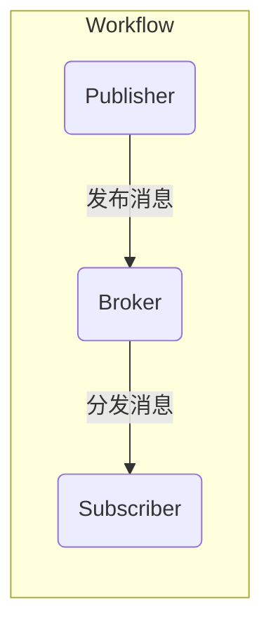
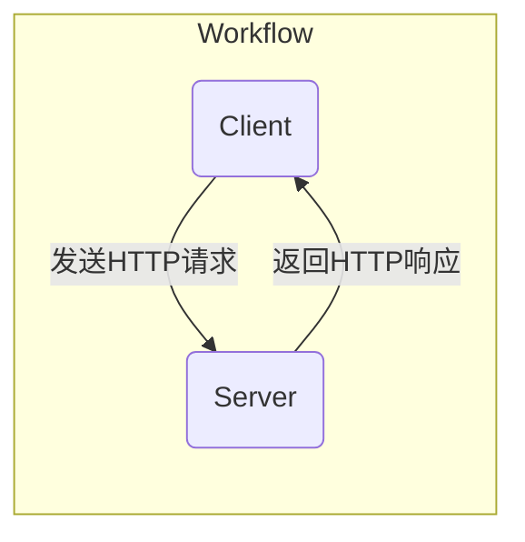
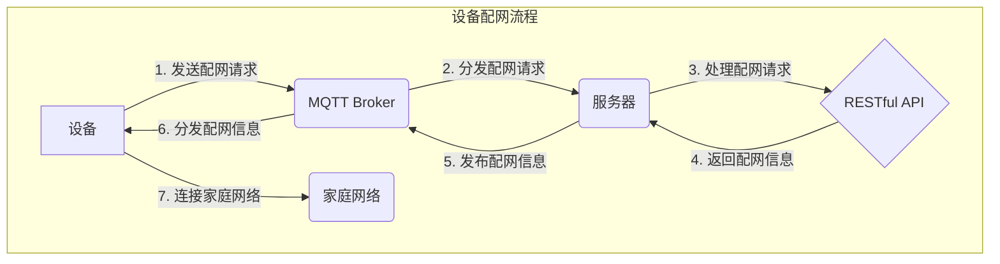

# 基于MQTT协议和RESTful API的智能家居设备配网优化方案

## 1. 背景介绍

### 1.1 智能家居概述

随着物联网技术的快速发展,智能家居系统逐渐走进千家万户,为人们的生活带来了前所未有的便利和舒适体验。智能家居系统通过将家中的各种设备联网,实现对照明、温度、安防等设备的智能控制和管理,大大提高了家居生活的质量。

### 1.2 智能家居设备配网挑战

然而,在智能家居系统的实际应用中,设备的配网问题一直是一个棘手的问题。由于家庭网络环境的复杂性和多样性,传统的配网方式(如蓝牙、红外等)往往存在配网困难、不稳定等问题,严重影响了用户体验。因此,开发一种高效、安全、可靠的智能家居设备配网方案,对于智能家居系统的顺利部署和运行至关重要。

## 2. 核心概念与联系

### 2.1 MQTT协议

MQTT(Message Queuing Telemetry Transport)是一种基于发布/订阅模式的轻量级消息传输协议,专门为资源受限的物联网设备设计。它具有以下优点:

- 极少的网络开销和协议交换开销
- 支持QoS(Quality of Service)机制,保证消息传输的可靠性
- 使用TCP/IP网络,易于穿透防火墙和NAT
- 支持主题(Topic)层次结构,实现一对多的消息发布和订阅

### 2.2 RESTful API

RESTful API(Representational State Transfer Application Programming Interface)是一种基于HTTP协议的应用程序接口,它遵循REST架构风格,具有以下特点:

- 无状态: 每个请求都包含完整的必要信息,不依赖于之前的请求
- 统一接口: 使用标准的HTTP方法(GET、POST、PUT、DELETE)操作资源
- 面向资源: 每个资源都有一个唯一的URI(Uniform Resource Identifier)
- 可缓存: 响应结果可以被缓存,提高系统性能

### 2.3 MQTT与RESTful API的联系

MQTT协议和RESTful API在智能家居设备配网中扮演着互补的角色:

- MQTT协议用于设备与服务器之间的实时通信,适合于传输实时数据和控制命令。
- RESTful API用于设备配置、状态查询等操作,提供了一种标准化的接口。

通过将两者结合,可以实现高效、灵活的智能家居设备配网和管理方案。

## 3. 核心算法原理具体操作步骤

### 3.1 MQTT协议工作原理

MQTT协议基于发布/订阅模式,涉及以下三个主要角色:

1. **发布者(Publisher)**: 发布消息的一方,将消息发送到主题(Topic)。
2. **订阅者(Subscriber)**: 订阅主题的一方,接收发布到该主题的消息。
3. **代理(Broker)**: 消息中转站,负责分发消息。

MQTT协议的工作流程如下:



1. 发布者将消息发布到代理服务器的特定主题。
2. 代理服务器根据主题分发消息给所有订阅该主题的订阅者。
3. 订阅者接收到消息并进行处理。

### 3.2 RESTful API工作原理

RESTful API通过HTTP协议的标准方法(GET、POST、PUT、DELETE)操作资源,遵循以下设计原则:

1. **资源(Resource)**: 所有数据和功能都被抽象为资源,由URI唯一标识。
2. **表现层(Representation)**: 资源的表现形式,通常为JSON或XML。
3. **状态转移(State Transfer)**: 客户端通过HTTP方法操作资源的状态。

RESTful API的工作流程如下:



1. 客户端向服务器发送HTTP请求,请求中包含操作方法(GET、POST、PUT、DELETE)和资源URI。
2. 服务器根据请求执行相应的操作,并返回HTTP响应,响应中包含资源的表现形式(JSON或XML)。
3. 客户端接收响应,并根据需要进行后续处理。

### 3.3 智能家居设备配网流程

基于MQTT协议和RESTful API,智能家居设备配网的具体流程如下:



1. 智能家居设备通过MQTT协议向代理服务器发送配网请求。
2. 代理服务器将配网请求分发给服务器。
3. 服务器通过RESTful API处理配网请求,获取家庭网络配置信息。
4. 服务器将配网信息返回给RESTful API客户端。
5. 服务器通过MQTT协议将配网信息发布到特定主题。
6. 代理服务器将配网信息分发给订阅该主题的设备。
7. 设备获取到配网信息后,连接家庭网络,完成配网过程。

通过这种方式,智能家居设备可以高效、安全地完成配网,同时服务器也可以通过RESTful API对设备进行管理和控制。

## 4. 数学模型和公式详细讲解举例说明

在智能家居设备配网优化方案中,可能需要使用一些数学模型和公式来优化配网效率和可靠性。以下是一些常见的模型和公式:

### 4.1 信道容量公式

在无线通信中,信道容量是指在给定的带宽和信噪比条件下,信道能够传输的最大数据率。信道容量公式由香农定理给出:

$$C = B \log_2(1 + \frac{S}{N})$$

其中:

- $C$ 表示信道容量(bit/s)
- $B$ 表示信道带宽(Hz)
- $S$ 表示信号功率(W)
- $N$ 表示噪声功率(W)

在智能家居设备配网过程中,可以根据实际环境中的带宽和信噪比条件,计算出理论上的最大数据传输速率,从而优化配网效率。

### 4.2 MQTT协议吞吐量模型

MQTT协议的吞吐量取决于多个因素,包括网络带宽、消息大小、QoS级别等。我们可以使用以下公式估计MQTT协议的吞吐量:

$$T = \frac{B}{H + P + (L + M) \times (1 + Q)}$$

其中:

- $T$ 表示吞吐量(消息/秒)
- $B$ 表示网络带宽(bit/s)
- $H$ 表示MQTT协议头部开销(bit)
- $P$ 表示有效载荷(Payload)开销(bit)
- $L$ 表示消息长度(bit)
- $M$ 表示元数据长度(bit)
- $Q$ 表示QoS级别(0、1或2)

通过估计MQTT协议的吞吐量,我们可以优化消息大小、QoS级别等参数,提高配网效率。

### 4.3 RESTful API响应时间模型

RESTful API的响应时间是评估API性能的重要指标之一。我们可以使用以下公式估计RESTful API的响应时间:

$$T_r = T_n + T_s + T_q + T_p + T_m$$

其中:

- $T_r$ 表示总响应时间
- $T_n$ 表示网络延迟
- $T_s$ 表示服务器处理时间
- $T_q$ 表示队列等待时间
- $T_p$ 表示数据持久化时间
- $T_m$ 表示其他开销时间

通过分析各个环节的时间开销,我们可以优化RESTful API的性能,缩短响应时间,提高配网效率。

上述数学模型和公式只是一些示例,在实际应用中,我们可能需要根据具体情况引入更多的模型和公式,以优化智能家居设备配网方案的性能和可靠性。

## 5. 项目实践: 代码实例和详细解释说明

为了更好地理解基于MQTT协议和RESTful API的智能家居设备配网优化方案,我们将通过一个实际项目来进行实践和说明。

### 5.1 项目概述

在本项目中,我们将开发一个智能家居系统,包括以下主要组件:

1. **智能家居设备**: 支持MQTT协议的物联网设备,如智能灯泡、智能插座等。
2. **MQTT代理服务器**: 负责接收和分发MQTT消息。
3. **服务器**: 提供RESTful API,用于设备配置、状态查询等操作。
4. **移动应用程序**: 用于控制和监控智能家居设备。

### 5.2 MQTT代码实例

以下是一个使用Python编写的MQTT客户端示例代码:

```python
import paho.mqtt.client as mqtt

# MQTT代理服务器地址和端口
broker_address = "broker.example.com"
broker_port = 1883

# 定义MQTT回调函数
def on_connect(client, userdata, flags, rc):
    print("Connected with result code " + str(rc))

def on_message(client, userdata, msg):
    print("Received message: " + msg.topic + " " + str(msg.payload))

# 创建MQTT客户端实例
client = mqtt.Client()

# 设置回调函数
client.on_connect = on_connect
client.on_message = on_message

# 连接MQTT代理服务器
client.connect(broker_address, broker_port)

# 订阅主题
client.subscribe("home/devices/#")

# 发布消息
client.publish("home/devices/light1", "ON")

# 保持连接
client.loop_forever()
```

在这个示例中,我们首先导入了`paho.mqtt.client`模块,用于创建MQTT客户端。然后,我们定义了MQTT代理服务器的地址和端口。

接下来,我们定义了两个回调函数:`on_connect`和`on_message`。`on_connect`函数在客户端连接到代理服务器时被调用,而`on_message`函数在收到消息时被调用。

我们创建了一个`mqtt.Client`实例,并设置了回调函数。然后,我们连接到MQTT代理服务器,订阅了主题`"home/devices/#"`。

最后,我们发布了一条消息到主题`"home/devices/light1"`,并使用`loop_forever()`方法保持连接。

### 5.3 RESTful API代码实例

以下是一个使用Python和Flask框架实现的RESTful API示例代码:

```python
from flask import Flask, jsonify, request

app = Flask(__name__)

# 模拟设备数据
devices = [
    {"id": 1, "name": "Light 1", "status": "OFF"},
    {"id": 2, "name": "Light 2", "status": "ON"},
    {"id": 3, "name": "Thermostat", "temperature": 25}
]

# 获取所有设备
@app.route('/devices', methods=['GET'])
def get_devices():
    return jsonify(devices)

# 获取单个设备
@app.route('/devices/<int:device_id>', methods=['GET'])
def get_device(device_id):
    device = next((d for d in devices if d['id'] == device_id), None)
    if device:
        return jsonify(device)
    else:
        return jsonify({"error": "Device not found"}), 404

# 控制设备
@app.route('/devices/<int:device_id>', methods=['PUT'])
def control_device(device_id):
    device = next((d for d in devices if d['id'] == device_id), None)
    if device:
        data = request.get_json()
        if 'status' in data:
            device['status'] = data['status']
        if 'temperature' in data:
            device['temperature'] = data['temperature']
        return jsonify(device)
    else:
        return jsonify({"error": "Device not found"}), 404

if __name__ == '__main__':
    app.run(host='0.0.0.0', port=5000, debug=True)
```

在这个示例中,我们首先导入了Flask和其他必要的模块。然后,我们创建了一个Flask应用程序实例。

我们定义了一个模拟的设备数据列表,包含三个设备的信息。

接下来,我们定义了三个RESTful API端点:

1. `GET /devices`: