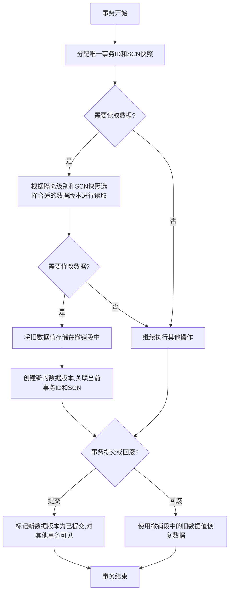

# 基于MVCC的Oracle数据库事务隔离

## 1.背景介绍

在现代数据库系统中,事务是一个基本且关键的概念。事务可确保数据的完整性和一致性,防止由于故障或并发访问导致的数据损坏。Oracle数据库作为领先的关系型数据库管理系统,提供了强大的事务处理能力,其中采用了多版本并发控制(MVCC)机制来实现事务隔离。

事务隔离是指并发执行的事务不会相互影响,每个事务有自己独立的数据视图。Oracle通过MVCC实现了四种标准的隔离级别:读uncommitted(读未提交)、读committed(读已提交)、可重复读和串行化。其中,读已提交和可重复读是Oracle的默认隔离级别。

## 2.核心概念与联系

### 2.1 MVCC概念

多版本并发控制(MVCC)是一种用于管理并发访问的技术,它通过为每个事务分配一个唯一的事务ID和系统更改号(SCN),并维护数据的多个版本来实现读写并发。

在MVCC中,每个数据行都与一个版本信息相关联,包括创建该行版本的事务ID和SCN。当事务需要读取数据时,Oracle会根据事务的隔离级别和当前SCN,从数据行的多个版本中选择满足条件的版本进行读取。

### 2.2 系统更改号(SCN)

系统更改号(SCN)是Oracle用于标识数据库更改的逻辑时间戳。每当数据库发生更改时,Oracle都会为该更改分配一个唯一的SCN值。SCN值是一个单调递增的数字序列,用于确定数据版本的可见性和有效性。

### 2.3 读一致性

读一致性(Read Consistency)是Oracle事务隔离的一个重要概念。它确保事务在整个执行过程中,读取到的数据是逻辑上一致的。Oracle通过MVCC机制,为每个事务分配一个SCN快照,事务只能读取在该SCN之前已提交的数据版本。

### 2.4 撤销段(Undo Segments)

撤销段是Oracle用于存储数据修改的逆向操作信息的特殊段。当事务对数据进行修改时,Oracle会将旧的数据值存储在撤销段中。这样,如果事务需要回滚,Oracle可以使用撤销段中的信息恢复数据到修改前的状态。撤销段对于实现MVCC和读一致性至关重要。

## 3.核心算法原理具体操作步骤

Oracle通过MVCC实现事务隔离的核心算法原理如下:

1. 为每个事务分配一个唯一的事务ID和SCN快照。
2. 当事务需要读取数据时,Oracle会根据事务的隔离级别和SCN快照,从数据行的多个版本中选择满足条件的版本进行读取。
3. 如果事务需要修改数据,Oracle会先将旧的数据值存储在撤销段中,然后创建一个新的数据版本,并将该版本与当前事务ID和SCN相关联。
4. 当事务提交时,Oracle会将新创建的数据版本标记为已提交,并使其对其他事务可见。
5. 如果事务回滚,Oracle会使用撤销段中存储的旧数据值恢复数据到修改前的状态。

以下是Oracle MVCC实现事务隔离的具体操作步骤:



## 4.数学模型和公式详细讲解举例说明

在Oracle的MVCC机制中,数据版本的可见性和有效性由事务的SCN快照和数据版本的创建SCN决定。Oracle使用以下公式来确定数据版本是否对当前事务可见:

$$
\begin{aligned}
&\text{数据版本可见条件:} \\
&\qquad \text{数据版本创建SCN} \leq \text{事务SCN快照} < \text{数据版本过期SCN}
\end{aligned}
$$

其中,数据版本过期SCN是指该版本被新版本覆盖或被删除的SCN。

例如,假设一个事务的SCN快照为1000,数据库中有以下三个数据版本:

| 版本号 | 创建SCN | 过期SCN |
|--------|---------|---------|
| 1      | 800     | 1200    |
| 2      | 1100    | 1500    |
| 3      | 1600    | -       |

根据上述公式,对于该事务,版本1和版本2是可见的,因为它们的创建SCN小于事务SCN快照,且事务SCN快照小于它们的过期SCN。而版本3是不可见的,因为它的创建SCN大于事务SCN快照。

Oracle还使用类似的公式来确定数据版本是否已提交:

$$
\begin{aligned}
&\text{数据版本已提交条件:} \\
&\qquad \text{数据版本创建SCN} < \text{当前SCN}
\end{aligned}
$$

如果一个数据版本的创建SCN小于当前系统SCN,则该版本被视为已提交。

通过这些公式,Oracle可以准确地确定每个事务应该读取哪些数据版本,从而实现不同的隔离级别。

## 5.项目实践:代码实例和详细解释说明

为了更好地理解Oracle MVCC机制,我们可以通过一个简单的示例来观察MVCC在实际操作中的表现。

假设我们有一个名为`orders`的表,其中包含`order_id`、`customer_id`和`amount`三个列。我们将创建两个会话(Session 1和Session 2),并在其中执行一些事务操作。

**Session 1:**

```sql
-- 创建orders表
CREATE TABLE orders (
    order_id NUMBER PRIMARY KEY,
    customer_id NUMBER,
    amount NUMBER
);

-- 插入一些示例数据
INSERT INTO orders VALUES (1, 101, 100);
INSERT INTO orders VALUES (2, 102, 200);
INSERT INTO orders VALUES (3, 103, 300);

-- 启动一个新事务
SET TRANSACTION ISOLATION LEVEL READ COMMITTED;
BEGIN;

-- 查看orders表的当前数据
SELECT * FROM orders;

-- 更新order_id为2的订单金额
UPDATE orders SET amount = 250 WHERE order_id = 2;
```

**Session 2:**

```sql
-- 启动一个新事务
SET TRANSACTION ISOLATION LEVEL READ COMMITTED;
BEGIN;

-- 查看orders表的当前数据
SELECT * FROM orders;
```

在Session 1中,我们首先创建了`orders`表并插入了一些示例数据。然后,我们启动了一个新事务,并将隔离级别设置为`READ COMMITTED`(读已提交)。在事务中,我们首先查看了`orders`表的当前数据,然后更新了`order_id`为2的订单金额。

在Session 2中,我们也启动了一个新事务,隔离级别同样设置为`READ COMMITTED`。在事务中,我们查看了`orders`表的当前数据。

现在,让我们观察两个会话中查询结果的不同:

**Session 1:**

```
ORDER_ID  CUSTOMER_ID    AMOUNT
--------  -----------  --------
        1          101       100
        2          102       200
        3          103       300
```

在更新之前,Session 1可以看到原始数据。

```
ORDER_ID  CUSTOMER_ID    AMOUNT
--------  -----------  --------
        1          101       100
        2          102       250
        3          103       300
```

更新后,Session 1可以看到更新后的数据。

**Session 2:**

```
ORDER_ID  CUSTOMER_ID    AMOUNT
--------  -----------  --------
        1          101       100
        2          102       200
        3          103       300
```

在Session 2中,由于我们的事务启动时间晚于Session 1的更新操作,因此我们只能看到更新之前的旧数据。这就是MVCC机制的体现:每个事务都有自己独立的数据视图,不会受到其他并发事务的影响。

如果我们在Session 1中提交事务,然后在Session 2中再次查询`orders`表,我们将看到:

```
ORDER_ID  CUSTOMER_ID    AMOUNT
--------  -----------  --------
        1          101       100
        2          102       250
        3          103       300
```

此时,Session 2可以看到Session 1提交的更新后的数据。

通过这个示例,我们可以清楚地看到Oracle MVCC机制如何实现事务隔离,确保每个事务都有一致的数据视图,直到其他事务提交后才能看到更新后的数据。

## 6.实际应用场景

Oracle MVCC机制在各种应用场景中都发挥着重要作用,特别是在需要确保数据一致性和并发访问控制的场景下。以下是一些典型的应用场景:

1. **在线交易处理系统(OLTP)**: OLTP系统通常需要处理大量的并发事务,例如银行系统、零售系统等。MVCC机制可以确保每个事务都有一致的数据视图,防止脏读、不可重复读和幻读等问题,从而保证数据的完整性和一致性。

2. **电子商务系统**: 在电子商务系统中,多个用户可能同时查看和下单同一商品。MVCC机制可以确保每个用户看到的库存数据是一致的,直到下单事务提交后才能看到更新后的库存数据。

3. **预订系统**: 预订系统通常需要处理大量的并发预订请求,例如机票预订、酒店预订等。MVCC机制可以确保每个预订事务都有一致的数据视图,防止因并发访问而导致的数据不一致问题。

4. **金融系统**: 金融系统对数据完整性和一致性有着极高的要求。MVCC机制可以确保每个事务都有一致的账户余额视图,防止因并发访问而导致的数据错误或资金丢失。

5. **数据仓库和决策支持系统**: 在数据仓库和决策支持系统中,通常需要执行长时间运行的查询和报告任务。MVCC机制可以确保这些查询和报告任务在执行过程中看到一致的数据视图,即使底层数据在查询执行期间发生了变化。

总的来说,Oracle MVCC机制为确保数据完整性和一致性提供了强有力的支持,是实现高并发、高可靠性系统的关键技术之一。

## 7.工具和资源推荐

在学习和使用Oracle MVCC机制时,以下工具和资源可能会对您有所帮助:

1. **Oracle文档**: Oracle提供了详细的文档,涵盖了MVCC机制的原理、实现和最佳实践。您可以在Oracle官方网站上找到相关文档。

2. **Oracle SQL Developer**: SQL Developer是Oracle提供的免费集成开发环境,可用于查询、管理和监控Oracle数据库。它提供了丰富的可视化工具和实用程序,可以帮助您更好地理解和调试MVCC相关的问题。

3. **Oracle Database Utilities**: Oracle数据库实用程序,如`DBMS_LOCK`、`DBMS_TRANSACTION`和`DBMS_STATS`等,可以用于监控和管理事务、锁和统计信息,对于调试和优化MVCC相关问题非常有用。

4. **Oracle社区论坛**: Oracle社区论坛是一个庞大的在线社区,您可以在这里与其他Oracle用户和专家交流、提问和分享经验。这是一个获取最新信息和解决问题的宝贵资源。

5. **Oracle认证培训**: Oracle提供了各种认证培训课程,涵盖了Oracle数据库的各个方面,包括MVCC机制。通过这些培训课程,您可以系统地学习Oracle数据库的核心概念和最佳实践。

6. **第三方书籍和在线资源**: 市面上有许多优秀的Oracle数据库书籍和在线资源,如Oracle官方书籍、技术博客和视频教程等,可以帮助您深入理解MVCC机制及其在实际应用中的使用。

利用这些工具和资源,您可以更好地掌握Oracle MVCC机制,提高数据库开发和管理的效率和质量。

## 8.总结:未来发展趋