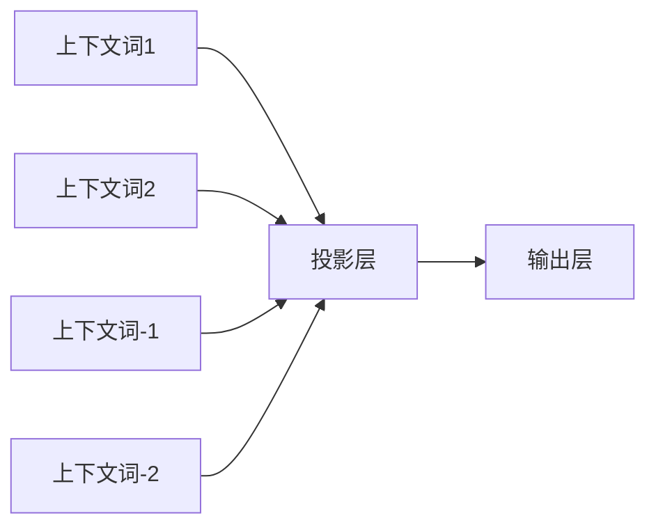
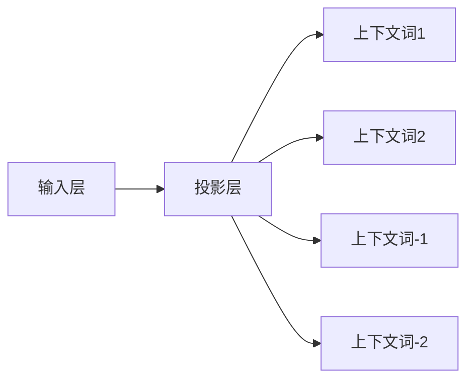
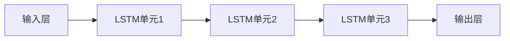

# 基于NLP的电影推荐Android应用程序的实现

## 1.背景介绍

### 1.1 电影推荐系统的重要性

在当今信息时代,人们面临着海量的电影选择,很难从中找到真正感兴趣和喜欢的电影。传统的基于内容的推荐系统和协同过滤推荐系统存在一些缺陷,比如无法很好地解决冷启动问题、数据稀疏性问题等。而基于自然语言处理(NLP)的电影推荐系统能够更好地理解用户的口味偏好,提供个性化和高质量的推荐,从而提高用户体验。

### 1.2 NLP在推荐系统中的应用

自然语言处理技术在推荐系统中的应用主要包括:

- 情感分析:分析用户对电影的评论,了解用户的情感倾向
- 主题建模:发现用户评论中的潜在主题,捕捉用户的兴趣
- 语义匹配:将用户的自然语言查询与电影信息进行语义匹配

通过NLP技术,推荐系统能够更好地理解用户的需求,提供更加个性化和准确的推荐结果。

## 2.核心概念与联系  

### 2.1 自然语言处理(NLP)

自然语言处理是人工智能的一个重要分支,旨在使计算机能够理解和生成人类语言。NLP技术包括:

- 文本预处理:分词、去停用词、词干提取等
- 词向量表示:Word2Vec、GloVe等
- 语言模型:N-gram、RNN、Transformer等
- 命名实体识别、关系抽取、情感分析等任务

### 2.2 推荐系统

推荐系统是一种为用户提供个性化推荐的系统,主要有以下几种方法:

- 基于内容:根据用户历史行为推荐相似内容
- 协同过滤:根据用户间的相似性推荐
- 基于知识图谱:利用知识图谱挖掘实体关系
- 混合推荐:综合多种方法的优点

### 2.3 NLP与推荐系统的结合

将NLP技术应用于推荐系统,可以更好地理解用户需求、捕捉用户兴趣,从而提高推荐质量。常见的做法包括:

- 情感分析:分析用户评论,了解用户对电影的喜好程度
- 主题建模:发现用户评论中的潜在主题,捕捉用户兴趣
- 语义匹配:将用户查询与电影信息进行语义匹配

## 3.核心算法原理具体操作步骤

实现基于NLP的电影推荐Android应用程序,主要包括以下几个步骤:

### 3.1 数据采集与预处理

首先需要采集电影数据和用户数据,包括电影信息(名称、类型、简介等)和用户评论数据。对数据进行预处理,如分词、去停用词、词干提取等,为后续的NLP任务做准备。

### 3.2 词向量表示

将文本数据(电影简介、用户评论)转换为词向量表示,常用的方法有Word2Vec、GloVe等。词向量能够捕捉词与词之间的语义关系,为后续的NLP任务提供有效的语义表示。

### 3.3 情感分析

对用户评论进行情感分析,判断用户对电影的情感倾向(正面、负面或中性)。可以使用基于词典的方法或基于深度学习的方法(如LSTM、Transformer等)。情感分析结果可用于推荐系统,推荐用户喜欢的电影。

### 3.4 主题建模

使用主题模型(如LDA)发现用户评论中的潜在主题,捕捉用户的兴趣偏好。将主题作为用户画像的一部分,为推荐系统提供有价值的信息。

### 3.5 语义匹配

当用户输入自然语言查询时,将查询与电影信息进行语义匹配,找到与查询最相关的电影。可以使用基于词袋模型的方法(如TF-IDF)或基于深度学习的方法(如Siamese网络)。

### 3.6 推荐策略

综合上述NLP技术的结果(情感分析、主题建模、语义匹配),设计合理的推荐策略,为用户生成个性化的电影推荐列表。可以考虑基于内容、协同过滤等多种推荐方法的融合。

### 3.7 Android应用程序开发

最后,将上述算法和模型集成到Android应用程序中,开发出具有NLP能力的电影推荐App,为用户提供良好的推荐体验。

## 4.数学模型和公式详细讲解举例说明

### 4.1 词向量表示

#### 4.1.1 Word2Vec

Word2Vec是一种高效的词嵌入模型,能够将词语映射到低维连续向量空间,保持词与词之间的语义关系。Word2Vec包括两种模型:CBOW(连续词袋模型)和Skip-gram。

CBOW模型的目标是根据上下文词预测目标词,模型架构如下:



CBOW模型的目标函数为:

$$\max_{\theta}\frac{1}{T}\sum_{t=1}^{T}\log p(w_t|w_{t-n},\dots,w_{t-1},w_{t+1},\dots,w_{t+n})$$

其中$\theta$为模型参数,$T$为语料库中词的总数,$n$为上下文窗口大小。

Skip-gram模型则是根据目标词预测上下文词,模型架构如下:



Skip-gram模型的目标函数为:

$$\max_{\theta}\frac{1}{T}\sum_{t=1}^{T}\sum_{j=-n}^{n}\log p(w_{t+j}|w_t)$$

通过优化上述目标函数,Word2Vec能够学习出词向量表示,捕捉词与词之间的语义关系。

#### 4.1.2 GloVe

GloVe(Global Vectors for Word Representation)是另一种流行的词向量表示方法,它直接从词共现统计中学习词向量。

GloVe的目标函数为:

$$J=\sum_{i,j=1}^{V}f(X_{ij})(w_i^Tw_j+b_i+b_j-\log X_{ij})^2$$

其中$X$为词共现矩阵,$V$为词汇表大小,$w_i$和$b_i$分别为词$i$的词向量和偏置项,$f(x)$为权重函数(如$f(x)=(\frac{x}{x_{\max}})^{\alpha}$)。

通过优化上述目标函数,GloVe能够获得词向量表示,并很好地捕捉词与词之间的语义和概念关系。

### 4.2 情感分析

情感分析常用的数学模型是基于机器学习或深度学习的分类模型,如逻辑回归、支持向量机、LSTM等。以LSTM为例:



LSTM能够有效地捕捉序列数据中的长期依赖关系,适合于文本情感分析任务。LSTM的核心是门控机制,包括遗忘门、输入门和输出门,用于控制信息的流动。

遗忘门决定了有多少之前的信息需要被遗忘:

$$f_t=\sigma(W_f\cdot[h_{t-1},x_t]+b_f)$$

输入门决定了有多少新的信息需要被记住:

$$i_t=\sigma(W_i\cdot[h_{t-1},x_t]+b_i)$$
$$\tilde{C}_t=\tanh(W_C\cdot[h_{t-1},x_t]+b_C)$$

输出门决定了有多少信息需要被输出:

$$o_t=\sigma(W_o\cdot[h_{t-1},x_t]+b_o)$$
$$h_t=o_t\odot\tanh(C_t)$$

其中$\sigma$为sigmoid激活函数,$\odot$为元素乘积。

通过反向传播算法训练LSTM模型,可以学习到合适的参数,对文本序列进行情感分类。

### 4.3 主题建模

主题模型常用的是LDA(Latent Dirichlet Allocation,潜在狄利克雷分布)模型。LDA是一种无监督的主题模型,能够从文档集合中自动发现潜在的主题。

LDA模型的生成过程如下:

1. 对每个文档$d$:
    - 从狄利克雷分布$Dir(\alpha)$中抽取主题分布$\theta_d$
2. 对每个主题$k$:
    - 从狄利克雷分布$Dir(\beta)$中抽取词分布$\phi_k$
3. 对文档$d$中的每个词$w_{dn}$:
    - 从$\theta_d$中抽取主题$z_{dn}$
    - 从$\phi_{z_{dn}}$中抽取词$w_{dn}$

其中$\alpha$和$\beta$是超参数,控制着主题-文档分布和词-主题分布的离散程度。

LDA模型的目标是最大化语料库的对数似然函数:

$$\log p(D|\alpha,\beta)=\sum_{d=1}^{M}\log\left(\int_{\theta_d}p(\theta_d|\alpha)\left(\prod_{n=1}^{N_d}\sum_{z_{dn}}p(z_{dn}|\theta_d)p(w_{dn}|z_{dn},\beta)\right)d\theta_d\right)$$

通过贝叶斯推断(如变分推断)求解上述目标函数,可以获得文档-主题分布$\theta$和词-主题分布$\phi$,从而发现文档集合中的潜在主题。

## 5.项目实践:代码实例和详细解释说明

本节将提供一些核心代码示例,并对其进行详细解释,帮助读者更好地理解如何实现基于NLP的电影推荐Android应用程序。

### 5.1 数据预处理

```python
import re
import nltk
from nltk.corpus import stopwords

# 分词
def tokenize(text):
    tokens = nltk.word_tokenize(text)
    return tokens

# 去停用词
def remove_stopwords(tokens):
    stop_words = set(stopwords.words('english'))
    filtered_tokens = [w for w in tokens if w.lower() not in stop_words]
    return filtered_tokens

# 词干提取
def stem_tokens(tokens):
    stemmer = nltk.stem.PorterStemmer()
    stemmed_tokens = [stemmer.stem(token) for token in tokens]
    return stemmed_tokens

# 预处理管道
def preprocess(text):
    tokens = tokenize(text)
    filtered_tokens = remove_stopwords(tokens)
    stemmed_tokens = stem_tokens(filtered_tokens)
    return stemmed_tokens
```

上述代码实现了文本预处理的基本功能,包括分词、去停用词和词干提取。这些预处理步骤对于后续的NLP任务(如词向量表示、情感分析等)非常重要。

### 5.2 词向量表示

```python
import gensim

# 训练Word2Vec模型
def train_word2vec(corpus, vector_size=100, window=5, min_count=5, workers=4):
    model = gensim.models.Word2Vec(corpus, vector_size=vector_size, window=window, min_count=min_count, workers=workers)
    return model

# 获取词向量
def get_word_vector(model, word):
    try:
        vector = model.wv[word]
    except KeyError:
        vector = None
    return vector
```

上述代码使用了Gensim库实现Word2Vec模型的训练和词向量查询。`train_word2vec`函数接受语料库`corpus`和一些超参数,返回训练好的Word2Vec模型。`get_word_vector`函数则用于获取特定词的词向量表示。

### 5.3 情感分析

```python
import tensorflow as tf
from tensorflow.keras.layers import Embedding, LSTM, Dense
from tensorflow.keras.models import Sequential
from tensorflow.keras.preprocessing.sequence import pad_sequences

# 定义LSTM模型
def build_lstm_model(vocab_size, embedding_dim, max_length):
    model = Sequential([
        Embedding(vocab_size, embedding_dim, input_length=max_length),
        LSTM(64),
        Dense(1, activation='sigmoid')
    ])
    model.compile(optimizer='adam', loss='binary_crossentropy', metrics=['accuracy'])