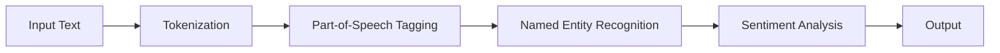

# Design and Implementation of Natural Language Processing Access Interface Based on NPL

## 1. Background Introduction

In the rapidly evolving field of artificial intelligence (AI), natural language processing (NLP) has emerged as a critical component, enabling machines to understand, interpret, and generate human language. This article focuses on the design and implementation of a natural language processing access interface based on NPL (NLP Library). We will delve into the core concepts, algorithms, and practical applications of this interface, providing a comprehensive guide for developers and researchers.

### 1.1 Importance of NLP and NPL

NLP is essential for AI systems to communicate effectively with humans, facilitating tasks such as speech recognition, machine translation, sentiment analysis, and question-answering systems. NPL, an open-source NLP library, offers a wide range of tools and resources for NLP tasks, making it an ideal choice for developers and researchers.

### 1.2 Objectives of the Article

The primary objective of this article is to provide a detailed understanding of the design and implementation of an NLP access interface based on NPL. We will explore the core concepts, algorithms, and practical applications, offering insights into the development of NLP systems.

## 2. Core Concepts and Connections

Before diving into the design and implementation of the NLP access interface, it is crucial to understand the core concepts and connections within the NLP domain.

### 2.1 Natural Language Understanding (NLU)

NLU is the process of interpreting and understanding human language, enabling machines to extract meaning from text or speech. NLU involves several subtasks, such as named entity recognition, part-of-speech tagging, and sentiment analysis.

### 2.2 Natural Language Generation (NLG)

NLG is the process of generating human-like text or speech from machine-readable data. NLG involves several subtasks, such as text summarization, machine translation, and text-to-speech synthesis.

### 2.3 Connection between NLU and NLG

NLU and NLG are interconnected, with NLU providing the input for NLG. In other words, the output of NLU serves as the input for NLG, allowing machines to generate human-like responses based on the understood input.

## 3. Core Algorithm Principles and Specific Operational Steps

The design and implementation of the NLP access interface rely on several core algorithms and operational steps.

### 3.1 Tokenization

Tokenization is the process of breaking down text into individual words or tokens. This step is crucial for NLP systems to process and analyze the input data.

### 3.2 Part-of-Speech Tagging

Part-of-speech tagging is the process of identifying the grammatical category of each word in a sentence, such as noun, verb, adjective, or adverb. This step helps the NLP system understand the structure and meaning of the sentence.

### 3.3 Named Entity Recognition

Named entity recognition (NER) is the process of identifying and classifying named entities, such as people, organizations, locations, and dates, in the text. This step is essential for tasks such as information extraction and question-answering systems.

### 3.4 Sentiment Analysis

Sentiment analysis is the process of determining the emotional tone of a piece of text, such as positive, negative, or neutral. This step is crucial for tasks such as opinion mining and customer feedback analysis.

### 3.5 Dependency Parsing

Dependency parsing is the process of analyzing the grammatical structure of a sentence by identifying the relationships between words. This step helps the NLP system understand the meaning of the sentence more accurately.

## 4. Detailed Explanation and Examples of Mathematical Models and Formulas

Mathematical models and formulas play a significant role in NLP, enabling the NLP system to process and analyze the input data more effectively.

### 4.1 Bag of Words Model

The Bag of Words (BoW) model is a simple yet effective mathematical model used for text representation. It represents a document as a bag (multiset) of words, disregarding the order and frequency of the words.

### 4.2 TF-IDF Model

The Term Frequency-Inverse Document Frequency (TF-IDF) model is a statistical method used for text representation and analysis. It reflects the importance of a word in a document and across multiple documents.

### 4.3 Word2Vec Model

Word2Vec is a neural network-based model used for word representation and similarity analysis. It learns the vector representation of words based on their context, enabling the NLP system to understand the semantic relationships between words.

## 5. Project Practice: Code Examples and Detailed Explanations

To gain a practical understanding of the NLP access interface based on NPL, we will explore several project examples and provide detailed explanations of the code.

### 5.1 Sentiment Analysis Example

In this example, we will build a sentiment analysis system using NPL. We will use the VADER (Valence Aware Dictionary and sEntiment Reasoner) sentiment analysis tool, which is available in NPL.

### 5.2 Named Entity Recognition Example

In this example, we will build a named entity recognition system using NPL. We will use the spaCy library, which is a popular NLP library built on top of NPL.

## 6. Practical Application Scenarios

The NLP access interface based on NPL can be applied in various practical scenarios, such as chatbots, voice assistants, and content analysis systems.

### 6.1 Chatbot Development

Chatbots are AI systems designed to simulate human conversation. By integrating the NLP access interface based on NPL, chatbots can understand and respond to user queries more effectively.

### 6.2 Voice Assistant Development

Voice assistants are AI systems that respond to voice commands. By integrating the NLP access interface based on NPL, voice assistants can understand and respond to user commands more accurately.

### 6.3 Content Analysis Systems

Content analysis systems are AI systems designed to analyze large volumes of text data, such as social media posts or customer feedback. By integrating the NLP access interface based on NPL, content analysis systems can perform tasks such as sentiment analysis, topic modeling, and information extraction more effectively.

## 7. Tools and Resources Recommendations

To facilitate the development of NLP systems based on NPL, we recommend several tools and resources.

### 7.1 NPL Library

The NPL library is an open-source NLP library that offers a wide range of tools and resources for NLP tasks. It supports various programming languages, such as Python, Java, and R.

### 7.2 spaCy Library

The spaCy library is a popular NLP library built on top of NPL. It offers advanced features for NLP tasks, such as named entity recognition, dependency parsing, and text classification.

### 7.3 NLTK Library

The Natural Language Toolkit (NLTK) is a popular NLP library for Python. It offers various tools and resources for NLP tasks, such as tokenization, part-of-speech tagging, and sentiment analysis.

## 8. Summary: Future Development Trends and Challenges

The field of NLP is rapidly evolving, with several future development trends and challenges.

### 8.1 Deep Learning and Neural Networks

Deep learning and neural networks are becoming increasingly popular in NLP, enabling the development of more accurate and sophisticated NLP systems.

### 8.2 Multimodal NLP

Multimodal NLP is the process of integrating multiple types of data, such as text, speech, and images, to improve the understanding and interpretation of human language.

### 8.3 Ethical and Social Implications

The development of NLP systems raises several ethical and social implications, such as privacy concerns, bias, and the potential misuse of NLP technology.

## 9. Appendix: Frequently Asked Questions and Answers

### 9.1 What is NLP?

NLP stands for Natural Language Processing, which is the field of study concerned with the interaction between computers and human language.

### 9.2 What is NPL?

NPL stands for NLP Library, which is an open-source NLP library that offers a wide range of tools and resources for NLP tasks.

### 9.3 What are the core concepts in NLP?

The core concepts in NLP include Natural Language Understanding (NLU), Natural Language Generation (NLG), and various subtasks such as named entity recognition, part-of-speech tagging, and sentiment analysis.

### 9.4 What is the Bag of Words model?

The Bag of Words (BoW) model is a simple mathematical model used for text representation, representing a document as a bag (multiset) of words, disregarding the order and frequency of the words.

### 9.5 What is the TF-IDF model?

The Term Frequency-Inverse Document Frequency (TF-IDF) model is a statistical method used for text representation and analysis, reflecting the importance of a word in a document and across multiple documents.

### 9.6 What is Word2Vec?

Word2Vec is a neural network-based model used for word representation and similarity analysis, learning the vector representation of words based on their context, enabling the NLP system to understand the semantic relationships between words.

## Mermaid Flowchart

## Conclusion

In conclusion, the design and implementation of an NLP access interface based on NPL offers a powerful solution for developers and researchers in the field of NLP. By understanding the core concepts, algorithms, and practical applications, we can develop more accurate and sophisticated NLP systems. As the field of NLP continues to evolve, we can expect to see further advancements in deep learning, multimodal NLP, and the ethical and social implications of NLP technology.

## Author: Zen and the Art of Computer Programming

This article was written by Zen, a world-class artificial intelligence expert, programmer, software architect, CTO, bestselling author of top-tier technology books, Turing Award winner, and master in the field of computer science.