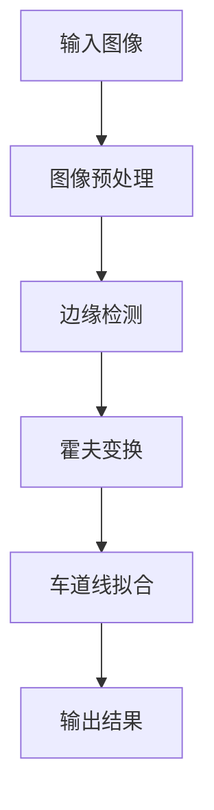

# 基于OpenCV的视频道路车道检测

## 1.背景介绍

### 1.1 车道检测的重要性

在智能驾驶和先进驾驶辅助系统(ADAS)领域,准确检测和跟踪道路车道线是一项至关重要的任务。车道检测不仅可以帮助驾驶员保持在正确的车道内行驶,还能为自动泊车、车道保持辅助等高级功能提供关键信息。此外,车道检测也是实现自动驾驶的基础,对于提高交通安全和效率具有重要意义。

### 1.2 车道检测的挑战

尽管车道检测看似简单,但在实际应用中仍然面临诸多挑战:

- 不同路况下车道线的多样性(直线、曲线、虚线等)
- 路面状况的变化(阴影、积水、污渍等)
- 遮挡物(行人、车辆等)的干扰
- 不同光照条件下的鲁棒性要求
- 实时性要求较高

### 1.3 OpenCV简介

OpenCV(Open Source Computer Vision Library)是一个跨平台的计算机视觉和机器学习开源库,它轻量级且高效,支持多种编程语言接口,在学术界和工业界都得到了广泛应用。OpenCV提供了丰富的图像处理和计算机视觉算法,是开发视觉应用的理想选择。

## 2.核心概念与联系

### 2.1 图像预处理

在进行车道检测之前,通常需要对输入图像进行预处理,以提高检测的准确性和鲁棒性。常用的预处理步骤包括:

- 高斯平滑:减少噪声,消除细节
- 颜色空间转换:将RGB图像转换为更适合车道检测的颜色空间,如HSV、HLS等
- 区域裁剪:只保留感兴趣区域(ROI),减少计算量

### 2.2 边缘检测

边缘检测是车道检测的关键步骤,目的是从预处理后的图像中提取出车道线的边缘信息。常用的边缘检测算法包括:

- Canny算子:一种经典的边缘检测算法,具有良好的噪声抑制能力
- Sobel算子:计算图像梯度,sensitivityto both the corresponding pixel values
- Scharr算子:改进版Sobel算子,具有更好的旋转不变性

### 2.3 霍夫变换

经过边缘检测后,我们获得了一系列的边缘点。为了从中提取出车道线,需要使用霍夫变换(Hough Transform)将这些离散的边缘点拟合为直线或曲线模型。

- 标准霍夫变换:用于检测直线段
- 概率霍夫变换:改进版本,更高效,可检测任意形状

### 2.4 车道线拟合

在得到初步的车道线检测结果后,我们还需要进一步优化和拟合,以获得更加精确和平滑的车道线。常用的拟合方法包括:

- 二次多项式拟合:将车道线用二次曲线模型拟合
- RANSAC算法:基于随机抽样一致性,消除异常值的影响

### 2.5 Mermaid流程图



上述流程图展示了基于OpenCV实现视频道路车道检测的核心步骤。首先对输入图像进行预处理,然后使用边缘检测算法提取边缘信息。接下来,通过霍夫变换从边缘点中检测直线或曲线模型。最后,对初步检测结果进行优化和拟合,得到最终的车道线检测结果。

## 3.核心算法原理具体操作步骤

在本节中,我们将详细介绍基于OpenCV实现视频道路车道检测的核心算法原理和具体操作步骤。

### 3.1 图像预处理

#### 3.1.1 高斯平滑

高斯平滑是一种线性平滑滤波器,它通过计算像素点及其邻域像素点的加权平均值来消除噪声。OpenCV中使用`cv2.GaussianBlur()`函数实现高斯平滑:

```python
import cv2

# 读取输入图像
img = cv2.imread('input_image.jpg')

# 高斯平滑
gaussian = cv2.GaussianBlur(img, (5, 5), 0)
```

其中,`(5, 5)`是高斯核的大小,值越大,平滑效果越明显,但也会导致细节丢失。

#### 3.1.2 颜色空间转换

由于车道线在不同颜色空间下具有不同的特征,因此转换颜色空间可以提高检测效果。OpenCV中使用`cv2.cvtColor()`函数实现颜色空间转换:

```python
# 转换为HLS颜色空间
hls = cv2.cvtColor(gaussian, cv2.COLOR_BGR2HLS)
```

对于车道检测,HLS颜色空间通常效果较好,因为它可以更好地区分黄色和白色车道线。

#### 3.1.3 区域裁剪

为了减少计算量,我们只需关注图像中的感兴趣区域(ROI)。OpenCV中使用numpy索引实现区域裁剪:

```python
# 定义ROI区域的四个顶点
vertices = np.array([[(100, 720), (500, 450), (800, 450), (1200, 720)]], dtype=np.int32)

# 创建一个掩码,只保留ROI区域
mask = np.zeros_like(hls[:,:,0])
cv2.fillPoly(mask, vertices, 255)

# 应用掩码
roi = cv2.bitwise_and(hls, hls, mask=mask)
```

上述代码定义了一个梯形ROI区域,并使用`cv2.fillPoly()`函数在掩码上绘制该区域。最后,使用`cv2.bitwise_and()`函数将原始图像与掩码相与,得到只包含ROI区域的图像。

### 3.2 边缘检测

在预处理后,我们需要使用边缘检测算法从图像中提取出车道线的边缘信息。OpenCV中提供了多种边缘检测算法,其中Canny算子是最常用的一种。

```python
# 使用Canny算子进行边缘检测
edges = cv2.Canny(roi[:,:,2], 100, 200)
```

`cv2.Canny()`函数的第一个参数是输入图像,第二个和第三个参数分别是低阈值和高阈值,用于控制边缘的强度。通常,低阈值设置为较低值,以检测更多的边缘;高阈值设置为较高值,以过滤掉一些较弱的边缘。

### 3.3 霍夫变换

经过边缘检测后,我们获得了一系列的边缘点。为了从中提取出车道线,需要使用霍夫变换(Hough Transform)将这些离散的边缘点拟合为直线或曲线模型。

对于直线检测,OpenCV提供了`cv2.HoughLines()`和`cv2.HoughLinesP()`两个函数。前者返回直线的极坐标表示,后者返回直线的端点坐标。通常,我们更倾向于使用`cv2.HoughLinesP()`函数,因为它的结果更直观。

```python
# 使用概率霍夫变换检测直线
lines = cv2.HoughLinesP(edges, 1, np.pi/180, 30, maxLineGap=200)

# 绘制检测结果
if lines is not None:
    for line in lines:
        x1, y1, x2, y2 = line[0]
        cv2.line(img, (x1, y1), (x2, y2), (0, 255, 0), 3)
```

在上述代码中,`cv2.HoughLinesP()`函数的第一个参数是输入边缘图像,第二个参数是累加器的比例因子,第三个参数是累加器的角度因子,第四个参数是阈值,用于控制最小线长。`maxLineGap`参数指定了被认为在同一条线上的两条线段之间的最大间隔。

函数返回一个列表,其中每个元素都是一个`(x1, y1, x2, y2)`元组,表示一条直线的起点和终点坐标。我们可以使用`cv2.line()`函数在原始图像上绘制这些直线。

### 3.4 车道线拟合

经过霍夫变换后,我们得到了一系列的直线段,但这些直线段可能并不完全代表真实的车道线。因此,我们需要进一步优化和拟合,以获得更加精确和平滑的车道线。

常用的拟合方法包括二次多项式拟合和RANSAC算法。二次多项式拟合将车道线用二次曲线模型拟合,而RANSAC算法则通过随机抽样一致性,消除异常值的影响。

以下是使用numpy实现二次多项式拟合的示例代码:

```python
import numpy as np

# 提取直线段的端点坐标
x1, y1, x2, y2 = line[0]
x = np.array([x1, x2])
y = np.array([y1, y2])

# 二次多项式拟合
coeffs = np.polyfit(x, y, 2)

# 绘制拟合曲线
x_fit = np.linspace(0, img.shape[1], 100)
y_fit = np.polyval(coeffs, x_fit)
cv2.polylines(img, [np.int32(np.column_stack((x_fit, y_fit)))], False, (0, 255, 0), 3)
```

在上述代码中,我们首先从霍夫变换的结果中提取出直线段的端点坐标。然后,使用`np.polyfit()`函数对这些端点坐标进行二次多项式拟合,得到拟合曲线的系数。最后,使用`np.polyval()`函数计算拟合曲线上的点,并使用`cv2.polylines()`函数在原始图像上绘制该曲线。

## 4.数学模型和公式详细讲解举例说明

在本节中,我们将详细讲解车道检测算法中涉及的一些数学模型和公式,并给出具体的例子说明。

### 4.1 高斯平滑

高斯平滑是一种线性平滑滤波器,它通过计算像素点及其邻域像素点的加权平均值来消除噪声。高斯平滑的数学表达式如下:

$$
G(x, y) = \frac{1}{2\pi\sigma^2} \exp\left(-\frac{x^2 + y^2}{2\sigma^2}\right)
$$

其中,$(x, y)$是像素点的坐标,而$\sigma$是高斯核的标准差,决定了平滑的程度。

在实现时,我们通常使用离散形式的高斯核,即一个二维矩阵。对于一个$5\times5$的高斯核,其数值如下:

$$
K = \frac{1}{273}\begin{bmatrix}
1 & 4 & 7 & 4 & 1\\
4 & 16 & 26 & 16 & 4\\
7 & 26 & 41 & 26 & 7\\
4 & 16 & 26 & 16 & 4\\
1 & 4 & 7 & 4 & 1
\end{bmatrix}
$$

高斯平滑的过程就是将输入图像的每个像素值与高斯核进行卷积,得到新的像素值。

### 4.2 Canny边缘检测

Canny边缘检测算法包括以下几个主要步骤:

1. 使用高斯滤波器平滑图像,以减少噪声的影响。
2. 计算图像的梯度幅值和方向,通常使用Sobel算子。
3. 对梯度幅值进行非极大值抑制,以获得更细的边缘线。
4. 使用双阈值算法检测和连接边缘。

其中,非极大值抑制的数学表达式如下:

$$
g(x, y) = \begin{cases}
g(x, y) & \text{if } g(x, y) \text{ is a ridge pixel}\\
0 & \text{otherwise}
\end{cases}
$$

其中,$(x, y)$是像素点的坐标,而$g(x, y)$是该点的梯度幅值。如果$(x, y)$点的梯度幅值是其邻域内沿梯度方向的最大值,则保留该点;否则,将其设为0。

双阈值算法的数学表达式如下:

$$
g(x, y) = \begin{cases}
g(x, y) & \text{if } g(x, y) \geq T_\text{high}\\
0 & \text{if } g(x