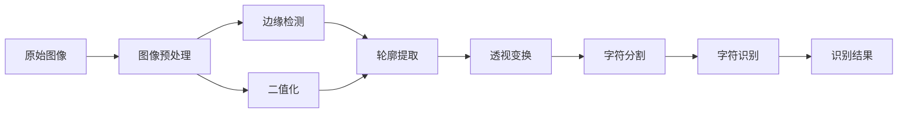

# 基于OpenCV的银行卡号识别系统详细设计与具体代码实现

## 1. 背景介绍

在当今数字化时代,银行卡已成为人们日常生活中不可或缺的支付工具。然而,随着银行卡使用量的增加,银行卡信息的录入和管理也变得越来越繁琐。传统的人工录入方式不仅效率低下,而且容易出错。因此,开发一个自动、高效、准确的银行卡号识别系统具有重要的现实意义。

本文将详细介绍如何利用计算机视觉库OpenCV设计并实现一个银行卡号识别系统。通过对银行卡图像进行预处理、定位、分割和识别等一系列操作,最终实现银行卡号的自动提取。本文不仅会深入探讨系统设计的核心算法原理,还会给出具体的代码实现,以供读者参考和实践。

### 1.1 银行卡号识别的应用场景

银行卡号识别技术可应用于以下场景:

- 银行柜台自助服务
- 移动支付中的银行卡绑定
- 在线支付平台的快捷支付
- 保险、证券等金融行业的客户信息录入
- 酒店、租车等行业的信用卡预授权

### 1.2 OpenCV简介

OpenCV(Open Source Computer Vision Library)是一个开源的计算机视觉库,由Intel公司发起并参与开发,以BSD许可证授权发行,可以在商业和研究领域中免费使用。OpenCV为计算机视觉相关的图像处理和机器学习算法提供了一个通用框架和大量优化的函数实现。

OpenCV的主要模块包括:

- core: 核心功能模块,包含基本数据结构、数学函数等
- imgproc: 图像处理模块,包含图像滤波、形态学、几何变换等
- objdetect: 目标检测模块,包含人脸检测、行人检测等
- ml: 机器学习模块,包含支持向量机、K最近邻、决策树等算法
- highgui: 用户界面模块,用于图像显示、视频捕获等
- video: 视频分析模块,包含运动估计、背景分离等算法

## 2. 核心概念与联系

要实现银行卡号识别,需要涉及计算机视觉、图像处理、模式识别等多个领域的知识。下面我们来了解一下系统设计中的几个核心概念:

### 2.1 图像预处理

图像预处理是指在进行主要的图像分析之前,对原始图像进行一系列处理,以去除噪声、增强对比度、校正畸变等,从而使图像更适合后续的分析和识别。常见的图像预处理操作包括:灰度化、二值化、平滑、锐化、形态学等。

### 2.2 边缘检测

边缘检测是指找出图像中亮度变化明显的区域,这些区域往往对应着物体的边界。常用的边缘检测算法有Canny、Sobel、Laplacian等。通过边缘检测,我们可以获得银行卡的轮廓信息。

### 2.3 轮廓提取

在得到二值化图像和边缘图像后,我们需要从中提取出银行卡的轮廓。轮廓提取一般基于连通域分析或边缘跟踪算法。OpenCV中提供了findContours函数来查找图像中的轮廓。

### 2.4 透视变换

由于拍摄角度和镜头畸变的影响,银行卡在图像中往往呈现一定的透视失真。为了准确定位和识别卡号区域,需要对图像进行透视变换,将卡片恢复为正面平行视角下的样子。透视变换需要根据卡片轮廓的四个顶点坐标,计算出3x3的透视变换矩阵。

### 2.5 字符分割

定位到卡号区域后,需要进一步将其分割成单个字符,为后续的字符识别做准备。常见的字符分割方法有:投影分割、连通域分割、轮廓分割等。

### 2.6 字符识别

字符识别是指将图像中的字符转换为计算机可编码的文本。传统的字符识别方法有模板匹配、特征提取+分类器等。近年来,基于深度学习的端到端字符识别方法也得到广泛应用,如CNN、CRNN等。

### 2.7 概念联系图

下面使用Mermaid流程图来展示银行卡号识别系统中各个核心概念之间的联系:



从上图可以看出,银行卡号识别是一个串行的多步骤过程。各个步骤环环相扣,缺一不可。下面我们将详细讲解每个步骤的算法原理和代码实现。

## 3. 核心算法原理与具体操作步骤

### 3.1 图像预处理

#### 3.1.1 灰度化

彩色图像中每个像素点由RGB三个通道的值组成,而灰度图像只有一个通道,对于许多图像处理算法来说更简单高效。OpenCV中可以用cvtColor函数将彩色图像转换为灰度图像:

```python
gray = cv2.cvtColor(img, cv2.COLOR_BGR2GRAY)
```

#### 3.1.2 高斯平滑

高斯平滑是一种常用的图像降噪方法,它用高斯核函数对图像进行卷积,可以有效去除高频噪声。OpenCV中可以用GaussianBlur函数实现:

```python
blurred = cv2.GaussianBlur(gray, (5, 5), 0)
```

其中,(5,5)表示高斯核的大小,0表示根据核大小自动计算标准差。

#### 3.1.3 自适应二值化

二值化是指将灰度图像转换为只有黑白两种颜色的图像。传统的二值化方法是设置一个全局阈值,大于阈值的像素点为白色,小于阈值的为黑色。而自适应二值化则是根据图像的局部区域动态计算阈值,对光照不均匀的图像更加有效。OpenCV中可以用adaptiveThreshold函数实现:

```python
binary = cv2.adaptiveThreshold(blurred, 255, cv2.ADAPTIVE_THRESH_GAUSSIAN_C, cv2.THRESH_BINARY_INV, 11, 2)
```

其中,255表示二值化后的最大值,ADAPTIVE_THRESH_GAUSSIAN_C表示使用高斯加权平均计算局部阈值,THRESH_BINARY_INV表示反向二值化(大于阈值为黑色),11表示局部邻域块大小,2表示阈值偏移量。

### 3.2 边缘检测与轮廓提取

#### 3.2.1 Canny边缘检测

Canny边缘检测是一种常用的边缘检测算法,它通过计算图像梯度幅值和方向,结合双阈值和边缘连接等步骤,可以获得清晰连续的边缘。OpenCV中可以用Canny函数实现:

```python
edges = cv2.Canny(blurred, 50, 150, apertureSize=3)
```

其中,50和150分别是双阈值的低阈值和高阈值,apertureSize表示Sobel算子的大小。

#### 3.2.2 轮廓提取

在得到二值化图像和边缘图像后,可以用findContours函数提取轮廓:

```python
contours, hierarchy = cv2.findContours(binary, cv2.RETR_EXTERNAL, cv2.CHAIN_APPROX_SIMPLE)
```

其中,RETR_EXTERNAL表示只提取最外层轮廓,CHAIN_APPROX_SIMPLE表示用尽可能少的像素点表示轮廓。

### 3.3 透视变换

#### 3.3.1 轮廓多边形拟合

由于图像噪声和分割误差的影响,提取出的轮廓往往不够规则。为了准确定位卡片的四个角点,需要对轮廓进行多边形拟合。OpenCV中可以用approxPolyDP函数实现:

```python
approx = cv2.approxPolyDP(contour, 0.02*cv2.arcLength(contour,True), True)
```

其中,第二个参数表示拟合精度,即原始轮廓与拟合多边形之间的最大距离,第三个参数表示拟合后的多边形是否闭合。

#### 3.3.2 透视变换矩阵计算

根据拟合后的四边形顶点坐标,可以用getPerspectiveTransform函数计算透视变换矩阵:

```python
pts1 = np.float32([top_left, top_right, bottom_right, bottom_left]) 
pts2 = np.float32([[0,0], [width,0], [width,height], [0,height]])
matrix = cv2.getPerspectiveTransform(pts1, pts2)
```

其中,pts1是卡片在原图中的四个顶点坐标,pts2是变换后的目标坐标,width和height是变换后的卡片宽度和高度。

#### 3.3.3 透视变换

有了变换矩阵后,用warpPerspective函数对图像进行透视变换:

```python
result = cv2.warpPerspective(img, matrix, (width,height))
```

变换后,卡片图像就被校正为正面平行视角下的样子了。

### 3.4 字符分割

#### 3.4.1 卡号区域定位

银行卡号一般印刷在卡片的下半部分,为了减小识别难度,我们可以先对卡号区域进行定位。定位可以根据卡片尺寸的先验知识,直接截取下半部分的一个小区域,也可以用边缘检测或轮廓分析的方法自动定位。

#### 3.4.2 投影分割

投影分割是指将二值图像在水平或垂直方向上像素值累加,根据投影直方图的波峰波谷分割字符。银行卡号的字符排列比较规则,适合用垂直投影分割。

```python
binary = cv2.adaptiveThreshold(number_roi, 255, cv2.ADAPTIVE_THRESH_GAUSSIAN_C, cv2.THRESH_BINARY_INV, 11, 2)
hist = np.sum(binary, axis=0)
peek_ranges = []
start = 0
for i in range(hist.shape[0]):
    if hist[i] > 0 and start == 0:
        start = i
    elif hist[i] == 0 and start > 0:
        end = i
        if end - start > 5:
            peek_ranges.append((start, end))
        start = 0
```

上面的代码先对卡号区域进行二值化,然后计算垂直投影直方图。接着用一个简单的状态机算法检测投影直方图中的波峰范围,并将其作为字符的分割位置。

### 3.5 字符识别

#### 3.5.1 模板匹配

模板匹配是一种简单实用的字符识别方法。其基本思想是:先准备好0~9和常见字符的二值化图像模板,然后用模板在待识别图像上滑动,计算模板与图像块的相似度,相似度最大的模板即为识别结果。

相似度的计算可以用归一化相关系数(NCC)等指标:

$NCC(T,I) = \frac{\sum_{x,y} (T(x,y) \cdot I(x,y))}{\sqrt{\sum_{x,y}T(x,y)^2 \cdot \sum_{x,y}I(x,y)^2}}$

其中,$T$表示模板图像,$I$表示待匹配的图像块。NCC的取值范围为[-1,1],越接近1表示越相似。

OpenCV中可以直接用matchTemplate函数进行模板匹配:

```python
res = cv2.matchTemplate(roi, template, cv2.TM_CCOEFF_NORMED)
min_val, max_val, min_loc, max_loc = cv2.minMaxLoc(res)
```

其中,TM_CCOEFF_NORMED表示用NCC作为相似度指标。max_val就是最大的相似度值,max_loc是相似度最大点的位置。

#### 3.5.2 卷积神经网络

传统的模板匹配方法在数字字符识别上可以取得不错的效果,但对于某些复杂字体和低质量图像,其泛化能力有限。近年来,以卷积神经网络(CNN)为代表的深度学习方法在字符识别领域取得了突破性进展。

CNN通过卷积层和池化层的堆叠,可以自动提取图像中的多层次特征,再经过全连接层映射到字