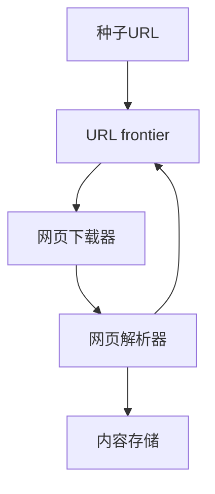

# 基于Python爬虫的电影数据可视化分析

## 1.背景介绍

### 1.1 数据驱动时代的到来

在当今时代,数据被视为新的"燃料",推动着各行各业的创新与发展。无论是科技巨头还是传统企业,都意识到了数据的巨大价值,纷纷投入大量资源进行数据采集、存储、分析和可视化。作为信息时代的重要载体,互联网上蕴含着海量的结构化和非结构化数据,这些数据对于企业决策、市场预测、用户体验优化等方面都具有重要意义。

### 1.2 电影行业的数据需求

电影作为一种重要的大众文化形式,其数据分析备受关注。电影公司需要了解观众的口味偏好,从而制定更有针对性的营销策略;影评人和影迷则希望通过数据分析发现电影作品的独特魅力;而学术界也将电影数据作为研究对象,探索其中蕴含的社会学、心理学等方面的规律。

### 1.3 爬虫技术的重要性

要获取互联网上的电影数据,离不开网络爬虫技术。爬虫是一种自动化程序,能够从网站上抓取所需的结构化数据或文本内容。Python作为一种简洁高效的编程语言,在爬虫开发领域占据重要地位。利用Python编写的爬虫程序,可以高效、规模化地采集所需的电影数据,为后续的数据处理和可视化分析奠定基础。

## 2.核心概念与联系

在基于Python爬虫进行电影数据采集和可视化分析的过程中,涉及了多个核心概念,它们之间存在着紧密的联系。下面将对这些概念进行介绍和解释。

### 2.1 网络爬虫(Web Crawler)

网络爬虫是一种自动化程序,它可以按照预定义的规则,自动地浏览万维网,获取网页数据。爬虫通常由以下几个主要组件构成:

- **种子URL(Seed URLs)**: 爬虫的起始点,是待抓取网页的初始URL集合。
- **URL frontier**: 用于存储待抓取的URL队列,确保爬虫按照一定策略有序地抓取网页。
- **网页下载器(Web Downloader)**: 根据URL从互联网上下载网页内容。
- **网页解析器(Web Parser)**: 从下载的网页中提取所需的数据,如文本、链接等。
- **内容存储(Content Storage)**: 用于存储抓取到的数据,如数据库、文件系统等。

爬虫的工作流程如下所示:



### 2.2 数据可视化

数据可视化是指将抽象的数据转换为图形或图像的过程,使得数据的模式、趋势和规律更加直观和易于理解。常见的数据可视化方式包括折线图、柱状图、饼图、散点图等。在电影数据分析中,可视化技术可以帮助我们更好地发现数据中隐藏的见解,如票房趋势、流行类型变化等。

Python中常用的数据可视化库有Matplotlib、Seaborn和Plotly等。它们提供了丰富的绘图功能,可以生成各种类型的统计图表,并支持高度定制化。

### 2.3 数据处理和特征工程

在进行数据可视化之前,通常需要对原始数据进行预处理和特征工程,以确保数据的质量和适用性。常见的数据处理步骤包括:

- **数据清洗**: 处理缺失值、异常值和重复数据等问题。
- **数据转换**: 对数据进行规范化、编码或者特征缩放等转换。
- **特征提取**: 从原始数据中提取有意义的特征,如电影类型、上映时间等。
- **特征选择**: 根据特征的重要性对特征进行筛选,去除冗余特征。

Python中的数据处理库如Pandas、Numpy等,可以高效地完成上述任务。

### 2.4 网页解析和正则表达式

为了从网页中提取所需的数据,需要对网页进行解析。常见的解析方式包括正则表达式匹配、XPath解析和CSS选择器解析等。

正则表达式是一种用于匹配文本模式的强大工具。在Python中,可以使用内置的re模块来实现正则表达式匹配和替换操作。正则表达式通过特殊的语法规则来描述字符串模式,可以高效地从网页中提取所需的数据。

### 2.5 异步编程和多线程

为了提高爬虫的效率,通常需要采用异步编程或多线程技术。异步编程允许程序在等待I/O操作(如网络请求)时继续执行其他任务,从而提高CPU利用率。而多线程则可以同时执行多个任务,充分利用多核CPU的计算能力。

Python中的异步编程框架如asyncio、aiohttp等,可以简化异步代码的编写。而多线程编程则可以使用threading模块或者更高级的线程池实现。合理地利用异步编程和多线程技术,可以显著提升爬虫的性能。

## 3.核心算法原理具体操作步骤

在本节中,我们将介绍基于Python爬虫进行电影数据采集和可视化分析的核心算法原理和具体操作步骤。

### 3.1 网页抓取算法

网页抓取算法是爬虫的核心部分,它决定了爬虫如何高效地从互联网上获取所需的数据。常见的网页抓取算法包括广度优先搜索(BFS)和深度优先搜索(DFS)等。

以BFS算法为例,其基本思路是:从种子URL开始,先将所有种子URL加入待抓取队列,然后不断从队列中取出URL进行网页下载和解析,并将新发现的URL加入队列尾部,直到队列为空或达到预设条件。BFS算法的优点是能够快速发现新的网页,但也存在内存占用较高的缺点。

```python
from collections import deque

def bfs_crawler(seed_urls, max_pages):
    visited = set()  # 已访问的URL集合
    queue = deque(seed_urls)  # 待抓取的URL队列
    crawled_pages = 0  # 已抓取的网页数量

    while queue and crawled_pages < max_pages:
        url = queue.popleft()  # 取出队首URL
        if url not in visited:
            visited.add(url)
            page = download_page(url)  # 下载网页
            content, links = parse_page(page)  # 解析网页内容和链接
            # 处理网页内容
            process_content(content)
            # 将新发现的链接加入队列
            queue.extend(link for link in links if link not in visited)
            crawled_pages += 1

    return crawled_pages
```

### 3.2 网页解析算法

网页解析算法用于从下载的网页中提取所需的数据,如文本内容、链接等。常见的解析算法包括正则表达式匹配、XPath解析和CSS选择器解析等。

以正则表达式匹配为例,我们可以使用Python的re模块来实现。下面是一个示例代码,用于从HTML页面中提取电影标题和评分:

```python
import re

def parse_movie_info(html):
    # 匹配电影标题
    title_pattern = r'<h1>(.*?)</h1>'
    title_match = re.search(title_pattern, html, re.S)
    if title_match:
        title = title_match.group(1)
    else:
        title = ''

    # 匹配电影评分
    rating_pattern = r'<span class="rating_num" property="v:average">(.*?)</span>'
    rating_match = re.search(rating_pattern, html, re.S)
    if rating_match:
        rating = rating_match.group(1)
    else:
        rating = ''

    return title, rating
```

### 3.3 数据存储算法

在爬虫过程中,需要将抓取到的数据存储起来,以备后续处理和分析。常见的数据存储方式包括文件存储(如CSV、JSON等)和数据库存储(如MongoDB、Redis等)。

以CSV文件存储为例,我们可以使用Python的csv模块来实现:

```python
import csv

def save_to_csv(data, filename):
    with open(filename, 'a', newline='', encoding='utf-8') as csvfile:
        writer = csv.writer(csvfile)
        for row in data:
            writer.writerow(row)
```

### 3.4 数据处理算法

在进行数据可视化之前,通常需要对原始数据进行预处理和特征工程,以确保数据的质量和适用性。常见的数据处理算法包括数据清洗、数据转换、特征提取和特征选择等。

以特征提取为例,我们可以从电影数据中提取上映年份、电影类型等特征:

```python
import pandas as pd

def extract_features(data):
    # 提取上映年份特征
    data['year'] = pd.to_datetime(data['release_date']).dt.year

    # 提取电影类型特征
    data['genres'] = data['genres'].str.split(',')

    return data
```

### 3.5 数据可视化算法

数据可视化算法用于将处理后的数据转换为图形或图像,以便更直观地发现数据中的模式和趋势。常见的数据可视化算法包括折线图、柱状图、饼图、散点图等。

以绘制折线图为例,我们可以使用Matplotlib库来实现:

```python
import matplotlib.pyplot as plt

def plot_trend(data, x, y):
    plt.figure(figsize=(12, 6))
    plt.plot(data[x], data[y])
    plt.xlabel(x)
    plt.ylabel(y)
    plt.title(f'{y} Trend')
    plt.show()
```

## 4.数学模型和公式详细讲解举例说明

在电影数据分析中,我们可能需要使用一些数学模型和公式来量化和描述数据中的模式和规律。下面将介绍一些常见的数学模型和公式,并给出详细的讲解和示例。

### 4.1 线性回归模型

线性回归模型是一种常用的监督学习算法,它可以用于建立自变量和因变量之间的线性关系。在电影数据分析中,我们可以使用线性回归模型来预测电影票房等指标。

线性回归模型的数学表达式如下:

$$y = \beta_0 + \beta_1x_1 + \beta_2x_2 + ... + \beta_nx_n + \epsilon$$

其中:
- $y$是因变量(如电影票房)
- $x_1, x_2, ..., x_n$是自变量(如导演声望、演员阵容、制作成本等)
- $\beta_0, \beta_1, \beta_2, ..., \beta_n$是回归系数,需要通过训练数据进行估计
- $\epsilon$是随机误差项

为了估计回归系数,我们可以使用最小二乘法,即最小化残差平方和:

$$\sum_{i=1}^{m}(y_i - \hat{y}_i)^2$$

其中$m$是训练数据的样本数量,$\hat{y}_i$是对应于$x_i$的预测值。

以Python的scikit-learn库为例,我们可以如下构建和训练线性回归模型:

```python
from sklearn.linear_model import LinearRegression

# 准备训练数据
X = data[['director_score', 'actor_score', 'budget']]
y = data['box_office']

# 创建线性回归模型
model = LinearRegression()

# 训练模型
model.fit(X, y)

# 预测新数据的票房
new_data = [[90, 85, 100_000_000]]
predicted_box_office = model.predict(new_data)
```

### 4.2 协方差和相关系数

在分析电影数据时,我们常常需要研究不同变量之间的关系。协方差和相关系数是衡量两个随机变量线性相关程度的重要指标。

**协方差**用于衡量两个随机变量的总体误差,其数学定义如下:

$$\text{Cov}(X, Y) = \frac{\sum_{i=1}^{n}(x_i - \bar{x})(y_i - \bar{y})}{n}$$

其中$\bar{x}$和$\bar{y}$分别是$X$和$Y$的均值。

协方差的值越大,说明两个变量之间的线性相关性越强。但是,协方差的数值范围没有确定的上下限,难以直观地比较不同变量对之间的相关程度。

**相关系数**则能够很好地解决这个问题。pearson相关系数的定义如下:

$$\rho_{X,