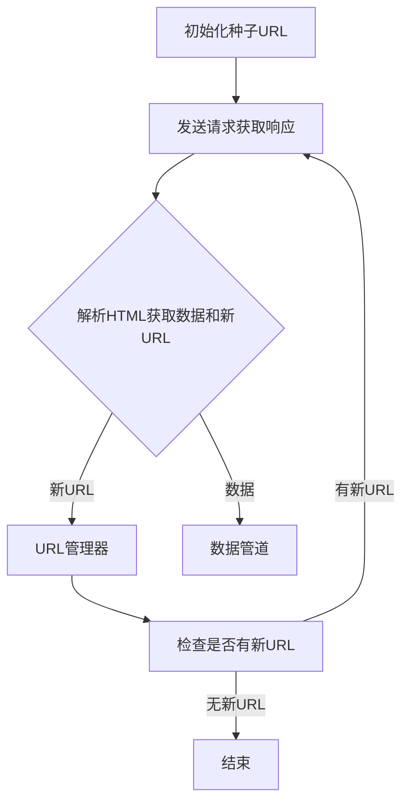

# 基于Python的新浪微博爬虫研究

## 1. 背景介绍

### 1.1 互联网时代的数据挖掘需求

在当今信息时代,互联网无疑成为了人们获取信息和交流沟通的重要渠道。随着社交媒体的兴起,大量用户在网络上分享着自己的生活、想法和观点。这些海量的用户生成内容(UGC)蕴含着巨大的潜在价值,成为了数据挖掘和分析的宝贵资源。

### 1.2 新浪微博的重要性

作为中国最大的微博平台,新浪微博吸引了数亿用户。用户在这里分享生活点滴、发表观点看法,形成了一个庞大的信息库。这些数据对于政府机构、企业以及研究机构来说,都具有重要的研究价值。通过分析新浪微博数据,可以了解公众情绪、热点话题,为决策提供依据;也可以进行舆情监控、营销策略制定等。

### 1.3 网络爬虫的作用

然而,由于新浪微博数据分散且动态更新,单靠人工采集显然效率低下。这时,网络爬虫便扮演了重要角色。爬虫可以自动化地从网站抓取所需数据,大大提高了数据采集效率。因此,开发一个高效、可靠的新浪微博爬虫,对于挖掘这一宝贵数据源至关重要。

## 2. 核心概念与联系

在开发新浪微博爬虫之前,我们需要理解以下几个核心概念:

### 2.1 网络爬虫(Web Crawler)

网络爬虫是一种自动化程序,它可以系统地浏览万维网,按照预先定义的规则抓取网页内容。爬虫通常由以下几个主要部分组成:

- **种子URL(Seed URLs)**: 爬虫启动时需要一个或多个初始URL作为入口点。
- **网页下载器(Page Downloader)**: 从互联网上下载网页内容。
- **网页解析器(Page Parser)**: 解析下载的网页内容,提取出所需的数据。
- **URL管理器(URL Manager)**: 管理待抓取的URL队列和已抓取的URL集合。
- **数据管道(Data Pipeline)**: 对抓取的数据进行存储或进一步处理。

### 2.2 HTML解析

由于网页通常是以HTML格式呈现的,因此我们需要解析HTML文档以提取所需数据。常用的HTML解析库有lxml、BeautifulSoup等。

### 2.3 反爬虫机制

一些网站为了防止被爬虫过度访问而采取了各种反爬虫机制,如用户验证、IP限制等。因此,我们需要针对性地设计策略来应对这些机制。

### 2.4 数据存储

抓取到的数据需要进行持久化存储,以便后续分析和处理。常用的存储方式有文件系统、关系型数据库和NoSQL数据库等。

## 3. 核心算法原理具体操作步骤  

新浪微博爬虫的核心算法可以概括为以下几个步骤:



### 3.1 初始化种子URL

首先,我们需要准备一个或多个初始URL作为爬虫的入口点,这些URL被称为种子URL。对于新浪微博,我们可以选择用户主页或者话题页面作为种子URL。

### 3.2 发送请求获取响应

接下来,爬虫会从URL管理器中取出一个待抓取的URL,并向该URL发送HTTP请求。服务器会响应该请求,返回包含HTML页面内容的响应对象。

### 3.3 解析HTML获取数据和新URL

爬虫会使用HTML解析器解析响应对象中的HTML内容,从中提取出所需的数据(如微博正文、发布时间等)。同时,它也会从HTML中发现新的URL链接,将这些新URL加入到URL管理器中,等待后续抓取。

### 3.4 URL管理器

URL管理器负责管理待抓取的URL队列和已抓取的URL集合。它需要保证:

1. 待抓取队列中不存在重复URL
2. 已抓取集合中不存在重复URL
3. 每个URL只抓取一次

通常,我们可以使用集合(Set)数据结构来存储已抓取的URL,使用队列(Queue)或其他数据结构存储待抓取的URL。

### 3.5 数据管道

提取出的数据会被传输到数据管道进行后续处理,例如存储到文件系统、关系型数据库或NoSQL数据库中。数据管道还可以对数据进行清洗、过滤等操作。

### 3.6 检查是否有新URL

在完成一个URL的抓取后,爬虫会检查URL管理器中是否还有未抓取的URL。如果有,则重复步骤3.2-3.5;如果没有,则结束爬虫程序。

## 4. 数学模型和公式详细讲解举例说明

在网络爬虫领域,有一些常用的数学模型和公式,可以帮助我们更好地理解和优化爬虫算法。

### 4.1 网页排名算法

网页排名算法是用于评估网页重要性的算法,其中最著名的是Google的PageRank算法。PageRank算法基于网页之间的链接结构,通过迭代计算得到每个网页的重要性分数。

PageRank算法的核心公式为:

$$PR(p) = \frac{1-d}{N} + d \sum_{q \in M(p)} \frac{PR(q)}{L(q)}$$

其中:

- $PR(p)$表示网页$p$的PageRank值
- $N$是网络中网页的总数
- $M(p)$是链接到网页$p$的所有网页集合
- $L(q)$是网页$q$的出链接数
- $d$是一个阻尼系数,通常取值0.85

虽然PageRank算法主要用于网页排名,但它也可以应用于网络爬虫,帮助确定抓取URL的优先级。

### 4.2 URL规范化

在实际爬虫过程中,我们经常会遇到相同网页的不同URL表示,例如:

```
https://www.example.com
https://www.example.com/
https://www.example.com/index.html
```

为了避免重复抓取,我们需要对URL进行规范化处理。常用的规范化方法包括:

1. 移除URL中的锚点(#后面的部分)
2. 移除URL中的查询参数
3. 将URL转换为小写
4. 规范化URL路径(如将`/path/./`转换为`/path/`)

经过规范化处理后,上面三个URL都会被转换为`https://www.example.com`。

### 4.3 URL指纹

为了快速判断一个URL是否已被抓取过,我们可以为每个URL计算一个固定长度的数字指纹(fingerprint)。常用的指纹算法有哈希函数(如MD5、SHA-1等)和其他简单的数字编码方式。

指纹算法需要满足以下两个条件:

1. 高效计算
2. 冲突概率低(不同的URL得到相同的指纹)

通过使用指纹,我们可以用一个定长的数字代替URL字符串,从而提高检查重复URL的效率。

### 4.4 URL规范化和指纹示例

假设我们有以下几个URL:

```python
urls = [
    "https://www.example.com/path/page.html?id=123#fragment",
    "https://www.example.com/path/page.html",
    "https://www.EXAMPLE.com/path/./page.html",
    "https://www.example.com/path/page.html?id=456",
]
```

我们可以使用Python的`urllib.parse`模块对URL进行规范化:

```python
from urllib.parse import urlparse, urlunparse

def normalize_url(url):
    parsed = urlparse(url)
    scheme = parsed.scheme
    netloc = parsed.netloc.lower()
    path = "/".join([p for p in parsed.path.split("/") if p != ""])
    query = ""
    fragment = ""
    return urlunparse((scheme, netloc, path, query, fragment))
```

对于指纹计算,我们可以使用Python的`hashlib`模块计算MD5哈希值:

```python
import hashlib

def fingerprint(url):
    return hashlib.md5(url.encode()).hexdigest()
```

应用这两个函数后,我们得到:

```python
>>> for url in urls:
...     normalized = normalize_url(url)
...     print(f"Original URL: {url}")
...     print(f"Normalized URL: {normalized}")
...     print(f"Fingerprint: {fingerprint(normalized)}")
...     print()
Original URL: https://www.example.com/path/page.html?id=123#fragment
Normalized URL: https://www.example.com/path/page.html
Fingerprint: 5d6e8e9d8c6b0e8c5f8ebbc930f66a1b

Original URL: https://www.example.com/path/page.html
Normalized URL: https://www.example.com/path/page.html
Fingerprint: 5d6e8e9d8c6b0e8c5f8ebbc930f66a1b

Original URL: https://www.EXAMPLE.com/path/./page.html
Normalized URL: https://www.example.com/path/page.html
Fingerprint: 5d6e8e9d8c6b0e8c5f8ebbc930f66a1b

Original URL: https://www.example.com/path/page.html?id=456
Normalized URL: https://www.example.com/path/page.html
Fingerprint: 5d6e8e9d8c6b0e8c5f8ebbc930f66a1b
```

可以看到,经过规范化处理后,这四个URL都得到了相同的规范化URL和指纹。这样,我们就可以有效地避免重复抓取同一网页。

## 5. 项目实践: 代码实例和详细解释说明

在了解了新浪微博爬虫的核心算法原理后,我们来看一个实际的Python代码实例。这个示例爬虫的目标是抓取指定用户的全部微博数据。

### 5.1 项目结构

```
sina-weibo-crawler/
├── crawler.py      # 爬虫主程序
├── config.py       # 配置文件
├── db.py           # 数据库操作模块
├── parser.py       # HTML解析模块
├── utils.py        # 工具函数模块
└── requirements.txt # 依赖包列表
```

### 5.2 配置文件 (config.py)

```python
# 新浪微博移动版网站URL
WEIBO_MOBILE_URL = "https://m.weibo.cn"

# 用户ID
USER_ID = "1756829927"  # 可修改为其他用户ID

# MySQL数据库配置
MYSQL_HOST = "localhost"
MYSQL_PORT = 3306
MYSQL_USER = "root"
MYSQL_PASSWORD = "your_password"
MYSQL_DB = "weibo_crawler"

# 请求头
HEADERS = {
    "User-Agent": "Mozilla/5.0 (Windows NT 10.0; Win64; x64) AppleWebKit/537.36 (KHTML, like Gecko) Chrome/58.0.3029.110 Safari/537.3",
    "Referer": f"{WEIBO_MOBILE_URL}/u/{USER_ID}",
}

# 每次请求后的随机睡眠时间范围(秒)
SLEEP_TIME_RANGE = (1, 5)
```

这个配置文件包含了爬虫所需的各种参数,如新浪微博移动版网站URL、目标用户ID、数据库配置等。你可以根据实际需求修改这些参数。

### 5.3 数据库操作模块 (db.py)

```python
import pymysql

from config import MYSQL_HOST, MYSQL_PORT, MYSQL_USER, MYSQL_PASSWORD, MYSQL_DB

# 创建数据库连接
conn = pymysql.connect(
    host=MYSQL_HOST,
    port=MYSQL_PORT,
    user=MYSQL_USER,
    password=MYSQL_PASSWORD,
    db=MYSQL_DB,
    charset="utf8mb4",
)

# 创建游标对象
cursor = conn.cursor()

# 创建微博表
create_table_sql = """
CREATE TABLE IF NOT EXISTS weibo (
    id BIGINT PRIMARY KEY AUTO_INCREMENT,
    weibo_id BIGINT UNIQUE,
    user_id BIGINT,
    content TEXT,
    created_at DATETIME,
    source TEXT,
    attitudes_count INT,
    comments_count INT,
    reposts_count INT
)
"""
cursor.execute(create_table_sql)

# 插入微博数据
def insert_weibo(weibo):
    sql = """
    INSERT INTO weibo (
        weibo_id, user_id, content, created_at, source,
        attitudes_count, comments_count, reposts_count
    ) VALUES (
        %