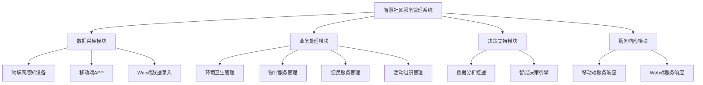
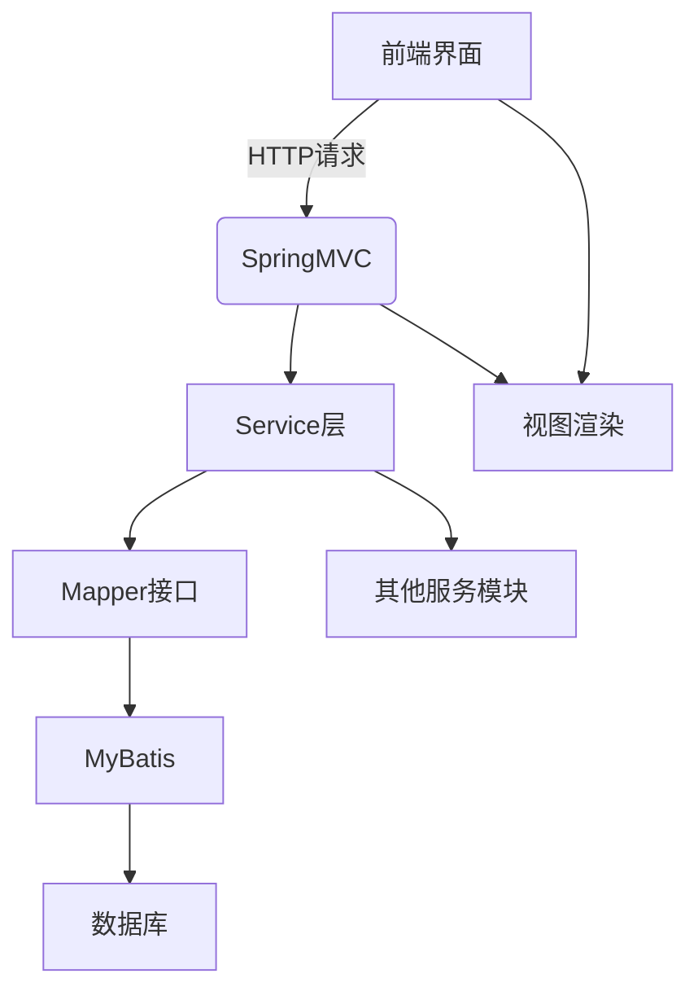

# 基于SSM的智慧社区服务管理系统的设计与实现

## 1. 背景介绍

随着城市化进程的不断加快,社区服务管理工作日益受到重视。传统的社区服务管理模式已经无法满足居民日益增长的需求,亟需引入智能化、信息化的管理手段,以提高社区服务的质量和效率。基于这一背景,本文设计并实现了一套基于SSM(Spring、SpringMVC、MyBatis)框架的智慧社区服务管理系统。

### 1.1 社区服务管理的重要性

社区是城市的基本单元,居民生活、工作、学习等活动主要集中在社区。高质量的社区服务管理对于维护社会和谐、提高居民生活质量至关重要。社区服务涵盖了环境卫生、物业管理、便民服务、文体活动等多个方面,需要对社区资源进行科学、高效的调配和管理。

### 1.2 传统管理模式的不足

传统的社区服务管理主要依赖人工操作,存在以下问题:

1. 信息采集和处理效率低下
2. 信息共享和协同困难
3. 缺乏智能化决策支持
4. 服务响应时间长,居民体验差

### 1.3 智慧社区的概念

智慧社区是指在社区管理中全面应用现代信息技术,实现社区资源的优化配置、社区服务的精细化管理和社区生活的智能化,从而提高社区管理的科学化、精细化和智能化水平。智慧社区的核心是建立一套集成化的信息管理平台,实现社区数据的互联互通和资源的高效共享。

## 2. 核心概念与联系

本系统涉及以下几个核心概念:



### 2.1 数据采集模块

数据采集是系统的基础,负责从各种渠道收集社区数据,包括:

1. **物联网感知设备**: 如环境监测传感器、视频监控等,用于采集环境数据。
2. **移动端APP**: 居民可通过APP上报社区事件、提出服务需求等。
3. **Web端数据录入**: 社区工作人员可通过Web端录入相关数据。

### 2.2 业务处理模块

根据采集的数据,对社区的不同服务进行流程化管理,包括:

1. **环境卫生管理**: 对垃圾分类、绿化养护、卫生清洁等环境相关事项的管理。
2. **物业服务管理**: 包括公共设施维修、车位管理、物业费缴纳等。
3. **便民服务管理**: 如快递代收、家政服务、旅游购票等便民服务的受理和派单。
4. **活动组织管理**: 文体活动、社区讲座等活动的策划和组织。

### 2.3 决策支持模块

通过数据分析和智能决策算法,为社区管理提供决策支持,包括:

1. **数据分析挖掘**: 对历史数据进行统计分析,发现潜在规律,支持决策。
2. **智能决策引擎**: 基于规则引擎、优化算法等技术,对复杂场景进行智能化决策。

### 2.4 服务响应模块

向居民提供高效便捷的服务响应,包括:

1. **移动端服务响应**: 通过APP向居民推送个性化服务信息。
2. **Web端服务响应**: 居民可通过Web端查询服务进度、反馈评价等。

## 3. 核心算法原理具体操作步骤

本系统的核心算法主要包括两个方面:数据分析算法和智能决策算法。

### 3.1 数据分析算法

数据分析算法旨在从海量社区数据中发现有价值的模式和规律,为决策提供支持。常用的数据分析算法包括:

1. **关联规则挖掘算法**

关联规则挖掘算法用于发现数据项之间的关联关系,可应用于发现居民需求之间的关联,从而进行精准推荐。算法的具体步骤如下:

```
输入: 交易数据集D
输出: 强关联规则的集合

1) 扫描交易数据集D,统计每个数据项的支持度
2) 根据最小支持度阈值,找出所有频繁项集
3) 对频繁项集进行组合,生成候选规则
4) 计算每条候选规则的可信度
5) 根据最小可信度阈值,输出强关联规则
```

其中,支持度和可信度的计算公式如下:

$$
支持度(X\rightarrow Y) = \frac{同时包含X和Y的交易数}{总交易数}
$$

$$
可信度(X\rightarrow Y) = \frac{支持度(X\cup Y)}{支持度(X)}
$$

2. **时序模式挖掘算法**

时序模式挖掘算法用于发现数据序列中的周期性规律,可应用于发现社区事件的时序规律。常用的算法有AprioriAll、AprioriSome等,具体步骤类似于关联规则挖掘。

3. **聚类分析算法**

聚类分析算法将相似的数据对象分为同一个簇,可用于对居民、社区事件等进行分类。常用的算法有K-Means、DBSCAN等,算法思路如下:

```
1) 初始化聚类中心
2) 计算每个数据对象到各个聚类中心的距离
3) 将数据对象分配到最近的聚类中心所对应的簇
4) 重新计算每个簇的聚类中心
5) 重复步骤2-4,直至聚类中心不再发生变化
```

### 3.2 智能决策算法

智能决策算法根据分析结果和决策规则,对复杂场景进行智能化决策。常用的算法包括:

1. **规则引擎算法**

规则引擎算法根据预定义的规则对输入数据进行推理,得到决策结果。规则的格式通常为"IF...THEN..."。算法步骤如下:

```
输入: 事实数据集F,规则集R
输出: 决策结果D

1) 将F加载到工作内存
2) 对每条规则r in R:
    a. 计算r的前提部分(IF...)是否为真
    b. 若为真,则将r的结论部分(THEN...)添加到工作内存
3) 对工作内存中的数据进行冲突解决,得到决策结果D
```

2. **优化算法**

优化算法用于在满足约束条件的前提下,寻找最优解。在社区管理中,可用于资源调配、路径规划等场景。常用的算法有:

- **整数规划**: 用于求解线性约束条件下的整数解,如车位分配问题。
- **启发式算法**: 如遗传算法、蚁群算法等,用于求解复杂的组合优化问题,如垃圾车路径规划问题。

## 4. 数学模型和公式详细讲解举例说明

### 4.1 关联规则挖掘算法数学模型

设 $I=\{i_1,i_2,...,i_m\}$ 为所有可能出现在交易中的数据项的集合, $D=\{t_1,t_2,...,t_n\}$ 为所有交易记录的集合,其中每个交易记录 $t_i$ 都是 $I$ 的一个子集。

定义 $X\subseteq I$ 为数据项集,交易记录 $t$ 包含 $X$ 记作 $X\subseteq t$。$X$ 在数据集 $D$ 中的支持度计算公式为:

$$
支持度(X) = \frac{|\{t\in D|X\subseteq t\}|}{|D|}
$$

其中,分子表示包含数据项集 $X$ 的交易记录数,分母表示总交易记录数。

对于关联规则 $X\rightarrow Y$,其支持度定义为:

$$
支持度(X\rightarrow Y) = 支持度(X\cup Y)
$$

可信度定义为:

$$
可信度(X\rightarrow Y) = \frac{支持度(X\cup Y)}{支持度(X)}
$$

给定最小支持度阈值 $min\_sup$ 和最小可信度阈值 $min\_conf$,关联规则挖掘算法的目标是找出所有支持度不小于 $min\_sup$ 且可信度不小于 $min\_conf$ 的规则。

### 4.2 时序模式挖掘算法数学模型

设 $E=\{e_1,e_2,...,e_m\}$ 为所有可能出现的事件类型的集合, $S=\langle s_1,s_2,...,s_n\rangle$ 为一个事件序列,其中每个事件 $s_i\in E$。

定义 $\alpha=\langle a_1,a_2,...,a_l\rangle$ 为一个长度为 $l$ 的事件子序列,如果存在 $1\leq i_1<i_2<...<i_l\leq n$ 使得 $a_j=s_{i_j}(1\leq j\leq l)$,则称 $\alpha$ 是 $S$ 的一个子序列,记作 $\alpha\sqsubseteq S$。

$\alpha$ 在序列数据集 $D$ 中的支持度计算公式为:

$$
支持度(\alpha) = \frac{|\{S\in D|\alpha\sqsubseteq S\}|}{|D|}
$$

给定最小支持度阈值 $min\_sup$,时序模式挖掘算法的目标是找出所有支持度不小于 $min\_sup$ 的频繁序列模式。

### 4.3 K-Means聚类算法数学模型

设有 $n$ 个数据对象 $\{x_1,x_2,...,x_n\}$,需要将它们划分为 $k$ 个簇 $\{C_1,C_2,...,C_k\}$。定义簇内平方和为:

$$
E = \sum_{i=1}^k\sum_{x\in C_i}||x-\mu_i||^2
$$

其中, $\mu_i$ 为簇 $C_i$ 的质心,即:

$$
\mu_i = \frac{1}{|C_i|}\sum_{x\in C_i}x
$$

K-Means算法的目标是最小化簇内平方和 $E$,算法步骤如下:

```
1) 随机选取k个初始质心 $\{\mu_1,\mu_2,...,\mu_k\}$
2) 对每个数据对象x:
    a. 计算x到每个质心的距离: $d(x,\mu_i)=||x-\mu_i||$
    b. 将x划分到最近的簇: $C_i^{(t)}=\{x|d(x,\mu_i)\leq d(x,\mu_j),\forall j\neq i\}$
3) 对每个簇$C_i^{(t)}$,重新计算质心:
    $\mu_i^{(t+1)}=\frac{1}{|C_i^{(t)}|}\sum_{x\in C_i^{(t)}}x$
4) 重复步骤2-3,直至质心不再发生变化
```

## 5. 项目实践:代码实例和详细解释说明

本系统采用Java语言,基于SSM(Spring+SpringMVC+MyBatis)框架进行开发。

### 5.1 系统架构



1. **前端界面**: 包括管理员Web端和居民移动端App,通过HTTP请求与后端服务器交互。
2. **SpringMVC**: 作为系统的控制器,接收请求,调用Service层处理业务逻辑,渲染视图返回结果。
3. **Service层**: 系统的业务逻辑实现,包括数据分析、决策引擎等模块。
4. **Mapper接口**: MyBatis的持久层接口,定义对数据库的操作方法。