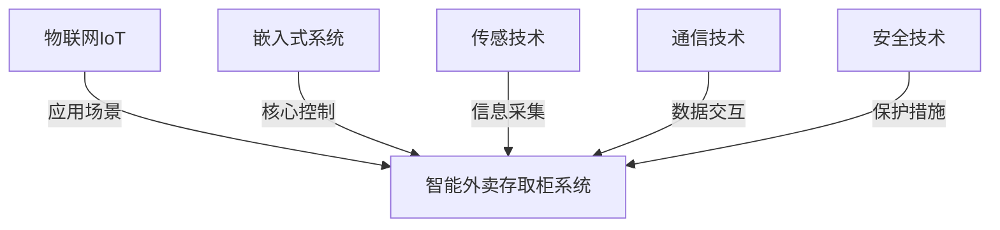

# 基于STM32的智能外卖存取柜

## 1.背景介绍

随着外卖行业的蓬勃发展和消费者对便利性的追求,智能外卖存取柜应运而生。传统的外卖配送模式存在着诸多不便,例如送货时间不确定、食物可能遭到污染和损坏等问题。智能外卖存取柜提供了一种全新的解决方案,可以有效解决这些问题,为用户带来更加便捷、安全和高效的体验。

智能外卖存取柜是一种基于物联网技术的自动化存储设备,通常安装在小区、写字楼等人口密集区域。它由多个独立的存储柜格组成,每个柜格都有独立的锁控系统。外卖员只需将外卖放入指定的空柜格,系统会自动分配柜格号并将信息发送给用户。用户凭借手机APP或密码即可在柜格上取走外卖,整个过程无需人工干预,实现了真正的无接触配送。

基于STM32的智能外卖存取柜系统是该概念的具体实现,它采用了ARM Cortex-M系列的STM32微控制器作为核心控制单元,并集成了多种传感器和通信模块,可实现柜格状态监测、身份识别、远程控制等功能。该系统具有低功耗、高可靠性和良好的可扩展性,是智能外卖存取柜的理想选择。

## 2.核心概念与联系

智能外卖存取柜系统涉及多个核心概念,包括:

1. **物联网(IoT)**:物联网是指通过各种信息传感设备,实现对物品的识别、定位、跟踪和监控,并通过网络将获取的信息传递给相关系统进行处理的一种技术。智能外卖存取柜系统正是物联网技术在外卖配送领域的应用。

2. **嵌入式系统**:嵌入式系统是指将计算机系统嵌入到某个专用的应用中,用于控制和监视特定的功能或操作。STM32微控制器作为嵌入式系统的核心,负责智能外卖存取柜系统的各项功能控制。

3. **传感技术**:传感技术是指通过各种传感器来采集被测对象的信息,并将这些信息转换为电信号或其他所需形式的输出信号。智能外卖存取柜系统中的各种传感器用于监测柜格状态、环境条件等信息。

4. **通信技术**:通信技术是指实现信息传输和交换的技术手段,包括有线和无线通信。智能外卖存取柜系统需要通过通信模块与服务器、用户APP等进行数据交互。

5. **安全技术**:安全技术是指保护系统免受未经授权的访问、使用、泄露或破坏的技术手段。智能外卖存取柜系统需要采取身份识别、加密等安全措施,以保护用户隐私和食品安全。

这些核心概念相互关联、相互支撑,共同构建了智能外卖存取柜系统的整体解决方案。



## 3.核心算法原理具体操作步骤

智能外卖存取柜系统的核心算法包括柜格分配算法、身份识别算法和通信协议算法等。

### 3.1 柜格分配算法

柜格分配算法负责合理分配空闲柜格,以存放新到达的外卖订单。该算法的具体操作步骤如下:

1. 获取所有柜格的当前状态(空闲或占用)
2. 从空闲柜格列表中选择一个合适的柜格
3. 将选中的柜格标记为"占用"状态
4. 记录该柜格号与对应的订单信息
5. 将柜格号发送给外卖员和用户

在选择合适柜格时,算法可以考虑多种因素,如柜格位置、保温条件等,以优化用户的取件体验。

### 3.2 身份识别算法

身份识别算法用于验证用户的身份,确保只有合法用户才能取走相应的外卖订单。常见的身份识别方式包括密码验证、指纹识别、人脸识别等。算法的具体操作步骤如下:

1. 获取用户输入的身份识别信息(如密码、指纹或人脸数据)
2. 与系统中预存的合法用户信息进行比对
3. 如果匹配成功,则向用户发送开锁指令,允许取件
4. 如果匹配失败,则拒绝访问并记录相关日志

该算法需要权衡安全性和便利性,以实现合理的用户身份验证。

### 3.3 通信协议算法

通信协议算法负责智能外卖存取柜系统与外部设备(如服务器、用户APP等)之间的数据交互。常见的通信协议包括TCP/IP、HTTP、MQTT等。算法的具体操作步骤如下:

1. 建立与外部设备的通信连接
2. 按照约定的数据格式和协议,发送或接收相关数据
3. 对接收到的数据进行解析和处理
4. 根据需要,向外部设备发送响应数据
5. 关闭通信连接

该算法需要确保数据传输的可靠性、高效性和安全性,同时兼顾系统的低功耗和实时性要求。

## 4.数学模型和公式详细讲解举例说明

在智能外卖存取柜系统中,数学模型和公式主要应用于以下几个方面:

### 4.1 柜格分配优化

柜格分配算法需要考虑多种因素,以优化用户的取件体验。我们可以将这个问题建模为一个约束优化问题,目标函数为最小化用户的平均取件距离或时间。

设有n个柜格,m个订单,柜格i的位置坐标为$(x_i, y_i)$,订单j的目的地坐标为$(x_j, y_j)$,决策变量$z_{ij}$表示订单j是否分配给柜格i(1表示分配,0表示不分配)。则目标函数可以表示为:

$$\min \sum_{i=1}^n\sum_{j=1}^m z_{ij}\sqrt{(x_i-x_j)^2+(y_i-y_j)^2}$$

约束条件包括:每个订单只能分配给一个柜格,每个柜格最多只能存放一个订单等。通过求解这个优化问题,我们可以得到最优的柜格分配方案。

### 4.2 身份识别精度评估

对于基于机器学习的身份识别算法(如人脸识别),我们需要评估其精度。常用的评估指标包括精确率(Precision)、召回率(Recall)和F1分数等。

设真实情况为正例的样本数量为$TP$(True Positive),被错误地判定为正例的样本数量为$FP$(False Positive),被错误地判定为负例的样本数量为$FN$(False Negative),则精确率和召回率的计算公式为:

$$Precision = \frac{TP}{TP+FP}$$
$$Recall = \frac{TP}{TP+FN}$$

$F1$分数是精确率和召回率的调和平均数,公式为:

$$F1 = 2 \times \frac{Precision \times Recall}{Precision + Recall}$$

通过计算这些指标,我们可以评估身份识别算法的性能,并进行相应的优化和改进。

### 4.3 数据传输可靠性分析

对于智能外卖存取柜系统与服务器之间的数据传输,我们需要保证其可靠性。可以使用信道编码技术,在有噪声的信道上进行数据传输。

设信源发送比特序列$\mathbf{u} = (u_1, u_2, \ldots, u_k)$,经过编码器编码后得到码字$\mathbf{c} = (c_1, c_2, \ldots, c_n)$,码率为$R = k/n$。在加性白噪声高斯信道(AWGN)上传输后,接收端接收到$\mathbf{y} = \mathbf{c} + \mathbf{w}$,其中$\mathbf{w}$为噪声序列。

我们可以计算每一个可能的码字$\mathbf{c}_i$与接收序列$\mathbf{y}$之间的欧几里得距离:

$$d_i = \sqrt{\sum_{j=1}^n (y_j - c_{ij})^2}$$

接收端选择与$\mathbf{y}$距离最近的码字$\mathbf{c}_i$作为解码结果,从而最大程度地降低了误码率,提高了数据传输的可靠性。

通过合理选择编码方式和码率,我们可以在一定程度上trade-off数据传输的可靠性和带宽效率。

以上是智能外卖存取柜系统中数学模型和公式的几个应用实例,展示了数学在优化算法、性能评估和可靠性分析等方面的重要作用。

## 5.项目实践:代码实例和详细解释说明

为了更好地理解智能外卖存取柜系统的实现,我们提供了一些核心模块的代码实例,并对其进行详细解释说明。

### 5.1 柜格状态监测模块

柜格状态监测模块负责检测每个柜格的占用情况,以便系统可以合理分配空闲柜格。该模块通常包括红外线传感器、磁簧开关等硬件,以及相应的驱动程序和中断服务程序。

```c
// 定义柜格状态枚举
typedef enum {
    CABINET_EMPTY,
    CABINET_OCCUPIED
} CabinetStatus_t;

// 全局变量,存储所有柜格的状态
CabinetStatus_t cabinetStatus[NUM_CABINETS];

// 中断服务程序,检测柜格状态变化
void EXTI0_IRQHandler(void) {
    uint8_t cabinetIndex = 0; // 柜格索引
    
    // 读取传感器状态,更新对应柜格的状态
    if (readSensorStatus(cabinetIndex)) {
        cabinetStatus[cabinetIndex] = CABINET_OCCUPIED;
    } else {
        cabinetStatus[cabinetIndex] = CABINET_EMPTY;
    }
    
    // 清除中断标志位
    EXTI->PR = 0x00000001;
}
```

在上述代码中,我们定义了一个枚举类型`CabinetStatus_t`来表示柜格的状态(空闲或占用)。`cabinetStatus`数组存储了所有柜格的当前状态。

当柜格状态发生变化时,对应的传感器会触发外部中断。中断服务程序`EXTI0_IRQHandler`会被调用,读取传感器状态并更新`cabinetStatus`数组中对应柜格的状态。最后,需要清除中断标志位,以便响应下一次中断。

### 5.2 用户身份识别模块

用户身份识别模块负责验证用户的身份,确保只有合法用户才能取走相应的外卖订单。以下是一个基于密码验证的简单实现:

```c
#include <string.h>

// 用户密码数据库
const char *userPasswords[] = {
    "password1",
    "password2",
    "password3",
    // ...
};

// 验证用户密码
bool authenticateUser(const char *inputPassword) {
    for (int i = 0; i < NUM_USERS; i++) {
        if (strcmp(inputPassword, userPasswords[i]) == 0) {
            return true; // 密码匹配
        }
    }
    return false; // 密码不匹配
}

// 主程序中调用身份验证函数
char inputPassword[MAX_PASSWORD_LEN];
// ... 获取用户输入的密码
if (authenticateUser(inputPassword)) {
    // 身份验证成功,执行开锁操作
    unlockCabinet();
} else {
    // 身份验证失败,拒绝访问
    displayErrorMessage();
}
```

在上述代码中,我们使用一个字符串数组`userPasswords`来存储所有合法用户的密码。`authenticateUser`函数接受用户输入的密码,并与数据库中的密码进行比对。如果找到匹配的密码,则返回`true`表示身份验证成功;否则返回`false`表示身份验证失败。

在主程序中,我们获取用户输入的密码,调用`authenticateUser`函数进行身份验证。如果