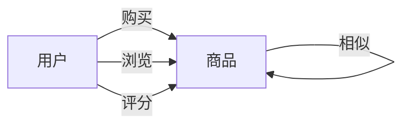
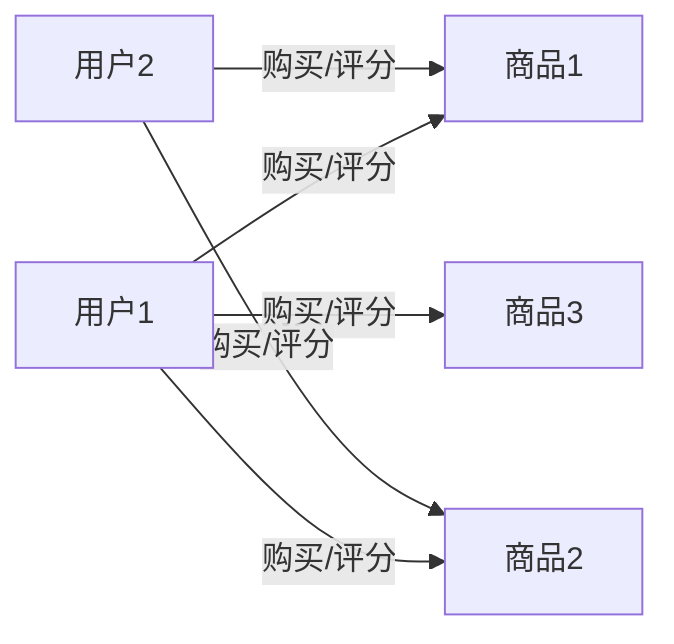
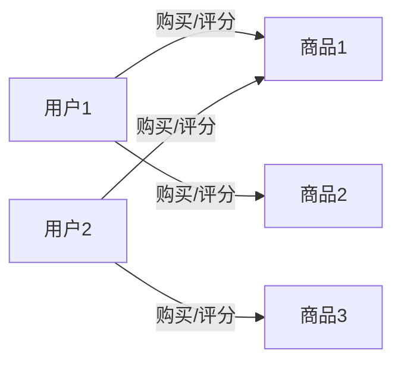

# 基于TinkerPop的推荐系统性能优化实践

## 1. 背景介绍

### 1.1 推荐系统的重要性

在当今信息过载的时代,推荐系统已经成为各大互联网公司提供个性化服务的关键技术。无论是电商平台、视频网站、新闻资讯应用还是社交媒体,都广泛采用推荐系统来为用户提供个性化的内容推荐,提升用户体验和粘性。推荐系统的准确性和效率直接影响着用户对产品的感知和使用体验,因此优化推荐系统的性能成为了一个重要的课题。

### 1.2 图数据库在推荐系统中的应用

传统的关系型数据库在处理复杂关系数据时存在性能瓶颈,而图数据库凭借其天然的优势在处理高度连接的数据方面表现出色。推荐系统中的数据通常具有复杂的关联关系,例如用户-商品、商品-商品、用户-用户等,使用图数据库来存储和查询这些数据可以大幅提高性能。

TinkerPop是一个广为人知的开源图计算框架,提供了标准的图数据结构和图查询语言Gremlin,支持多种图数据库后端。本文将重点介绍如何基于TinkerPop优化推荐系统的性能,涵盖数据建模、查询优化、缓存策略等多个方面。

## 2. 核心概念与联系

### 2.1 图数据库核心概念

在介绍基于TinkerPop的推荐系统优化之前,我们先来了解一下图数据库的核心概念:

- 顶点(Vertex):表示实体,如用户、商品等
- 边(Edge):表示实体之间的关系,如购买、浏览等
- 属性(Property):顶点和边上的键值对,用于存储元数据

这些概念构成了图数据库的数据模型,能够自然地表达复杂的关系数据。

### 2.2 TinkerPop和Gremlin

TinkerPop是一个开源的图计算框架,提供了标准的图数据结构和图查询语言Gremlin。Gremlin是一种功能丰富的图遍历语言,支持通过链式调用来构建复杂的图查询。TinkerPop支持多种图数据库后端,如Neo4j、JanusGraph等,使得基于Gremlin编写的应用可以轻松地在不同图数据库之间迁移。

### 2.3 推荐系统中的图数据模型

在推荐系统中,我们通常需要处理用户、商品以及它们之间的各种关系数据,如购买记录、浏览记录、评分数据等。使用图数据库可以自然地表达这些复杂关系,例如:



通过将数据建模为图结构,我们可以高效地执行各种推荐算法,如协同过滤、基于图的相似度计算等。

## 3. 核心算法原理具体操作步骤

### 3.1 用户相似度计算

用户相似度是协同过滤推荐算法的基础,通常采用基于物品的方法计算。具体步骤如下:

1. 构建用户-商品双向边
2. 对每对用户,计算它们购买/评分过的共同商品集
3. 基于共同商品集,计算用户间的相似度得分(如余弦相似度)



对于用户1和用户2,它们的共同商品集为{商品1,商品2},可以基于这个集合计算两者的相似度得分。

### 3.2 商品相似度计算

商品相似度是基于内容的推荐算法的基础,通常采用基于图的方法计算。具体步骤如下:

1. 构建商品-商品相似边
2. 对每对商品,计算它们被相同用户购买/评分的次数
3. 基于共同用户数,计算商品间的相似度得分(如Jaccard相似系数)



对于商品1和商品2,它们被用户1购买/评分过,因此可以计算它们之间的相似度得分。

### 3.3 基于图的推荐算法

有了用户相似度和商品相似度,我们就可以实现基于图的推荐算法,如:

- 基于用户的协同过滤:给定目标用户,找到与其最相似的用户集,推荐这些相似用户喜欢的商品
- 基于商品的协同过滤:给定目标商品,找到与其最相似的商品集,推荐这些相似商品
- 混合推荐:结合基于用户和基于商品的推荐结果

这些算法都可以通过高效的图遍历来实现,避免了传统方法中的大量连接操作。

## 4. 数学模型和公式详细讲解举例说明 

### 4.1 余弦相似度

余弦相似度是计算两个向量相似性的常用方法,在用户相似度计算中有广泛应用。假设用户A的商品评分向量为$\vec{a}$,用户B的商品评分向量为$\vec{b}$,则它们的余弦相似度定义为:

$$sim(a,b) = \frac{\vec{a} \cdot \vec{b}}{||\vec{a}|| \times ||\vec{b}||}$$

其中$\vec{a} \cdot \vec{b}$为两个向量的点积,$ ||\vec{a}||$和$||\vec{b}||$分别为向量$\vec{a}$和$\vec{b}$的二范数。

余弦相似度的取值范围为$[0,1]$,值越大表示两个向量越相似。当两个向量完全相同时,余弦相似度为1;当两个向量夹角为90度时,余弦相似度为0。

例如,假设用户A对商品1、2、3的评分为(5,3,0),用户B对商品1、2、3的评分为(4,4,0),则它们的余弦相似度为:

$$\vec{a} = (5,3,0), \vec{b} = (4,4,0)$$
$$\vec{a} \cdot \vec{b} = 5 \times 4 + 3 \times 4 + 0 \times 0 = 32$$
$$||\vec{a}|| = \sqrt{5^2 + 3^2 + 0^2} = \sqrt{34}, ||\vec{b}|| = \sqrt{4^2 + 4^2 + 0^2} = \sqrt{32}$$
$$sim(a,b) = \frac{32}{\sqrt{34} \times \sqrt{32}} \approx 0.94$$

可见,用户A和用户B的评分向量非常相似,余弦相似度接近1。

### 4.2 Jaccard相似系数

Jaccard相似系数常用于计算两个集合的相似度,在商品相似度计算中有广泛应用。假设集合A和B分别表示购买/评分过某商品的用户集,则它们的Jaccard相似系数定义为:

$$sim(A,B) = \frac{|A \cap B|}{|A \cup B|}$$

其中$|A \cap B|$表示集合A和B的交集元素个数,$|A \cup B|$表示集合A和B的并集元素个数。

Jaccard相似系数的取值范围为$[0,1]$,值越大表示两个集合越相似。当两个集合相同时,Jaccard相似系数为1;当两个集合没有交集时,Jaccard相似系数为0。

例如,假设商品A被用户集{1,2,3,4}购买/评分过,商品B被用户集{2,3,5,6}购买/评分过,则它们的Jaccard相似系数为:

$$A = \{1,2,3,4\}, B = \{2,3,5,6\}$$
$$|A \cap B| = |\{2,3\}| = 2, |A \cup B| = |\{1,2,3,4,5,6\}| = 6$$
$$sim(A,B) = \frac{2}{6} = \frac{1}{3}$$

可见,商品A和商品B的购买/评分用户集有一定重合,Jaccard相似系数为1/3。

通过上述公式,我们可以高效地计算用户相似度和商品相似度,为基于图的推荐算法奠定基础。

## 5. 项目实践:代码实例和详细解释说明

在本节,我们将通过一个基于TinkerPop的推荐系统示例项目,演示如何在实践中优化推荐系统的性能。

### 5.1 数据准备

我们使用开源的MovieLens数据集,其中包含了100,000+条电影评分记录。首先,我们需要将数据导入到图数据库中。以Gremlin语言为例,导入用户和电影顶点的语句如下:

```groovy
// 导入用户顶点
:> g.addV('user').property('userId', 1).property('name', 'Alice').iterate()
// 导入电影顶点 
:> g.addV('movie').property('movieId', 1).property('title', 'Toy Story').iterate()
```

然后,我们导入用户-电影评分边:

```groovy
// 导入评分边
:> user = g.V().has('user','userId',1).next()
:> movie = g.V().has('movie','movieId',1).next()
:> user.addE('rated').to(movie).property('rating',5).iterate()
```

重复上述步骤,直到所有数据导入完毕。

### 5.2 用户相似度计算

我们使用余弦相似度来计算用户相似度。首先,构建用户-电影双向边:

```groovy
// 构建用户-电影双向边
:> g.V().hasLabel('user').as('u').
     V().hasLabel('movie').as('m').
     addE('rated').from('u').to('m').
     iterate()
```

然后,对每对用户计算它们的共同电影集:

```groovy
// 计算用户1和用户2的共同电影集
:> user1 = g.V().has('user','userId',1).next()
:> user2 = g.V().has('user','userId',2).next()
:> common = user1.outE('rated').inV().intersect(user2.outE('rated').inV()).toList()
```

最后,基于共同电影集计算余弦相似度:

```groovy
// 计算余弦相似度
:> import static java.lang.Math.sqrt
:> u1Ratings = common.collect{it.inE('rated').filter{it.outV().next()==user1}.next().values('rating')}
:> u2Ratings = common.collect{it.inE('rated').filter{it.outV().next()==user2}.next().values('rating')}
:> dotProduct = u1Ratings.zip(u2Ratings).collect{it[0]*it[1]}.sum()
:> u1Norm = sqrt(u1Ratings.collect{it*it}.sum())  
:> u2Norm = sqrt(u2Ratings.collect{it*it}.sum())
:> cosineSim = dotProduct / (u1Norm * u2Norm)
```

通过上述步骤,我们就可以计算出任意两个用户的余弦相似度。

### 5.3 商品相似度计算

我们使用Jaccard相似系数来计算商品相似度。首先,构建商品-商品相似边:

```groovy
// 构建商品-商品相似边
:> g.V().hasLabel('movie').as('m1').
     V().hasLabel('movie').as('m2').
     addE('similar').from('m1').to('m2').
     by(__.inE('rated').dedup().count()).
     iterate()
```

上述语句将为每对商品创建一条`similar`边,边的属性值为两个商品被相同用户评分的次数。

然后,我们可以计算任意两个商品的Jaccard相似系数:

```groovy
// 计算商品1和商品2的Jaccard相似系数
:> movie1 = g.V().has('movie','movieId',1).next()
:> movie2 = g.V().has('movie','movieId',2).next()
:> common = movie1.inE('rated').outV().intersect(movie2.inE('rated').outV()).count().next()
:> union = movie1.inE('rated').outV().union(movie2.inE('rated').outV()).dedup().count().next()
:> jaccard = common / (union - common)
```

通过上述代码,我们就可以高效地计