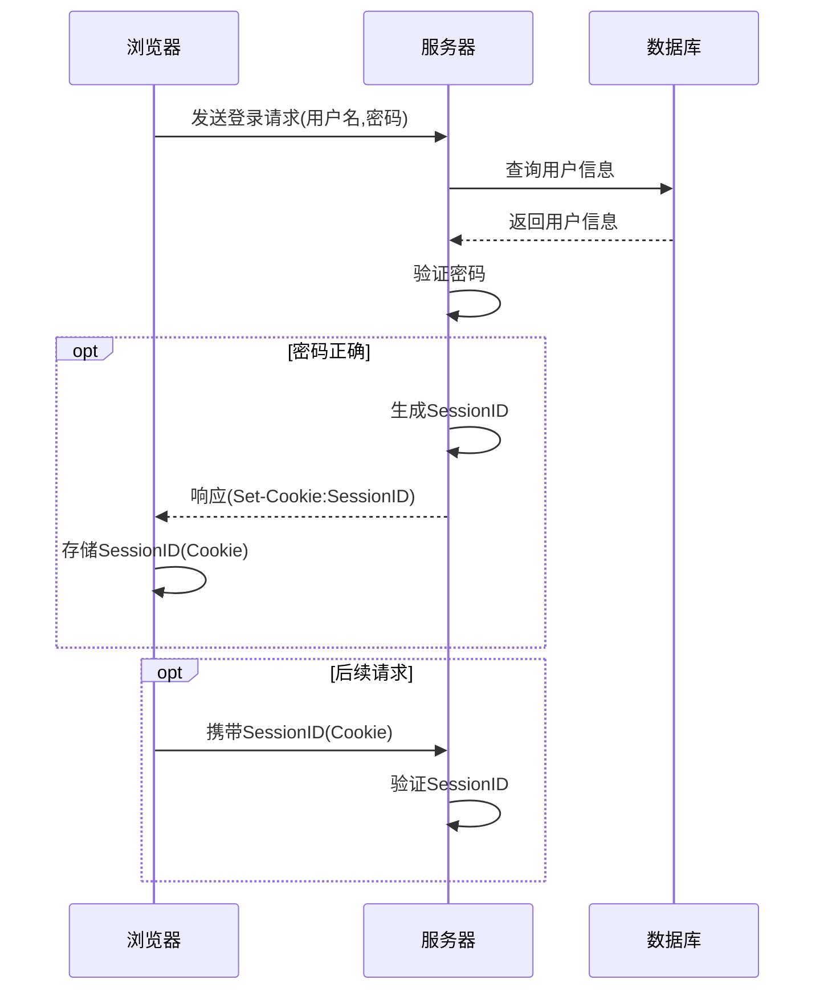
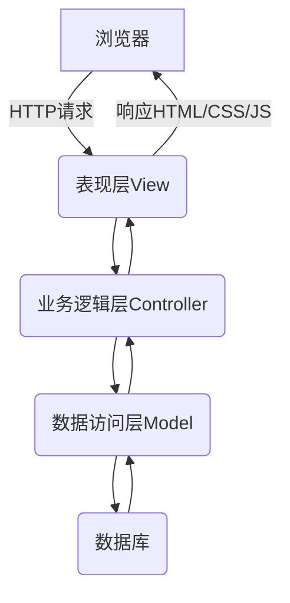

# 基于WEB的学生成绩管理系统详细设计与具体代码实现

## 1.背景介绍

### 1.1 学生成绩管理系统概述

随着教育信息化进程的不断推进,学校对学生成绩管理系统的需求日益迫切。传统的纸质成绩管理方式已经难以满足现代教育管理的要求,存在工作量大、效率低下、数据安全性差等诸多弊端。因此,构建一个基于Web的学生成绩管理系统,实现成绩录入、查询、统计分析等功能,成为了当前教育信息化建设的重点任务之一。

### 1.2 系统建设的必要性

1. **提高工作效率**:基于Web的学生成绩管理系统可以极大地减轻教师的工作负担,实现成绩录入、查询、统计分析等功能的自动化,从而提高工作效率。

2. **数据安全可靠**:与传统纸质管理相比,系统可以有效防止数据丢失、被篡改等问题,保证数据的安全性和可靠性。

3. **信息共享便捷**:通过网络,教师、学生、家长均可随时查询相关成绩信息,实现信息共享,提高工作效率。

4. **统计分析方便**:系统可以自动生成各种统计报表,为教学质量评估和教学决策提供数据支持。

5. **适应信息化发展趋势**:构建基于Web的学生成绩管理系统,是学校信息化建设的重要组成部分,有利于提高学校的信息化水平。

## 2.核心概念与联系

### 2.1 系统架构

基于Web的学生成绩管理系统通常采用B/S(Browser/Server)架构,即浏览器/服务器架构。该架构将系统分为两个部分:客户端(浏览器)和服务器端。

```mermaid
graph TD
    A[客户端(浏览器)] -->|HTTP请求| B(服务器)
    B -->|响应HTML/CSS/JS| A
```

1. **客户端(浏览器)**:用户通过浏览器访问系统,发送HTTP请求。
2. **服务器端**:接收客户端请求,处理相关业务逻辑,并返回HTML、CSS、JavaScript等响应数据。

### 2.2 核心技术

基于Web的学生成绩管理系统涉及的核心技术包括:

- **前端技术**:HTML、CSS、JavaScript等,用于构建系统的用户界面。
- **后端技术**:Java、Python、PHP等编程语言,用于实现系统的业务逻辑。
- **数据库技术**:MySQL、Oracle、SQLServer等,用于存储系统数据。
- **Web服务器技术**:Tomcat、Nginx、Apache等,用于部署和运行Web应用程序。
- **框架技术**:Spring、Django、Laravel等,用于简化开发过程。

### 2.3 系统功能模块

基于Web的学生成绩管理系统通常包含以下核心功能模块:

1. **用户管理模块**:实现用户注册、登录、权限管理等功能。
2. **成绩管理模块**:实现成绩录入、修改、查询、统计分析等功能。
3. **课程管理模块**:实现课程信息维护、教师分配等功能。
4. **班级管理模块**:实现班级信息维护、学生分配等功能。
5. **系统管理模块**:实现系统参数配置、日志管理等功能。

## 3.核心算法原理具体操作步骤

### 3.1 用户认证算法

用户认证是系统的核心功能之一,通常采用密码加密存储和会话管理等技术来实现。具体步骤如下:

1. 用户输入用户名和密码,提交登录请求。
2. 服务器端接收请求,从数据库中查询用户信息。
3. 将用户输入的密码与数据库中存储的密码(通常是加密后的密码)进行比对。
4. 如果密码正确,服务器生成一个会话ID(SessionID),并将其存储在服务器端(例如内存或Redis中)。
5. 服务器将SessionID通过HTTP响应头(Set-Cookie)发送给浏览器。
6. 浏览器将SessionID存储在Cookie中,后续每次请求都会携带该Cookie。
7. 服务器验证请求中的SessionID是否有效,以确定用户是否已通过身份验证。



### 3.2 成绩计算算法

成绩计算是学生成绩管理系统的核心功能之一,通常需要根据不同的计分规则进行计算。以下是一种常见的加权平均分数计算算法:

1. 定义课程的权重系数 $w_i$ ,其中 $\sum_{i=1}^{n}w_i=1$ 。
2. 对于每门课程,计算该课程的加权分数:$s_i=w_i\times p_i$,其中 $p_i$ 为该课程的原始分数。
3. 计算总加权分数:$S=\sum_{i=1}^{n}s_i$。

算法步骤:

1. 输入:课程数量 $n$ ,每门课程的权重 $w_i$ 和原始分数 $p_i$ 。
2. 初始化总加权分数 $S=0$ 。
3. 对于每门课程 $i$ :
    a. 计算加权分数:$s_i=w_i\times p_i$ 。
    b. 累加总加权分数:$S=S+s_i$ 。
4. 输出:总加权分数 $S$ 。

示例:假设有3门课程,权重分别为0.3、0.4和0.3,原始分数分别为85、92和78,则加权平均分数计算过程如下:

$$
\begin{aligned}
s_1&=0.3\times85=25.5\\
s_2&=0.4\times92=36.8\\
s_3&=0.3\times78=23.4\\
S&=25.5+36.8+23.4=85.7
\end{aligned}
$$

因此,该学生的加权平均分数为85.7分。

## 4.数学模型和公式详细讲解举例说明

在学生成绩管理系统中,常常需要进行统计分析,例如计算平均分、标准差等。以下是一些常用的数学模型和公式:

### 4.1 平均数模型

平均数是反映一组数据中心位置的重要指标。对于一个包含 $n$ 个数据 $x_1,x_2,\ldots,x_n$ 的数据集,其算术平均数 $\bar{x}$ 定义为:

$$\bar{x}=\frac{1}{n}\sum_{i=1}^{n}x_i$$

例如,对于数据集 $\{85,92,78,91,86\}$ ,其平均数为:

$$\bar{x}=\frac{85+92+78+91+86}{5}=86.4$$

### 4.2 标准差模型

标准差是衡量数据离散程度的重要指标。对于一个包含 $n$ 个数据 $x_1,x_2,\ldots,x_n$ 的数据集,其标准差 $s$ 定义为:

$$s=\sqrt{\frac{1}{n}\sum_{i=1}^{n}(x_i-\bar{x})^2}$$

其中 $\bar{x}$ 为算术平均数。

例如,对于数据集 $\{85,92,78,91,86\}$ ,其平均数为86.4,标准差为:

$$
\begin{aligned}
s&=\sqrt{\frac{1}{5}\left[(85-86.4)^2+(92-86.4)^2+(78-86.4)^2+(91-86.4)^2+(86-86.4)^2\right]}\\
&=\sqrt{\frac{1}{5}\left[(-1.4)^2+5.6^2+(-8.4)^2+4.6^2+(-0.4)^2\right]}\\
&=\sqrt{\frac{1.96+31.36+70.56+21.16+0.16}{5}}\\
&=\sqrt{25.04}\\
&=5.00
\end{aligned}
$$

因此,该数据集的标准差为5.00。

### 4.3 相关系数模型

相关系数是衡量两个变量之间线性相关程度的无量纲指标。对于两个变量 $X$ 和 $Y$ ,它们的相关系数 $r$ 定义为:

$$r=\frac{\sum_{i=1}^{n}(x_i-\bar{x})(y_i-\bar{y})}{\sqrt{\sum_{i=1}^{n}(x_i-\bar{x})^2\sum_{i=1}^{n}(y_i-\bar{y})^2}}$$

其中 $\bar{x}$ 和 $\bar{y}$ 分别为 $X$ 和 $Y$ 的算术平均数。相关系数的取值范围为 $[-1,1]$ ,绝对值越大,表明两个变量之间的线性相关程度越高。

例如,假设我们有一组学生的数学成绩 $X$ 和英语成绩 $Y$ 的数据,分别为:

$$
\begin{aligned}
X&=\{85,92,78,91,86\}\\
Y&=\{82,88,75,90,84\}
\end{aligned}
$$

则它们的相关系数为:

$$
\begin{aligned}
r&=\frac{(85-86.4)(82-83.8)+(92-86.4)(88-83.8)+\cdots}{\\sqrt{(85-86.4)^2+(92-86.4)^2+\cdots}\sqrt{(82-83.8)^2+(88-83.8)^2+\cdots}}&\\
&=\frac{-9.8+44.8-26.4+48.6-3.2}{\\sqrt{25.04}\sqrt{21.44}}&\\
&=\frac{54}{125.76}\\
&=0.43
\end{aligned}
$$

因此,数学成绩和英语成绩之间存在一定的正相关关系。

## 5.项目实践:代码实例和详细解释说明

### 5.1 系统架构设计

基于Web的学生成绩管理系统通常采用三层架构,包括表现层(View)、业务逻辑层(Controller)和数据访问层(Model)。



1. **表现层(View)**:负责接收用户请求,展示数据并响应用户交互。
2. **业务逻辑层(Controller)**:处理业务逻辑,调用数据访问层进行数据操作。
3. **数据访问层(Model)**:负责与数据库进行交互,执行数据持久化操作。

### 5.2 核心功能实现

以下是基于Java语言和Spring框架实现的部分核心功能代码示例:

#### 5.2.1 用户认证

```java
@RestController
@RequestMapping("/auth")
public class AuthController {

    @Autowired
    private UserService userService;

    @PostMapping("/login")
    public ResponseEntity<String> login(@RequestBody LoginRequest request, HttpSession session) {
        User user = userService.authenticate(request.getUsername(), request.getPassword());
        if (user != null) {
            session.setAttribute("user", user);
            return ResponseEntity.ok("登录成功");
        } else {
            return ResponseEntity.status(HttpStatus.UNAUTHORIZED).body("用户名或密码错误");
        }
    }

    // 其他认证相关方法...
}
```

在上面的示例中,`AuthController`负责处理用户认证相关的请求。`login`方法接收用户名和密码,调用`UserService`进行身份验证。如果认证成功,将用户信息存储在会话中,否则返回401错误。

#### 5.2.2 成绩管理

```java
@RestController
@RequestMapping("/grades")
public class GradeController {

    @Autowired
    private GradeService gradeService;

    @PostMapping
    public ResponseEntity<String> saveGrade(@RequestBody Grade grade) {
        gradeService.saveGrade(grade);
        return ResponseEntity.ok("成绩保存成功");
    }

    @GetMapping
    public ResponseEntity<List<Grade>> getGrades() {
        List<Grade> grades = gradeService.getAllGrades();
        return ResponseEntity.ok(