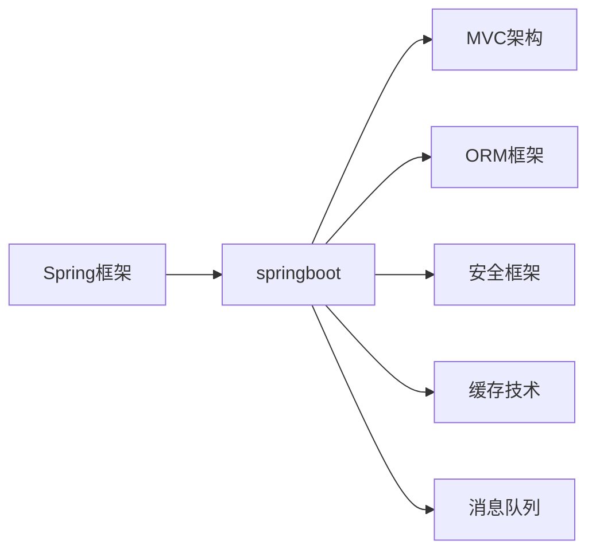

# 基于springboot的企业OA管理系统

## 1. 背景介绍

### 1.1 企业OA系统的重要性

在现代企业管理中,办公自动化(Office Automation,简称OA)系统扮演着越来越重要的角色。OA系统能够有效地提高企业的工作效率,优化业务流程,加强内部沟通与协作,从而提升企业的整体竞争力。

### 1.2 springboot框架概述

springboot是一个基于Java的开源框架,它可以大大简化Spring应用的开发和部署过程。springboot内嵌了Tomcat等Web服务器,无需部署WAR文件,只需要一个可执行的jar包就能运行整个应用。springboot提供了丰富的starter依赖,能够自动配置Spring和第三方库,使开发人员能够快速上手,专注于业务逻辑的实现。

### 1.3 基于springboot的OA系统的优势

将springboot框架应用于企业OA系统的开发,可以充分发挥其优势:

1. 快速开发:springboot简化了配置,提供了大量的starter,使得开发人员可以快速搭建项目骨架,缩短开发周期。

2. 易于部署:springboot内嵌Web服务器,打包成可执行jar,无需单独部署,简化了部署流程。

3. 高度集成:springboot与主流的开源框架和工具无缝集成,如Spring MVC、MyBatis、Redis等,提供开箱即用的功能。

4. 灵活扩展:springboot基于约定优于配置的原则,提供了丰富的配置选项和扩展点,能够灵活地满足不同企业的个性化需求。

## 2. 核心概念与联系

### 2.1 Spring框架

Spring是一个轻量级的Java开发框架,它提供了IoC(Inversion of Control,控制反转)和AOP(Aspect Oriented Programming,面向切面编程)等核心功能,使得开发人员能够更加高效地进行企业级应用开发。springboot是在Spring框架基础上构建的,继承了Spring的核心特性。

### 2.2 MVC架构

MVC(Model-View-Controller)是一种经典的软件架构模式,将应用程序划分为模型(Model)、视图(View)和控制器(Controller)三个部分,实现了业务逻辑、数据、界面显示的分离。springboot遵循MVC架构,提供了@Controller、@Service、@Repository等注解,使得开发人员能够更加清晰地组织代码结构。

### 2.3 ORM框架

ORM(Object Relational Mapping)框架是一种将面向对象的领域模型与关系型数据库进行映射的技术。通过ORM框架,开发人员可以以面向对象的方式操作数据库,而无需编写繁琐的SQL语句。springboot支持主流的ORM框架,如Hibernate、MyBatis等,能够大大简化数据访问层的开发。

### 2.4 安全框架

在企业OA系统中,安全性是一个不可忽视的因素。springboot提供了Spring Security框架,它是一个功能强大且高度可定制的身份验证和访问控制框架。通过Spring Security,可以方便地实现用户认证、授权、密码加密等安全功能。

### 2.5 缓存技术

缓存是提高应用性能的重要手段。springboot支持多种缓存解决方案,如Redis、Ehcache等。通过在springboot中集成缓存技术,可以将频繁访问的数据存储在内存中,减轻数据库的压力,提升系统的响应速度。

### 2.6 消息队列

消息队列是一种异步通信机制,可以用于解耦应用程序的不同组件,实现可靠的消息传递。在企业OA系统中,可以使用消息队列来处理异步任务,如邮件发送、短信通知等。springboot支持多种消息队列中间件,如RabbitMQ、Kafka等。

下面是springboot企业OA管理系统的核心概念与联系的Mermaid流程图:

## 3. 核心算法原理具体操作步骤

### 3.1 用户认证与授权

在企业OA系统中,用户认证与授权是最基本也是最重要的功能之一。springboot集成了Spring Security框架,提供了一套完整的安全解决方案。

#### 3.1.1 用户认证

用户认证的目的是验证用户的身份,确保只有合法用户才能访问系统。Spring Security支持多种认证方式,如表单认证、HTTP Basic认证、JWT认证等。以表单认证为例,具体步骤如下:

1. 用户在登录页面输入用户名和密码,提交表单。
2. Spring Security拦截请求,调用`AuthenticationManager`的`authenticate`方法对用户进行认证。
3. `AuthenticationManager`委托给配置的`AuthenticationProvider`进行实际的认证工作。
4. `AuthenticationProvider`从数据库或其他存储中获取用户信息,对用户名和密码进行比对。
5. 如果认证成功,返回一个`Authentication`对象,表示用户已通过认证;否则抛出`AuthenticationException`异常。
6. 认证成功后,将用户信息存储到`SecurityContext`中,并生成一个`JSESSIONID`的cookie返回给浏览器。

#### 3.1.2 用户授权

用户授权的目的是控制用户对系统资源的访问权限。Spring Security使用`AccessDecisionManager`来决定用户是否有权访问某个资源。具体步骤如下:

1. 定义授权规则,可以通过`@PreAuthorize`、`@PostAuthorize`等注解或`HttpSecurity`配置来实现。
2. 当用户访问受保护的资源时,Spring Security拦截请求。
3. `AccessDecisionManager`获取用户的`Authentication`对象和请求的资源信息。
4. `AccessDecisionManager`委托给配置的`AccessDecisionVoter`进行投票。
5. 每个`AccessDecisionVoter`根据自己的逻辑对是否允许访问进行投票,返回`ACCESS_GRANTED`、`ACCESS_DENIED`或`ACCESS_ABSTAIN`。
6. `AccessDecisionManager`根据投票结果做出最终决定,如果允许访问,则放行请求;否则抛出`AccessDeniedException`异常。

### 3.2 工作流引擎

工作流是企业OA系统的核心功能之一,它能够将业务流程进行标准化、自动化,提高工作效率。springboot可以集成Activiti等工作流引擎,实现工作流的定义、部署、执行等功能。

#### 3.2.1 工作流定义

工作流定义是指对业务流程进行建模,通常使用BPMN(Business Process Model and Notation)标准来描述。具体步骤如下:

1. 使用流程设计器(如Activiti Designer)创建BPMN文件,定义流程的任务、网关、事件等元素。
2. 在BPMN文件中配置任务的属性,如任务的处理人、表单、脚本等。
3. 将BPMN文件部署到工作流引擎中。

#### 3.2.2 工作流执行

工作流执行是指根据工作流定义,驱动流程实例的运转,直至完成。具体步骤如下:

1. 用户提交流程实例,工作流引擎根据BPMN文件创建流程实例。
2. 工作流引擎根据流程定义,确定当前活动的任务,并分配给相应的处理人。
3. 处理人完成任务后,提交表单数据,工作流引擎根据流程定义决定下一步执行路径。
4. 重复步骤2-3,直到流程实例结束。

### 3.3 报表生成

报表是企业OA系统的常见功能,用于展示业务数据,辅助决策。springboot可以集成JasperReports、Apache POI等报表工具,实现报表的设计和生成。

#### 3.3.1 报表设计

报表设计是指定义报表的布局、数据源、参数等。以JasperReports为例,具体步骤如下:

1. 使用Jaspersoft Studio设计报表模板,定义报表的布局、样式、数据源等。
2. 在报表模板中设置参数,如日期范围、部门等,用于动态生成报表。
3. 将报表模板编译成.jasper文件。

#### 3.3.2 报表生成

报表生成是指根据报表模板和数据源,生成具体的报表文件。具体步骤如下:

1. 从数据库或其他数据源获取报表数据。
2. 将数据传递给JasperReports引擎,同时指定报表模板和参数。
3. JasperReports引擎根据模板和数据生成报表文件,支持PDF、Excel、Word等多种格式。
4. 将生成的报表文件返回给用户下载或在线预览。

## 4. 数学模型和公式详细讲解举例说明

### 4.1 用户相似度计算

在企业OA系统中,可以根据用户的行为数据(如阅读文章、参与项目等)计算用户之间的相似度,从而实现个性化推荐、人才挖掘等功能。常用的用户相似度计算方法有皮尔逊相关系数、余弦相似度等。

#### 4.1.1 皮尔逊相关系数

皮尔逊相关系数(Pearson Correlation Coefficient)是一种度量两个变量线性相关程度的指标。对于用户$u$和$v$,他们对$n$个项目的评分分别为$R_u=\{r_{u1},r_{u2},...,r_{un}\}$和$R_v=\{r_{v1},r_{v2},...,r_{vn}\}$,则他们的皮尔逊相关系数为:

$$
sim(u,v) = \frac{\sum_{i=1}^n (r_{ui}-\bar{r_u})(r_{vi}-\bar{r_v})}{\sqrt{\sum_{i=1}^n (r_{ui}-\bar{r_u})^2} \sqrt{\sum_{i=1}^n (r_{vi}-\bar{r_v})^2}}
$$

其中,$\bar{r_u}$和$\bar{r_v}$分别为用户$u$和$v$的平均评分。皮尔逊相关系数的取值范围为$[-1,1]$,值越大表示两个用户的相似度越高。

举例说明:假设用户$u$对项目$\{A,B,C,D,E\}$的评分为$\{4,5,3,4,2\}$,用户$v$对项目$\{A,C,D,E\}$的评分为$\{5,4,3,1\}$,则他们的皮尔逊相关系数为:

$$
\begin{aligned}
\bar{r_u} &= \frac{4+5+3+4+2}{5} = 3.6 \\
\bar{r_v} &= \frac{5+4+3+1}{4} = 3.25 \\
sim(u,v) &= \frac{(4-3.6)(5-3.25)+(3-3.6)(4-3.25)+(4-3.6)(3-3.25)+(2-3.6)(1-3.25)}{\sqrt{(4-3.6)^2+(5-3.6)^2+(3-3.6)^2+(4-3.6)^2+(2-3.6)^2} \sqrt{(5-3.25)^2+(4-3.25)^2+(3-3.25)^2+(1-3.25)^2}} \\
&\approx 0.8321
\end{aligned}
$$

可见,用户$u$和$v$的皮尔逊相关系数为0.8321,说明他们的兴趣爱好比较相似。

#### 4.1.2 余弦相似度

余弦相似度(Cosine Similarity)是一种度量两个向量夹角余弦值的指标。将用户对项目的评分看作多维空间中的向量,则可以用余弦相似度来衡量用户之间的相似程度。对于用户$u$和$v$,他们对$n$个项目的评分向量分别为$R_u=\{r_{u1},r_{u2},...,r_{un}\}$和$R_v=\{r_{v1},r_{v2},...,r_{vn}\}$,则他们的余弦相似度为:

$$
sim(u,v) = \frac{\sum_{i=1}^n r_{ui}r_{vi}}{\sqrt{\sum_{i=1}^n r_{ui}^2} \sqrt{\sum_{i=1}^n r_{vi}^2}}
$$

余弦相似度的取值范围为$[0,1]$,值越大表示两个用户的相似度越高。

举例说明:假设用户$u$对项目$\{A,B,C,D,E\}$的评分为$\{4,5,3,4,2\}$,用户$v$对项目$\{