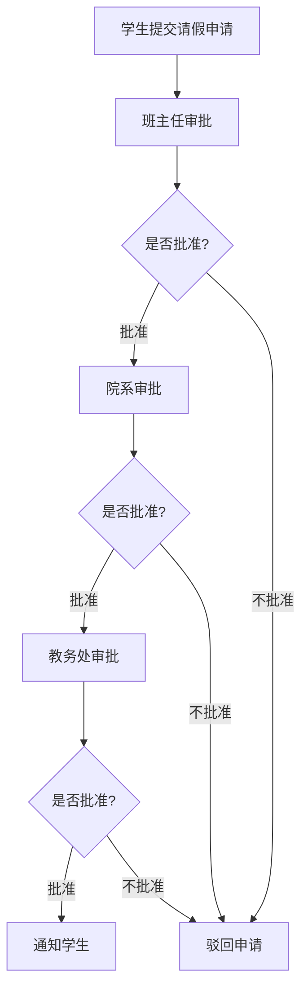
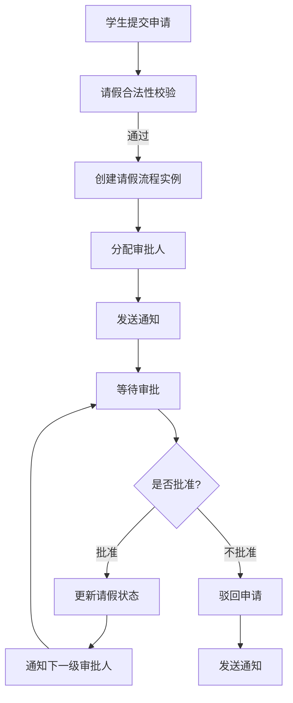
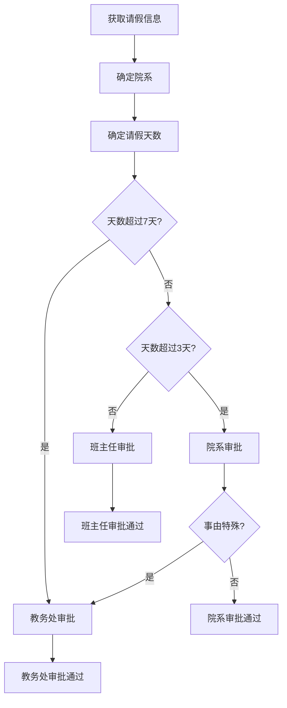

# 基于SpringBoot的高校请假系统

## 1.背景介绍

### 1.1 高校请假系统概述

随着信息技术的飞速发展,高校教学管理工作也逐渐向信息化、自动化方向迈进。传统的纸质请假单已经无法满足现代化高校管理的需求,因此构建一个高效、便捷的请假系统势在必行。基于SpringBoot的高校请假系统正是为解决这一问题而诞生的创新性应用。

### 1.2 传统请假模式存在的问题

1. **低效率**:纸质请假流程繁琐,需要多级审批,效率低下。
2. **数据管理困难**:纸质请假单容易遗失,数据统计分析困难。
3. **不利于监管**:纸质审批流程缺乏有效监督,容易产生舞弊行为。
4. **不利于通知**:纸质请假单无法及时通知相关人员。

### 1.3 基于SpringBoot的请假系统优势

1. **高效便捷**:学生可随时随地在线提交请假申请,审批流程自动化。
2. **数据集中**:所有请假数据存储在统一的数据库中,方便查询和分析。
3. **过程透明**:请假流程电子化,每一步操作都有记录,有利于监管。
4. **及时通知**:系统可自动通知相关人员,保证信息传递的及时性。
5. **移动支持**:基于SpringBoot的Web系统可适配各种移动终端。

## 2.核心概念与联系

### 2.1 请假流程

基于SpringBoot的高校请假系统的核心是请假流程,它贯穿了整个系统的运行。请假流程可分为以下几个阶段:



### 2.2 系统角色

系统主要涉及以下几类角色:

1. **学生**:可以提交请假申请,查看请假状态和结果。
2. **班主任**:审批本班学生的请假申请。
3. **院系管理员**:审批本院系学生的请假申请。
4. **教务处管理员**:审批全校学生的请假申请,也可以设置请假规则。
5. **超级管理员**:管理整个系统的运行,包括账号管理、数据备份等。

### 2.3 关键技术

基于SpringBoot的高校请假系统主要采用了以下关键技术:

1. **SpringBoot**:基于Spring的全新框架,用于快速构建高效的应用程序。
2. **Spring MVC**:构建请假系统的Web层。
3. **MyBatis**:实现数据持久层,对数据库进行操作。
4. **Spring Security**:实现系统的权限控制和安全管理。
5. **Thymeleaf**:渲染前端页面视图。
6. **BootStrap**:前端UI框架,实现响应式设计。
7. **WebSocket**:实现系统实时通知功能。

## 3.核心算法原理具体操作步骤

### 3.1 请假申请处理流程

当学生提交请假申请时,系统会根据预设的请假规则进行合法性校验,通过后将进入审批流程。请假申请处理流程如下:



其中,请假合法性校验主要包括以下几个方面:

1. 检查请假事由是否合理
2. 检查请假时间段是否冲突
3. 检查请假天数是否超出限制
4. 检查附件资料是否齐全

### 3.2 请假审批算法

请假审批算法是整个系统的核心,它决定了请假申请的审批路径。该算法考虑了以下几个主要因素:

1. 学生所属院系
2. 请假天数
3. 请假事由
4. 历史请假记录

算法流程如下:



### 3.3 请假数据统计算法

为了方便管理人员及时掌握学生请假情况,系统提供了请假数据统计功能。统计算法主要包括以下步骤:

1. 根据时间范围、院系、班级等条件筛选请假记录
2. 统计请假总天数、总人数
3. 按请假事由分类统计
4. 生成可视化报表

该算法的时间复杂度为O(n),其中n为请假记录总数。

## 4.数学模型和公式详细讲解举例说明

### 4.1 请假审批路径计算模型

为了优化审批效率,系统需要合理计算请假申请的审批路径。我们将此问题建模为一个加权有向图,其中节点表示审批人,边表示审批路径,边的权重表示审批优先级。

令G=(V,E)为审批路径图,其中:

- V是所有审批人的集合
- E是所有可能的审批路径的集合

对于任意请假申请r,我们定义一个代价函数:

$$
C(r,p)=\sum_{e\in p}w_e
$$

其中p是审批路径,w_e是边e的权重。我们希望找到一条代价最小的路径p*,使得:

$$
p^*=\arg\min_{p\in P_r}C(r,p)
$$

这实际上是一个典型的最短路径问题,可以使用Dijkstra算法等经典算法求解。

### 4.2 请假数据挖掘模型

通过对历史请假数据进行挖掘分析,可以发现一些有价值的模式,为制定请假规则和优化审批流程提供依据。我们将请假记录表示为一个数据集D,其中每个记录是一个n维向量:

$$
x_i=(x_{i1},x_{i2},...,x_{in})
$$

其中n是特征的个数,包括请假事由、天数、时间等。我们的目标是发现一些潜在的聚类,即将D划分为k个簇:

$$
D=\bigcup_{j=1}^kC_j
$$

我们可以使用K-Means聚类算法来求解,其目标函数为:

$$
J=\sum_{j=1}^k\sum_{x_i\in C_j}||x_i-\mu_j||^2
$$

其中$\mu_j$是第j个簇的质心。通过迭代优化,我们可以得到最优的聚类结果。

## 5.项目实践:代码实例和详细解释说明

### 5.1 请假申请表单

学生提交请假申请的入口是一个Web表单,前端使用BootStrap框架实现响应式设计,后端由Spring MVC控制器处理:

```java
@Controller
@RequestMapping("/leave")
public class LeaveController {

    @GetMapping("/apply")
    public String showApplyForm(Model model) {
        model.addAttribute("leaveForm", new LeaveForm());
        return "leave/applyForm";
    }

    @PostMapping("/apply")
    public String submitApplication(@Valid @ModelAttribute("leaveForm") LeaveForm form,
                                    BindingResult bindingResult) {
        if (bindingResult.hasErrors()) {
            return "leave/applyForm";
        }
        
        // 处理请假申请逻辑
        leaveService.submitApplication(form);
        
        return "redirect:/leave/status";
    }
}
```

前端表单使用Thymeleaf模板引擎渲染:

```html
<form th:action="@{/leave/apply}" th:object="${leaveForm}" method="post">
    <div>
        <label>请假事由:</label>
        <textarea th:field="*{reason}" required></textarea>
    </div>
    
    <div>
        <label>开始时间:</label>
        <input type="datetime-local" th:field="*{startTime}" required/>
    </div>
    
    <div>
        <label>结束时间:</label>
        <input type="datetime-local" th:field="*{endTime}" required/>
    </div>
    
    <div>
        <input type="submit" value="提交申请"/>
    </div>
</form>
```

### 5.2 请假审批流程实现

请假审批流程的实现采用了状态机和任务调度的设计模式。每个请假申请都是一个状态机实例,根据当前状态执行不同的操作。

```java
@Component
public class LeaveApplicationStateMachine {

    public void submitApplication(LeaveApplication application) {
        application.setState(LeaveState.SUBMITTED);
        application.setCreateTime(LocalDateTime.now());
        applicationRepository.save(application);
        
        // 触发第一步审批任务
        approvalTaskScheduler.scheduleTask(application, application.getInitialApprover());
    }
    
    public void approve(LeaveApplication application, String approverId) {
        application.setState(LeaveState.APPROVED);
        applicationRepository.save(application);
        
        // 获取下一步审批人
        String nextApproverId = getNextApprover(application);
        if (nextApproverId != null) {
            // 触发下一步审批任务
            approvalTaskScheduler.scheduleTask(application, nextApproverId);
        } else {
            // 审批流程结束
            application.setState(LeaveState.FINAL_APPROVED);
            applicationRepository.save(application);
            notificationService.notifyStudent(application);
        }
    }
    
    public void reject(LeaveApplication application, String approverId) {
        application.setState(LeaveState.REJECTED);
        applicationRepository.save(application);
        notificationService.notifyStudent(application);
    }
}
```

任务调度使用Spring的@Scheduled注解实现:

```java
@Component
public class ApprovalTaskScheduler {

    @Scheduled(fixedDelay = 60000)
    public void processApprovalTasks() {
        List<ApprovalTask> tasks = approvalTaskRepository.findPendingTasks();
        for (ApprovalTask task : tasks) {
            LeaveApplication application = task.getApplication();
            String approverId = task.getApproverId();
            
            // 模拟审批操作
            boolean approved = approvalService.simulateApproval(application, approverId);
            if (approved) {
                stateMachine.approve(application, approverId);
            } else {
                stateMachine.reject(application, approverId);
            }
        }
    }
}
```

### 5.3 请假数据统计报表

请假数据统计报表的实现使用了JFreeChart开源库,该库提供了丰富的图表类型和自定义功能。

```java
@Controller
@RequestMapping("/report")
public class ReportController {

    @GetMapping
    public String showReportForm(Model model) {
        model.addAttribute("query", new ReportQuery());
        return "report/form";
    }

    @PostMapping
    public String generateReport(@ModelAttribute("query") ReportQuery query, Model model) {
        // 从数据库查询请假记录
        List<LeaveApplication> applications = leaveService.findByQueryCondition(query);
        
        // 生成统计报表
        DefaultCategoryDataset dataset = new DefaultCategoryDataset();
        for (LeaveApplication app : applications) {
            dataset.addValue(app.getLeaveDays(), "请假天数", app.getReason());
        }
        
        JFreeChart chart = ChartFactory.createBarChart("请假统计报表", "请假事由", "请假天数", dataset);
        
        // 将报表转换为图片
        File chartFile = new File("report.png");
        try {
            ChartUtils.saveChartAsPNG(chartFile, chart, 800, 600);
        } catch (IOException e) {
            e.printStackTrace();
        }
        
        model.addAttribute("chartFile", chartFile);
        return "report/result";
    }
}
```

前端使用HTML5的`<canvas>`标签显示报表图片:

```html
<canvas id="reportChart">
    
</canvas>
```

## 6.实际应用场景

基于SpringBoot的高校请假系统可广泛应用于各类院校,为师生提供高效便捷的请假服务。以下是一些典型的应用场景