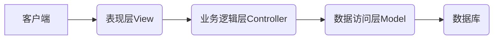

# 基于SSM滑雪场租赁系统

## 1.背景介绍

### 1.1 滑雪运动概述

滑雪运动是一种在雪地上进行的户外运动,主要分为两大类:高山滑雪和平地滑雪。高山滑雪又称阿尔卑斯式滑雪,需要在具有一定坡度的雪山上进行。平地滑雪则是在人工制造的雪道上滑行。无论哪种滑雪方式,都需要使用特殊的滑雪板和滑雪杖等装备。

滑雪运动有着悠久的历史,最早可以追溯到公元前几千年的北欧地区。起初滑雪只是作为一种交通工具,后来逐渐发展成为一项运动项目。现代滑雪运动在19世纪中期开始在欧洲流行,并逐渐演变成为一项国际性的运动项目。

### 1.2 滑雪场租赁系统的需求

随着滑雪运动的普及,各大滑雪场的运营管理变得越来越重要。传统的人工管理方式已经无法满足日益增长的需求。因此,开发一套完善的滑雪场租赁系统就显得尤为必要。

滑雪场租赁系统需要实现以下主要功能:

1. 滑雪装备租赁管理
2. 滑雪教练预约服务
3. 在线售票和订单管理
4. 会员管理和积分系统
5. 资源调度和安排
6. 财务管理和统计报表

通过该系统,滑雪场可以提高运营效率,优化资源利用,为顾客提供更好的服务体验。

## 2.核心概念与联系

### 2.1 系统架构

滑雪场租赁系统采用经典的三层架构设计,包括表现层(View)、业务逻辑层(Controller)和数据访问层(Model)。



### 2.2 设计模式

在系统开发中,我们应用了多种设计模式,以提高代码的可维护性、扩展性和复用性。

- **MVC模式**: 将系统分为模型(Model)、视图(View)和控制器(Controller)三个部分,实现了交互逻辑与数据逻辑的分离。
- **工厂模式**: 通过工厂类来实例化对象,增加系统的灵活性和可扩展性。
- **观察者模式**: 在对象之间定义了一种一对多的依赖关系,当一个对象状态发生改变时,所有依赖于它的对象都会得到通知。
- **单例模式**: 保证一个类只有一个实例,并提供一个访问它的全局访问点。

### 2.3 关键技术

滑雪场租赁系统基于流行的SSM(Spring+SpringMVC+MyBatis)框架构建,并整合了其他技术和工具。

- **Spring**: 提供了面向切面编程(AOP)和控制反转(IOC)等功能,简化了对象之间的依赖关系。
- **SpringMVC**: 基于MVC设计模式的请求驱动框架,用于处理HTTP请求和响应。
- **MyBatis**: 一个优秀的持久层框架,支持定制化SQL、存储过程和高级映射。
- **MySQL**: 作为系统的关系型数据库,存储业务数据。
- **Redis**: 高性能的NoSQL数据库,用于缓存和消息队列。
- **Shiro**: 一个强大的安全框架,提供了认证、授权、加密和会话管理等功能。

## 3.核心算法原理具体操作步骤  

### 3.1 滑雪装备租赁算法

滑雪装备租赁是系统的核心功能之一,需要高效地匹配顾客需求和可用资源。我们采用了一种基于优先级队列的算法来实现这一功能。

算法步骤如下:

1. 将所有可租赁的滑雪装备按照类型、品牌、尺寸等属性存储在优先级队列中。
2. 当有新的租赁请求到来时,根据顾客的要求(如身高、体重等)计算出最佳装备配置。
3. 在优先级队列中查找满足要求的装备,按照距离匹配度从高到低排序。
4. 选取最匹配的装备出租给顾客,并从优先级队列中移除。
5. 当顾客归还装备时,将其重新加入优先级队列。

该算法的时间复杂度为O(nlogn),其中n为优先级队列的大小。通过优先级队列,我们可以快速找到最佳匹配的装备,提高了资源利用率。

### 3.2 滑雪教练预约算法

滑雪教练是一种稀缺资源,需要合理安排以满足顾客需求。我们采用了一种基于图着色的算法来解决这个问题。

算法步骤如下:

1. 将每个滑雪教练视为一个节点,将他们之间的冲突关系(如同一时间段只能授课一次)视为无向边构建一个冲突图。
2. 使用威尔士-鲍威尔(Welsh-Powell)算法对冲突图进行着色,每种颜色代表一个不冲突的教练组。
3. 遍历每种颜色,将同一颜色的教练安排在同一时间段授课。
4. 如果有新的预约请求到来,尝试将其分配给现有的教练组;如果不行,则创建一个新的教练组。

该算法的时间复杂度为O(n+m),其中n为教练数量,m为冲突边数量。通过图着色算法,我们可以高效地安排教练资源,避免时间冲突。

## 4.数学模型和公式详细讲解举例说明

### 4.1 装备匹配度计算

在滑雪装备租赁算法中,我们需要计算顾客需求与可用装备之间的匹配度,以找到最佳配置。我们使用加权欧几里得距离作为匹配度的度量标准。

设顾客需求为向量$\vec{x}=(x_1, x_2, \ldots, x_n)$,可用装备为向量$\vec{y}=(y_1, y_2, \ldots, y_n)$,其中$x_i$和$y_i$分别表示第i个属性的值。我们为每个属性赋予一个权重$w_i$,表示其重要程度。则匹配度可以表示为:

$$
d(\vec{x}, \vec{y}) = \sqrt{\sum_{i=1}^{n}w_i(x_i - y_i)^2}
$$

匹配度$d(\vec{x}, \vec{y})$越小,表示$\vec{x}$和$\vec{y}$越相似,也就是匹配度越高。

例如,假设我们有三个属性:身高、体重和滑雪水平,权重分别为0.4、0.3和0.3。顾客的需求向量为(180cm, 75kg, 初级),某款装备的属性向量为(175cm, 70kg, 中级)。则它们之间的匹配度为:

$$
\begin{aligned}
d &= \sqrt{0.4(180-175)^2 + 0.3(75-70)^2 + 0.3(1-2)^2} \\
   &= \sqrt{25 + 25 + 0.09} \\
   &= 7.07
\end{aligned}
$$

通过计算所有可用装备的匹配度,并按照匹配度从小到大排序,我们就可以找到最佳配置了。

### 4.2 教练组合优化

在滑雪教练预约算法中,我们需要将教练分配到不同的时间段,以避免时间冲突。这可以看作是一个集合覆盖问题,我们的目标是用最少的教练组来覆盖所有的预约请求。

设有n个预约请求$R=\{r_1, r_2, \ldots, r_n\}$,m个教练$T=\{t_1, t_2, \ldots, t_m\}$。我们定义一个二元关系$\rho \subseteq R \times T$,如果$(r_i, t_j) \in \rho$,则表示教练$t_j$可以满足预约请求$r_i$。

我们的目标是找到$T$的一个最小子集$T' \subseteq T$,使得对于任意$r_i \in R$,都存在$(r_i, t_j) \in \rho$且$t_j \in T'$。也就是说,每个预约请求都可以被$T'$中的某个教练满足。

这是一个经典的集合覆盖问题,可以使用近似算法来解决。我们采用了一种基于贪心策略的近似算法,算法步骤如下:

1. 初始化$T'=\emptyset$
2. 重复以下步骤,直到所有预约请求都被覆盖:
    a. 选择一个覆盖最多未覆盖预约请求的教练$t_j$
    b. 将$t_j$加入$T'$,移除所有被$t_j$覆盖的预约请求
3. 返回$T'$

该算法的近似比为$H(max|R|)$,其中$H(n)=\sum_{i=1}^{n}\frac{1}{i}$是n次调和级数。这意味着算法得到的解的代价最多比最优解大$H(max|R|)$倍。

通过这种近似算法,我们可以快速找到一个较优的教练组合方案,从而提高资源利用率和顾客满意度。

## 5.项目实践:代码实例和详细解释说明

### 5.1 装备租赁模块

装备租赁模块的核心类是`EquipmentRentalService`,它负责管理可租赁的滑雪装备,并处理租赁请求。

```java
@Service
public class EquipmentRentalService {
    private PriorityQueue<SkiEquipment> availableEquipments;

    public EquipmentRentalService() {
        // 初始化优先级队列,按照匹配度从小到大排序
        this.availableEquipments = new PriorityQueue<>((a, b) -> {
            double aDist = calculateMatchingDegree(a);
            double bDist = calculateMatchingDegree(b);
            return Double.compare(aDist, bDist);
        });
        // 加载所有可租赁的装备
        loadAvailableEquipments();
    }

    public SkiEquipment rentEquipment(Customer customer) {
        // 计算顾客的最佳装备配置
        SkiEquipmentRequest request = calculateIdealConfiguration(customer);
        // 从优先级队列中获取最匹配的装备
        SkiEquipment bestEquipment = availableEquipments.poll();
        // 其他逻辑...
        return bestEquipment;
    }

    public void returnEquipment(SkiEquipment equipment) {
        // 将归还的装备重新加入优先级队列
        availableEquipments.offer(equipment);
    }

    // 其他辅助方法...
}
```

在`rentEquipment`方法中,我们首先根据顾客信息计算出最佳装备配置,然后从优先级队列中获取最匹配的装备出租。当顾客归还装备时,我们将其重新加入优先级队列,以供下一次租赁。

### 5.2 教练预约模块

教练预约模块的核心类是`InstructorSchedulingService`,它使用图着色算法来安排教练资源。

```java
@Service
public class InstructorSchedulingService {
    private Map<Instructor, Set<Timeslot>> instructorSchedules;
    private Graph<Instructor> conflictGraph;

    public InstructorSchedulingService() {
        this.instructorSchedules = new HashMap<>();
        this.conflictGraph = new Graph<>();
        // 加载所有教练及其冲突关系
        loadInstructorsAndConflicts();
    }

    public boolean makeReservation(Reservation reservation) {
        // 尝试将预约分配给现有的教练组
        if (assignToExistingGroup(reservation)) {
            return true;
        }
        // 如果无法分配,则创建一个新的教练组
        Set<Instructor> newGroup = createNewGroup(reservation);
        if (newGroup != null) {
            assignInstructors(reservation, newGroup);
            return true;
        }
        // 无法安排预约
        return false;
    }

    private boolean assignToExistingGroup(Reservation reservation) {
        // 遍历每个教练组,尝试分配预约
        for (Set<Instructor> group : getInstructorGroups()) {
            if (canAssignToGroup(reservation, group)) {
                assignInstructors(reservation, group);
                return true;
            }
        }
        return false;
    }

    private Set<Instructor> createNewGroup(Reservation reservation) {
        // 使用图着色算法找到一个新的教练组
        WelshPowellColoring<Instructor> coloring = new Welsh