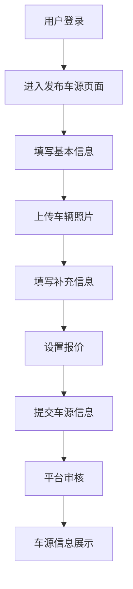

# 基于SSM的二手车销售平台

## 1.背景介绍

### 1.1 二手车交易市场概况

随着汽车保有量的不断增加和汽车更新换代周期的缩短,二手车交易市场规模也在不断扩大。根据中国汽车流通协会的数据显示,2022年中国二手车交易量达到1562万辆,同比增长11.5%。然而,传统的二手车交易模式存在诸多痛点,如信息不对称、交易环节繁琐、交易成本高昂等,严重影响了二手车交易的效率和用户体验。

### 1.2 互联网+二手车交易平台

为了解决传统二手车交易模式的弊端,互联网+二手车交易平台应运而生。这种基于互联网技术的交易平台,通过构建统一的信息发布和交易平台,实现了二手车信息的集中展示和在线交易,极大地提高了交易效率和透明度。同时,平台还提供了车辆检测、过户代办、金融服务等增值服务,为用户提供了一站式的二手车交易解决方案。

### 1.3 基于SSM架构的二手车交易平台

基于SSM(Spring+SpringMVC+MyBatis)架构的二手车交易平台,是一种典型的J2EE企业级应用,它采用了当前流行的轻量级框架组合,具有开发效率高、可扩展性强、易于维护等优势。本文将详细介绍该平台的核心架构、关键技术以及实现过程,为读者提供一个完整的开发参考。

## 2.核心概念与联系

### 2.1 SSM架构

SSM架构是指Spring+SpringMVC+MyBatis这种流行的轻量级框架组合,它们分别承担了不同的职责:

- Spring: 负责对象的创建、初始化和装配,提供了面向切面编程(AOP)的支持,是整个架构的核心容器。
- SpringMVC: 是Spring框架的一个模块,是一种基于MVC设计模式的Web层框架,负责处理HTTP请求和响应。
- MyBatis: 是一种优秀的持久层框架,支持自定义SQL、存储过程以及高级映射,可以方便地将数据库中的记录映射为Java对象。

这三个框架相互配合,构建了一个高效、灵活、可扩展的J2EE企业级应用架构。


### 2.2 二手车交易平台核心概念

二手车交易平台的核心概念包括:

- 车源信息: 包括车辆基本信息(品牌、车型、年限、里程等)、车况评级、报价等。
- 买家/卖家: 平台的两类主要用户角色。
- 订单: 买卖双方达成交易意向后,在平台上生成的交易订单。
- 增值服务: 平台提供的车辆检测、过户代办、金融服务等增值服务。

这些概念相互关联,构成了二手车交易平台的核心业务流程。

## 3.核心算法原理具体操作步骤

### 3.1 车辆信息发布流程

车主在平台上发布车辆信息的流程如下:

1. 用户登录平台,进入"发布车源"页面。
2. 填写车辆基本信息,如品牌、车型、年限、里程等。
3. 上传车辆实拍照片。
4. 填写车辆配置信息、车况描述等补充信息。
5. 设置车辆报价。
6. 提交车源信息,等待平台审核。
7. 平台审核通过后,车源信息在平台上公开展示。



### 3.2 车辆搜索与推荐算法

为了帮助买家快速找到心仪的车源,平台提供了车辆搜索和个性化推荐功能。

#### 3.2.1 车辆搜索算法

车辆搜索算法基于多维度的搜索条件,如品牌、车型、年限、里程、价格区间等,通过对数据库中的车源信息进行多条件筛选,快速返回满足条件的车辆列表。

```python
def search_vehicles(brand, model, year, mileage, price_range):
    query = Vehicle.query
    if brand:
        query = query.filter(Vehicle.brand == brand)
    if model:
        query = query.filter(Vehicle.model == model)
    if year:
        query = query.filter(Vehicle.year == year)
    if mileage:
        query = query.filter(Vehicle.mileage <= mileage)
    if price_range:
        min_price, max_price = price_range
        query = query.filter(Vehicle.price >= min_price, Vehicle.price <= max_price)
    return query.all()
```

#### 3.2.2 个性化推荐算法

个性化推荐算法基于协同过滤技术,通过分析用户的浏览记录、收藏记录和购买记录,发现用户的偏好模式,从而推荐潜在感兴趣的车辆。

1. 构建用户-车辆评分矩阵
2. 计算用户间的相似度
3. 基于相似用户的历史记录,为目标用户生成推荐列表

```python
import numpy as np
from sklearn.metrics.pairwise import cosine_similarity

def recommend_vehicles(user_id, user_ratings, vehicle_ids, k=10):
    # 计算用户间的相似度
    user_sim = cosine_similarity(user_ratings)
    
    # 获取最相似的k个用户
    user_indices = np.argsort(-user_sim[user_id])[:k+1]
    similar_users = user_indices[1:]
    
    # 基于相似用户的评分,生成推荐列表
    user_ratings_sum = np.sum(user_ratings[similar_users], axis=0)
    recommended_indices = np.argsort(-user_ratings_sum)
    recommended_vehicles = [vehicle_ids[i] for i in recommended_indices if user_ratings[user_id, i] == 0]
    
    return recommended_vehicles
```

## 4.数学模型和公式详细讲解举例说明

### 4.1 协同过滤推荐算法

协同过滤推荐算法是基于用户行为数据进行推荐的一种常用技术,它的核心思想是找到与目标用户有相似兴趣爱好的用户群体,然后根据这个群体的行为记录,为目标用户生成个性化推荐列表。

#### 4.1.1 用户相似度计算

计算用户相似度是协同过滤算法的关键步骤,常用的相似度计算方法包括余弦相似度、皮尔逊相关系数等。以余弦相似度为例,对于用户$u$和用户$v$,它们的相似度可以表示为:

$$\text{sim}(u, v) = \cos(\vec{r_u}, \vec{r_v}) = \frac{\vec{r_u} \cdot \vec{r_v}}{||\vec{r_u}|| \times ||\vec{r_v}||}$$

其中$\vec{r_u}$和$\vec{r_v}$分别表示用户$u$和用户$v$对所有物品的评分向量。

#### 4.1.2 基于用户相似度的预测评分

对于目标用户$u$,我们可以基于与其相似的用户群体$S$,预测$u$对物品$i$的评分:

$$\hat{r}_{u,i} = \overline{r_u} + \frac{\sum\limits_{v \in S} \text{sim}(u, v) \times (r_{v,i} - \overline{r_v})}{\sum\limits_{v \in S} |\text{sim}(u, v)|}$$

其中$\overline{r_u}$和$\overline{r_v}$分别表示用户$u$和用户$v$的平均评分。

通过计算目标用户对所有未评分物品的预测评分,我们可以获得一个推荐列表,将预测评分较高的物品推荐给用户。

### 4.2 车辆价格预测模型

对于二手车交易平台而言,能够准确预测车辆的合理价格,对于提高交易效率和用户体验至关重要。我们可以基于机器学习技术,构建一个车辆价格预测模型。

假设车辆价格$y$与车辆特征$x_1, x_2, \dots, x_n$之间存在如下线性关系:

$$y = \beta_0 + \beta_1 x_1 + \beta_2 x_2 + \dots + \beta_n x_n + \epsilon$$

其中$\beta_0, \beta_1, \dots, \beta_n$是模型参数,需要通过训练数据进行估计;$\epsilon$是随机误差项。

我们可以使用普通最小二乘法(OLS)来估计模型参数:

$$\hat{\beta} = \arg\min_{\beta} \sum_{i=1}^{m} (y_i - \beta_0 - \beta_1 x_{i1} - \dots - \beta_n x_{in})^2$$

对于给定的车辆特征$x_1, x_2, \dots, x_n$,我们可以使用训练好的模型预测其价格:

$$\hat{y} = \hat{\beta}_0 + \hat{\beta}_1 x_1 + \hat{\beta}_2 x_2 + \dots + \hat{\beta}_n x_n$$

该模型可以为卖家提供参考价格,也可以为买家评估车辆的合理价位,从而提高交易的公平性和透明度。

## 5.项目实践:代码实例和详细解释说明

### 5.1 项目架构

本项目采用典型的SSM架构,分为三层:

- Web层: 基于SpringMVC框架,负责处理HTTP请求和响应,渲染视图。
- 业务逻辑层: 基于Spring框架,负责实现业务逻辑和调用持久层。
- 持久层: 基于MyBatis框架,负责与数据库进行交互。


### 5.2 核心代码示例

#### 5.2.1 发布车源功能

发布车源功能主要包括以下几个步骤:

1. 在Web层的Controller中接收请求,调用Service层的方法。

```java
@Controller
@RequestMapping("/vehicle")
public class VehicleController {
    @Autowired
    private VehicleService vehicleService;

    @PostMapping("/publish")
    public String publishVehicle(@ModelAttribute VehicleDTO vehicleDTO) {
        vehicleService.publishVehicle(vehicleDTO);
        return "success";
    }
}
```

2. 在Service层中实现业务逻辑,调用Dao层的方法进行数据持久化。

```java
@Service
public class VehicleServiceImpl implements VehicleService {
    @Autowired
    private VehicleDao vehicleDao;

    @Override
    public void publishVehicle(VehicleDTO vehicleDTO) {
        Vehicle vehicle = new Vehicle();
        // 将DTO对象转换为实体对象
        BeanUtils.copyProperties(vehicleDTO, vehicle);
        vehicleDao.insert(vehicle);
    }
}
```

3. 在Dao层中使用MyBatis提供的Mapper接口,定义SQL语句进行数据库操作。

```java
@Mapper
public interface VehicleMapper {
    @Insert("INSERT INTO vehicle (brand, model, year, mileage, price, description, photos) " +
            "VALUES (#{brand}, #{model}, #{year}, #{mileage}, #{price}, #{description}, #{photos})")
    int insert(Vehicle vehicle);
}
```

#### 5.2.2 车辆搜索功能

车辆搜索功能主要包括以下几个步骤:

1. 在Web层的Controller中接收请求参数,调用Service层的方法。

```java
@Controller
@RequestMapping("/search")
public class SearchController {
    @Autowired
    private SearchService searchService;

    @GetMapping
    public String searchVehicles(@RequestParam Map<String, Object> params, Model model) {
        List<Vehicle> vehicles = searchService.searchVehicles(params);
        model.addAttribute("vehicles", vehicles);
        return "search-result";
    }
}
```

2. 在Service层中实现业务逻辑,调用Dao层的方法进行数据查询。

```java
@Service
public class SearchServiceImpl implements SearchService {
    @Autowired
    private VehicleDao vehicleDao;

    @Override
    public List<Vehicle> searchVehicles(Map<String, Object> params) {
        return vehicleDao.search(params);
    }
}
```

3. 在Dao层中使用MyBatis提供的动态SQL功能,根据查询参数动态构建SQL语句。

```xml
<mapper namespace="com.example.dao.VehicleMapper">
    <select i