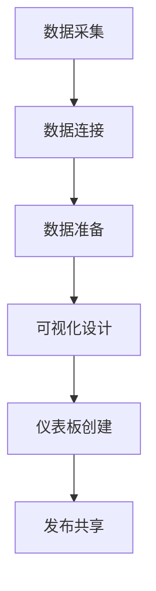

# 基于Tableau的历届奥运会数据可视化分析

## 1.背景介绍

### 1.1 奥运会简介

奥林匹克运动会(Olympic Games)是世界上规模最大、影响力最广的综合性体育赛事,被誉为"世界第一等的综合性体育运动会"。奥运会由国际奥林匹克委员会(IOC)主办,每四年一届,分为夏季奥运会和冬季奥运会。第一届夏季奥运会于1896年在希腊雅典举行,而第一届冬季奥运会则于1924年在法国的沙蒙尼举行。

奥运会不仅是体育健儿们展现实力、争夺荣誉的舞台,更是各国人民相互了解、增进友谊的平台。截至2022年北京冬奥会,奥运会已经走过了126年的历程,见证了无数个难忘瞬间。随着时代的发展,奥运会规模不断扩大,项目种类日益丰富,参与国家和运动员人数与日俱增。

### 1.2 数据可视化概述

数据可视化(Data Visualization)是将抽象的数据转化为图形或图像的过程,目的是通过视觉化的方式来简化复杂的数据,增强人们对数据的理解和分析能力。有效的数据可视化能够揭示数据中隐藏的模式、趋势和关系,从而帮助人们更好地洞察数据,做出明智的决策。

在大数据时代,数据可视化的重要性日益凸显。传统的数据表格和报告已经难以满足人们对海量数据的分析需求,而数据可视化则能够将枯燥的数字转化为生动形象的图表,使数据更加直观、易于理解。因此,数据可视化已经广泛应用于各个领域,包括商业智能、科学研究、教育培训等。

### 1.3 Tableau介绍

Tableau是一款领先的数据可视化和商业智能软件,由Tableau Software公司开发。它以其强大的数据连接、探索和可视化功能而闻名,可以帮助用户快速发现数据中的见解和趋势。

Tableau的主要优势包括:

- 直观易用的拖拽式界面,无需编程即可创建精美的数据可视化效果
- 支持多种数据源连接,包括平面文件、数据库、云端数据等
- 丰富的可视化选择,如饼图、柱状图、地图、树形图等
- 强大的数据处理和分析功能,支持联机分析和数据透视等
- 灵活的共享和协作选项,可轻松发布和共享仪表板

凭借其卓越的性能和用户体验,Tableau已经成为全球数据可视化领域的领导者,被众多企业、政府机构和教育机构广泛采用。

## 2.核心概念与联系 

### 2.1 奥运数据的重要性

奥运数据是一笔宝贵的资源,蕴含着丰富的信息和洞见。通过对历届奥运会数据的分析和可视化,我们可以发现以下重要价值:

1. **运动员和国家表现评估**:奥运数据能够反映各个国家和运动员在不同项目中的历史表现,有助于评估实力、发现优劣势,为未来备战提供参考。

2. **趋势洞察**:通过分析历史数据,我们可以洞察奥运会的发展趋势,如新兴项目、人气变化等,为相关决策提供依据。

3. **社会影响力**:奥运会不仅是体育盛事,更是文化交流的平台。奥运数据可以反映不同国家和地区在体育领域的影响力和地位。

4. **教育和启发**:奥运数据蕴含着诸多励志故事和精神财富,可以为青少年提供积极向上的榜样,激发他们对体育运动的热情。

5. **商业价值**:奥运数据对于相关产业链(如体育用品、营销策略等)具有重要的商业参考价值。

总之,奥运数据是一种宝贵的资源,通过有效的数据可视化和分析,我们可以从中获得更深入的见解和启发。

### 2.2 Tableau在奥运数据可视化中的作用

作为领先的数据可视化工具,Tableau在奥运数据可视化方面具有独特的优势:

1. **多样化的可视化选择**:Tableau提供了丰富的图表类型选择,如柱状图、折线图、地图、树状图等,能够有效展现奥运数据的不同维度和特征。

2. **强大的数据连接能力**:Tableau可以无缝连接多种数据源,包括平面文件、数据库、云端数据等,这为整合和分析奥运数据提供了便利。

3. **高效的数据处理和分析**:Tableau内置了多种数据处理和分析功能,如数据透视、联机分析等,有助于从海量奥运数据中发现隐藏的模式和趋势。

4. **交互式仪表板和故事**:Tableau可以创建富有吸引力的交互式仪表板和数据故事,使奥运数据的呈现更加生动直观,增强用户体验。

5. **灵活的共享和协作**:Tableau支持将可视化结果发布到服务器或云端,方便不同团队和利益相关者共享和协作。

通过利用Tableau强大的数据可视化功能,我们可以更好地探索和呈现奥运数据,为相关决策提供有力支持。

### 2.3 可视化流程概述

将奥运会数据通过Tableau进行可视化分析,主要包括以下几个核心步骤:

1. **数据采集**:首先需要收集相关的奥运会历史数据,可以从官方网站、政府机构、体育组织等渠道获取。

2. **数据连接**:使用Tableau连接所需的数据源,可以是本地文件、数据库、云端数据等。

3. **数据准备**:对原始数据进行清洗、转换和整理,确保数据的完整性和一致性。

4. **可视化设计**:根据分析目标和数据特征,选择合适的可视化图表类型,如柱状图、地图、树状图等。

5. **仪表板创建**:将多个可视化图表组合成交互式仪表板,实现全面的数据展示和探索。

6. **发布共享**:将创建好的仪表板发布到Tableau Server或Tableau Cloud,便于与他人共享和协作。

通过这一系列步骤,我们可以充分利用Tableau的数据可视化能力,将奥运会数据转化为直观、生动的可视化效果,从而发现隐藏的见解和趋势。

## 3.核心算法原理具体操作步骤

虽然Tableau以其直观易用的拖拽式界面而闻名,但在内部依然运用了多种数据可视化和分析算法,以实现高效的数据处理和绘图。本节将介绍Tableau中一些核心算法的原理和具体操作步骤。

### 3.1 数据透视算法

数据透视(Data Pivoting)是Tableau中一种重要的数据处理和分析技术,它能够帮助用户快速重组和汇总数据,从而发现隐藏的模式和趋势。

数据透视算法的核心思想是将原始数据按照指定的维度(如时间、地区等)进行分组和聚合计算。具体操作步骤如下:

1. 选择需要透视的数据字段,包括行维度、列维度和值字段。
2. 将行维度字段拖拽到行架上,列维度字段拖拽到列架上,值字段拖拽到标记卡上。
3. 选择适当的聚合函数(如求和、计数、平均值等)对值字段进行计算。
4. 根据需要,可以进一步对数据进行过滤、排序等操作。

通过数据透视,我们可以快速生成透视表或交叉表,从不同维度对数据进行汇总和分析。例如,我们可以按照年份和国家对奥运会奖牌数进行透视,从而比较不同国家在不同年份的表现。

### 3.2 地理编码算法

地理编码(Geocoding)是将地理数据(如国家、城市等)转换为可视化地图坐标的过程。Tableau内置了强大的地理编码引擎,可以自动将地理数据与地图进行匹配和绘制。

地理编码算法的主要步骤包括:

1. 识别数据中的地理字段(如国家名称、城市名称等)。
2. 将地理字段与Tableau内置的地理数据库进行匹配,获取对应的地理坐标。
3. 根据匹配结果,在地图上绘制相应的标记或区域着色。
4. 可以进一步设置地图样式、标注等选项,增强可视化效果。

通过地理编码,我们可以将奥运会相关的地理数据(如举办城市、运动员国籍等)直观地展现在地图上,从而发现地理分布的模式和趋势。例如,我们可以在世界地图上标注每个国家获得的奖牌数,直观比较不同国家的体育实力。

### 3.3 树状视图算法

树状视图(Treemap)是一种常用的数据可视化技术,它将层次结构数据以嵌套的矩形形式展现,矩形的大小对应数据的值或权重。Tableau中的树状视图算法可以自动将分层数据转换为树状图形式。

树状视图算法的核心步骤包括:

1. 识别数据中的层次结构字段,如类别、子类别等。
2. 将层次字段拖拽到视图的行或列架上,值字段拖拽到大小卡上。
3. 选择适当的布局算法(如平铺、环绕等)来排列矩形。
4. 根据需要,可以进一步设置颜色、标注等选项,增强可视化效果。

树状视图算法的优势在于能够直观展现分层数据的结构和权重分布,有助于快速发现数据热点和异常值。在奥运数据可视化中,我们可以使用树状视图来展现不同项目、运动员或国家的奖牌分布情况,快速了解重点领域。

### 3.4 关联分析算法

关联分析(Association Analysis)是一种常用的数据挖掘技术,旨在发现数据集中存在的频繁模式、相关性和关联规则。Tableau内置了关联分析算法,可以帮助用户发现数据之间的隐藏关联。

关联分析算法的主要步骤包括:

1. 选择需要分析的数据字段。
2. 设置最小支持度和置信度阈值,用于过滤关联规则。
3. 算法将扫描数据集,识别出频繁项集和关联规则。
4. 可视化展示发现的关联规则,并对规则进行排序和过滤。

在奥运数据可视化中,关联分析可以帮助我们发现奥运项目之间的相关性、运动员特征与成绩的关联等有价值的见解。例如,我们可以发现某些项目的获奖运动员往往具有相似的身高、体重等特征,为运动员选拔和训练提供参考。

通过掌握这些核心算法的原理和操作步骤,我们可以更好地利用Tableau的数据处理和分析能力,从海量奥运数据中发现隐藏的模式和趋势,为相关决策提供有力支持。

## 4.数学模型和公式详细讲解举例说明

在数据可视化和分析过程中,数学模型和公式扮演着重要的角色,能够帮助我们更精确地量化和解释数据。本节将介绍一些在奥运数据可视化中常用的数学模型和公式,并给出详细的讲解和实例说明。

### 4.1 奖牌得分模型

为了更全面地评估国家在奥运会上的总体表现,我们可以采用奖牌得分模型,将不同等级的奖牌赋予不同的分数权重。常见的奖牌得分模型如下:

$$
总分 = 金牌数 \times 金牌权重 + 银牌数 \times 银牌权重 + 铜牌数 \times 铜牌权重
$$

其中,金牌权重通常设置为