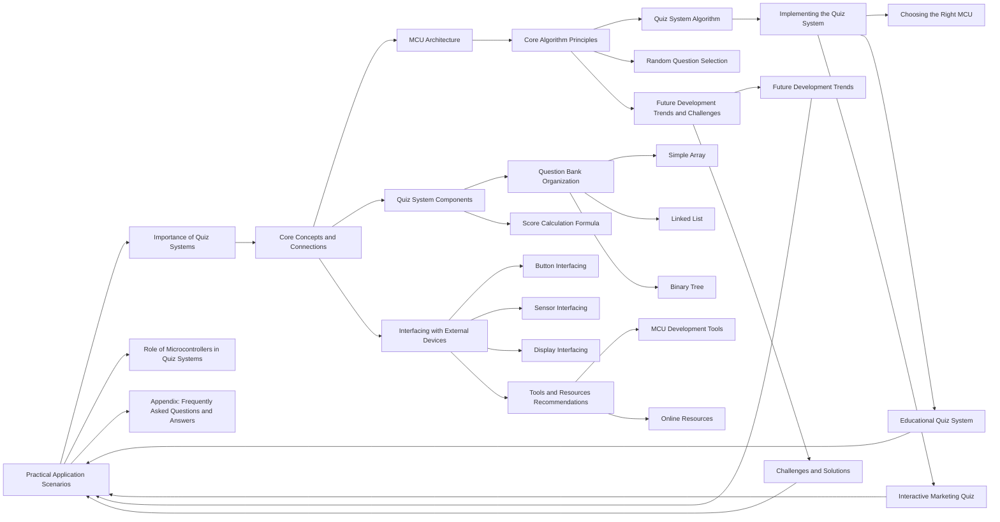

# Design and Implementation of a Quiz System Based on Microcontrollers

## 1. Background Introduction

In the rapidly evolving world of technology, the demand for efficient and innovative solutions is ever-increasing. One such solution lies in the development of a quiz system based on microcontrollers (MCUs). This system, when implemented correctly, can serve various purposes, from educational to entertainment, and even industrial applications. This article aims to provide a comprehensive guide on the design and implementation of a quiz system based on MCUs.

### 1.1 Importance of Quiz Systems

Quiz systems are essential in various fields, including education, marketing, and entertainment. They help assess knowledge, engage users, and provide a platform for interactive learning. In the context of MCUs, quiz systems can be used in IoT devices, embedded systems, and even standalone devices.

### 1.2 Role of Microcontrollers in Quiz Systems

Microcontrollers (MCUs) are small, low-cost, and versatile computer chips that integrate a processor, memory, and input/output (I/O) peripherals. They are ideal for developing quiz systems due to their low power consumption, small size, and ability to interface with various sensors and actuators.

## 2. Core Concepts and Connections

### 2.1 MCU Architecture

Understanding the architecture of an MCU is crucial for designing and implementing a quiz system. An MCU typically consists of a central processing unit (CPU), memory (RAM and ROM), input/output peripherals, and clock circuitry.

### 2.2 Quiz System Components

A quiz system based on MCUs consists of several components, including a user interface (UI), a question bank, a scoring system, and a communication module. The UI can be a simple LED display or a more complex LCD or TFT display. The question bank stores the questions and answers, while the scoring system calculates the scores based on the user's responses. The communication module allows the system to interact with other devices or networks.

### 2.3 Interfacing with External Devices

To create a more interactive and engaging quiz system, it is essential to interface with external devices such as buttons, sensors, and displays. This section will discuss the principles and steps for interfacing these devices with an MCU.

## 3. Core Algorithm Principles and Specific Operational Steps

### 3.1 Quiz System Algorithm

The quiz system algorithm can be broken down into several steps:

1. Initialize the system
2. Display the question
3. Wait for user input
4. Check the user's response
5. Calculate the score
6. Display the score
7. Move to the next question or end the quiz

### 3.2 Random Question Selection

To make the quiz more engaging, it is essential to select questions randomly from the question bank. This section will discuss the principles and steps for implementing random question selection in the quiz system.

## 4. Detailed Explanation and Examples of Mathematical Models and Formulas

### 4.1 Question Bank Organization

The question bank can be organized in various ways, such as a simple array or a more complex data structure like a linked list or a binary tree. This section will discuss the advantages and disadvantages of each organization method and provide examples.

### 4.2 Score Calculation Formula

The score calculation formula depends on the type of quiz (multiple choice, true/false, etc.) and the number of questions. This section will provide the general formula for score calculation and discuss specific formulas for different types of quizzes.

## 5. Project Practice: Code Examples and Detailed Explanations

### 5.1 Choosing the Right MCU

The choice of MCU depends on the requirements of the quiz system, such as the number of questions, the complexity of the UI, and the available resources. This section will discuss popular MCUs suitable for quiz system development and provide code examples for each.

### 5.2 Implementing the Quiz System

This section will provide a step-by-step guide on implementing the quiz system, including coding the UI, question bank, scoring system, and communication module.

## 6. Practical Application Scenarios

### 6.1 Educational Quiz System

An educational quiz system can be used in classrooms or online learning platforms. This section will discuss the design and implementation of an educational quiz system based on MCUs.

### 6.2 Interactive Marketing Quiz

An interactive marketing quiz can be used to engage customers and collect data for marketing purposes. This section will discuss the design and implementation of an interactive marketing quiz based on MCUs.

## 7. Tools and Resources Recommendations

### 7.1 MCU Development Tools

This section will recommend popular MCU development tools, such as Integrated Development Environments (IDEs) and debugging tools.

### 7.2 Online Resources

This section will recommend online resources for learning about MCUs, quiz system development, and related topics.

## 8. Summary: Future Development Trends and Challenges

### 8.1 Future Development Trends

This section will discuss the future development trends in quiz system based on MCUs, such as the integration of artificial intelligence and machine learning.

### 8.2 Challenges and Solutions

This section will discuss the challenges faced in developing quiz systems based on MCUs and provide potential solutions.

## 9. Appendix: Frequently Asked Questions and Answers

This section will provide answers to frequently asked questions about quiz system based on MCUs, such as \"What is the best MCU for quiz system development?\" and \"How can I make my quiz system more interactive?\"

## Conclusion

In conclusion, developing a quiz system based on MCUs is an exciting and rewarding project. With the right understanding of MCU architecture, quiz system components, and algorithm principles, you can create an engaging and effective quiz system. By following the steps and guidelines provided in this article, you will be well on your way to creating a successful quiz system based on MCUs.

## Author: Zen and the Art of Computer Programming

I hope you found this article informative and helpful. If you have any questions or comments, please feel free to reach out. Happy coding!

