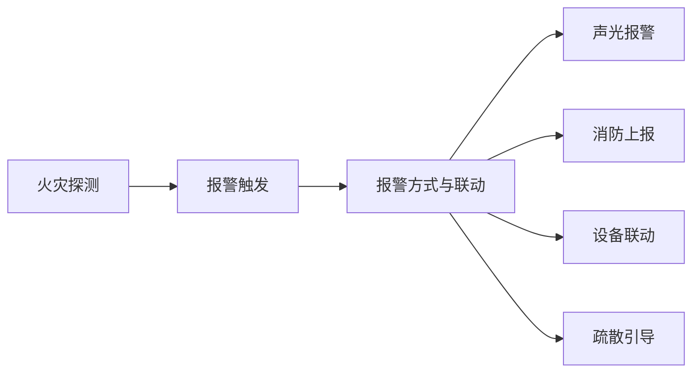

# 基于单片机的火灾自动报警系统设计

## 1. 背景介绍

火灾作为一种突发性灾害,对人们的生命财产安全构成了严重威胁。及时准确地检测火情,快速有效地扑救火灾,是减少火灾损失的关键。传统的人工巡查和手动报警方式存在反应迟缓、误报率高等问题,已经无法满足现代社会的消防安全需求。因此,开发一套高效可靠的自动火灾报警系统具有重要意义。

本文将详细介绍一种基于单片机的火灾自动报警系统的设计方案。该系统利用温度传感器、烟雾传感器实时监测环境参数,通过单片机进行智能判断和控制,一旦检测到火情就立即触发声光报警,并通过无线通信模块将警情信息上传至消防中心。系统具有反应迅速、虚警率低、可靠性高等优点,可广泛应用于各类建筑场所,为火灾预防和扑救提供有力保障。

### 1.1 火灾危害与防范的重要性

#### 1.1.1 火灾事故频发,危害巨大
#### 1.1.2 加强火灾预防刻不容缓
#### 1.1.3 自动报警是关键一环

### 1.2 传统火灾报警方式的局限性

#### 1.2.1 人工巡查效率低下
#### 1.2.2 手动报警存在误报漏报
#### 1.2.3 难以适应现代消防需求

### 1.3 自动火灾报警系统的优势

#### 1.3.1 实时监测,反应迅速 
#### 1.3.2 智能判断,虚警率低
#### 1.3.3 远程上报,联动控制

## 2. 核心概念与关联

本节将阐述火灾自动报警系统涉及的一些核心概念,以及它们之间的内在联系。

### 2.1 火灾探测

火灾探测是指利用各种传感器实时采集环境参数,及时发现火情的过程。常用的火灾探测手段有:

- 温度探测:利用温度传感器监测环境温度的异常升高。
- 烟雾探测:利用光电或电离式烟雾传感器检测空气中的烟雾浓度。 
- 红外探测:利用红外传感器捕捉火焰辐射的红外光谱。
- 可见光探测:利用可见光传感器识别火焰的闪烁频率。

不同探测方式各有优缺点,实际应用中往往采用多种传感器组合,以提高探测的准确性和可靠性。

### 2.2 报警触发机制

当传感器采集到的数据满足一定条件时,报警就会被触发。常见的报警触发机制包括:

- 阈值触发:当监测量超过预设的阈值时触发报警,如温度超过50℃。
- 突变触发:当监测量在短时间内急剧变化时触发报警,如温度骤升。
- 图像识别触发:通过对火焰图像进行特征提取和模式识别来触发报警。
- 多传感器融合触发:综合多个传感器的数据,根据一定的融合算法触发报警。

触发机制的选择需要权衡灵敏度和虚警率,避免漏报的同时尽量减少误报。

### 2.3 报警方式与联动

一旦触发报警,系统需要采取一系列措施,包括:

- 本地报警:通过声光报警器发出警示,提醒人员撤离。
- 远程上报:利用无线通信将警情上传至消防中心,便于调度救援。
- 设备联动:触发灭火设备(如喷淋)、切断电源、关闭空调等,控制火情蔓延。
- 疏散引导:通过应急广播、指示灯引导人员安全撤离。

报警方式的选择要考虑场所的特点,采取差异化的策略。报警联动则需要统筹兼顾,避免相互干扰。

### 2.4 概念之间的关联

火灾探测是基础,为后续的报警触发提供依据。报警触发则是枢纽,连接探测和响应。报警方式和联动是最终目的,将系统的智能转化为实际的灭火和疏散行动。它们环环相扣,缺一不可。

下图展示了火灾自动报警系统的核心概念之间的关联:



## 3. 核心算法原理与操作步骤

火灾自动报警系统的核心在于根据传感器数据进行火情判断和报警控制。本节将重点介绍几种常用的火情判断算法。

### 3.1 固定阈值法

固定阈值法是最简单的判断方法,当传感器检测值超过预设的固定阈值时,就认为发生了火情。以温度传感器为例:

```
if (温度 > 阈值) then (触发火警)
```

该方法实现简单,但容易产生误报或漏报。阈值设置过高,可能延误火情发现;阈值设置过低,又可能将正常波动判为火情。

### 3.2 突变量法 

为了克服固定阈值法的不足,突变量法引入了时间维度,关注传感器数据的动态变化。当数据在短时间内突然急剧变化,超过一定幅度时,即判定为火情。以温度传感器为例:

```
if (|温度(t) - 温度(t-1)| > 突变阈值) then (触发火警)
```

其中t为当前时刻,t-1为上一时刻。该方法对突发的火情反应迅速,但对缓慢发展的火情可能失效。

### 3.3 趋势分析法

趋势分析法进一步考虑了数据的变化趋势。它连续记录一段时间内的数据,提取变化的速率、加速度等高阶特征,再结合阈值进行判断。以温度传感器为例:

```
计算温度变化速率 v(t) = (温度(t) - 温度(t-1)) / Δt
计算温度变化加速度 a(t) = (v(t) - v(t-1)) / Δt 
if (v(t) > 速率阈值 and a(t) > 加速度阈值) then (触发火警)
```

趋势分析法能够根据数据的变化模式进行更加智能的判断,但算法也相对复杂。

### 3.4 多传感器融合法

在实际应用中,往往部署多种类型的传感器,如温度、烟雾、红外等。多传感器融合法就是要将这些异构数据进行综合分析,得出更加可靠的火情判断。常见的融合策略有:

- 逻辑与:所有传感器都达到阈值时才触发火警,减少误报但可能漏报。
- 逻辑或:任一传感器达到阈值即触发火警,减少漏报但可能误报。
- 加权融合:给不同传感器赋予权重,取加权平均值与阈值比较。
- 贝叶斯融合:利用贝叶斯理论计算在多传感器数据下火情发生的后验概率。

多传感器融合能够弥补单一传感器的不足,但融合方法的选择需要根据具体应用场合而定。

## 4. 数学模型与公式推导

为了对火灾自动报警系统进行定量设计和性能评估,需要建立相应的数学模型。本节将介绍两个常用模型:火灾发展模型和报警可靠性模型。

### 4.1 火灾发展模型

火灾发展模型描述了火灾环境参数(如温度)随时间的变化规律。一个简化的模型假设温度呈指数增长:

$$T(t) = T_0 e^{kt}$$

其中$T(t)$为t时刻的温度,$T_0$为初始温度,k为增长系数。这个模型可以用来估计不同阶段的温度变化,为探测阈值的设置提供依据。

举例而言,假设初始温度$T_0=20℃$,增长系数$k=0.05$,则1分钟后的温度为:

$$T(60) = 20e^{0.05×60} ≈ 40℃$$

可见温度在短时间内就有显著升高。因此探测阈值不宜设得过高,以免延误火情发现。

### 4.2 报警可靠性模型

报警可靠性模型用于评估系统误报和漏报的概率。最简单的模型是二项分布模型:

设系统的误报概率为$p_f$,漏报概率为$p_m$,则在n次独立事件中恰好发生k次误报的概率为:

$$P_f(X=k) = C_n^k p_f^k (1-p_f)^{n-k}$$

类似地,恰好发生k次漏报的概率为:

$$P_m(X=k) = C_n^k p_m^k (1-p_m)^{n-k}$$

利用这个模型,可以计算出一段时间内系统的整体可靠性。

例如,假设系统的误报率为5%,在一天内发生100次独立事件,则一天内不发生误报的概率为:

$$P_f(X=0) = C_{100}^0 0.05^0 0.95^{100} ≈ 0.006$$

可见,即使单次误报概率很低,累积起来也会有很高的误报风险,需要采取措施加以控制。

## 5. 项目实践:代码实例与说明

本节将给出基于单片机的火灾自动报警系统的核心代码实例,并进行详细解释说明。

### 5.1 温度采集与阈值判断

以下代码展示了利用DS18B20数字温度传感器采集温度,并与预设阈值进行比较,超过阈值则触发报警:

```c
#include <reg52.h>
#include <ds18b20.h>

sbit ALARM = P2^0;  // 报警器控制端口
#define TEMP_THRESHOLD 50  // 温度阈值

void main() {
  unsigned int temp;  // 温度值
  
  DS18B20_Init();  // 初始化温度传感器
  
  while(1) {
    temp = DS18B20_ReadTemp();  // 读取温度值
    
    if (temp > TEMP_THRESHOLD) {
      ALARM = 0;  // 触发报警
    } else {
      ALARM = 1;  // 关闭报警
    }
  }
}
```

代码首先定义了报警器的控制端口`ALARM`和温度阈值`TEMP_THRESHOLD`。然后在主循环中,通过`DS18B20_ReadTemp()`函数读取当前温度值,如果超过阈值就将`ALARM`置低电平触发报警,否则保持高电平关闭报警。

这个代码虽然简单,但实现了温度报警的基本功能。实际项目中,还需要考虑报警器的驱动电路、阈值的动态设置、数据的滤波平滑等问题。

### 5.2 多传感器数据融合

以下代码展示了如何将温度和烟雾两个传感器的数据进行加权融合,得到火情概率,并与阈值比较判断是否报警:

```c
#include <reg52.h>
#include <ds18b20.h>
#include <mq2.h>

#define TEMP_WEIGHT 0.6  // 温度权重
#define SMOKE_WEIGHT 0.4  // 烟雾权重
#define ALARM_THRESHOLD 0.8  // 报警阈值

float getTempProb(unsigned int temp) {
  // 根据温度计算火情概率,此处略
}

float getSmokeProb(unsigned int smoke) {
  // 根据烟雾浓度计算火情概率,此处略  
}

void main() {
  unsigned int temp, smoke;
  float tempProb, smokeProb, fireProb;
  
  DS18B20_Init();
  MQ2_Init();
  
  while(1) {
    temp = DS18B20_ReadTemp();
    smoke = MQ2_ReadSmoke();
    
    tempProb = getTempProb(temp);
    smokeProb = getSmokeProb(smoke);
    
    fireProb = tempProb * TEMP_WEIGHT + smokeProb * SMOKE_WEIGHT;
    
    if (fireProb > ALARM_THRESHOLD) {
      // 触发报警
    } else {
      // 关闭报警
    }
  }
}
```

代码定义了温度和烟雾的权重系数,以及报警阈值。`getTempProb`和`getSmoke