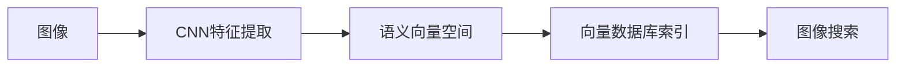
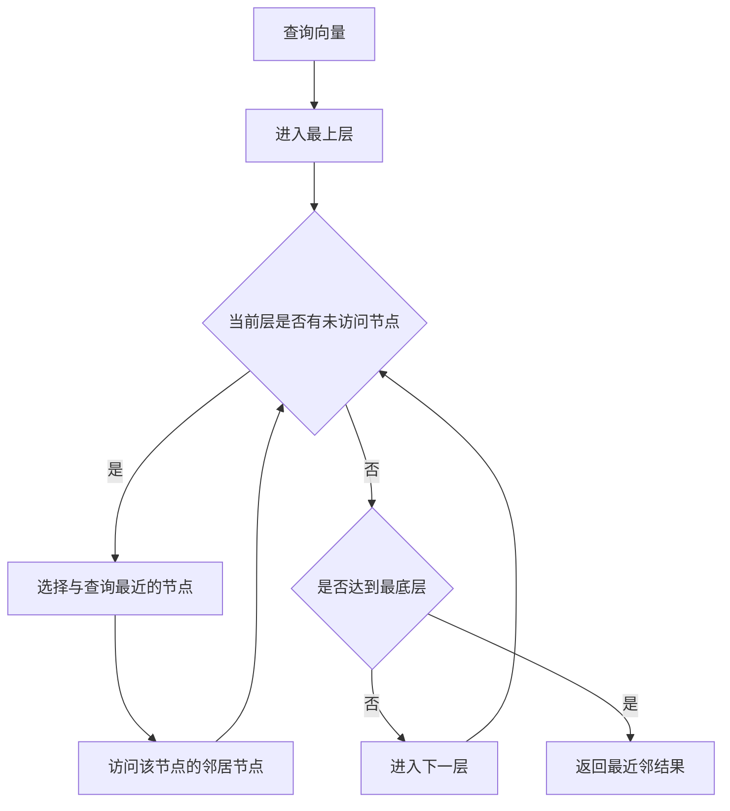

# 基于向量数据库的图像搜索技术进展

## 1. 背景介绍

### 1.1 图像搜索的重要性
在当今信息爆炸的时代,图像作为一种重要的信息载体,其数量呈指数级增长。如何高效地管理和检索海量图像数据,已成为学术界和工业界共同关注的热点问题。图像搜索技术的发展,对于提升用户获取图像信息的效率,改善人机交互体验,推动人工智能领域的进步都具有重要意义。

### 1.2 传统图像搜索的局限性
传统的图像搜索主要基于关键词匹配的方式,需要人工为图像添加标签或描述信息。这种方法存在以下局限性:

1. 人工标注工作量巨大,难以应对海量图像数据
2. 标签信息主观性强,容易产生语义鸿沟
3. 无法捕捉图像内容的细粒度语义信息
4. 缺乏对图像内容相似性的度量

### 1.3 基于向量数据库的图像搜索优势
近年来,随着深度学习技术的发展,特别是卷积神经网络(CNN)在计算机视觉领域取得的突破性进展,为图像搜索带来了新的契机。将图像映射到语义向量空间,利用向量数据库对其进行索引和检索,成为了图像搜索的新范式。相比传统方法,基于向量数据库的图像搜索具有以下优势:

1. 自动提取图像的深层语义特征,无需人工标注
2. 以图搜图,支持多模态检索
3. 可以度量图像内容的相似性,实现细粒度搜索
4. 检索效率高,适合海量图像数据的实时搜索

本文将围绕基于向量数据库的图像搜索技术展开深入探讨,介绍其核心概念、关键算法、数学模型、代码实践、应用场景等,并对其未来发展趋势和面临的挑战进行展望。

## 2. 核心概念与联系

### 2.1 图像特征提取
图像特征提取是图像搜索的基础,其目标是将图像映射到一个紧凑的特征向量,使得语义相似的图像在特征空间中距离较近。传统的手工设计特征如SIFT、SURF等,难以刻画图像的高层语义信息。深度学习方法,尤其是CNN,可以端到端地学习图像的层次化特征表示,大幅提升了特征的判别性和泛化能力。

### 2.2 语义向量空间
语义向量空间是指将图像映射到一个高维实数向量空间,每个维度代表了某种潜在的语义属性。在该空间中,可以用向量之间的距离(如欧氏距离、余弦相似度)来度量图像在语义上的相似程度。理想的语义向量空间应具备以下特性:

1. 同一语义概念的图像映射到相近的向量
2. 不同语义概念的图像映射到distant的向量
3. 向量空间的维度较低,便于索引和检索

### 2.3 向量数据库
向量数据库是一种专门用于存储和检索高维向量的数据库系统。与传统的关系型、文档型数据库不同,向量数据库在建立索引和查询时需要考虑向量空间的特性,采用适合高维数据的数据结构和算法。常见的向量数据库包括Faiss、Annoy、HNSW等,它们在向量检索的效率和可扩展性方面进行了优化。

### 2.4 相关性
图像特征提取、语义向量空间和向量数据库三者之间紧密相关,共同构成了基于向量数据库的图像搜索的核心要素:



高质量的图像特征是语义向量空间的基础,语义向量空间为向量数据库提供了合适的表示形式,高效的向量数据库则是实现图像搜索的关键。三者相辅相成,缺一不可。

## 3. 核心算法原理与操作步骤

### 3.1 基于CNN的图像特征提取

#### 3.1.1 卷积神经网络(CNN)原理
CNN是一种层次化的神经网络结构,通过局部连接和权值共享,可以高效地处理网格化数据如图像。典型的CNN由若干卷积层、池化层和全连接层组成:

1. 卷积层对图像进行卷积操作,提取局部特征
2. 池化层对特征图下采样,提高特征的鲁棒性和不变性
3. 全连接层对高层特征进行组合,生成最终的特征表示

#### 3.1.2 预训练CNN模型
在大规模图像数据集(如ImageNet)上预训练的CNN模型,可以作为通用的特征提取器,应用于下游任务。常用的预训练模型包括:

1. AlexNet
2. VGGNet
3. GoogLeNet
4. ResNet

这些模型在ImageNet分类任务上取得了出色的性能,其中间层输出可以作为图像的语义特征。

#### 3.1.3 特征提取步骤
利用预训练CNN模型提取图像特征的一般步骤如下:

1. 加载预训练的CNN模型
2. 移除模型的最后一层(分类层)
3. 将图像输入到修改后的CNN模型
4. 提取CNN的某一中间层(如倒数第二层)的输出作为图像特征
5. 对提取的特征进行L2归一化,得到单位特征向量

```python
import torch
import torchvision.models as models
import torchvision.transforms as transforms

# 加载预训练的ResNet-50模型
model = models.resnet50(pretrained=True) 

# 移除最后一层
model = torch.nn.Sequential(*(list(model.children())[:-1]))

# 图像预处理
transform = transforms.Compose([
    transforms.Resize(256),
    transforms.CenterCrop(224),
    transforms.ToTensor(),
    transforms.Normalize(mean=[0.485, 0.456, 0.406],
                         std=[0.229, 0.224, 0.225])
])

# 提取图像特征
def extract_feature(image):
    image = transform(image)
    image = image.unsqueeze(0)
    with torch.no_grad():
        feature = model(image)
    feature = feature.squeeze()
    feature = feature / torch.norm(feature)
    return feature
```

### 3.2 语义向量空间构建

#### 3.2.1 度量学习
度量学习的目标是学习一个映射函数,将图像映射到一个度量空间,使得相似图像的距离小于不相似图像的距离。常见的度量学习方法包括:

1. 对比损失(Contrastive Loss)
2. 三元组损失(Triplet Loss) 
3. N-pair损失(N-pair Loss)

这些损失函数通过构造正负样本对,优化特征空间的分布,使得同类样本聚集,异类样本分离。

#### 3.2.2 对比学习
对比学习是一种自监督学习范式,通过最大化同一图像不同增强视图之间的一致性,学习图像的语义表示。代表性的对比学习算法包括:

1. SimCLR
2. MoCo
3. BYOL

对比学习在ImageNet上取得了与监督学习相媲美的表现,学到的特征可以很好地迁移到下游任务。

#### 3.2.3 知识蒸馏
知识蒸馏利用教师模型(大模型)指导学生模型(小模型)学习,可以在保持模型精度的同时,大幅压缩模型的尺寸。将知识蒸馏应用于图像特征学习,可以得到更加紧凑的语义向量表示。

### 3.3 向量索引与检索

#### 3.3.1 向量索引
向量索引的目标是对高维向量进行组织和存储,支持快速的相似性查询。常用的向量索引方法包括:

1. 乘积量化(Product Quantization, PQ)
2. 树型索引(Tree-based Index)
   - KD-Tree
   - Ball Tree
3. 图索引(Graph-based Index)
   - HNSW
   - NSG

这些索引方法在查询效率和内存占用上进行了不同的权衡,适用于不同的应用场景。

#### 3.3.2 相似性查询
相似性查询是指给定一个查询向量,在向量数据库中找到与之最相似的K个向量。常见的相似性度量包括:

1. 欧氏距离(L2距离)
2. 内积(Dot Product)
3. 余弦相似度(Cosine Similarity)

通过建立向量索引,可以避免暴力搜索,大幅提高查询效率。以HNSW为例,其查询过程如下:



## 4. 数学模型与公式推导

### 4.1 CNN的数学表示
假设一个L层的CNN,每一层 $l$ 的输出特征图记为 $H^l$,卷积核参数记为 $W^l$,偏置记为 $b^l$,激活函数为 $\sigma$,则CNN的前向传播过程可以表示为:

$$H^l = \sigma(W^l * H^{l-1} + b^l)$$

其中 $*$ 表示卷积操作。将图像 $I$ 输入到CNN,可以得到其特征表示:

$$f(I) = H^L$$

### 4.2 度量学习的损失函数

#### 4.2.1 对比损失
给定一对图像 $(I_i, I_j)$,其特征表示为 $(f_i, f_j)$,二者的欧氏距离为 $d_{ij} = ||f_i - f_j||_2$。对比损失定义为:

$$L_{contrast} = \frac{1}{2N}\sum_{i=1}^N (y_{ij}d_{ij}^2 + (1-y_{ij})\max(0, m-d_{ij})^2)$$

其中 $y_{ij}$ 表示两图像是否属于同一类别,取值为0或1。$m$ 为距离边界,用于区分正负样本。

#### 4.2.2 三元组损失
给定一个三元组 $(I_a, I_p, I_n)$,其中 $I_a$ 为锚点图像,$I_p$ 为正样本,$I_n$ 为负样本。三元组损失定义为:

$$L_{triplet} = \frac{1}{N}\sum_{i=1}^N \max(0, d_{ap}^2 - d_{an}^2 + m)$$

其中 $d_{ap}$ 和 $d_{an}$ 分别为锚点图像与正负样本的距离,$m$ 为距离边界。

### 4.3 对比学习的一致性损失
以SimCLR为例,其损失函数定义为:

$$L_{SimCLR} = -\sum_{i=1}^N \log \frac{\exp(sim(f_i, f_{i'})/\tau)}{\sum_{k=1}^{2N} \mathbf{1}_{k \neq i} \exp(sim(f_i, f_k)/\tau)}$$

其中 $f_i$ 和 $f_{i'}$ 为同一图像的两个增强视图的特征,$sim(u,v) = u^Tv/||u||||v||$ 为余弦相似度,$\tau$ 为温度超参数。该损失函数最大化了同一图像不同视图之间的相似度,相对于其他图像的相似度。

### 4.4 知识蒸馏的软标签损失
设教师模型为 $T$,学生模型为 $S$,图像 $I$ 在两个模型上的预测输出分别为 $p_T$ 和 $p_S$,温度参数为 $\tau$,则软标签损失定义为:

$$L_{KD} = \tau^2 \cdot KL(\text{softmax}(p_T/\tau), \text{softmax}(p_S/\tau))$$

其中 $KL$ 为KL散度,用于度量两个概率分布之间的差异。通过最小化软标签损失,学生模型可以学习到教师模型的知识。

## 5. 项目实践

### 5.1 基于ResNet的图像特征提取

```python
import torch
import torchvision.models as models
import torchvision.transforms as transforms

# 加载预训练的ResNet-50模