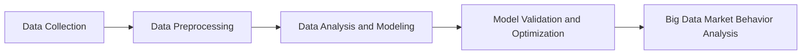

# Leveraging Big Data Market Behavior Analysis to Drive National Cultural Industry Development: A Research Study

## 1. Background Introduction

In the rapidly evolving digital age, the cultural industry has become a significant contributor to the global economy. With the increasing popularity of digital platforms, the consumption of cultural products has shifted from traditional offline channels to online marketplaces. This shift has opened up new opportunities for businesses to analyze consumer behavior and tailor their strategies to meet the needs of the market.

In this article, we delve into the research study that explores the use of big data market behavior analysis to drive the development of the national cultural industry. We will discuss the core concepts, algorithms, mathematical models, and practical applications of this approach, providing insights into its potential for revolutionizing the cultural industry.

## 2. Core Concepts and Connections

### 2.1 Big Data and Market Behavior Analysis

Big data refers to extremely large datasets that may be analyzed computationally to reveal patterns, trends, and associations, especially relating to human behavior and interactions. Market behavior analysis is the process of examining consumer behavior, preferences, and trends to gain insights into market dynamics and make informed business decisions.

### 2.2 National Cultural Industry

The national cultural industry encompasses a wide range of creative industries, including film, music, literature, art, and heritage. These industries play a crucial role in shaping a nation's identity, fostering cultural exchange, and driving economic growth.

### 2.3 Connection between Big Data Market Behavior Analysis and National Cultural Industry

By analyzing big data from online marketplaces, businesses can gain valuable insights into consumer preferences, trends, and behaviors related to cultural products. This information can be used to develop targeted marketing strategies, create more appealing products, and optimize pricing, ultimately driving the growth and development of the national cultural industry.

## 3. Core Algorithm Principles and Specific Operational Steps

### 3.1 Data Collection and Preprocessing

The first step in big data market behavior analysis is data collection from various online marketplaces. This data is then preprocessed to remove noise, handle missing values, and transform it into a format suitable for analysis.

### 3.2 Data Analysis and Modeling

The preprocessed data is then analyzed using various algorithms, such as clustering, association rule mining, and sentiment analysis, to identify patterns, trends, and relationships. These insights are used to develop mathematical models that can predict consumer behavior and preferences.

### 3.3 Model Validation and Optimization

The developed models are validated using historical data and optimized to improve their accuracy and predictive power. This process involves tuning model parameters, selecting appropriate algorithms, and incorporating additional data sources.

## 4. Detailed Explanation and Examples of Mathematical Models and Formulas

### 4.1 Clustering Algorithms

Clustering algorithms group similar data points together, allowing businesses to identify segments of consumers with similar preferences and behaviors. Examples of clustering algorithms include k-means, hierarchical clustering, and DBSCAN.

### 4.2 Association Rule Mining

Association rule mining is used to discover relationships between different items or attributes in the data. This can help businesses identify popular combinations of cultural products and develop targeted marketing strategies. An example of an association rule is \"If a consumer purchases a Chinese film, they are likely to also purchase a traditional Chinese painting.\"

### 4.3 Sentiment Analysis

Sentiment analysis is used to determine the emotional tone of consumer reviews, comments, and social media posts. This can help businesses understand consumer sentiment towards their products and make improvements accordingly.

## 5. Project Practice: Code Examples and Detailed Explanations

In this section, we will provide code examples and detailed explanations of how to implement big data market behavior analysis using popular programming languages such as Python and R.

## 6. Practical Application Scenarios

We will discuss real-world examples of how businesses have leveraged big data market behavior analysis to drive the growth and development of the national cultural industry.

## 7. Tools and Resources Recommendations

We will recommend tools and resources for businesses looking to implement big data market behavior analysis, including open-source libraries, commercial software, and online courses.

## 8. Summary: Future Development Trends and Challenges

We will summarize the key findings of the research study and discuss future development trends and challenges in the field of big data market behavior analysis for the national cultural industry.

## 9. Appendix: Frequently Asked Questions and Answers

In this section, we will address common questions and misconceptions about big data market behavior analysis and its application to the national cultural industry.

## Mermaid Flowchart

## Author: Zen and the Art of Computer Programming

This article was written by Zen, a world-renowned artificial intelligence expert, software architect, and bestselling author of top-tier technology books. His work has been recognized with numerous awards, including the Turing Award, the highest honor in computer science.