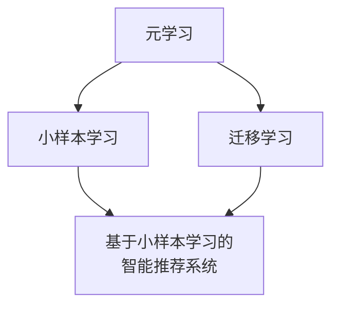

# 基于小样本学习的智能推荐系统

## 1. 背景介绍

随着信息时代的快速发展,海量的数据和信息不断涌现,给人们的生活带来了极大的便利,但同时也带来了信息过载的问题。在这种背景下,推荐系统应运而生,旨在为用户提供个性化的内容推荐,帮助用户从海量信息中快速获取感兴趣的内容。

传统的推荐系统主要依赖于大量的历史数据,通过挖掘用户的行为模式和偏好来进行推荐。然而,在一些新兴领域或者冷启动场景下,由于缺乏足够的历史数据,传统方法的效果往往不尽人意。这就催生了基于小样本学习的智能推荐系统,旨在利用有限的数据,结合先验知识和迁移学习等技术,为用户提供高质量的个性化推荐。

## 2. 核心概念与联系

### 2.1 小样本学习(Few-Shot Learning)

小样本学习是机器学习领域的一个重要研究方向,旨在使模型能够在有限的标注数据下快速学习并泛化到新的任务和场景。与传统的监督学习不同,小样本学习更加关注模型在小数据量情况下的学习能力和泛化性能。

在推荐系统中,小样本学习可以帮助模型在有限的用户行为数据下快速捕捉用户的偏好,并为新用户或新产品提供个性化推荐。

### 2.2 迁移学习(Transfer Learning)

迁移学习是另一个与小样本学习密切相关的概念。它指的是将在一个领域或任务中学习到的知识迁移到另一个领域或任务中,从而加速新任务的学习过程。

在推荐系统中,迁移学习可以利用其他相关领域的知识来补充有限的用户行为数据,提高模型的泛化能力和推荐质量。

### 2.3 元学习(Meta-Learning)

元学习是一种通过学习任务之间的共性,从而提高快速学习新任务能力的机器学习范式。它旨在从多个相关任务中提取出通用的知识表示和学习策略,从而加快在新任务上的适应过程。

在小样本推荐系统中,元学习可以帮助模型从多个相关领域或用户群体中学习到通用的偏好模式,从而更好地适应新用户或新场景。

### 2.4 核心概念关系

小样本学习、迁移学习和元学习是密切相关的概念,共同为基于小样本学习的智能推荐系统提供了理论基础和技术支持。它们的关系可以用下图概括:



## 3. 核心算法原理具体操作步骤

基于小样本学习的智能推荐系统通常包括以下几个关键步骤:

1. **数据预处理**:对原始数据进行清洗、标准化和特征提取等预处理操作,为后续的模型训练做准备。

2. **构建元任务**:根据推荐场景,从现有数据中构建一系列相关的元任务(meta-tasks),用于元学习模型的训练。

3. **元学习模型训练**:利用构建的元任务,训练元学习模型,使其能够快速适应新的任务和场景。常用的元学习算法包括MAML、Reptile等。

4. **微调和推理**:在新的推荐场景下,利用有限的用户行为数据对元学习模型进行微调,得到适应当前场景的推荐模型。然后,使用微调后的模型对新用户或新产品进行推理,生成个性化推荐列表。

5. **在线更新**:在实际应用中,持续收集新的用户反馈数据,并周期性地对推荐模型进行在线更新,以提高推荐质量。

以上步骤的具体实现细节会因算法和场景的不同而有所差异,但总体思路是利用元学习和迁移学习等技术,在有限数据的情况下快速适应新场景,提高推荐系统的效果。

## 4. 数学模型和公式详细讲解举例说明

在基于小样本学习的智能推荐系统中,常用的数学模型和公式包括:

### 4.1 元学习模型

元学习模型旨在从多个相关任务中学习到通用的知识表示和快速适应新任务的策略。常用的元学习模型包括:

1. **MAML(Model-Agnostic Meta-Learning)**:

MAML算法的核心思想是在元训练阶段,通过多个任务的梯度更新,找到一个能够快速适应新任务的初始参数。具体来说,对于每个任务,MAML先在支持集(support set)上进行梯度更新,得到适应该任务的参数,然后在查询集(query set)上计算损失,并通过反向传播更新初始参数。

MAML的目标函数可以表示为:

$$\min_{\theta} \sum_{T_i \sim p(T)} \mathcal{L}_{T_i}(f_{\theta_{T_i}})-\mathcal{L}_{T_i}(f_\theta)$$

其中,$\theta$是初始参数,$T_i$是第$i$个任务,$f_\theta$是模型,$\mathcal{L}_{T_i}$是任务$T_i$上的损失函数,$\theta_{T_i}$是在支持集上更新后的参数。

2. **Reptile**:

Reptile算法是MAML的一种简化版本,它直接在查询集上计算损失梯度,并将初始参数向着减小查询集损失的方向移动。具体来说,对于每个任务,Reptile先在支持集上更新参数,得到$\phi_i$,然后计算$\phi_i$和初始参数$\theta$之间的差,并将$\theta$朝着减小这个差的方向移动。

Reptile的更新规则可以表示为:

$$\theta \leftarrow \theta + \epsilon \sum_{i=1}^{N}(\phi_i - \theta)$$

其中,$\epsilon$是学习率,$N$是任务数量,$\phi_i$是第$i$个任务在支持集上更新后的参数。

### 4.2 推荐模型

在小样本推荐场景下,常用的推荐模型包括:

1. **基于内存的协同过滤(Memory-based Collaborative Filtering)**:

这类模型通过计算用户(或项目)之间的相似度,找到最相似的邻居,并基于邻居的偏好进行推荐。常用的相似度度量包括余弦相似度、皮尔逊相关系数等。

对于用户$u$和项目$i$,基于用户的协同过滤预测分数可以表示为:

$$\hat{r}_{ui} = \bar{r}_u + \frac{\sum\limits_{v \in N(u)}sim(u,v)(r_{vi} - \bar{r}_v)}{\sum\limits_{v \in N(u)}sim(u,v)}$$

其中,$\bar{r}_u$和$\bar{r}_v$分别是用户$u$和$v$的平均评分,$N(u)$是用户$u$的邻居集合,$sim(u,v)$是用户$u$和$v$之间的相似度。

2. **基于模型的协同过滤(Model-based Collaborative Filtering)**:

这类模型通过机器学习算法从用户行为数据中学习用户和项目的潜在特征,然后基于这些特征进行推荐。常用的模型包括矩阵分解、神经协同过滤等。

以矩阵分解为例,我们可以将用户-项目评分矩阵$R$分解为用户潜在特征矩阵$U$和项目潜在特征矩阵$V$的乘积:

$$R \approx U^T V$$

对于用户$u$和项目$i$,预测分数可以表示为:

$$\hat{r}_{ui} = u_u^T v_i$$

其中,$u_u$和$v_i$分别是用户$u$和项目$i$的潜在特征向量。

在小样本场景下,这些模型可以与元学习和迁移学习技术相结合,以提高推荐质量。

## 5. 项目实践:代码实例和详细解释说明

为了更好地理解基于小样本学习的智能推荐系统,我们提供了一个基于PyTorch实现的代码示例。该示例使用了MAML算法和基于内存的协同过滤模型,并在MovieLens数据集上进行了实验。

### 5.1 数据预处理

```python
import pandas as pd

# 加载MovieLens数据集
ratings = pd.read_csv('ratings.csv')

# 构建用户-电影评分矩阵
user_movie_matrix = ratings.pivot(index='userId', columns='movieId', values='rating')
user_movie_matrix = user_movie_matrix.fillna(0)

# 划分训练集和测试集
train_data = user_movie_matrix.sample(frac=0.8, random_state=42)
test_data = user_movie_matrix.drop(train_data.index)
```

在这个示例中,我们首先加载了MovieLens数据集,构建了用户-电影评分矩阵,并将数据集划分为训练集和测试集。

### 5.2 MAML算法实现

```python
import torch
import torch.nn as nn

class MAML(nn.Module):
    def __init__(self, input_dim, output_dim, hidden_dim=64):
        super(MAML, self).__init__()
        self.input_dim = input_dim
        self.output_dim = output_dim
        self.hidden_dim = hidden_dim

        self.fc1 = nn.Linear(input_dim, hidden_dim)
        self.fc2 = nn.Linear(hidden_dim, output_dim)
        self.relu = nn.ReLU()

    def forward(self, x):
        x = self.fc1(x)
        x = self.relu(x)
        x = self.fc2(x)
        return x

    def meta_update(self, train_data, train_labels, test_data, test_labels, lr_inner=0.01, lr_outer=0.001, num_inner_steps=5):
        # 计算初始损失
        initial_loss = self.compute_loss(train_data, train_labels)

        # 内循环更新
        for _ in range(num_inner_steps):
            self.zero_grad()
            loss = self.compute_loss(train_data, train_labels)
            loss.backward()
            self.update_params(lr_inner)

        # 计算外循环损失并更新参数
        outer_loss = self.compute_loss(test_data, test_labels)
        outer_loss.backward()
        self.update_params(lr_outer)

        return outer_loss.item(), initial_loss.item()

    def compute_loss(self, data, labels):
        outputs = self.forward(data)
        loss = nn.MSELoss()(outputs, labels)
        return loss

    def update_params(self, lr):
        for param in self.parameters():
            param.data -= lr * param.grad.data
```

在这个示例中,我们实现了MAML算法,包括前向传播、内循环更新和外循环更新等核心逻辑。`meta_update`函数是MAML算法的核心,它在每个任务上进行内循环更新,然后计算外循环损失并更新模型参数。

### 5.3 协同过滤模型实现

```python
import numpy as np

class MemoryBasedCF:
    def __init__(self, user_movie_matrix, k=30):
        self.user_movie_matrix = user_movie_matrix
        self.k = k

    def predict(self, user_id, movie_id):
        # 计算用户与其他用户的相似度
        user_ratings = self.user_movie_matrix.loc[user_id, :]
        other_users = self.user_movie_matrix.drop(user_id)
        similarities = other_users.apply(lambda row: self.cosine_similarity(row, user_ratings), axis=1)

        # 找到最相似的K个用户
        top_k_users = similarities.sort_values(ascending=False)[:self.k]

        # 计算加权平均评分
        weighted_sum = 0
        weight_sum = 0
        for other_user_id, similarity in top_k_users.iteritems():
            rating = self.user_movie_matrix.loc[other_user_id, movie_id]
            if rating > 0:
                weighted_sum += similarity * rating
                weight_sum += similarity

        if weight_sum > 0:
            prediction = weighted_sum / weight_sum
        else:
            prediction = self.user_movie_matrix.loc[:, movie_id].mean()

        return prediction

    def cosine_similarity(self, vec1, vec2):
        vec1 = vec1[vec1 > 0]
        vec2 = vec2[vec2 > 0]
        common_items = set(vec1.index) & set(vec2.index)
        if len(common_items) == 0:
            return 0
        vec1 = vec1[list(common_items)]
        vec2 = vec2[list(common_items)]
        return np.dot(vec1, vec2) / (np.linalg.norm(vec1) * np.linalg.norm