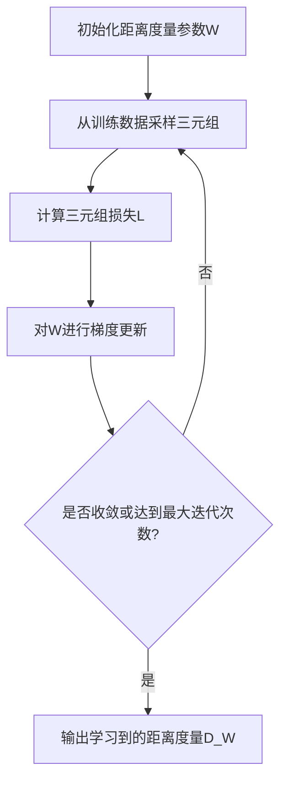

# 基于度量学习方法的代码实例：Python实现与详细解读

## 1. 背景介绍

### 1.1 度量学习概述

在机器学习和模式识别领域中,度量学习(Metric Learning)是一种重要的技术,旨在学习一个合适的相似性度量,使得在该度量空间中,同类样本的距离相对较近,异类样本的距离相对较远。传统的机器学习算法通常使用预定义的距离度量(如欧几里得距离)来衡量样本之间的相似性,但这种度量未必适用于所有的数据分布和任务。度量学习则能够根据数据的特征自动学习一个判别性更强的相似性度量,从而提高后续的分类、聚类等任务的性能。

### 1.2 度量学习的应用

度量学习技术在计算机视觉、自然语言处理、信息检索等多个领域都有广泛的应用。例如在人脸识别任务中,我们希望同一个人在不同的图像中具有较小的距离,而不同人则具有较大的距离;在文本分类任务中,我们希望语义相近的文本具有较小的距离。通过学习合适的距离度量,可以提高这些任务的准确性。

## 2. 核心概念与联系

### 2.1 相似性度量

相似性度量(Similarity Metric)是衡量两个样本之间接近程度的一种函数,通常记为$d(x_i, x_j)$,其中$x_i$和$x_j$分别表示两个样本。常用的相似性度量包括欧几里得距离、余弦相似度等。

在度量学习中,我们希望学习一个判别性更强的距离度量函数$D_W(x_i, x_j)$,使得同类样本的距离较小,异类样本的距离较大。这个距离度量函数通常由一个参数矩阵$W$参数化,因此度量学习的目标就是学习这个参数矩阵$W$。

### 2.2 Mahalanobis距离

Mahalanobis距离是度量学习中常用的一种距离度量,定义如下:

$$D_W(x_i, x_j) = \sqrt{(x_i - x_j)^T W (x_i - x_j)}$$

其中$W$是一个半正定矩阵,用于改变原始特征空间的度量。当$W=I$(单位矩阵)时,Mahalanobis距离就等同于标准的欧几里得距离。通过学习合适的$W$矩阵,我们可以获得一个判别性更强的距离度量。

### 2.3 核心思想

度量学习的核心思想是:通过最小化同类样本对之间的距离,最大化异类样本对之间的距离,从而学习到一个判别性更强的距离度量函数。这个过程可以通过构建合适的目标函数(损失函数)并使用优化算法(如梯度下降)来实现。

## 3. 核心算法原理具体操作步骤 

### 3.1 基于对比损失的度量学习

一种常见的度量学习方法是基于对比损失(Contrastive Loss)的方法。对比损失的思想是:对于一对同类样本,我们希望它们的距离足够小;对于一对异类样本,我们希望它们的距离足够大。具体来说,对比损失可以定义为:

$$L = \sum_{i,j} y_{ij} D_W(x_i, x_j)^2 + (1-y_{ij})\max(0, m - D_W(x_i, x_j))^2$$

其中$y_{ij}$是一个标记,表示$x_i$和$x_j$是否属于同一类($y_{ij}=1$表示同类,$y_{ij}=0$表示异类),$m$是一个超参数,控制异类样本对之间的最小距离。

对比损失的优化过程是:对于同类样本对,我们希望最小化$D_W(x_i, x_j)^2$;对于异类样本对,我们希望最大化$D_W(x_i, x_j)$,使其大于$m$。通过最小化总的损失函数$L$,我们可以学习到一个判别性更强的距离度量$D_W$。

算法步骤如下:

1. 初始化距离度量参数$W$
2. 对训练数据中的样本对进行采样,构建小批量数据
3. 计算小批量数据上的对比损失$L$
4. 对$W$进行梯度更新,最小化损失$L$
5. 重复步骤2-4,直到收敛或达到最大迭代次数

### 3.2 基于三元组损失的度量学习

另一种常见的度量学习方法是基于三元组损失(Triplet Loss)。三元组损失的思想是:对于一个锚点样本$x_a$,我们希望它与同类样本$x_p$的距离足够小,而与异类样本$x_n$的距离足够大。具体来说,三元组损失可以定义为:

$$L = \sum_{\text{triplets}} \max(0, D_W(x_a, x_p) - D_W(x_a, x_n) + m)$$

其中$m$是一个超参数,控制同类样本对与异类样本对之间的最小距离差。

三元组损失的优化过程是:对于每个三元组$(x_a, x_p, x_n)$,我们希望最小化$D_W(x_a, x_p)$,最大化$D_W(x_a, x_n)$,使得$D_W(x_a, x_p) + m < D_W(x_a, x_n)$。通过最小化总的损失函数$L$,我们可以学习到一个判别性更强的距离度量$D_W$。

算法步骤如下:

1. 初始化距离度量参数$W$
2. 从训练数据中采样三元组$(x_a, x_p, x_n)$,构建小批量数据
3. 计算小批量数据上的三元组损失$L$
4. 对$W$进行梯度更新,最小化损失$L$
5. 重复步骤2-4,直到收敛或达到最大迭代次数

### 3.3 算法流程图

以下是基于三元组损失的度量学习算法的流程图:

## 4. 数学模型和公式详细讲解举例说明

在这一节,我们将详细讲解度量学习中的数学模型和公式,并给出具体的例子说明。

### 4.1 Mahalanobis距离

回顾一下Mahalanobis距离的定义:

$$D_W(x_i, x_j) = \sqrt{(x_i - x_j)^T W (x_i - x_j)}$$

其中$W$是一个半正定矩阵,用于改变原始特征空间的度量。当$W=I$(单位矩阵)时,Mahalanobis距离就等同于标准的欧几里得距离。

让我们来看一个具体的例子。假设我们有两个二维样本$x_1 = (1, 2)$和$x_2 = (3, 4)$,我们希望计算它们之间的Mahalanobis距离。

**情况1: $W = \begin{bmatrix} 1 & 0 \\ 0 & 1 \end{bmatrix}$**

在这种情况下,Mahalanobis距离等同于标准的欧几里得距离:

$$\begin{aligned}
D_W(x_1, x_2) &= \sqrt{(x_1 - x_2)^T W (x_1 - x_2)} \\
&= \sqrt{((1, 2) - (3, 4))^T \begin{bmatrix} 1 & 0 \\ 0 & 1 \end{bmatrix} ((1, 2) - (3, 4))} \\
&= \sqrt{(-2)^2 + (-2)^2} \\
&= \sqrt{8} \\
&= 2.83
\end{aligned}$$

**情况2: $W = \begin{bmatrix} 2 & 0 \\ 0 & 1 \end{bmatrix}$**

在这种情况下,Mahalanobis距离对第一个维度的差异赋予了更大的权重:

$$\begin{aligned}
D_W(x_1, x_2) &= \sqrt{(x_1 - x_2)^T W (x_1 - x_2)} \\
&= \sqrt{((1, 2) - (3, 4))^T \begin{bmatrix} 2 & 0 \\ 0 & 1 \end{bmatrix} ((1, 2) - (3, 4))} \\
&= \sqrt{2 \cdot (-2)^2 + (-2)^2} \\
&= \sqrt{12} \\
&= 3.46
\end{aligned}$$

我们可以看到,通过改变$W$矩阵,我们可以调整不同特征维度对距离的贡献权重,从而获得一个更合适的距离度量。

### 4.2 对比损失

对比损失的定义如下:

$$L = \sum_{i,j} y_{ij} D_W(x_i, x_j)^2 + (1-y_{ij})\max(0, m - D_W(x_i, x_j))^2$$

其中$y_{ij}$是一个标记,表示$x_i$和$x_j$是否属于同一类($y_{ij}=1$表示同类,$y_{ij}=0$表示异类),$m$是一个超参数,控制异类样本对之间的最小距离。

让我们来看一个具体的例子。假设我们有三个样本$x_1, x_2, x_3$,其中$x_1$和$x_2$属于同一类,而$x_3$属于另一类。我们希望计算对比损失。

假设$D_W(x_1, x_2) = 0.5, D_W(x_1, x_3) = 2.0, D_W(x_2, x_3) = 2.5$,并且我们设置$m=1$。

对于同类样本对$(x_1, x_2)$,我们有:

$$y_{12} D_W(x_1, x_2)^2 = 1 \cdot 0.5^2 = 0.25$$

对于异类样本对$(x_1, x_3)$和$(x_2, x_3)$,我们有:

$$\begin{aligned}
(1-y_{13})\max(0, m - D_W(x_1, x_3))^2 &= (1-0)\max(0, 1 - 2.0)^2 = 0 \\
(1-y_{23})\max(0, m - D_W(x_2, x_3))^2 &= (1-0)\max(0, 1 - 2.5)^2 = 0
\end{aligned}$$

因此,总的对比损失为:

$$L = 0.25 + 0 + 0 = 0.25$$

我们可以看到,对比损失会惩罚同类样本对之间的较大距离,并鼓励异类样本对之间的较小距离(小于$m$)。通过最小化这个损失函数,我们可以学习到一个判别性更强的距离度量。

### 4.3 三元组损失

三元组损失的定义如下:

$$L = \sum_{\text{triplets}} \max(0, D_W(x_a, x_p) - D_W(x_a, x_n) + m)$$

其中$m$是一个超参数,控制同类样本对与异类样本对之间的最小距离差。

让我们来看一个具体的例子。假设我们有三个样本$x_a, x_p, x_n$,其中$x_a$和$x_p$属于同一类,而$x_n$属于另一类。我们希望计算三元组损失。

假设$D_W(x_a, x_p) = 0.3, D_W(x_a, x_n) = 1.5$,并且我们设置$m=1$。

对于这个三元组$(x_a, x_p, x_n)$,我们有:

$$\max(0, D_W(x_a, x_p) - D_W(x_a, x_n) + m) = \max(0, 0.3 - 1.5 + 1) = 0$$

因为$D_W(x_a, x_p) - D_W(x_a, x_n) + m < 0$,所以三元组损失为0。

但是,如果$D_W(x_a, x_p) = 1.0, D_W(x_a, x_n) = 0.5$,那么三元组损失就会变成:

$$\max(0, D_W(x_a, x_p) - D_W(x_a, x_n) + m) = \max(0, 1.0 - 0.5 + 1) = 1.5$$