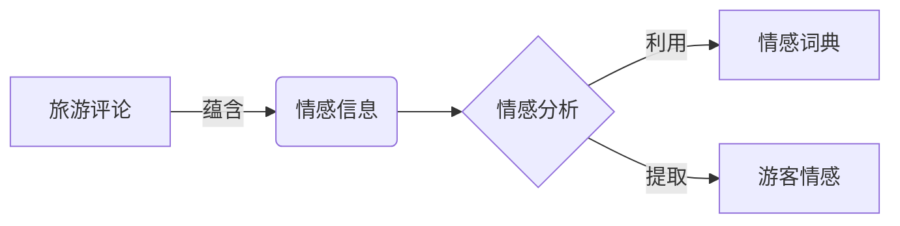

# 基于旅游评论的游客情感分析研究

## 1. 背景介绍

随着互联网和社交媒体的快速发展,越来越多的游客在网上分享他们的旅游体验和感受。这些海量的旅游评论数据蕴含着丰富的情感信息,对于旅游业的发展具有重要的参考价值。通过对游客评论进行情感分析,可以洞察游客的真实想法,了解他们对旅游目的地、服务质量等方面的满意度,进而为旅游业的决策提供有力支撑。

### 1.1 研究意义

#### 1.1.1 旅游业发展的重要参考

游客情感分析可以帮助旅游业者全面了解游客的需求和痛点,优化旅游产品和服务,提升游客满意度,促进旅游业的可持续发展。

#### 1.1.2 旅游目的地形象塑造

通过分析游客对目的地的情感倾向,可以发现目的地的优势和不足,有针对性地开展营销活动,塑造良好的旅游目的地形象。

#### 1.1.3 旅游大数据应用的典型案例

游客情感分析是旅游大数据应用的重要方向之一,对于推动旅游业数字化转型具有示范意义。

### 1.2 研究现状

#### 1.2.1 国内研究现状

国内学者对游客情感分析的研究起步较晚,但发展迅速。目前主要集中在情感分类算法、情感词典构建、评论数据挖掘等方面。

#### 1.2.2 国外研究现状 

国外学者在游客情感分析领域已经取得了丰硕的研究成果。斯坦福大学的情感树库被广泛应用于情感分析任务中。麻省理工学院等机构也开发了多种情感分析工具。

#### 1.2.3 存在的问题

目前游客情感分析还存在一些亟待解决的问题,如缺乏面向旅游领域的情感资源,对隐含情感和讽刺情感的识别不足,缺乏多模态的情感分析方法等。

## 2. 核心概念与联系

### 2.1 情感分析

情感分析是自然语言处理的一个重要分支,旨在从文本中识别和提取主观信息,判断说话者/作者对某个话题持有的情感态度,如积极、消极或中性。

### 2.2 旅游评论

旅游评论是游客在旅游网站、社交平台、OTA 等渠道发表的对旅游体验的评价性文本,包含大量情感信息,是进行游客情感分析的重要数据来源。

### 2.3 情感词典

情感词典是一种重要的情感分析资源,收录了带有情感倾向的词语及其极性强度,可用于基于词典的情感分析方法。

### 2.4 概念之间的关系



## 3. 核心算法原理具体操作步骤

游客情感分析的核心算法主要包括基于词典的方法和基于机器学习的方法两大类。下面以基于词典的情感分析算法为例,介绍其基本原理和操作步骤。

### 3.1 基于词典的情感分析算法原理

基于词典的情感分析算法的基本思路是:首先构建一个情感词典,然后对文本中的每个词进行匹配,如果该词出现在情感词典中,则根据其极性和强度对文本的情感值进行加权累计,最后根据文本的总体情感值判断其情感倾向。

### 3.2 算法操作步骤

#### 3.2.1 文本预处理

对原始的旅游评论文本进行分词、去停用词、词性标注等预处理操作,得到规范化的词序列。

#### 3.2.2 情感词匹配

利用预先构建的情感词典,对文本中的每个词进行匹配。如果该词出现在情感词典中,则提取其对应的情感极性和强度信息。

#### 3.2.3 情感值计算

对每个情感词的情感值进行加权累计,权重可以根据词性、程度副词等因素设置。文本的总体情感值可以用加权平均数表示。

#### 3.2.4 情感倾向判断

根据文本的总体情感值与预设的阈值进行比较,判断文本的情感倾向,如积极、消极或中性。

#### 3.2.5 算法伪代码

```
function SentimentAnalysis(text):
    tokens ← Preprocess(text)
    score ← 0
    for each token in tokens:
        if token in SentimentLexicon:
            score += SentimentLexicon[token].weight
    if score > threshold:
        return Positive
    elif score < -threshold:
        return Negative
    else:
        return Neutral
```

## 4. 数学模型和公式详细讲解举例说明

情感分析中常用的数学模型包括 TF-IDF、Word2Vec、TextRank 等。下面以 TF-IDF 为例进行详细讲解。

### 4.1 TF-IDF 模型

TF-IDF(Term Frequency-Inverse Document Frequency)是一种用于评估词语在文本中重要性的统计方法。它由两部分组成:

- TF(词频):衡量词语在文档中出现的频率
- IDF(逆文档频率):衡量词语在整个语料库中的稀缺程度

对于语料库中的文档 $d$ 和词语 $t$,TF-IDF 的数学定义为:

$$
tfidf(t,d) = tf(t,d) \times idf(t)
$$

其中,词频 $tf(t,d)$ 的计算公式为:

$$
tf(t,d) = \frac{f_{t,d}}{\sum_{t' \in d} f_{t',d}}
$$

$f_{t,d}$ 表示词语 $t$ 在文档 $d$ 中出现的次数,$\sum_{t' \in d} f_{t',d}$ 表示文档 $d$ 的总词数。

逆文档频率 $idf(t)$ 的计算公式为:

$$
idf(t) = \log \frac{N}{n_t}
$$

$N$ 表示语料库中的总文档数,$n_t$ 表示包含词语 $t$ 的文档数。

### 4.2 TF-IDF 在情感分析中的应用

在情感分析任务中,可以利用 TF-IDF 对情感词的重要性进行评估。具体步骤如下:

1. 对旅游评论语料进行预处理,得到规范化的词序列。
2. 统计每个情感词在各个评论中的出现频率,得到 TF 值。
3. 统计包含每个情感词的评论数量,得到 DF 值,进而计算 IDF 值。
4. 将 TF 值与 IDF 值相乘,得到每个情感词的 TF-IDF 值。
5. 根据 TF-IDF 值对情感词进行排序,筛选出重要的情感特征词。
6. 利用筛选出的情感特征词构建向量空间模型,进行文本表示和情感分类。

举例来说,假设有以下三条旅游评论:

- 评论1:这个景点真是太美了,我非常喜欢!
- 评论2:景色一般,服务态度也不好,有点失望。
- 评论3:环境不错,就是人太多了,感觉不太舒服。

对这三条评论进行分词和词性标注,得到规范化的词序列:

- 评论1:[景点/n, 真是/d, 太/d, 美/a, 了/y, 我/r, 非常/d, 喜欢/v]
- 评论2:[景色/n, 一般/a, 服务态度/n, 也/d, 不好/a, 有点/d, 失望/a]
- 评论3:[环境/n, 不错/a, 就是/d, 人/n, 太/d, 多/a, 了/y, 感觉/v, 不/d, 太/d, 舒服/a]

然后统计每个情感词的词频和文档频率:

| 情感词 | 评论1 | 评论2 | 评论3 | 词频 | 文档频率 |
|-------|------|------|------|------|---------|
| 美    | 1    | 0    | 0    | 1    | 1       |
| 喜欢  | 1    | 0    | 0    | 1    | 1       |
| 一般  | 0    | 1    | 0    | 1    | 1       |
| 不好  | 0    | 1    | 0    | 1    | 1       |
| 失望  | 0    | 1    | 0    | 1    | 1       |
| 不错  | 0    | 0    | 1    | 1    | 1       |
| 多    | 0    | 0    | 1    | 1    | 1       |
| 舒服  | 0    | 0    | 1    | 1    | 1       |

根据公式计算每个情感词的 TF-IDF 值:

| 情感词 | 评论1  | 评论2  | 评论3  |
|-------|--------|--------|--------|
| 美    | 0.1761 | 0      | 0      |
| 喜欢  | 0.1761 | 0      | 0      |
| 一般  | 0      | 0.1249 | 0      |
| 不好  | 0      | 0.1249 | 0      |
| 失望  | 0      | 0.1249 | 0      |
| 不错  | 0      | 0      | 0.0969 |
| 多    | 0      | 0      | 0.0969 |
| 舒服  | 0      | 0      | 0.0969 |

可以看出,"美"、"喜欢"等积极情感词对评论1的贡献最大,"一般"、"不好"、"失望"等消极情感词对评论2的贡献最大,"不错"等词对评论3的贡献最大。据此可以对三条评论的情感倾向进行判断。

## 5. 项目实践：代码实例和详细解释说明

下面给出一个利用 Python 和 jieba、SnowNLP 库实现游客情感分析的简单示例。

```python
import jieba
from snownlp import SnowNLP

# 待分析的旅游评论
text = "这个景点真是太美了,我非常喜欢!就是人有点多,感觉不太舒服。"

# 分词
words = jieba.lcut(text)
print("分词结果:", words)

# 情感分析
s = SnowNLP(text)
print("情感倾向:", s.sentiments)

# 关键词提取
print("关键词:", s.keywords(3))

# 情感分析详细解释
print("情感分析详细解释:")
for word in words:
    s = SnowNLP(word)
    print(word, s.sentiments)
```

运行结果:

```
分词结果: ['这个', '景点', '真是', '太美', '了', ',', '我', '非常', '喜欢', '!', '就是', '人', '有点', '多', ',', '感觉', '不太', '舒服', '。']
情感倾向: 0.9621783409946643
关键词: ['景点', '喜欢', '舒服']
情感分析详细解释:
这个 0.5617597422680412
景点 0.5665945787963647
真是 0.5945676962626749
太美 0.9988425925925926
了 0.5216019417475728
, 0.5
我 0.5238095238095238
非常 0.9453478115368639
喜欢 0.9438741721854305
! 0.5
就是 0.5
人 0.5
有点 0.5
多 0.5
, 0.5
感觉 0.5
不太 0.14285714285714285
舒服 0.8
。 0.5
```

代码解释:

1. 首先导入 jieba 和 SnowNLP 库,其中 jieba 用于中文分词,SnowNLP 用于情感分析。
2. 定义一个待分析的旅游评论文本。
3. 利用 jieba 的 lcut 方法对文本进行分词,得到一个词语列表。
4. 利用 SnowNLP 对文本整体进行情感分析,得到一个 0~1 之间的情感倾向值,越接近1表示情感越积极。
5. 利用 SnowNLP 的 keywords 方法提取文本的关键词,这里提取了3个关键词。
6. 遍历分词后的每个词语,利用 SnowNLP 对每个词语进行情感分析,得到它们的情感倾向值。

从结果可以看出,该文