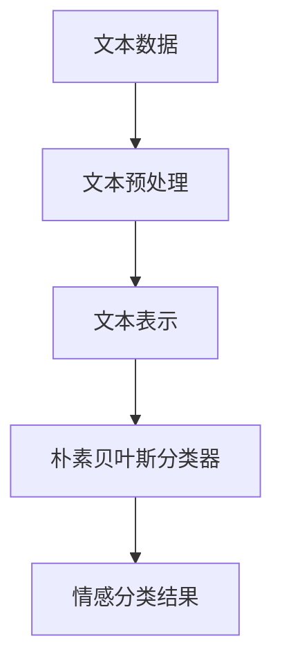

# 基于朴素贝叶斯的淘宝评论分析与应用

## 1.背景介绍

### 1.1 电子商务的崛起与评论数据的重要性

随着互联网技术的快速发展和移动智能设备的普及,电子商务(E-commerce)已经成为当今零售业的主导力量。作为电子商务的重要组成部分,在线评论系统为消费者提供了一个宝贵的平台,可以分享他们对产品和服务的真实感受。这些评论数据不仅对潜在买家的购买决策有重要影响,而且对商家的产品优化和营销策略也具有指导意义。

以淘宝网为例,作为中国最大的综合性电子商务平台,每天都会产生大量的用户评论数据。这些评论数据蕴含着丰富的信息,涉及产品质量、物流服务、卖家信誉等多个方面。如何高效地从海量评论数据中提取有价值的信息,对商家和平台运营者而言是一项极具挑战的任务。

### 1.2 文本数据挖掘的重要性

文本数据挖掘(Text Data Mining)是一种从非结构化或半结构化文本数据中发现有用模式和知识的过程。随着互联网上大量文本数据的积累,文本数据挖掘技术在各个领域都有广泛的应用,如情感分析、主题发现、文本分类等。

在电子商务领域,文本数据挖掘技术可以帮助商家和平台运营者更好地理解消费者的需求和偏好,从而优化产品和服务。具体来说,通过对用户评论进行情感分析,可以了解消费者对产品的整体满意度;通过主题发现,可以发现评论中反映的产品优缺点;通过文本分类,可以自动对评论进行分类,方便管理和检索。

### 1.3 朴素贝叶斯在文本分类中的应用

朴素贝叶斯(Naive Bayes)是一种基于贝叶斯定理与特征条件独立假设的简单而有效的机器学习算法。尽管其独立性假设在实际应用中往往不成立,但由于其计算简单、鲁棒性强等优点,朴素贝叶斯在文本分类领域仍然表现出色。

本文将重点介绍如何利用朴素贝叶斯算法对淘宝用户评论进行情感分类,从而为商家和平台运营者提供有价值的信息支持。我们将从理论和实践两个层面对朴素贝叶斯在文本分类中的应用进行深入探讨。

## 2.核心概念与联系

### 2.1 文本表示

在对文本进行分类之前,需要首先将文本转换为机器可以理解的数值向量表示。常用的文本表示方法包括:

1. **词袋(Bag of Words)模型**:将文本视为一个"词袋",每个词作为一个特征,特征值为该词在文本中出现的次数。
2. **N-gram模型**:将连续的N个词作为一个特征,常用的有一元语法(Unigram)、二元语法(Bigram)和三元语法(Trigram)等。
3. **TF-IDF(Term Frequency-Inverse Document Frequency)**:在词袋模型的基础上,对每个词赋予不同的权重,常用词的权重较低,稀有词的权重较高。

本文将采用TF-IDF作为文本表示方法,以充分利用每个词对文本分类的贡献。

### 2.2 朴素贝叶斯分类器

朴素贝叶斯分类器基于贝叶斯定理,通过计算后验概率(Posterior Probability)来对样本进行分类。具体来说,对于一个样本 $\vec{x}$ 和类别 $c_k$,我们需要计算 $P(c_k|\vec{x})$,即样本 $\vec{x}$ 属于类别 $c_k$ 的概率。根据贝叶斯定理:

$$P(c_k|\vec{x}) = \frac{P(\vec{x}|c_k)P(c_k)}{P(\vec{x})}$$

其中:

- $P(\vec{x}|c_k)$ 是似然(Likelihood),即在已知类别 $c_k$ 的情况下,样本 $\vec{x}$ 出现的概率。
- $P(c_k)$ 是先验概率(Prior Probability),即类别 $c_k$ 出现的概率。
- $P(\vec{x})$ 是证据因子(Evidence Factor),是一个常数,对于不同的类别是相同的,因此在分类时可以忽略。

由于直接计算 $P(\vec{x}|c_k)$ 是非常困难的,朴素贝叶斯分类器做出了"特征条件独立假设",即假设在已知类别的情况下,每个特征之间是相互独立的。这样,我们就可以将 $P(\vec{x}|c_k)$ 分解为各个特征概率的乘积:

$$P(\vec{x}|c_k) = \prod_{i=1}^{n}P(x_i|c_k)$$

其中 $n$ 是特征的个数。

在文本分类任务中,我们可以将每个词视为一个特征,然后根据上述公式计算每个类别的后验概率,将文本划分到概率最大的类别中。

### 2.3 评论情感分类

评论情感分类是一个典型的文本分类问题,目标是将评论划分为正面(好评)、负面(差评)或中性三类。对于淘宝评论数据,我们可以利用朴素贝叶斯分类器对评论进行情感分类,从而了解消费者对产品的整体满意度。

在实际应用中,我们还需要考虑一些特殊情况,如:

1. **处理否定词**:否定词(如"不"、"没有"等)会改变词语的情感倾向,需要特殊处理。
2. **识别修饰词**:修饰词(如"很"、"非常"等)会加强或减弱情感强度,也需要特殊处理。
3. **上下文信息**:同一个词在不同上下文中可能有不同的情感倾向,需要结合上下文进行判断。

通过合理处理这些特殊情况,我们可以进一步提高朴素贝叶斯分类器在评论情感分类任务中的表现。

上图展示了基于朴素贝叶斯的评论情感分类流程。首先对原始文本数据进行预处理(如分词、去停用词等),然后将预处理后的文本转换为数值向量表示(如TF-IDF向量),接着利用朴素贝叶斯分类器对文本进行分类,最终得到情感分类结果。

## 3.核心算法原理具体操作步骤

### 3.1 朴素贝叶斯分类器原理

朴素贝叶斯分类器基于贝叶斯定理,通过计算后验概率(Posterior Probability)来对样本进行分类。具体来说,对于一个样本 $\vec{x}$ 和类别 $c_k$,我们需要计算 $P(c_k|\vec{x})$,即样本 $\vec{x}$ 属于类别 $c_k$ 的概率。根据贝叶斯定理:

$$P(c_k|\vec{x}) = \frac{P(\vec{x}|c_k)P(c_k)}{P(\vec{x})}$$

其中:

- $P(\vec{x}|c_k)$ 是似然(Likelihood),即在已知类别 $c_k$ 的情况下,样本 $\vec{x}$ 出现的概率。
- $P(c_k)$ 是先验概率(Prior Probability),即类别 $c_k$ 出现的概率。
- $P(\vec{x})$ 是证据因子(Evidence Factor),是一个常数,对于不同的类别是相同的,因此在分类时可以忽略。

由于直接计算 $P(\vec{x}|c_k)$ 是非常困难的,朴素贝叶斯分类器做出了"特征条件独立假设",即假设在已知类别的情况下,每个特征之间是相互独立的。这样,我们就可以将 $P(\vec{x}|c_k)$ 分解为各个特征概率的乘积:

$$P(\vec{x}|c_k) = \prod_{i=1}^{n}P(x_i|c_k)$$

其中 $n$ 是特征的个数。

在文本分类任务中,我们可以将每个词视为一个特征,然后根据上述公式计算每个类别的后验概率,将文本划分到概率最大的类别中。

### 3.2 算法步骤

基于朴素贝叶斯分类器对文本进行分类的具体步骤如下:

1. **文本预处理**:对原始文本数据进行分词、去停用词等预处理操作。
2. **文本表示**:将预处理后的文本转换为数值向量表示,如TF-IDF向量。
3. **训练集划分**:从已标注的语料库中随机选取一部分数据作为训练集。
4. **计算先验概率**:在训练集中统计每个类别的文档数量,计算每个类别的先验概率 $P(c_k)$。
5. **计算条件概率**:在训练集中统计每个特征(词)在每个类别中出现的次数,计算每个特征的条件概率 $P(x_i|c_k)$。
6. **分类预测**:对于一个新的文本样本,利用上述计算得到的先验概率和条件概率,根据贝叶斯公式计算每个类别的后验概率,将样本划分到概率最大的类别中。

需要注意的是,在实际应用中,由于某些词可能在训练集中从未出现过,导致其条件概率为0,这会影响整个乘积的计算结果。为了解决这个问题,通常会引入"平滑"(Smoothing)技术,即为每个词赋予一个很小的非零概率值。

### 3.3 算法优缺点分析

朴素贝叶斯分类器的主要优点包括:

1. **简单高效**:算法原理简单,计算过程高效,即使在大规模数据集上也可以快速训练和预测。
2. **需要估计的参数少**:只需要估计先验概率和条件概率,参数量相对较少。
3. **对缺失数据不太敏感**:由于使用了乘法,缺失的特征只会影响结果的一部分,而不会导致整个结果为0。

但朴素贝叶斯分类器也存在一些缺点:

1. **独立性假设较强**:特征之间通常是存在相关性的,独立性假设在实际应用中往往不成立。
2. **对于有序数据表现较差**:朴素贝叶斯分类器更适合处理离散型数据,对于有序数据(如文本长度等)的表现较差。
3. **对于非平稳数据表现较差**:如果数据的统计特性随时间发生变化,朴素贝叶斯分类器的性能会下降。

尽管存在一些缺陷,但由于朴素贝叶斯分类器的简单高效特性,在文本分类等任务中仍然有着广泛的应用。

## 4.数学模型和公式详细讲解举例说明

在第3节中,我们介绍了朴素贝叶斯分类器的核心原理和算法步骤。现在,我们将通过一个具体的例子,详细讲解朴素贝叶斯分类器的数学模型和公式。

### 4.1 问题描述

假设我们有一个由淘宝评论组成的数据集,每条评论已被标注为"正面"或"负面"两类之一。我们的目标是训练一个朴素贝叶斯分类器,对新的未标注评论进行情感分类。

为了简化问题,我们假设每条评论只包含以下5个词:

- 好(good)
- 差(bad)
- 快(fast)
- 慢(slow)
- 服务(service)

### 4.2 先验概率计算

先验概率 $P(c_k)$ 表示类别 $c_k$ 出现的概率,可以通过统计训练集中每个类别的文档数量来估计。

假设我们的训练集包含以下数据:

- 正面评论数量: 8
- 负面评论数量: 4

那么,正面评论和负面评论的先验概率分别为:

$$P(c_\text{positive}) = \frac{8}{8+4} = 