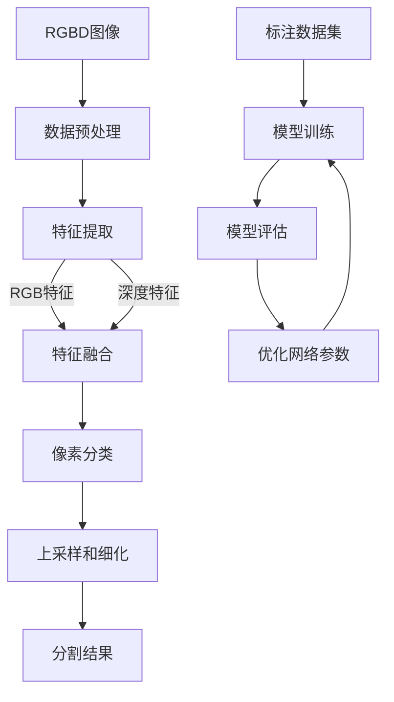

# 基于深度网络的RGBD图像分割算法研究

## 1.背景介绍

随着深度学习技术的快速发展,基于深度网络的图像分割算法逐渐成为计算机视觉领域的研究热点。图像分割是指将图像分割成若干个具有相似特征的区域,这是图像理解和分析的基础。传统的基于手工特征的图像分割算法往往受到图像质量、光照条件等因素的影响,效果并不理想。而基于深度网络的图像分割算法能够自动学习图像的特征表示,具有更强的鲁棒性和适用性。

RGBD图像由RGB图像和深度图像组成,不仅包含了物体的颜色和纹理信息,还包含了物体的几何形状和空间位置信息。相比于单一的RGB图像,RGBD图像能够为图像分割算法提供更加丰富的信息,从而提高分割的精度和效果。因此,基于深度网络的RGBD图像分割算法研究具有重要的理论意义和应用价值。

## 2.核心概念与联系

### 2.1 图像分割

图像分割是将图像划分为若干个具有相似特征的区域的过程。根据分割的目标和方法不同,可以分为以下几种类型:

- 基于阈值的分割: 根据像素灰度值或颜色等特征,将图像划分为目标区域和背景区域。
- 基于边缘的分割: 检测图像中的边缘,将边缘连接成封闭区域作为分割结果。
- 基于区域的分割: 根据像素之间的相似性将图像划分为若干个连通区域。
- 基于聚类的分割: 将图像中的像素按照某种相似性准则聚类,每个聚类即为一个分割区域。

### 2.2 深度网络

深度网络是一种由多个非线性变换层组成的人工神经网络,能够自动从数据中学习特征表示。常见的深度网络包括卷积神经网络(CNN)、循环神经网络(RNN)等。深度网络具有强大的表达能力,在图像分类、目标检测、语音识别等领域取得了卓越的成绩。

### 2.3 RGBD图像

RGBD图像由RGB图像和深度图像组成,RGB图像记录了物体的颜色和纹理信息,深度图像记录了每个像素点到相机的距离。RGBD图像不仅包含了物体的外观特征,还包含了物体的几何形状和空间位置信息,为图像理解和分析提供了更加丰富的信息。

### 2.4 核心联系

基于深度网络的RGBD图像分割算法将深度网络和RGBD图像有机结合,利用深度网络强大的特征学习能力,从RGBD图像中自动提取出有效的特征表示,从而实现精确的图像分割。这种算法能够充分利用RGBD图像中的颜色、纹理、形状和空间位置等多模态信息,提高分割的精度和鲁棒性。

## 3.核心算法原理具体操作步骤

基于深度网络的RGBD图像分割算法通常包括以下几个核心步骤:

1. **数据预处理**: 对RGBD图像进行预处理,包括数据清洗、标准化等,以满足深度网络的输入要求。

2. **网络设计**: 设计适合于RGBD图像分割任务的深度网络架构,常见的网络包括FCN、SegNet、DeepLab等。网络架构需要能够同时处理RGB图像和深度图像,并融合两种模态的特征。

3. **特征提取**: 利用深度网络从RGBD图像中自动提取出有效的特征表示,包括低级特征(如边缘、纹理等)和高级语义特征。

4. **特征融合**: 将RGB图像和深度图像提取的特征进行融合,获得更加丰富和discriminative的特征表示。

5. **像素分类**: 基于融合后的特征,对每个像素进行分类,将其划分到不同的语义类别中。

6. **上采样和细化**: 将分类结果上采样到原始图像分辨率,并使用后处理技术(如条件随机场CRF)进行细化,获得精确的分割结果。

7. **模型训练**: 使用标注好的RGBD图像数据集,通过反向传播算法对深度网络进行端到端的训练,优化网络参数。

8. **模型评估**: 在测试集上评估模型的分割性能,常用的评价指标包括像素准确率(Pixel Accuracy)、平均交并比(Mean IoU)等。

该算法的核心在于设计合理的网络架构,能够充分利用RGBD图像的多模态信息;以及使用有效的特征融合策略,将RGB图像和深度图像的特征进行融合,提高特征的discriminative能力。



## 4.数学模型和公式详细讲解举例说明

在基于深度网络的RGBD图像分割算法中,常用的数学模型和公式包括:

### 4.1 卷积运算

卷积运算是深度网络中的核心操作,用于从输入数据中提取特征。对于二维输入数据(如图像),卷积运算可以表示为:

$$
y_{ij} = \sum_{m}\sum_{n}w_{mn}x_{i+m,j+n} + b
$$

其中,$x$表示输入数据,$w$表示卷积核权重,$b$表示偏置项,$y$表示卷积输出。卷积运算能够自动学习输入数据的空间和结构信息,是深度网络强大的特征提取能力的基础。

### 4.2 上采样操作

上采样操作用于将低分辨率的特征图恢复到原始输入图像的分辨率,是图像分割算法的重要环节。常用的上采样方法包括反卷积(deconvolution)和双线性插值(bilinear interpolation)等。

对于反卷积操作,可以表示为:

$$
y_{ij} = \sum_{m}\sum_{n}w_{mn}x_{i-m,j-n} + b
$$

其中,$x$表示输入特征图,$w$表示反卷积核权重,$b$表示偏置项,$y$表示上采样后的输出特征图。反卷积操作实际上是卷积操作的逆过程,能够学习到输入特征图的上采样参数。

### 4.3 特征融合

在RGBD图像分割算法中,常用的特征融合方法包括元素级融合(element-wise fusion)和级联融合(cascaded fusion)等。

元素级融合是将RGB特征图和深度特征图在相同位置的特征元素进行融合,可以表示为:

$$
f_{ij}^{fused} = \phi(f_{ij}^{rgb}, f_{ij}^{depth})
$$

其中,$f^{rgb}$和$f^{depth}$分别表示RGB特征图和深度特征图,$\phi$是特定的融合函数,如加权求和、最大值等。

级联融合则是将RGB特征图和深度特征图分别输入到不同的网络分支中提取特征,然后将两个分支的特征进行融合,可以表示为:

$$
f^{fused} = \psi(F^{rgb}(x^{rgb}), F^{depth}(x^{depth}))
$$

其中,$F^{rgb}$和$F^{depth}$分别表示RGB特征提取网络和深度特征提取网络,$\psi$是特定的融合函数,如级联、加权求和等。

### 4.4 损失函数

在RGBD图像分割算法的训练过程中,常用的损失函数包括交叉熵损失(cross-entropy loss)和Dice损失(Dice loss)等。

交叉熵损失用于衡量预测结果与真实标签之间的差异,可以表示为:

$$
L_{CE} = -\sum_{i=1}^{N}\sum_{c=1}^{C}y_{ic}\log(p_{ic})
$$

其中,$N$表示像素数量,$C$表示类别数量,$y$表示真实标签,$p$表示预测概率。

Dice损失则是基于Dice系数的损失函数,用于衡量预测结果与真实标签之间的重合程度,可以表示为:

$$
L_{Dice} = 1 - \frac{2\sum_{i=1}^{N}p_{i}y_{i}}{\sum_{i=1}^{N}p_{i} + \sum_{i=1}^{N}y_{i}}
$$

其中,$p$表示预测结果,$y$表示真实标签。Dice损失能够更好地处理类别不平衡的问题,常用于医学图像分割等任务。

### 4.5 评价指标

常用的RGBD图像分割算法评价指标包括像素准确率(Pixel Accuracy)、平均交并比(Mean IoU)等。

像素准确率表示正确分类的像素数占总像素数的比例,可以表示为:

$$
PA = \frac{\sum_{i=1}^{N}1(p_{i}=y_{i})}{\sum_{i=1}^{N}1}
$$

其中,$p$表示预测结果,$y$表示真实标签,$1(\cdot)$是指示函数。

平均交并比则是基于交并比(IoU)的评价指标,用于衡量预测结果与真实标签之间的重合程度,可以表示为:

$$
mIoU = \frac{1}{C}\sum_{c=1}^{C}\frac{\sum_{i=1}^{N}p_{ic}y_{ic}}{\sum_{i=1}^{N}p_{ic} + \sum_{i=1}^{N}y_{ic} - \sum_{i=1}^{N}p_{ic}y_{ic}}
$$

其中,$C$表示类别数量,$p$表示预测结果,$y$表示真实标签。平均交并比能够更好地衡量分割结果的精度和完整性。

以上数学模型和公式是基于深度网络的RGBD图像分割算法的核心组成部分,对于理解和实现该算法具有重要的指导意义。

## 5.项目实践:代码实例和详细解释说明

在本节中,我们将通过一个基于PyTorch的代码实例,详细解释基于深度网络的RGBD图像分割算法的实现过程。

### 5.1 数据准备

首先,我们需要准备RGBD图像数据集,常用的数据集包括NYUv2、SUN RGB-D等。这些数据集包含了RGB图像、深度图像和对应的语义标签。我们将数据集划分为训练集、验证集和测试集。

```python
import torch
from torch.utils.data import Dataset, DataLoader
import numpy as np
import cv2

class RGBDDataset(Dataset):
    def __init__(self, data_dir, transform=None):
        self.data_dir = data_dir
        self.transform = transform
        self.rgb_paths, self.depth_paths, self.label_paths = self.load_paths()

    def load_paths(self):
        rgb_paths = []
        depth_paths = []
        label_paths = []
        # 加载RGB、深度和标签图像路径
        return rgb_paths, depth_paths, label_paths

    def __len__(self):
        return len(self.rgb_paths)

    def __getitem__(self, idx):
        rgb_path = self.rgb_paths[idx]
        depth_path = self.depth_paths[idx]
        label_path = self.label_paths[idx]

        rgb = cv2.imread(rgb_path)
        depth = cv2.imread(depth_path, cv2.IMREAD_ANYDEPTH)
        label = cv2.imread(label_path, cv2.IMREAD_GRAYSCALE)

        if self.transform:
            rgb, depth, label = self.transform(rgb, depth, label)

        return rgb, depth, label

# 创建数据集和数据加载器
dataset = RGBDDataset(data_dir='path/to/dataset')
dataloader = DataLoader(dataset, batch_size=4, shuffle=True)
```

### 5.2 网络架构

接下来,我们定义RGBD图像分割网络的架构。这里我们使用一个基于FCN的网络架构,包括RGB分支和深度分支,最后将两个分支的特征进行融合。

```python
import torch.nn as nn
import torch.nn.functional as F

class RGBDSegNet(nn.Module):
    def __init__(self, num_classes):
        super(RGBDSegNet, self).__init__()
        
        # RGB分支
        self.rgb_conv1 = nn.Conv2d(3, 64, kernel_size=3, padding=1)
        self.rgb_conv2 = nn.Conv2d(64, 128, kernel_size=3, padding=1)
        self.rgb_conv3 = nn.Conv2