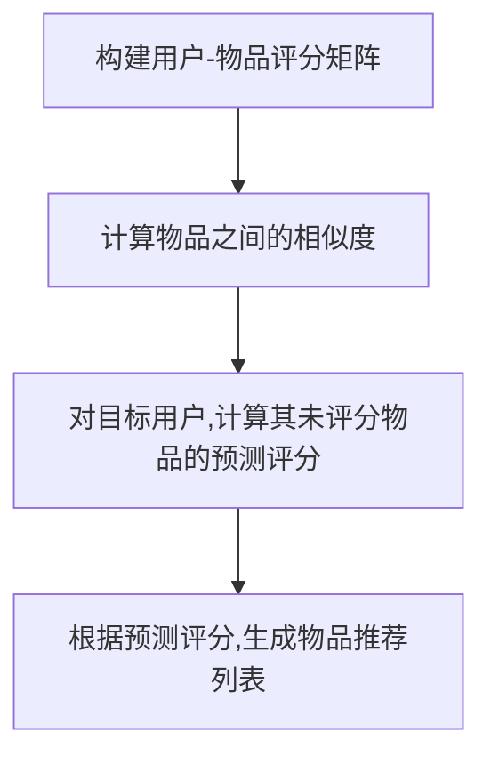

# 基于物品的协同过滤：发现你可能喜欢的商品

## 1.背景介绍

### 1.1 协同过滤的概念

在当今信息时代,我们每天都会接触到大量的数据和信息。然而,有效地从海量数据中发现有价值的信息并满足个人需求,成为了一个巨大的挑战。这就是协同过滤(Collaborative Filtering)应运而生的背景。

协同过滤是一种基于用户行为的推荐系统技术,通过分析用户过去的行为记录(如浏览历史、购买记录等),发现具有相似兴趣爱好的用户群体,从而预测目标用户可能喜欢的项目(如商品、电影等),并向其推荐。

### 1.2 协同过滤的分类

协同过滤主要分为两大类:基于用户的协同过滤(User-based Collaborative Filtering)和基于物品的协同过滤(Item-based Collaborative Filtering)。

- **基于用户的协同过滤**通过找到与目标用户有相似兴趣爱好的用户群体,然后将这些相似用户喜欢的物品推荐给目标用户。
- **基于物品的协同过滤**则是通过发现用户之前喜欢的物品与其他物品的相似程度,从而推荐给用户可能喜欢的其他相似物品。

本文将重点介绍基于物品的协同过滤算法原理、实现方法和应用场景。

## 2.核心概念与联系

### 2.1 用户-物品评分矩阵

基于物品的协同过滤算法的核心是构建用户-物品评分矩阵(User-Item Rating Matrix)。该矩阵的行表示用户,列表示物品,每个元素的值表示该用户对该物品的评分(通常为1-5分)。如果用户没有对某个物品评分,则该元素为空值。

例如,下面是一个简单的用户-物品评分矩阵示例:

```
      物品A 物品B 物品C 物品D
用户1   5     3    ?     4
用户2   4     ?    4     ?
用户3   ?     3    ?     5
用户4   5     ?    5     4
```

### 2.2 物品相似度计算

基于物品的协同过滤算法的关键是计算物品之间的相似度。常用的相似度计算方法有:

1. **余弦相似度(Cosine Similarity)**
2. **皮尔逊相关系数(Pearson Correlation Coefficient)**
3. **调整余弦相似度(Adjusted Cosine Similarity)**
4. **欧几里得距离(Euclidean Distance)**

其中,余弦相似度和皮尔逊相关系数是最常用的两种方法。

### 2.3 预测评分和推荐

计算出物品之间的相似度后,就可以预测目标用户对某个物品的评分,从而判断是否应该将该物品推荐给用户。

预测评分的基本思路是:对于目标用户未评分的物品,基于该用户已评分的物品,结合这些物品与目标物品的相似度,加权计算得到对目标物品的预测评分。

如果预测评分高于某个阈值,则将该物品推荐给用户。

## 3.核心算法原理具体操作步骤  

基于物品的协同过滤算法的核心步骤如下:



### 3.1 构建用户-物品评分矩阵

首先,从用户的历史行为数据(如浏览记录、购买记录等)中提取用户对物品的评分,构建用户-物品评分矩阵。

### 3.2 计算物品之间的相似度

对于每两个物品,计算它们之间的相似度。常用的相似度计算方法有余弦相似度和皮尔逊相关系数。

1. **余弦相似度**

余弦相似度衡量两个向量的夹角余弦值,取值范围为[-1,1]。两个向量夹角越小,余弦相似度越大,表示越相似。

设有两个物品$i$和$j$,分别用向量$\vec{x}$和$\vec{y}$表示,其中$\vec{x}$和$\vec{y}$的每个分量对应一个用户的评分。则$i$和$j$的余弦相似度定义为:

$$\text{sim}(i,j) = \cos(\vec{x},\vec{y}) = \frac{\vec{x}\cdot\vec{y}}{\|\vec{x}\|\|\vec{y}\|}=\frac{\sum\limits_{u\in U}r_{ui}r_{uj}}{\sqrt{\sum\limits_{u\in U}r_{ui}^2}\sqrt{\sum\limits_{u\in U}r_{uj}^2}}$$

其中$U$表示所有用户的集合,$r_{ui}$和$r_{uj}$分别表示用户$u$对物品$i$和$j$的评分。

2. **皮尔逊相关系数**

皮尔逊相关系数衡量两个变量之间的线性相关程度,取值范围为[-1,1]。相关系数越接近1,表示两个变量越正相关;越接近-1,表示两个变量越负相关;等于0,表示两个变量不相关。

设有两个物品$i$和$j$,计算它们的皮尔逊相关系数的公式为:

$$\text{sim}(i,j)=\frac{\sum\limits_{u\in U}(r_{ui}-\overline{r_i})(r_{uj}-\overline{r_j})}{\sqrt{\sum\limits_{u\in U}(r_{ui}-\overline{r_i})^2}\sqrt{\sum\limits_{u\in U}(r_{uj}-\overline{r_j})^2}}$$

其中$\overline{r_i}$和$\overline{r_j}$分别表示物品$i$和$j$的平均评分。

计算出所有物品对之间的相似度后,就可以构建物品相似度矩阵。

### 3.3 计算预测评分

对于目标用户$u$,对其未评分的物品$j$,可以基于$u$已评分的物品,结合这些物品与$j$的相似度,加权计算得到对$j$的预测评分$\hat{r}_{uj}$。

常用的预测评分公式为:

$$\hat{r}_{uj}=\overline{r_u}+\frac{\sum\limits_{i\in I_u^r}\text{sim}(i,j)(r_{ui}-\overline{r_u})}{\sum\limits_{i\in I_u^r}|\text{sim}(i,j)|}$$

其中:
- $\overline{r_u}$表示用户$u$的平均评分
- $I_u^r$表示用户$u$已评分的物品集合
- $\text{sim}(i,j)$表示物品$i$和$j$的相似度
- $r_{ui}$表示用户$u$对物品$i$的评分

### 3.4 生成推荐列表

计算出目标用户对所有未评分物品的预测评分后,将预测评分高于某个阈值的物品,按照预测评分从高到低的顺序,生成物品推荐列表。

## 4.数学模型和公式详细讲解举例说明

在上一节中,我们介绍了基于物品协同过滤算法的核心公式,包括余弦相似度、皮尔逊相关系数和预测评分公式。现在,我们通过具体的例子,详细解释这些公式的含义和计算过程。

### 4.1 余弦相似度示例

假设有3个用户对4个物品的评分情况如下:

```
      物品A 物品B 物品C 物品D
用户1   5     3     ?     4  
用户2   4     ?     4     ?
用户3   ?     3     ?     5
```

我们来计算物品A和物品B的余弦相似度。

首先,将用户对物品A和B的评分分别表示为向量:

$$\vec{x}=(5,4,?)$$
$$\vec{y}=(3,?,3)$$  

根据余弦相似度公式:

$$\text{sim}(A,B)=\cos(\vec{x},\vec{y})=\frac{\vec{x}\cdot\vec{y}}{\|\vec{x}\|\|\vec{y}\|}$$

我们需要计算:
1. $\vec{x}\cdot\vec{y}$
2. $\|\vec{x}\|$
3. $\|\vec{y}\|$

1.$\vec{x}\cdot\vec{y}=5\times3+4\times0+0\times3=15$  
2.$\|\vec{x}\|=\sqrt{5^2+4^2+0^2}=\sqrt{41}$  
3.$\|\vec{y}\|=\sqrt{3^2+0^2+3^2}=\sqrt{18}$

将这些值代入余弦相似度公式:

$$\text{sim}(A,B)=\frac{15}{\sqrt{41}\sqrt{18}}\approx0.68$$

因此,物品A和物品B的余弦相似度约为0.68。

### 4.2 皮尔逊相关系数示例 

我们仍然使用上面的用户-物品评分数据,来计算物品A和物品D的皮尔逊相关系数。

首先需要计算物品A和D的平均评分:

$$\overline{r_A}=\frac{5+4}{2}=4.5$$
$$\overline{r_D}=\frac{4+5}{2}=4.5$$

然后根据皮尔逊相关系数公式计算:

$$\text{sim}(A,D)=\frac{\sum\limits_{u\in U}(r_{uA}-\overline{r_A})(r_{uD}-\overline{r_D})}{\sqrt{\sum\limits_{u\in U}(r_{uA}-\overline{r_A})^2}\sqrt{\sum\limits_{u\in U}(r_{uD}-\overline{r_D})^2}}$$

将用户对A和D的评分带入公式:

$$\text{sim}(A,D)=\frac{(5-4.5)(4-4.5)+(4-4.5)(0-4.5)}{(\sqrt{0.25+0.25})(\sqrt{(-0.5)^2+(-4.5)^2})}=\frac{-0.25}{\sqrt{0.5}\sqrt{20.25}}\approx-0.22$$

因此,物品A和物品D的皮尔逊相关系数约为-0.22,表明它们之间存在一定的负相关关系。

### 4.3 预测评分示例

现在,我们来预测用户1对物品C的评分。用户1对物品A和D的评分分别为5和4。

首先需要计算用户1的平均评分:

$$\overline{r_{u1}}=\frac{5+3+4}{3}=4$$

然后根据预测评分公式计算:

$$\hat{r}_{u1C}=\overline{r_{u1}}+\frac{\sum\limits_{i\in I_{u1}^r}\text{sim}(i,C)(r_{u1i}-\overline{r_{u1}})}{\sum\limits_{i\in I_{u1}^r}|\text{sim}(i,C)|}$$

其中$I_{u1}^r=\{A,B,D\}$,表示用户1已评分的物品集合。

我们需要计算物品C分别与A、B、D的相似度,假设已知:
- $\text{sim}(A,C)=0.7$  
- $\text{sim}(B,C)=0.6$
- $\text{sim}(D,C)=0.5$

将这些值代入预测评分公式:

$$\begin{aligned}
\hat{r}_{u1C}&=4+\frac{0.7(5-4)+0.6(3-4)+0.5(4-4)}{0.7+0.6+0.5}\\
&=4+\frac{0.7+(-0.6)+0}{1.8}\\
&=4+0.39\\
&=4.39
\end{aligned}$$

因此,预测用户1对物品C的评分为4.39分。如果设置推荐阈值为4分,那么就应该将物品C推荐给用户1。

通过上面的例子,我们对余弦相似度、皮尔逊相关系数和预测评分公式有了更深入的理解。在实际应用中,需要根据具体的业务场景和数据特点,选择合适的相似度计算方法和预测评分公式。

## 5.项目实践:代码实例和详细解释说明

为了更好地理解基于物品的协同过滤算法,我们将使用Python实现一个简单的示例项目。该项目包括以下几个步骤:

1. 加载用户-物品评分数据
2. 计算物品之间的相似度
3. 计算目标用户对未评分物品的预测评分
4. 生成物品推荐列表

### 5.1 加载用户-物品评分数据

首先,我们需要从数据源(如数据库或文件