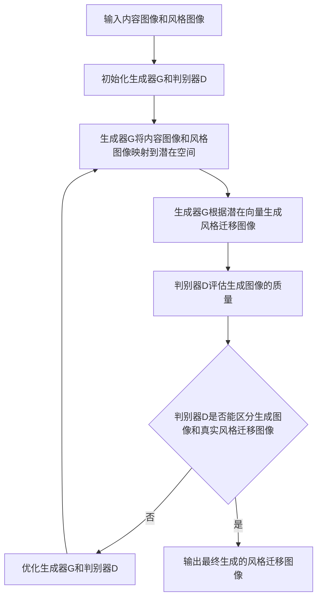

# 基于生成对抗网络的图像风格迁移在时尚设计中的应用

## 1. 背景介绍

### 1.1 时尚设计中的创新需求

在当今瞬息万变的时尚界,设计师们不断追求创新和突破。传统的设计方法已经难以满足日益增长的消费者需求。如何利用现代科技手段,特别是人工智能技术来辅助时尚设计,成为业界关注的焦点。

### 1.2 人工智能在时尚领域的应用现状

近年来,人工智能技术在时尚领域得到广泛应用,从智能推荐、客户画像到智能制造,AI正在重塑时尚产业的各个环节。但在设计创意环节,AI的应用还处于探索阶段。将AI算法应用于时尚设计创意,是一个充满想象力的方向。

### 1.3 图像风格迁移技术概述

图像风格迁移是一种利用深度学习算法,将一张图像的风格特征迁移到另一张图像上,生成一张融合了内容图像和风格图像特点的新图像的技术。近年来,随着生成对抗网络(GAN)的兴起,图像风格迁移技术取得了突破性进展,为时尚设计创意提供了新的可能。

## 2. 核心概念与联系

### 2.1 生成对抗网络(GAN)

生成对抗网络由生成器(Generator)和判别器(Discriminator)两部分组成。生成器负责生成假样本去欺骗判别器,判别器负责判断输入样本是真实样本还是生成器生成的假样本。两个网络在对抗中不断提升,最终生成器可以生成以假乱真的样本。

### 2.2 风格迁移

风格迁移就是将一张图像的风格特征提取出来,迁移到另一张图像上,生成一张融合了内容图像内容和风格图像风格的新图像。传统方法主要通过优化目标函数来实现,但效果有限。

### 2.3 GAN用于风格迁移

将GAN引入风格迁移任务,可以显著提升生成图像的质量和多样性。其基本思想是训练一个生成器网络,将内容图像和风格图像映射到一个共同的潜在空间,再利用判别器网络去评估生成图像的质量,通过对抗训练优化生成器。

### 2.4 在时尚设计中的应用构想

利用基于GAN的图像风格迁移技术,可以将各种经典元素、图案、纹理等风格迁移到服装设计图上,自动生成大量富有创意的设计方案,供设计师参考和选择,大大提升设计效率和创新能力。同时,还可以根据市场趋势、用户画像自动生成符合需求的设计。

## 3. 核心算法原理与操作步骤

### 3.1 基于GAN的图像风格迁移算法流程



算法主要分为以下几个步骤:

1. 准备训练数据,包括大量内容图像和风格图像。
2. 设计并初始化生成器网络G和判别器网络D的架构。
3. 训练判别器D,输入真实的风格迁移图像,标签为1;输入生成器生成的图像,标签为0。优化判别器D,使其能准确区分真实图像和生成图像。
4. 训练生成器G,固定判别器D,将内容图像和风格图像输入生成器G,得到生成图像。将生成图像输入判别器D,得到评分,以此评分为损失优化生成器G,使生成图像能欺骗判别器。
5. 重复步骤3和4,交替训练生成器G和判别器D,直到模型收敛,生成器G能生成高质量的风格迁移图像。
6. 测试阶段,输入任意内容图像和风格图像到训练好的生成器G,即可生成对应的风格迁移图像。

### 3.2 生成器和判别器网络架构

生成器G通常采用编码器-解码器架构,如U-Net。先将内容图像和风格图像分别编码到潜在空间,再拼接潜在向量,通过解码器生成风格迁移图像。

判别器D通常采用卷积神经网络,如PatchGAN。对输入图像进行多层卷积和下采样,最后通过全连接层输出图像真假概率。

### 3.3 损失函数设计

总的损失函数包括三部分:对抗损失、内容损失和风格损失。

对抗损失采用Wasserstein GAN的形式:
$$
L_{adv} = \underset{\tilde{x} \sim \mathbb{P}_{g}}{\mathbb{E}}[D(\tilde{x})] - \underset{x \sim \mathbb{P}_{r}}{\mathbb{E}}[D(x)]
$$

内容损失采用生成图像和内容图像在VGG网络某一层特征图的L2损失:
$$
L_{content} = \frac{1}{C_{j}H_{j}W_{j}} \sum_{i=1}^{C_j}\sum_{h=1}^{H_j}\sum_{w=1}^{W_j}(\phi_j(G(c,s))_{i,h,w} - \phi_j(c)_{i,h,w})^2
$$

风格损失采用生成图像和风格图像在VGG网络某几层特征图的Gram矩阵的L2损失:
$$
L_{style} = \sum_{j=1}^J \frac{1}{C_j^2} \sum_{i=1}^{C_j}\sum_{k=1}^{C_j}(G(\phi_j(G(c,s)))_{i,k} - G(\phi_j(s))_{i,k})^2
$$

最终的损失为三者的加权和:
$$
L = \lambda_{adv}L_{adv} + \lambda_{content}L_{content} + \lambda_{style}L_{style}
$$

## 4. 数学模型与公式详解

### 4.1 Wasserstein GAN的对抗损失

传统GAN的判别器输出样本的真假概率,容易出现梯度消失问题。WGAN将判别器改为估计真假样本分布之间的Wasserstein距离:

$$
W(P_r, P_g) = \inf_{\gamma \in \Pi(P_r, P_g)} \mathbb{E}_{(x,y) \sim \gamma}[||x-y||]
$$

其中$\Pi(P_r, P_g)$表示$P_r$和$P_g$之间所有可能的联合分布。直观理解,Wasserstein距离衡量将$P_r$变换为$P_g$所需的最小代价。

根据Kantorovich-Rubinstein对偶性,上式可以转化为:

$$
W(P_r, P_g) = \sup_{||f||_L \leq 1} \mathbb{E}_{x \sim P_r}[f(x)] - \mathbb{E}_{x \sim P_g}[f(x)]
$$

其中$f$为判别器D。对抗损失就是让生成分布$P_g$去逼近真实分布$P_r$,最小化它们的Wasserstein距离。

### 4.2 基于VGG特征图的内容损失和风格损失

内容损失和风格损失都是基于预训练的VGG网络提取的特征。

内容损失通过最小化生成图像和内容图像在VGG网络第$j$层特征图的L2损失,来保证生成图像与内容图像在内容上的一致性:

$$
L_{content} = \frac{1}{C_{j}H_{j}W_{j}} \sum_{i=1}^{C_j}\sum_{h=1}^{H_j}\sum_{w=1}^{W_j}(\phi_j(G(c,s))_{i,h,w} - \phi_j(c)_{i,h,w})^2
$$

其中$\phi_j$表示VGG网络从输入到第$j$层的子网络,$C_j,H_j,W_j$为第$j$层特征图的通道数、高度和宽度。

风格损失通过最小化生成图像和风格图像在VGG网络某几层特征图的Gram矩阵的L2损失,来保证生成图像与风格图像在纹理、色彩等风格上的一致性。Gram矩阵描述了特征图各通道之间的相关性:

$$
G(\phi_j(x))_{i,k} = \frac{1}{C_jH_jW_j}\sum_{h=1}^{H_j}\sum_{w=1}^{W_j}\phi_j(x)_{i,h,w}\phi_j(x)_{k,h,w}
$$

风格损失就是最小化生成图像和风格图像在多个VGG层上Gram矩阵的L2损失:

$$
L_{style} = \sum_{j=1}^J \frac{1}{C_j^2} \sum_{i=1}^{C_j}\sum_{k=1}^{C_j}(G(\phi_j(G(c,s)))_{i,k} - G(\phi_j(s))_{i,k})^2
$$

## 5. 项目实践:代码实例与详解

下面给出基于TensorFlow 2.0的图像风格迁移模型关键代码。

首先定义生成器和判别器网络:

```python
def build_generator():
    # 内容编码器
    content_input = Input(shape=(256,256,3))
    cx = Conv2D(64, 3, activation='relu', padding='same')(content_input)
    cx = Conv2D(128, 3, activation='relu', padding='same', strides=2)(cx) 
    cx = Conv2D(256, 3, activation='relu', padding='same', strides=2)(cx)
    
    # 风格编码器  
    style_input = Input(shape=(256,256,3))
    sx = Conv2D(64, 3, activation='relu', padding='same')(style_input)
    sx = Conv2D(128, 3, activation='relu', padding='same', strides=2)(sx)
    sx = Conv2D(256, 3, activation='relu', padding='same', strides=2)(sx)
    
    # 拼接内容和风格的潜在向量
    x = Concatenate()([cx,sx])

    # 解码生成图像
    x = Conv2DTranspose(256, 3, activation='relu', padding='same')(x) 
    x = Conv2DTranspose(128, 3, activation='relu', padding='same', strides=2)(x)  
    x = Conv2DTranspose(64, 3, activation='relu', padding='same', strides=2)(x)
    output = Conv2D(3, 3, activation='tanh', padding='same')(x)
    
    model = Model([content_input, style_input], output)
    return model

def build_discriminator():
    input = Input((256,256,3))
    x = Conv2D(64, 4, strides=2, padding='same')(input)
    x = LeakyReLU(0.2)(x)
    x = Conv2D(128, 4, strides=2, padding='same')(x) 
    x = LeakyReLU(0.2)(x)
    x = Conv2D(256, 4, strides=2, padding='same')(x)
    x = LeakyReLU(0.2)(x)
    x = Conv2D(512, 4, padding='same')(x)
    x = LeakyReLU(0.2)(x)
    output = Conv2D(1, 4, padding='same')(x)  
    model = Model(input, output)
    return model
```

然后定义对抗损失、内容损失和风格损失:

```python
def adversarial_loss(real_output, fake_output):
    real_loss = tf.reduce_mean(real_output)
    fake_loss = tf.reduce_mean(fake_output)
    return fake_loss - real_loss

def content_loss(base_features, target_features):
    return tf.reduce_mean(tf.square(target_features - base_features))

def gram_matrix(features):
    batch_size, height, width, channels = features.shape
    features = tf.reshape(features, (batch_size, height*width, channels))
    features_T = tf.transpose(features, perm=[0,2,1])
    gram = tf.matmul(features_T, features) / (height * width * channels)
    return gram
    
def style_loss(base_gram_list, target_gram_list):
    style_losses = tf.add_n([tf.reduce_mean(tf.square(base_gram - target_gram)) 
                            for base_gram, target_gram in zip(base_gram_list, target_gram_list)])
    return style_losses
```

最后定义训练循环:

```python
def train_step(content_images, style_images):
    with tf.GradientTape() as gen_tape, tf.GradientTape() as disc_tape:
        generated_images = generator([content_images, style_images], training=True)
        
        real_output = discriminator(style_images