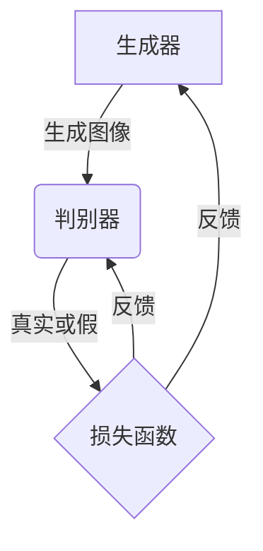

# 基于生成对抗网络的图像风格迁移在用户交互中的体验优化

## 1. 背景介绍

### 1.1 图像风格迁移的概念

图像风格迁移是一种将一种艺术风格迁移到另一种图像上的技术。它能够保留原始图像的内容和结构,同时赋予其新的艺术风格,例如油画、素描、水彩等。这种技术广泛应用于数字艺术创作、图像编辑、图像增强等领域。

### 1.2 用户交互体验的重要性

随着人工智能技术的不断发展,图像风格迁移应用程序越来越普及。然而,用户交互体验往往被忽视,导致应用程序使用困难、效率低下。优化用户交互体验对于提高应用程序的实用性和用户满意度至关重要。

### 1.3 生成对抗网络在图像风格迁移中的应用

生成对抗网络(Generative Adversarial Networks, GANs)是一种基于深度学习的生成模型,由两个神经网络组成:生成器(Generator)和判别器(Discriminator)。生成器负责生成新的样本,而判别器则判断生成的样本是否真实。通过不断训练,生成器可以生成越来越逼真的样本。在图像风格迁移中,GANs可以有效地将一种艺术风格迁移到目标图像上,同时保留原始图像的内容和结构。

## 2. 核心概念与联系

### 2.1 生成对抗网络的工作原理

生成对抗网络由生成器和判别器两部分组成,它们相互对抗,相互学习,最终达到一种动态平衡。



1. 生成器(Generator)从随机噪声中生成图像样本,试图欺骗判别器。
2. 判别器(Discriminator)接收生成器生成的图像和真实图像,并判断它们是真实的还是生成的。
3. 生成器和判别器通过最小化各自的损失函数来相互对抗,不断提高性能。

### 2.2 图像风格迁移的核心思想

图像风格迁移的核心思想是将目标图像的内容特征与风格图像的风格特征相结合,生成新的图像。这个过程可以概括为以下三个步骤:

1. 提取目标图像的内容特征和风格图像的风格特征。
2. 将目标图像的内容特征与风格图像的风格特征相结合。
3. 通过优化算法生成新的图像,使其具有目标图像的内容特征和风格图像的风格特征。

### 2.3 生成对抗网络在图像风格迁移中的应用

在图像风格迁移中,生成对抗网络可以有效地将目标图像的内容特征与风格图像的风格特征相结合,生成新的图像。具体来说:

1. 生成器(Generator)负责生成新的图像样本,试图欺骗判别器。
2. 判别器(Discriminator)接收生成器生成的图像和真实图像,并判断它们是真实的还是生成的。同时,判别器还需要判断生成图像是否具有期望的风格特征。
3. 生成器和判别器通过最小化各自的损失函数来相互对抗,不断提高性能。最终,生成器可以生成具有目标图像内容特征和风格图像风格特征的新图像。

## 3. 核心算法原理具体操作步骤

基于生成对抗网络的图像风格迁移算法可以分为以下几个主要步骤:

### 3.1 数据预处理

1. 准备目标图像和风格图像数据集。
2. 对图像进行归一化和缩放,使其符合网络输入要求。

### 3.2 提取图像特征

使用预训练的卷积神经网络(如VGG-19)提取目标图像的内容特征和风格图像的风格特征。

1. 内容特征通常来自网络的中间层,反映图像的内容和结构信息。
2. 风格特征通常来自网络的不同层的特征图,反映图像的纹理、颜色和笔触等风格信息。

### 3.3 构建生成对抗网络

构建生成对抗网络,包括生成器和判别器两部分。

1. 生成器(Generator)通常采用编码器-解码器结构,输入为随机噪声或目标图像的内容特征,输出为生成的图像。
2. 判别器(Discriminator)通常采用卷积神经网络结构,输入为真实图像或生成图像,输出为真实或生成的概率分数。

### 3.4 训练生成对抗网络

1. 初始化生成器和判别器的权重。
2. 在每个训练迭代中:
   - 生成器生成新的图像样本,试图欺骗判别器。
   - 判别器接收生成器生成的图像和真实图像,并判断它们是真实的还是生成的。同时,判别器还需要判断生成图像是否具有期望的风格特征。
   - 计算生成器和判别器的损失函数,包括对抗损失和风格损失。
   - 使用反向传播算法更新生成器和判别器的权重,最小化各自的损失函数。

### 3.5 生成风格迁移图像

经过充分训练后,生成器可以生成具有目标图像内容特征和风格图像风格特征的新图像。

1. 将目标图像的内容特征输入生成器。
2. 生成器输出风格迁移后的图像。

## 4. 数学模型和公式详细讲解举例说明

### 4.1 内容损失

内容损失用于保留生成图像的内容特征,与目标图像的内容特征相似。通常使用预训练的卷积神经网络(如VGG-19)提取图像的内容特征,并计算生成图像和目标图像内容特征之间的均方差:

$$J_{\text{content}}(G) = \frac{1}{2} \sum_{i,j} (F_{ij}^l - P_{ij}^l)^2$$

其中,$$F_{ij}^l$$和$$P_{ij}^l$$分别表示生成图像和目标图像在第$$l$$层的特征图上的像素值。

### 4.2 风格损失

风格损失用于保留生成图像的风格特征,与风格图像的风格特征相似。通常使用格拉姆矩阵(Gram Matrix)来表示风格特征,并计算生成图像和风格图像的格拉姆矩阵之间的均方差:

$$J_{\text{style}}(G) = \sum_l w_l \cdot \frac{1}{N_l^2 M_l^2} \sum_{i,j} (G_{ij}^l - A_{ij}^l)^2$$

其中,$$G_{ij}^l$$和$$A_{ij}^l$$分别表示生成图像和风格图像在第$$l$$层的格拉姆矩阵,$$N_l$$和$$M_l$$分别表示特征图的高度和宽度,$$w_l$$是对应层的权重。

格拉姆矩阵定义如下:

$$G_{ij}^l = \sum_k F_{ik}^l \cdot F_{jk}^l$$

其中,$$F_{ik}^l$$和$$F_{jk}^l$$分别表示第$$l$$层特征图上的像素值。

### 4.3 总体损失函数

生成对抗网络的总体损失函数包括内容损失、风格损失和对抗损失三部分:

$$J(G, D) = \alpha J_{\text{content}}(G) + \beta J_{\text{style}}(G) + \gamma J_{\text{adv}}(G, D)$$

其中,$$\alpha$$、$$\beta$$和$$\gamma$$分别是内容损失、风格损失和对抗损失的权重系数,用于平衡三者之间的影响。

对抗损失$$J_{\text{adv}}(G, D)$$由生成器和判别器的对抗过程决定,具体形式取决于所采用的生成对抗网络架构。

### 4.4 实例说明

假设我们希望将一张风景照片的风格迁移到一张人像照片上。首先,我们需要提取风景照片的风格特征和人像照片的内容特征。然后,我们可以使用生成对抗网络将这两种特征相结合,生成一张新的图像,既保留了人像照片的内容,又具有风景照片的风格。

在训练过程中,生成器会不断尝试生成具有期望风格特征的图像,而判别器则判断生成图像是否真实,以及是否具有期望的风格特征。通过不断优化内容损失、风格损失和对抗损失,生成器和判别器相互学习,最终达到动态平衡。

经过充分训练后,生成器可以生成具有目标内容特征和期望风格特征的新图像。例如,我们可以将一张风景照片的风格迁移到一张人像照片上,生成一张具有人像内容和风景风格的新图像。

## 5. 项目实践:代码实例和详细解释说明

在本节中,我们将提供一个基于PyTorch实现的图像风格迁移项目实践示例。该示例包括数据加载、模型构建、训练和测试等核心部分。

### 5.1 导入所需库

```python
import torch
import torch.nn as nn
import torchvision.models as models
import torchvision.transforms as transforms
from PIL import Image
import matplotlib.pyplot as plt
```

### 5.2 加载图像

```python
# 加载目标图像
content_img = Image.open("content.jpg").convert("RGB")
# 加载风格图像
style_img = Image.open("style.jpg").convert("RGB")

# 图像预处理
transform = transforms.Compose([
    transforms.Resize((256, 256)),
    transforms.ToTensor(),
    transforms.Normalize(mean=[0.485, 0.456, 0.406], std=[0.229, 0.224, 0.225])
])

content_tensor = transform(content_img).unsqueeze(0)
style_tensor = transform(style_img).unsqueeze(0)
```

### 5.3 定义模型

```python
class StyleTransferModel(nn.Module):
    def __init__(self):
        super(StyleTransferModel, self).__init__()
        self.vgg = models.vgg19(pretrained=True).features

        # 冻结VGG19参数
        for param in self.vgg.parameters():
            param.requires_grad_(False)

        # 定义内容层和风格层
        self.content_layers = ['conv_4']
        self.style_layers = ['conv_1', 'conv_2', 'conv_3', 'conv_4', 'conv_5']

        # 定义生成器和判别器
        self.generator = Generator()
        self.discriminator = Discriminator()

    def forward(self, content, style):
        # 提取内容特征和风格特征
        content_features = self.get_features(content, self.content_layers)
        style_features = self.get_features(style, self.style_layers)

        # 生成图像
        generated = self.generator(content_features, style_features)

        # 判别器输出
        output = self.discriminator(generated)

        return generated, output

    def get_features(self, x, layers):
        features = {}
        for name, layer in self.vgg._modules.items():
            x = layer(x)
            if name in layers:
                features[name] = x
        return features
```

### 5.4 训练模型

```python
# 定义损失函数和优化器
content_weight = 1.0
style_weight = 1e6
adversarial_weight = 1e-3

criterion_content = nn.MSELoss()
criterion_style = nn.MSELoss()
criterion_adversarial = nn.BCELoss()

optimizer_G = torch.optim.Adam(model.generator.parameters(), lr=1e-3)
optimizer_D = torch.optim.Adam(model.discriminator.parameters(), lr=1e-3)

# 训练循环
for epoch in range(num_epochs):
    # 训练生成器
    optimizer_G.zero_grad()
    generated, output = model(content_tensor, style_tensor)
    loss_content = criterion_content(generated, content_tensor)
    loss_style = criterion_style(model.get_style_loss(generated), model.get_style_loss(style_tensor))
    loss_adversarial = criterion_adversarial(output, torch.ones_like(output))
    loss_G = content_weight * loss_content + style_weight * loss_style + adversarial_weight * loss_adversarial
    loss_G.backward()
    optimizer_G.step()

    # 训练判别器
    optimizer_D.zero_grad()
    output_real = model.discriminator(style_tensor)
    output_fake = model.discriminator(generated.detach())
    loss_real = criterion_adversarial(output_real, torch.ones_like(output_real))
    loss_fake = criterion_adversarial(output_fake, torch.zeros_like(output_fake))
    loss_D = (loss_real + loss_fake) / 2
    loss_D