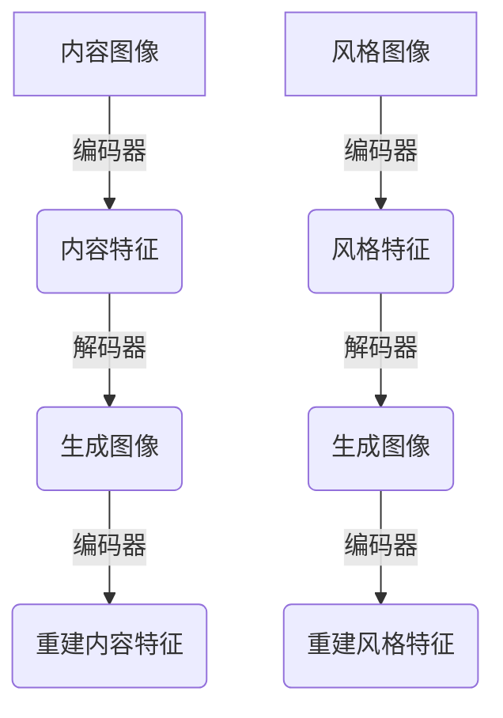

# 基于生成对抗网络的数字化图像风格迁移历史档案构建

## 1.背景介绍

### 1.1 数字化图像档案的重要性

在当今数字时代,图像数据扮演着越来越重要的角色。无论是个人照片、艺术作品、历史文物还是科学实验数据,将它们数字化并妥善保存都具有重大意义。数字化图像档案不仅能够保护珍贵的视觉资源免受时间侵蚀,还能促进知识传播和文化交流。

然而,由于技术条件的限制,早期的数字图像质量较差,分辨率低下,难以满足当代的展示需求。因此,对这些低质量图像进行风格迁移和增强处理,提高其清晰度和真实感,成为构建高质量数字化图像档案的关键一环。

### 1.2 图像风格迁移的挑战

图像风格迁移是一项将源图像的内容与目标风格相融合的任务。传统的基于滤镜的方法往往效果单一,难以捕捉风格的丰富细节。而基于深度学习的方法虽然能够产生令人惊艳的效果,但存在以下挑战:

1. 内容保真性差:风格迁移后的图像往往会丢失源图像的部分内容细节。
2. 风格迁移效果不稳定:对于相似的输入,生成的结果可能存在较大差异。
3. 计算资源消耗大:高质量的风格迁移需要大量的计算资源和时间。

### 1.3 生成对抗网络在图像风格迁移中的应用

生成对抗网络(Generative Adversarial Networks, GANs)是一种基于深度学习的生成模型,由生成器和判别器两个神经网络组成。生成器负责生成逼真的样本,而判别器则评估生成样本的真实性。通过生成器和判别器之间的对抗训练,GANs能够学习到数据的真实分布,并生成高质量的样本。

近年来,GANs在图像风格迁移任务中展现出了卓越的能力。相比传统方法,基于GANs的图像风格迁移模型能够更好地保留内容细节,同时生成更加丰富、细腻的风格效果。此外,GANs的并行计算能力也使其在处理大规模图像数据时具有较高的效率。

本文将重点介绍如何利用GANs技术,构建一个高效、高质量的数字化图像风格迁移系统,为历史档案的数字化保护提供有力支持。

## 2.核心概念与联系

### 2.1 生成对抗网络(GANs)

生成对抗网络是一种由生成模型和判别模型组成的无监督学习框架。其核心思想是通过生成器和判别器之间的对抗训练,使生成器学会捕捉真实数据分布,从而生成逼真的样本。

生成器 $G$ 的目标是从噪声分布 $p_z(z)$ 中采样,生成逼真的样本 $G(z)$,使其难以被判别器 $D$ 识别为"假"样本。而判别器 $D$ 则努力区分真实样本 $x$ 和生成样本 $G(z)$。形式上,生成器和判别器的目标函数可表示为:

$$\min_G \max_D V(D,G) = \mathbb{E}_{x\sim p_{\text{data}}(x)}[\log D(x)] + \mathbb{E}_{z\sim p_z(z)}[\log(1-D(G(z)))]$$

通过这种对抗训练过程,生成器 $G$ 和判别器 $D$ 相互促进,最终达到一种纳什均衡,使得生成样本 $G(z)$ 的分布 $p_g$ 与真实数据分布 $p_{\text{data}}$ 无法区分。

GANs 自提出以来,在图像生成、风格迁移、超分辨率重建等领域取得了卓越的成果,展现出了强大的生成能力。

### 2.2 图像风格迁移

图像风格迁移旨在将一种风格迁移到另一种内容图像上,生成具有目标风格但保留原始内容的新图像。形式上,给定内容图像 $c$ 和风格图像 $s$,风格迁移的目标是生成新图像 $g$,使其内容接近 $c$,风格接近 $s$。

传统的图像风格迁移方法通常基于图像滤镜或纹理合成等技术,效果有限且缺乏灵活性。而基于深度学习的方法则能够更好地捕捉图像的语义内容和风格特征,生成更加自然、细腻的风格迁移效果。

GANs 在图像风格迁移任务中的应用,主要体现在生成器 $G$ 的设计上。通过对生成器 $G$ 的损失函数进行设计,使其同时最小化内容损失(与原始内容图像的差异)和风格损失(与目标风格图像的差异),从而实现内容保真且风格迁移自然的目标。

### 2.3 数字化图像档案构建

数字化图像档案的构建过程,包括图像采集、预处理、元数据标注、长期存储和检索等多个环节。其中,图像预处理是确保档案质量的关键步骤,需要对原始图像进行增强、修复、去噪等操作,以提高图像的清晰度和真实感。

基于 GANs 的图像风格迁移技术,可以作为数字化图像档案预处理的有力补充。通过将低质量的原始图像作为内容输入,结合高质量的风格参考图像,利用 GANs 模型生成风格迁移后的增强图像,不仅能够提高图像的分辨率和细节,还能赋予图像更加丰富、细腻的质感,为后续的长期保存和展示奠定基础。

## 3.核心算法原理具体操作步骤

在 GANs 的基础上,研究人员提出了多种用于图像风格迁移的改进模型和训练策略。这里我们介绍一种基于循环一致性损失的图像风格迁移算法,它能够实现高质量的风格迁移效果,同时较好地保留了内容细节。

### 3.1 网络架构

该算法采用了编码器-解码器的网络架构,如下图所示:

其中,编码器网络用于提取输入图像的内容和风格特征,解码器网络则根据这些特征生成风格迁移后的图像。为了保证生成图像的内容保真性和风格一致性,引入了循环一致性损失,要求生成图像在重新编码后,能够重建出原始的内容和风格特征。

### 3.2 损失函数设计

该算法的总体损失函数由多个部分组成:

1. 内容损失 $\mathcal{L}_{\text{content}}$:衡量生成图像与原始内容图像之间的内容差异,通常使用特征重建损失来计算。
2. 风格损失 $\mathcal{L}_{\text{style}}$:衡量生成图像与目标风格图像之间的风格差异,通常使用格拉姆矩阵损失来计算。
3. 循环一致性损失 $\mathcal{L}_{\text{cycle}}$:衡量生成图像在重新编码后,与原始内容和风格特征之间的差异。
4. 总变分损失 $\mathcal{L}_{\text{tv}}$:用于平滑生成图像,避免出现棱角分明的不自然拼接效果。
5. 身份映射损失 $\mathcal{L}_{\text{id}}$:确保当输入内容图像和风格图像相同时,生成的图像不会发生改变。

将上述损失项线性组合,可得到该算法的总体损失函数:

$$\mathcal{L} = \lambda_{\text{content}}\mathcal{L}_{\text{content}} + \lambda_{\text{style}}\mathcal{L}_{\text{style}} + \lambda_{\text{cycle}}\mathcal{L}_{\text{cycle}} + \lambda_{\text{tv}}\mathcal{L}_{\text{tv}} + \lambda_{\text{id}}\mathcal{L}_{\text{id}}$$

其中 $\lambda$ 项为各损失项的权重系数,需要根据具体任务进行调整。

### 3.3 训练过程

该算法的训练过程包括以下几个主要步骤:

1. **数据准备**:准备用于训练的内容图像和风格图像数据集。
2. **网络初始化**:初始化编码器和解码器网络的权重参数。
3. **前向传播**:将内容图像和风格图像输入编码器,提取特征;将提取的特征输入解码器,生成风格迁移图像。
4. **损失计算**:根据上述损失函数,计算生成图像与真实图像之间的总体损失。
5. **反向传播**:基于计算得到的损失,使用优化算法(如 Adam)对网络参数进行更新。
6. **迭代训练**:重复执行步骤3-5,直至网络收敛或达到最大迭代次数。

在训练过程中,通过对抗性的损失函数设计和循环一致性约束,网络能够学习到如何将目标风格迁移到内容图像上,同时保留内容细节,从而实现高质量的风格迁移效果。

## 4.数学模型和公式详细讲解举例说明

在上一节中,我们介绍了基于循环一致性损失的图像风格迁移算法的总体框架。现在,我们将更加深入地探讨其中涉及的数学模型和公式,并通过具体示例加深理解。

### 4.1 内容损失

内容损失 $\mathcal{L}_{\text{content}}$ 用于衡量生成图像与原始内容图像之间的内容差异,确保风格迁移过程中内容信息的保留。通常采用预训练的深度卷积神经网络(如 VGG19)提取图像的特征表示,并计算生成图像特征与内容图像特征之间的均方差:

$$\mathcal{L}_{\text{content}}(c, g) = \frac{1}{N}\sum_{i=1}^N\left\|F^l(c) - F^l(g)\right\|_2^2$$

其中 $c$ 和 $g$ 分别表示内容图像和生成图像, $F^l$ 代表提取 $l$ 层特征的函数, $N$ 为特征图的元素个数。

例如,给定一张风景照片作为内容图像,如果我们希望将其风格迁移为油画风格,那么内容损失就会确保生成图像保留了原始风景照片的主要元素和布局,如山脉、树木、湖泊等。

### 4.2 风格损失

风格损失 $\mathcal{L}_{\text{style}}$ 用于衡量生成图像与目标风格图像之间的风格差异,确保风格迁移的效果。它基于格拉姆矩阵(Gram Matrix)来捕捉图像的风格特征,格拉姆矩阵定义为特征映射的内积:

$$G^l_{ij} = \sum_k F_{ik}^l F_{jk}^l$$

其中 $F^l$ 表示 $l$ 层的特征映射,下标 $i$、$j$ 和 $k$ 分别对应特征映射的高度、宽度和通道维度。

然后,风格损失被定义为生成图像和风格图像的格拉姆矩阵之间的均方差:

$$\mathcal{L}_{\text{style}}(s, g) = \sum_{l=1}^L\frac{1}{N_l^2M_l^2}\left\|G^l(s) - G^l(g)\right\|_F^2$$

其中 $s$ 和 $g$ 分别表示风格图像和生成图像, $N_l$ 和 $M_l$ 分别为 $l$ 层特征映射的高度和宽度, $\|\cdot\|_F$ 表示矩阵的frobenius范数。

例如,如果我们希望将一张风景照片的风格迁移为梵高的著名画作"星夜",那么风格损失就会捕捉梵高画作中独特的笔触、色彩和纹理,并将这些风格元素融入到生成图像中。

### 4.3 循环一致性损失

循环一致性