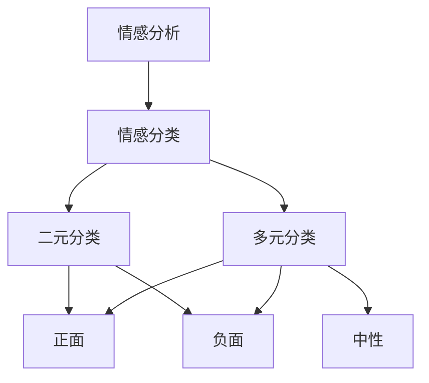
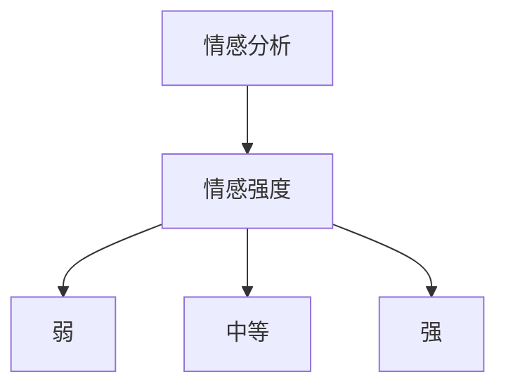
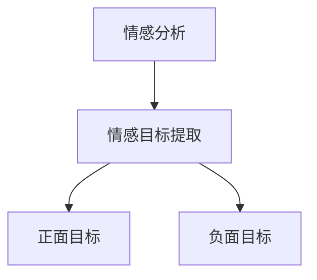

# 基于规则的情感分析：简单高效的入门方法

## 1.背景介绍

在当今的数字时代，情感分析已经成为一个非常重要的研究领域。随着社交媒体、在线评论和用户反馈的快速增长,能够有效地分析和理解用户情感对于企业、政府和组织机构来说变得至关重要。情感分析可以帮助他们更好地了解客户需求、改善产品和服务,并及时应对潜在的危机。

情感分析是一种自然语言处理(NLP)技术,旨在从文本数据中自动检测、识别和提取主观信息,如观点、情绪、态度和情感。它可以广泛应用于多个领域,包括社交媒体监测、品牌声誉管理、客户服务优化、市场营销策略制定等。

### 1.1 情感分析的挑战

尽管情感分析在理论和实践中都取得了长足的进步,但它仍然面临着一些挑战:

- 语义歧义:同一个词或短语在不同上下文中可能表达不同的情感。
- 主观性:情感往往具有主观性,不同的人对同一句话可能有不同的情感解读。
- 语言复杂性:俚语、讽刺、双关语等语言现象增加了情感分析的难度。
- 领域依赖性:不同领域的语料可能存在显著差异,需要针对特定领域进行优化。

### 1.2 情感分析的主要方法

目前,情感分析主要有三种方法:基于机器学习的方法、基于词典的方法和基于规则的方法。本文将重点介绍基于规则的情感分析方法,它简单高效,特别适合入门学习。

## 2.核心概念与联系

### 2.1 情感分类

情感分类是情感分析的核心任务之一。它旨在将给定的文本(如句子、评论等)分类为正面、负面或中性情感。情感分类可以是二元分类(正面或负面)或多元分类(正面、负面、中性等)。



### 2.2 情感强度

除了确定情感的极性(正面或负面)之外,情感强度也是一个重要的指标。它反映了情感的程度或强烈程度。例如,"不错"表达了一种正面情感,但强度较弱;"太棒了"则表达了更强烈的正面情感。



### 2.3 情感目标

在许多情况下,我们不仅需要知道文本的整体情感,还需要知道情感的具体目标是什么。这被称为情感目标提取。例如,在评论"这部手机的摄像头很棒,但电池续航时间很差"中,正面情感的目标是"摄像头",而负面情感的目标是"电池续航时间"。



### 2.4 基于规则的方法概述

基于规则的情感分析方法是通过手工定义一系列规则来识别和提取文本中的情感信息。这些规则通常基于词典、语法模式和人工经验。与基于机器学习的方法相比,基于规则的方法具有以下优势:

- 可解释性强:规则明确,便于理解和调整。
- 无需大量标注数据:只需构建情感词典和规则。
- 计算效率高:规则匹配速度快,适合实时应用。

但基于规则的方法也存在一些局限性,例如无法很好地处理上下文信息、难以覆盖所有情况等。因此,在实际应用中,基于规则的方法通常与其他方法结合使用。

## 3.核心算法原理具体操作步骤

基于规则的情感分析方法主要包括以下几个步骤:

### 3.1 构建情感词典

情感词典是基于规则方法的基础,它包含了带有情感极性(正面、负面或中性)和强度信息的词汇。构建情感词典的主要方式有:

1. 人工标注:由专家人工标注词汇的情感极性和强度。
2. 利用现有资源:如WordNet、SentiWordNet等现有情感词典资源。
3. 语料统计:从大规模语料中统计词频、共现等信息,自动构建情感词典。
4. 组合多种方式:结合人工标注、现有资源和语料统计等多种方式。

### 3.2 预处理文本

在进行情感分析之前,需要对文本进行预处理,包括:

1. 分词:将文本分割成单词序列。
2. 去除停用词:去除没有实际意义的词,如"的"、"了"等。
3. 词形还原:将词语归并为统一的词形,如"played"和"playing"归并为"play"。
4. 标记化:为每个单词赋予相应的词性标记,如名词、动词等。

### 3.3 应用情感规则

情感规则是基于规则方法的核心,它定义了如何根据词典和语法模式来识别和提取文本中的情感信息。常见的情感规则包括:

1. 词典映射规则:根据情感词典将文本中的词映射为相应的情感极性和强度。
2. 语法规则:利用词性标注信息,定义一些语法模式来识别否定、加强、转移等修饰词对情感的影响。
3. 上下文规则:考虑上下文信息,如果一个词在不同上下文中具有不同的情感,则应用相应的规则。

以下是一个简单的情感规则示例:

```
规则1: 如果一个词在情感词典中为正面词,则将其标记为正面情感。
规则2: 如果一个词在情感词典中为负面词,则将其标记为负面情感。
规则3: 如果一个词前面有否定词(如"不"、"没有"等),则将其情感极性反转。
规则4: 如果一个词前面有加强词(如"非常"、"十分"等),则将其情感强度增强。
```

### 3.4 合并和归一化结果

在应用完所有规则后,需要对结果进行合并和归一化处理,得到最终的情感分类结果。常见的方法包括:

1. 投票法:根据不同规则得到的结果进行投票,取得票数最多的情感极性作为最终结果。
2. 加权平均法:为不同规则赋予不同的权重,计算加权平均值作为最终情感强度。
3. 启发式方法:根据人工设计的启发式规则对结果进行调整和优化。

## 4.数学模型和公式详细讲解举例说明

在基于规则的情感分析中,我们可以使用一些数学模型和公式来量化和优化结果。以下是一些常见的模型和公式:

### 4.1 情感强度计算

我们可以使用加权平均的方式来计算一段文本的整体情感强度。设文本由n个词$w_1, w_2, \ldots, w_n$组成,每个词$w_i$的情感强度为$s_i$,权重为$\alpha_i$,则文本的整体情感强度$S$可以计算为:

$$S = \frac{\sum_{i=1}^{n} \alpha_i s_i}{\sum_{i=1}^{n} \alpha_i}$$

其中,权重$\alpha_i$可以根据词的重要性、位置等因素进行设置。例如,我们可以赋予句子开头和结尾的词更高的权重。

### 4.2 情感极性分类

对于情感极性分类问题,我们可以使用逻辑回归模型。设文本由n个特征$x_1, x_2, \ldots, x_n$组成,其中$x_i$可以是词的情感强度、词性等特征。我们需要学习一个线性函数$f(x) = \beta_0 + \beta_1 x_1 + \beta_2 x_2 + \ldots + \beta_n x_n$,使得当$f(x) > 0$时,文本被分类为正面情感;当$f(x) < 0$时,文本被分类为负面情感。

对于给定的训练数据$(x^{(i)}, y^{(i)})$,其中$x^{(i)}$是第i个文本的特征向量,$y^{(i)} \in \{0, 1\}$是对应的情感极性标签(0表示负面,1表示正面)。我们可以使用最大似然估计的方法来学习参数$\beta$:

$$\beta = \arg\max_\beta \prod_{i=1}^{m} p(y^{(i)} | x^{(i)}; \beta)$$

其中,似然函数$p(y | x; \beta)$可以定义为逻辑回归模型:

$$p(y=1 | x; \beta) = \frac{1}{1 + e^{-\beta^T x}}$$
$$p(y=0 | x; \beta) = 1 - p(y=1 | x; \beta)$$

通过优化上述目标函数,我们可以得到最优的参数$\beta$,从而构建情感极性分类器。

### 4.3 情感目标提取

对于情感目标提取问题,我们可以将其建模为序列标注任务,使用条件随机场(CRF)模型。设$X = (x_1, x_2, \ldots, x_n)$是输入序列(如一个句子),$Y = (y_1, y_2, \ldots, y_n)$是对应的标注序列(如每个词是否为情感目标)。CRF模型定义了$X$和$Y$之间的条件概率分布:

$$p(Y | X) = \frac{1}{Z(X)} \exp\left(\sum_{i=1}^{n} \sum_{k} \lambda_k f_k(y_{i-1}, y_i, X, i)\right)$$

其中,$Z(X)$是归一化因子,确保概率和为1;$f_k$是特征函数,用于捕获输入序列$X$和标注序列$Y$之间的关系;$\lambda_k$是对应的权重参数。

在训练阶段,我们可以使用最大似然估计或者其他优化算法来学习权重参数$\lambda$。在预测阶段,我们可以使用维特比算法或其他解码算法来求解最优的标注序列$Y^*$:

$$Y^* = \arg\max_Y p(Y | X)$$

通过这种方式,我们可以从文本中自动提取出情感目标词语或短语。

以上是一些基于规则情感分析中常用的数学模型和公式,它们可以帮助我们量化和优化分析结果。在实际应用中,我们还可以根据具体需求,设计和使用其他合适的模型和公式。

## 5.项目实践:代码实例和详细解释说明

为了更好地理解基于规则的情感分析方法,我们将通过一个实际项目来演示其具体实现。该项目使用Python编程语言和NLTK自然语言处理库,旨在对电影评论进行情感分析。

### 5.1 准备数据

我们将使用NLTK内置的电影评论数据集,它包含了1000条带有情感标签(正面或负面)的评论文本。我们首先需要导入相关的库和加载数据集:

```python
import nltk
from nltk.corpus import movie_reviews

# 下载NLTK数据
nltk.download('movie_reviews')

# 加载数据集
neg_ids = movie_reviews.fileids('neg')
pos_ids = movie_reviews.fileids('pos')

neg_reviews = [movie_reviews.raw(id) for id in neg_ids]
pos_reviews = [movie_reviews.raw(id) for id in pos_ids]
```

### 5.2 构建情感词典

我们将使用NLTK内置的情感词典作为基础,并手工扩充一些电影评论相关的词汇。

```python
from nltk.corpus import opinion_lexicon

# 加载NLTK情感词典
positive_words = set(opinion_lexicon.positive())
negative_words = set(opinion_lexicon.negative())

# 手工扩充词典
positive_words.update(['awesome', 'brilliant', 'fantastic'])
negative_words.update(['boring', 'terrible', 'worst'])
```

### 5.3 预处理文本

我们将对文本进行分词、去除停用词和词形还原等预处理操作。

```python
import re
from nltk.corpus import stopwords
from nltk.stem import PorterStemmer

# 去除HTML标签