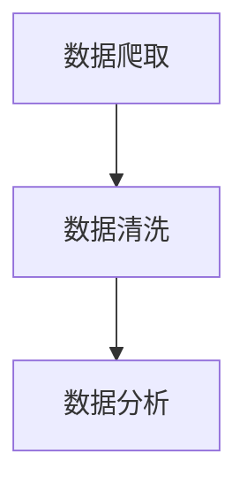

## 1.背景介绍

随着科技的进步和互联网的普及，“豆瓣读书网”已经成为了大多数读者获取书籍信息、分享阅读体验的重要平台。然而，对于如何利用这些海量的数据进行有效的图书市场分析，却是一项充满挑战的任务。本文将探讨如何使用数据分析技术，对“豆瓣读书网”的图书市场进行深入的研究。

## 2.核心概念与联系

在进行图书市场的分析与研究时，我们需要理解几个核心概念：

* 数据爬取：通过编程方式从网站获取我们需要的数据；
* 数据清洗：对获取的数据进行预处理，以便于分析；
* 数据分析：通过统计和算法对数据进行处理，得出有价值的信息。

这三个步骤是相互联系的，数据爬取是数据分析的基础，数据清洗则是数据分析的关键步骤，而数据分析则是我们实现目标的关键。



## 3.核心算法原理具体操作步骤

### 3.1 数据爬取

我们将使用Python的BeautifulSoup库进行数据爬取。首先，我们需要通过requests库获取网页的HTML内容，然后使用BeautifulSoup解析HTML，提取我们需要的数据。

### 3.2 数据清洗

数据清洗主要包括去除无效数据、去除重复数据、处理缺失数据等步骤。我们将使用Python的pandas库进行数据清洗。

### 3.3 数据分析

数据分析主要包括数据的统计分析和可视化。我们将使用Python的pandas和matplotlib库进行数据分析。

## 4.数学模型和公式详细讲解举例说明

在数据分析中，我们会使用一些基本的统计学概念和公式。例如，我们可能会计算图书的平均评分，这可以通过以下公式计算：

$$
\text{平均评分} = \frac{\sum \text{评分}}{\text{评分数量}}
$$

其中，$\sum \text{评分}$表示所有评分的总和，$\text{评分数量}$表示评分的数量。

## 5.项目实践：代码实例和详细解释说明

以下是一个简单的数据爬取的代码示例：

```python
import requests
from bs4 import BeautifulSoup

url = "https://book.douban.com/"
response = requests.get(url)
soup = BeautifulSoup(response.text, 'html.parser')
books = soup.find_all('div', class_='info')

for book in books:
    title = book.find('a').text
    print(title)
```

这段代码首先发送一个GET请求到“豆瓣读书网”，然后使用BeautifulSoup解析返回的HTML内容。接着，它查找所有的图书信息，并打印出每本图书的标题。

## 6.实际应用场景

这种数据分析的方法可以应用于各种场景，例如：

* 出版商可以通过分析图书的评分和评论，了解读者的喜好，以便制定出版策略。
* 书店可以通过分析图书的销售数据，了解哪些图书最受欢迎，以便调整库存。
* 读者可以通过分析图书的评分和评论，了解哪些图书值得阅读。

## 7.工具和资源推荐

* Python：一种广泛用于数据分析的编程语言。
* BeautifulSoup：一个用于解析HTML和XML的Python库。
* pandas：一个用于数据处理和分析的Python库。
* matplotlib：一个用于数据可视化的Python库。

## 8.总结：未来发展趋势与挑战

随着大数据和人工智能的发展，数据分析将在图书市场中发挥越来越重要的作用。然而，如何从海量的数据中提取有价值的信息，如何保护用户的隐私，如何避免数据的滥用，都是我们需要面对的挑战。

## 9.附录：常见问题与解答

Q：数据分析需要什么样的基础知识？

A：数据分析需要一些编程知识（如Python），以及一些统计学和数据处理的基础知识。

Q：如何学习数据分析？

A：有很多在线课程和书籍可以帮助你学习数据分析。你也可以通过实践项目来提高你的技能。

Q：数据分析可以用于哪些领域？

A：数据分析可以应用于各种领域，包括但不限于商业、科研、政策制定等。

作者：禅与计算机程序设计艺术 / Zen and the Art of Computer Programming