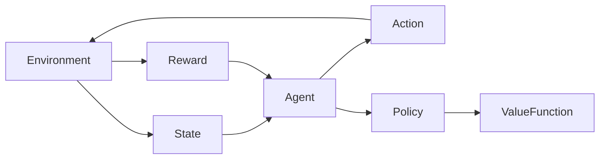

# 增强学习 原理与代码实例讲解

## 1.背景介绍

### 1.1 什么是增强学习

增强学习(Reinforcement Learning, RL)是机器学习的一个重要分支,它研究如何基于环境反馈来学习行为策略,以最大化预期的长期回报。与监督学习和无监督学习不同,增强学习没有给定的输入-输出样本对,而是通过与环境交互来学习。

增强学习的核心思想是让智能体(Agent)通过尝试和失败来学习如何在特定环境中采取最佳行动。智能体与环境交互,观察当前状态,执行行动,并从环境获得奖励或惩罚。通过不断尝试和学习,智能体逐步优化其决策策略,以获得最大的累积奖励。

### 1.2 增强学习的应用

增强学习在许多领域都有广泛的应用,例如:

- 机器人控制和导航
- 游戏AI(如国际象棋、围棋、Atari游戏等)
- 自动驾驶和交通控制
- 资源管理和优化
- 对话系统和自然语言处理
- 金融交易和投资决策

增强学习的优势在于它可以解决复杂的序列决策问题,并且无需大量的标注数据。相比监督学习,它更加灵活和通用,可以处理连续状态和行动空间。

## 2.核心概念与联系

### 2.1 增强学习的基本要素

增强学习系统通常由以下几个基本要素组成:

- **环境(Environment)**: 智能体所处的外部世界,包括状态和奖励信号。
- **状态(State)**: 描述环境当前情况的一组观测值。
- **行动(Action)**: 智能体可以在当前状态下采取的操作。
- **奖励(Reward)**: 环境对智能体当前行动的反馈,可以是正值(奖励)或负值(惩罚)。
- **策略(Policy)**: 智能体在每个状态下选择行动的规则或函数。
- **价值函数(Value Function)**: 评估一个状态或状态-行动对的长期累积奖励。

这些要素之间的关系如下所示:

### 2.2 马尔可夫决策过程(MDP)

增强学习问题通常被形式化为马尔可夫决策过程(Markov Decision Process, MDP),它是一种离散时间随机控制过程。MDP由以下几个要素组成:

- 状态集合 $\mathcal{S}$
- 行动集合 $\mathcal{A}$
- 转移概率 $\mathcal{P}_{ss'}^a = \mathcal{P}(s' | s, a)$,表示在状态 $s$ 采取行动 $a$ 后转移到状态 $s'$ 的概率
- 奖励函数 $\mathcal{R}_s^a$ 或 $\mathcal{R}_{ss'}^a$,表示在状态 $s$ 采取行动 $a$ 获得的即时奖励
- 折扣因子 $\gamma \in [0, 1)$,用于权衡当前奖励和未来奖励的重要性

目标是找到一个最优策略 $\pi^*$,使得在该策略下的期望累积奖励最大化:

$$
\pi^* = \arg\max_\pi \mathbb{E}_\pi \left[ \sum_{t=0}^\infty \gamma^t r_t \right]
$$

其中 $r_t$ 是第 $t$ 个时间步的奖励。

### 2.3 价值函数和贝尔曼方程

在增强学习中,我们通常使用价值函数来评估一个状态或状态-行动对的长期累积奖励。价值函数分为状态价值函数和行动价值函数:

- 状态价值函数 $V^\pi(s)$: 在策略 $\pi$ 下,从状态 $s$ 开始获得的期望累积奖励
- 行动价值函数 $Q^\pi(s, a)$: 在策略 $\pi$ 下,从状态 $s$ 开始,采取行动 $a$,然后按照 $\pi$ 执行获得的期望累积奖励

价值函数满足贝尔曼方程:

$$
\begin{aligned}
V^\pi(s) &= \mathbb{E}_\pi \left[ r_t + \gamma V^\pi(s_{t+1}) | s_t = s \right] \\
&= \sum_a \pi(a|s) \sum_{s'} \mathcal{P}_{ss'}^a \left[ \mathcal{R}_s^a + \gamma V^\pi(s') \right]
\end{aligned}
$$

$$
Q^\pi(s, a) = \mathbb{E}_\pi \left[ r_t + \gamma Q^\pi(s_{t+1}, a_{t+1}) | s_t = s, a_t = a \right]
$$

贝尔曼方程为求解价值函数提供了理论基础,也是许多增强学习算法的核心。

## 3.核心算法原理具体操作步骤

增强学习算法可以分为三大类:基于价值函数的算法、基于策略的算法和基于模型的算法。下面我们介绍几种核心算法的原理和具体操作步骤。

### 3.1 Q-Learning

Q-Learning是一种基于价值函数的无模型增强学习算法,它直接估计行动价值函数 $Q(s, a)$,而不需要估计状态转移概率和奖励函数。Q-Learning的核心思想是通过不断更新Q值,逐步逼近最优行动价值函数 $Q^*(s, a)$。

Q-Learning算法的步骤如下:

1. 初始化Q表格,所有Q值设为任意值(通常为0)
2. 对于每个episode:
    - 初始化状态 $s$
    - 对于每个时间步:
        - 根据当前Q值选择行动 $a$ (通常使用 $\epsilon$-贪婪策略)
        - 执行行动 $a$,观察奖励 $r$ 和新状态 $s'$
        - 更新Q值:
            $$Q(s, a) \leftarrow Q(s, a) + \alpha \left[ r + \gamma \max_{a'} Q(s', a') - Q(s, a) \right]$$
            其中 $\alpha$ 是学习率
        - 将 $s$ 更新为 $s'$
    - 直到episode结束

Q-Learning的优点是简单、易于实现,并且可以证明在满足适当条件下,Q值会收敛到最优行动价值函数。但是,它也存在一些缺点,如需要探索整个状态-行动空间,在大规模问题中可能效率较低。

### 3.2 Sarsa

Sarsa是另一种基于价值函数的无模型增强学习算法。与Q-Learning不同,Sarsa直接估计策略 $\pi$ 下的行动价值函数 $Q^\pi(s, a)$。

Sarsa算法的步骤如下:

1. 初始化Q表格,所有Q值设为任意值(通常为0)
2. 对于每个episode:
    - 初始化状态 $s$,根据策略 $\pi$ 选择行动 $a$
    - 对于每个时间步:
        - 执行行动 $a$,观察奖励 $r$ 和新状态 $s'$
        - 根据策略 $\pi$ 在新状态 $s'$ 下选择新行动 $a'$
        - 更新Q值:
            $$Q(s, a) \leftarrow Q(s, a) + \alpha \left[ r + \gamma Q(s', a') - Q(s, a) \right]$$
        - 将 $s \leftarrow s'$, $a \leftarrow a'$
    - 直到episode结束

Sarsa的优点是它直接估计了策略下的行动价值函数,因此可以更好地处理非平稳环境。但是,它也存在一些缺点,如可能收敛到次优策略,并且在确定性环境中可能无法学习。

### 3.3 Deep Q-Network (DQN)

传统的Q-Learning和Sarsa算法使用表格来存储Q值,在状态-行动空间较大时效率会降低。Deep Q-Network (DQN)通过使用深度神经网络来近似Q函数,从而解决了这个问题。

DQN算法的步骤如下:

1. 初始化神经网络 $Q(s, a; \theta)$ 和目标网络 $Q'(s, a; \theta')$,其中 $\theta$ 和 $\theta'$ 是网络参数
2. 初始化经验回放池 $\mathcal{D}$
3. 对于每个episode:
    - 初始化状态 $s$
    - 对于每个时间步:
        - 根据 $\epsilon$-贪婪策略选择行动 $a = \arg\max_a Q(s, a; \theta)$
        - 执行行动 $a$,观察奖励 $r$ 和新状态 $s'$
        - 将转换 $(s, a, r, s')$ 存储到经验回放池 $\mathcal{D}$
        - 从 $\mathcal{D}$ 中采样一批转换 $(s_j, a_j, r_j, s_j')$
        - 计算目标值 $y_j = r_j + \gamma \max_{a'} Q'(s_j', a'; \theta')$
        - 优化损失函数 $\mathcal{L}(\theta) = \mathbb{E}_{(s, a, r, s') \sim \mathcal{D}} \left[ (y - Q(s, a; \theta))^2 \right]$
        - 每隔一定步数将 $\theta'$ 更新为 $\theta$
        - 将 $s$ 更新为 $s'$
    - 直到episode结束

DQN引入了经验回放池和目标网络,可以提高训练稳定性和收敛性。它可以处理连续状态空间,并在许多任务上取得了出色的性能。

### 3.4 Policy Gradient

Policy Gradient是一种基于策略的增强学习算法,它直接优化策略函数 $\pi_\theta(a|s)$,而不是通过估计价值函数来间接优化策略。

Policy Gradient算法的步骤如下:

1. 初始化策略参数 $\theta$
2. 对于每个episode:
    - 初始化状态 $s_0$
    - 对于每个时间步 $t$:
        - 根据策略 $\pi_\theta(a|s_t)$ 采样行动 $a_t$
        - 执行行动 $a_t$,观察奖励 $r_t$ 和新状态 $s_{t+1}$
        - 存储轨迹 $(s_t, a_t, r_t)$
    - 计算回报 $G_t = \sum_{k=t}^T \gamma^{k-t} r_k$
    - 更新策略参数:
        $$\theta \leftarrow \theta + \alpha \sum_t \nabla_\theta \log \pi_\theta(a_t|s_t) G_t$$
        其中 $\alpha$ 是学习率

Policy Gradient算法的优点是它可以直接优化策略,无需估计价值函数。它也可以处理连续行动空间和非平稳环境。但是,它也存在一些缺点,如高方差梯度估计和样本效率较低。

### 3.5 Actor-Critic

Actor-Critic算法是一种结合了价值函数和策略的算法,它同时维护一个Actor网络(策略函数)和一个Critic网络(价值函数)。Actor网络根据当前状态输出行动概率,Critic网络评估当前状态或状态-行动对的价值。

Actor-Critic算法的步骤如下:

1. 初始化Actor网络 $\pi_\theta(a|s)$ 和Critic网络 $V_\phi(s)$
2. 对于每个episode:
    - 初始化状态 $s_0$
    - 对于每个时间步 $t$:
        - 根据策略 $\pi_\theta(a|s_t)$ 采样行动 $a_t$
        - 执行行动 $a_t$,观察奖励 $r_t$ 和新状态 $s_{t+1}$
        - 计算优势函数 $A(s_t, a_t) = r_t + \gamma V_\phi(s_{t+1}) - V_\phi(s_t)$
        - 更新Critic网络:
            $$\phi \leftarrow \phi - \alpha_\phi \nabla_\phi \left( A(s_t, a_t)^2 \right)$$
        - 更新Actor网络:
            $$\theta \leftarrow \theta + \alpha_\theta \nabla_\theta \log \pi_\theta(a_t|s_t) A(s_t, a_t)$$

Actor-Critic算法结合了价值函数和策略的优点,可以提高样本效率和稳定性。它可以处理连续状态和行动空间,并在许多任务上取得了出色的