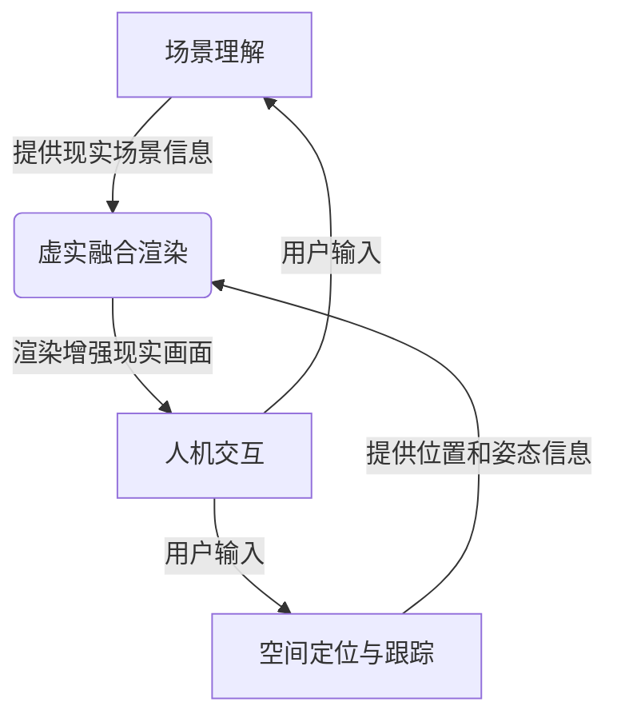

# 增强现实 (Augmented Reality)

## 1. 背景介绍

增强现实(Augmented Reality, AR)是一种将虚拟信息与现实世界实时相融合的技术。它通过计算机视觉、图像处理和计算机图形学等技术，将生成的虚拟物体或信息叠加到现实场景中，从而增强用户对现实世界的感知和体验。

增强现实的概念最早可以追溯到1960年代,但直到近年来移动设备和可穿戴设备的普及,AR技术才真正开始在各个领域得到广泛应用。随着硬件性能的不断提升和算法的持续优化,增强现实正在改变人们获取信息、交互方式和体验现实世界的方式。

## 2. 核心概念与联系

增强现实技术的核心概念包括以下几个方面:

### 2.1 场景理解

场景理解是AR系统的基础,它通过计算机视觉和深度学习算法对现实场景进行识别和理解,包括目标检测、语义分割、3D重建等,为后续的虚拟信息叠加奠定基础。

### 2.2 空间定位与跟踪

空间定位与跟踪技术能够实时确定用户和相机在三维空间中的位置和方向,从而准确地将虚拟信息投影到现实场景中。常用的定位方法包括基于视觉的SLAM(同步定位与映射)、基于传感器的融合定位等。

### 2.3 虚实融合渲染

虚实融合渲染是将虚拟信息与现实场景无缝融合的关键技术。它需要考虑光照、遮挡、阴影等因素,使虚拟物体与真实环境保持一致,提供沉浸式的增强现实体验。

### 2.4 人机交互

增强现实系统需要提供自然、直观的人机交互方式,如手势识别、语音控制、眼动追踪等,使用户能够方便地与虚拟内容进行交互。

这些核心概念相互关联,共同构建了增强现实系统的基本框架。

## 3. 核心算法原理具体操作步骤

### 3.1 场景理解算法

场景理解算法主要包括目标检测、语义分割和3D重建等。

#### 3.1.1 目标检测

目标检测算法用于在图像或视频中识别出感兴趣的目标物体,如人脸、汽车、建筑物等。常用的算法包括基于深度学习的目标检测算法,如YOLO、Faster R-CNN等。

目标检测算法的具体步骤如下:

1. 图像预处理:对输入图像进行缩放、归一化等预处理操作。
2. 区域提取:通过卷积神经网络提取图像的特征,生成候选区域。
3. 分类和回归:对候选区域进行分类和边界框回归,获得最终的检测结果。

#### 3.1.2 语义分割

语义分割算法用于将图像中的每个像素点分配到预定义的类别,如道路、建筑物、人等。常用的算法包括基于深度学习的FCN、SegNet、Mask R-CNN等。

语义分割算法的具体步骤如下:

1. 图像预处理:对输入图像进行缩放、归一化等预处理操作。
2. 特征提取:通过卷积神经网络提取图像的特征。
3. 上采样:将特征图上采样到原始图像尺寸。
4. 像素分类:对每个像素进行分类,获得语义分割结果。

#### 3.1.3 3D重建

3D重建算法用于从一系列图像或视频中重建出三维场景的几何和纹理信息。常用的算法包括基于多视图几何的SfM(Structure from Motion)和基于深度学习的深度估计算法。

3D重建算法的具体步骤如下:

1. 图像预处理:对输入图像进行去噪、校正等预处理操作。
2. 特征提取和匹配:提取图像特征点,并在不同视角图像之间进行匹配。
3. 相机位姿估计:根据特征点匹配结果,估计相机在三维空间中的位置和姿态。
4. 稠密重建:利用多视图几何原理或深度学习算法,重建出三维场景的稠密点云或网格模型。

### 3.2 空间定位与跟踪算法

空间定位与跟踪算法用于实时确定相机或设备在三维空间中的位置和方向,是增强现实系统的核心算法之一。

#### 3.2.1 基于视觉的SLAM算法

SLAM(Simultaneous Localization and Mapping)算法通过从相机图像中提取特征点,并与已建立的三维地图进行匹配,实现相机的定位和地图的更新。

SLAM算法的具体步骤如下:

1. 图像预处理:对输入图像进行去噪、校正等预处理操作。
2. 特征提取和匹配:提取图像特征点,并与地图中的三维点云进行匹配。
3. 运动估计:根据特征点匹配结果,估计相机的运动。
4. 地图更新:将新观测到的三维点云融合到地图中,更新地图。
5. 回环检测:检测相机是否回到之前访问过的位置,进行地图优化。

#### 3.2.2 基于传感器融合的定位算法

除了视觉定位,增强现实系统还可以利用其他传感器数据,如IMU(惯性测量单元)、GPS等,通过传感器融合算法实现更精确的定位。

传感器融合定位算法的具体步骤如下:

1. 数据预处理:对各种传感器数据进行去噪、校正等预处理操作。
2. 状态估计:利用卡尔曼滤波或粒子滤波等算法,融合多源传感器数据,估计设备的位置、速度、姿态等状态。
3. 约束优化:利用已知的地图或地理信息,对状态估计结果进行约束优化。

### 3.3 虚实融合渲染算法

虚实融合渲染算法是将虚拟信息与现实场景无缝融合的关键技术,需要考虑光照、遮挡、阴影等因素,提供沉浸式的增强现实体验。

#### 3.3.1 基于几何的渲染算法

基于几何的渲染算法利用三维场景的几何信息,根据相机位姿和虚拟物体的位置,将虚拟物体正确投影到图像平面上。

渲染算法的具体步骤如下:

1. 场景重建:利用3D重建算法获取现实场景的三维几何信息。
2. 虚拟物体建模:构建虚拟物体的三维模型。
3. 相机投影:根据相机位姿和虚拟物体位置,将虚拟物体投影到图像平面上。
4. 光照计算:根据场景光照条件,计算虚拟物体的光照效果。
5. 合成渲染:将虚拟物体与现实场景图像合成,得到增强现实画面。

#### 3.3.2 基于深度的渲染算法

基于深度的渲染算法利用深度相机或深度估计算法获取场景的深度信息,根据深度信息进行遮挡处理和阴影计算,提高虚实融合的真实感。

渲染算法的具体步骤如下:

1. 深度估计:利用深度相机或深度估计算法获取场景的深度信息。
2. 虚拟物体建模:构建虚拟物体的三维模型。
3. 深度测试:根据虚拟物体和场景深度信息,进行遮挡处理。
4. 阴影计算:根据光源位置和场景深度信息,计算虚拟物体的阴影效果。
5. 合成渲染:将虚拟物体与现实场景图像合成,得到增强现实画面。

## 4. 数学模型和公式详细讲解举例说明

### 4.1 相机投影模型

相机投影模型描述了三维空间中的点如何投影到二维图像平面上,是增强现实系统中虚实融合渲染的基础。

在计算机视觉中,常用的相机投影模型是针孔相机模型(Pinhole Camera Model)。针孔相机模型假设相机的成像过程类似于一个小孔,光线通过小孔投射到成像平面上形成图像。

针孔相机模型的数学表达式如下:

$$
\begin{bmatrix}
u\\
v\\
1
\end{bmatrix}
=
\begin{bmatrix}
f_x & 0 & c_x\\
0 & f_y & c_y\\
0 & 0 & 1
\end{bmatrix}
\begin{bmatrix}
r_{11} & r_{12} & r_{13} & t_x\\
r_{21} & r_{22} & r_{23} & t_y\\
r_{31} & r_{32} & r_{33} & t_z
\end{bmatrix}
\begin{bmatrix}
X\\
Y\\
Z\\
1
\end{bmatrix}
$$

其中:

- $(X, Y, Z)$是三维空间中的点坐标
- $(u, v)$是该点在图像平面上的投影坐标
- $f_x$和$f_y$是相机的焦距,分别对应x和y方向
- $(c_x, c_y)$是图像主点,即光轴与成像平面的交点
- $R$是$3\times3$的旋转矩阵,描述相机在世界坐标系中的方向
- $t$是$3\times1$的平移向量,描述相机在世界坐标系中的位置

通过这个投影模型,我们可以将三维空间中的点投影到二维图像平面上,实现虚拟物体与现实场景的融合。

### 4.2 SLAM中的运动估计

在SLAM(同步定位与映射)算法中,运动估计是一个关键步骤,用于估计相机在三维空间中的运动,包括位移和旋转。

常用的运动估计方法是基于特征点匹配的运动估计。假设我们有两个相邻帧的图像$I_1$和$I_2$,以及它们之间的特征点匹配对$(p_1, p_2)$,我们可以通过求解透视几何模型中的基础矩阵$F$或本质矩阵$E$来估计相机的运动。

#### 4.2.1 基础矩阵估计

基础矩阵$F$描述了两个相机视图之间的几何约束,它满足以下条件:

$$
p_2^T F p_1 = 0
$$

其中$p_1$和$p_2$是同一个三维点在两个视图中的投影点。

我们可以通过特征点匹配对构建线性方程组,利用RANSAC等鲁棒估计方法求解基础矩阵$F$。

#### 4.2.2 本质矩阵估计

本质矩阵$E$描述了两个相机视图之间的运动关系,它与基础矩阵$F$和相机内参数矩阵$K$之间有如下关系:

$$
E = K^T F K
$$

通过分解本质矩阵$E$,我们可以得到相机的旋转矩阵$R$和平移向量$t$,从而估计相机的运动。

### 4.3 光线追踪算法

光线追踪(Ray Tracing)是一种计算机图形学中常用的渲染算法,它通过模拟光线在三维场景中的传播过程,计算光线与物体的相互作用,从而生成逼真的图像。

光线追踪算法的基本思想是从相机(或观察点)发射出一束光线,追踪光线在场景中的传播路径,计算光线与物体的相交点,并根据物体的材质属性和光源的位置计算该点的颜色。

光线追踪算法的数学模型可以描述如下:

1. 发射光线:从相机(或观察点)发射出一束光线,光线的方向由像素坐标和相机投影模型确定。

2. 光线与物体相交测试:对于每一条光线,测试它是否与场景中的物体相交,如果相交,计算相交点的坐标和法向量。

3. 计算着色:在相交点处,根据物体的材质属性(如反射率、折射