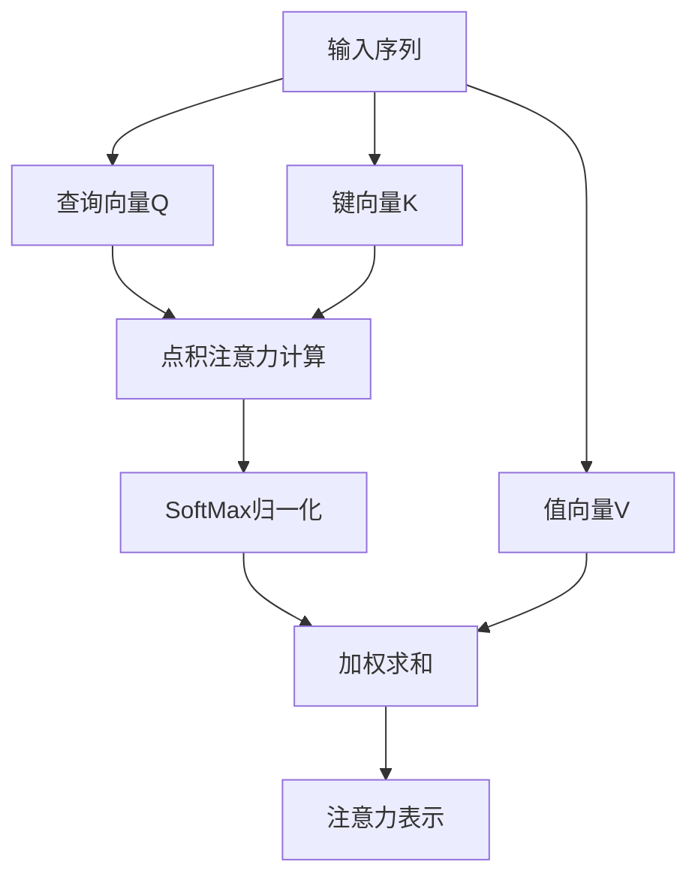
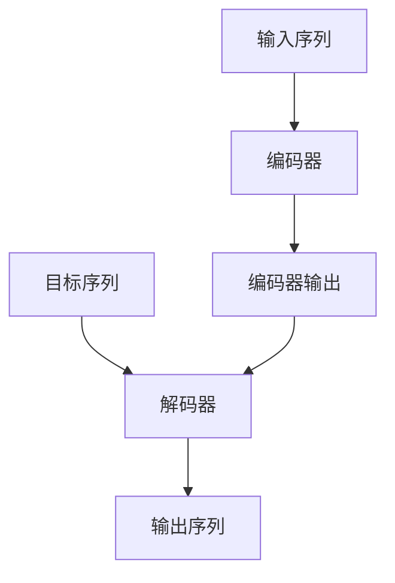
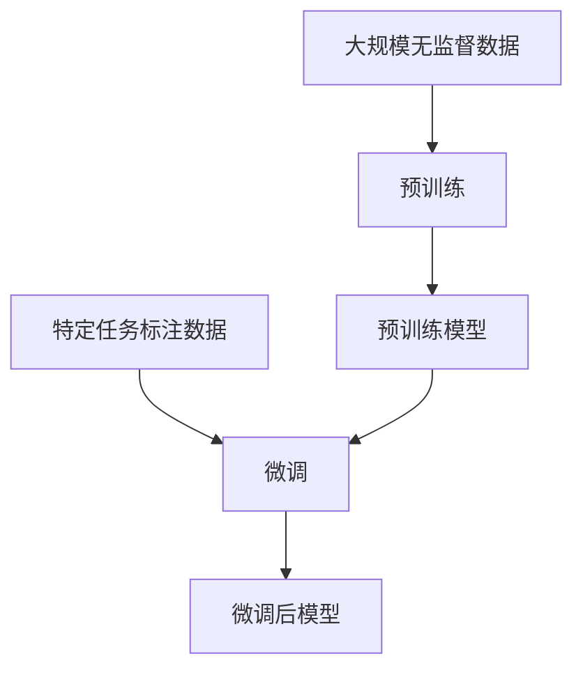
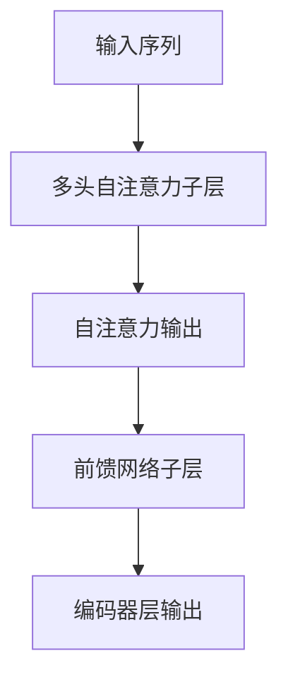
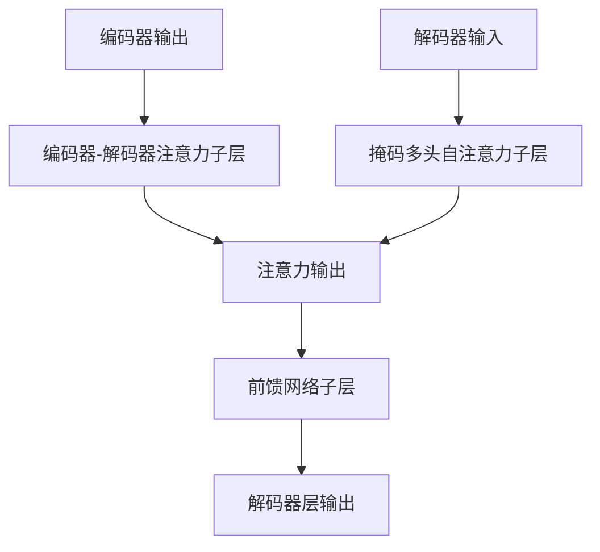

# 多模态大模型：技术原理与实战 GPT技术的发展历程

## 1.背景介绍

### 1.1 人工智能的发展历程

人工智能(Artificial Intelligence, AI)是当代科技发展的重要领域,自20世纪50年代诞生以来,已经经历了多个发展阶段。早期的人工智能系统主要基于符号主义和逻辑推理,如专家系统、规则引擎等。随着计算能力和数据量的不断增长,机器学习(Machine Learning)技术开始崛起,尤其是深度学习(Deep Learning)在图像、语音、自然语言处理等领域取得了突破性进展。

### 1.2 大模型的兴起

近年来,随着算力、数据和模型规模的进一步扩大,大模型(Large Model)开始在自然语言处理、计算机视觉等多个领域展现出卓越的性能表现。大模型通过在海量数据上预训练,学习到丰富的知识和语义表示,从而在下游任务上表现出强大的泛化能力。以GPT(Generative Pre-trained Transformer)为代表的大型语言模型,展现出惊人的文本生成、理解和推理能力,成为人工智能发展的重要里程碑。

### 1.3 多模态大模型的兴起

随着模型规模和预训练数据量的持续增长,单一模态(如文本、图像等)的大模型已经逐渐接近性能上限。为了进一步突破瓶颈,多模态大模型(Multimodal Large Model)应运而生。多模态大模型旨在统一处理多种模态数据(如文本、图像、视频、音频等),捕获跨模态的语义关联,从而实现更强大的认知和推理能力。

GPT(Generative Pre-trained Transformer)系列模型是多模态大模型发展的重要里程碑,本文将重点介绍GPT技术的发展历程、核心原理和实战应用。

## 2.核心概念与联系

### 2.1 自注意力机制(Self-Attention)

自注意力机制是Transformer模型的核心组件,它允许模型捕获输入序列中任意两个位置之间的关系,从而更好地建模长距离依赖。相比于传统的RNN和CNN,自注意力机制具有并行计算的优势,能够更高效地利用现代硬件(如GPU和TPU)的计算能力。

在自注意力机制中,每个输入位置都被映射为一个查询(Query)向量、一个键(Key)向量和一个值(Value)向量。然后,查询向量与所有键向量进行点积运算,得到一个注意力分数向量。注意力分数向量经过SoftMax函数归一化后,与值向量进行加权求和,得到该位置的注意力表示。通过自注意力机制,模型可以自适应地为每个位置分配注意力权重,关注输入序列中的重要信息。

自注意力机制在GPT等大型语言模型中发挥着关键作用,它使模型能够有效地捕获长距离的语义依赖关系,从而提高了模型的表现能力。

### 2.2 Transformer编码器-解码器架构

Transformer编码器-解码器架构是一种广泛应用于序列到序列(Sequence-to-Sequence)任务的模型架构,如机器翻译、文本摘要等。该架构由两个主要组件组成:编码器(Encoder)和解码器(Decoder)。

编码器的作用是将输入序列(如源语言句子)映射为一系列的向量表示,捕获输入序列中的重要信息。编码器由多个相同的编码器层堆叠而成,每个编码器层由多头自注意力子层和前馈网络子层组成。

解码器的作用是根据编码器的输出和目标序列(如目标语言句子)生成最终的输出序列。解码器也由多个相同的解码器层堆叠而成,每个解码器层包含三个子层:掩码多头自注意力子层、编码器-解码器注意力子层和前馈网络子层。掩码多头自注意力子层确保解码器在生成每个输出时,只关注之前的输出而不是未来的输出(以防止信息泄露)。编码器-解码器注意力子层则允许解码器关注编码器的输出,捕获输入和输出序列之间的关系。

Transformer编码器-解码器架构在GPT等大型语言模型中得到了广泛应用,它使模型能够有效地处理各种序列到序列任务,展现出卓越的性能表现。

### 2.3 预训练与微调(Pre-training and Fine-tuning)

预训练与微调是大型语言模型(如GPT)的关键训练范式。预训练阶段旨在在大规模无监督数据(如网络文本数据)上训练模型,使其学习到丰富的语义和世界知识表示。微调阶段则是在特定下游任务的监督数据上进一步调整预训练模型的参数,使其适应特定任务的需求。

在预训练阶段,模型通常采用自监督学习(Self-Supervised Learning)的方式进行训练,如掩码语言模型(Masked Language Modeling)和下一句预测(Next Sentence Prediction)等任务。通过预训练,模型可以捕获语言的一般性规律和知识,为后续的微调奠定基础。

在微调阶段,预训练模型的参数将被用作初始化,并在特定任务的标注数据上进行进一步的梯度更新。由于预训练模型已经学习到了丰富的语义表示,微调通常只需要少量的标注数据和较少的训练步骤,就能获得良好的性能表现。

预训练与微调范式在GPT等大型语言模型中得到了广泛应用,它使模型能够有效地利用大规模无监督数据和少量监督数据,实现了强大的泛化能力和高效的知识迁移。

### 2.4 GPT技术发展历程

GPT(Generative Pre-trained Transformer)是一系列具有里程碑意义的大型语言模型,它们在自然语言处理领域产生了深远的影响。GPT技术的发展历程如下:

1. **GPT-1(2018)**: 由OpenAI发布的首个GPT模型,采用了Transformer解码器架构,在大规模文本数据上进行了预训练。GPT-1展现出了强大的文本生成能力,为后续的GPT模型奠定了基础。

2. **GPT-2(2019)**: 相比GPT-1,GPT-2在模型规模和预训练数据量上有了大幅提升,达到了15亿个参数。GPT-2进一步展现出了出色的文本生成和理解能力,但也引发了一些潜在的安全和伦理问题。

3. **GPT-3(2020)**: GPT-3是一个规模达到1750亿参数的巨型语言模型,在预训练数据量和计算资源上都创下了新的纪录。GPT-3展现出了惊人的few-shot学习能力,能够通过少量示例就完成各种自然语言处理任务,引发了广泛的关注和讨论。

4. **GPT-3.5(2022)**: GPT-3.5是GPT-3的改进版本,在保持强大的few-shot学习能力的同时,进一步提高了模型的安全性和可控性。GPT-3.5被应用于OpenAI的ChatGPT对话系统,展现出了出色的对话交互能力。

5. **GPT-4(2023)**: GPT-4是GPT系列的最新版本,它不仅在语言理解和生成方面表现出色,还能够处理图像等多模态数据。GPT-4的推出标志着大型语言模型正在向多模态大模型的方向发展。

GPT技术的发展历程反映了人工智能领域追求更大规模、更强能力模型的趋势。未来,多模态大模型有望在认知智能、决策支持等领域发挥更加重要的作用。

## 3.核心算法原理具体操作步骤

### 3.1 Transformer编码器层

Transformer编码器层是编码器的基本构建模块,它由两个主要子层组成:多头自注意力子层和前馈网络子层。

**多头自注意力子层**的具体操作步骤如下:

1. 将输入序列X映射为查询(Query)、键(Key)和值(Value)向量序列。
2. 对每个头进行自注意力计算:
   - 计算查询和所有键的点积,得到注意力分数。
   - 对注意力分数进行SoftMax归一化,得到注意力权重。
   - 将注意力权重与值向量进行加权求和,得到注意力输出。
3. 将所有头的注意力输出拼接,并经过线性变换得到最终的自注意力输出。

**前馈网络子层**的具体操作步骤如下:

1. 将自注意力输出通过一个前馈网络(通常为两层全连接网络)进行非线性变换。
2. 将前馈网络的输出与自注意力输出进行残差连接,得到该层的最终输出。

编码器层的输出将作为下一个编码器层的输入,通过多层堆叠,编码器可以捕获输入序列中的长距离依赖关系。

### 3.2 Transformer解码器层

Transformer解码器层是解码器的基本构建模块,它由三个主要子层组成:掩码多头自注意力子层、编码器-解码器注意力子层和前馈网络子层。

**掩码多头自注意力子层**的具体操作步骤如下:

1. 将输入序列映射为查询、键和值向量序列。
2. 对每个头进行自注意力计算,但在计算注意力分数时,对未来位置的键向量进行掩码(设置为负无穷),以防止信息泄露。
3. 将所有头的注意力输出拼接,并经过线性变换得到最终的掩码自注意力输出。

**编码器-解码器注意力子层**的具体操作步骤如下:

1. 将编码器的输出作为键和值向量序列,解码器的输入作为查询向量序列。
2. 对每个头进行注意力计算,得到注意力输出。
3. 将所有头的注意力输出拼接,并经过线性变换得到最终的编码器-解码器注意力输出。

**前馈网络子层**的操作步骤与编码器层相同。

解码器层的输出将作为下一个解码器层的输入,或者作为生成输出序列的基础。通过多层堆叠,解码器可以融合编码器的输出和自身的历史信息,生成最终的输出序列。

### 3.3 GPT模型训练

GPT模型的训练过程包括两个主要阶段:预训练和微调。

**预训练阶段**的具体操作步骤如下:

1. 准备大规模无监督文本数据集,如网络爬取的文本数据。
2. 定义预训练任务,如掩码语言模型(Masked Language Modeling)和下一句预测(Next Sentence Prediction)。
3. 初始化Transformer模型参数,通常采用正态分布初始化。
4. 使用优化算法(如Adam)对模型参数进行迭代更新,最小化预训练任务的损失函数。
5. 在验证集上监控模型的性能,防止过拟合。
6. 保存预训练模型的参数,作为下游任