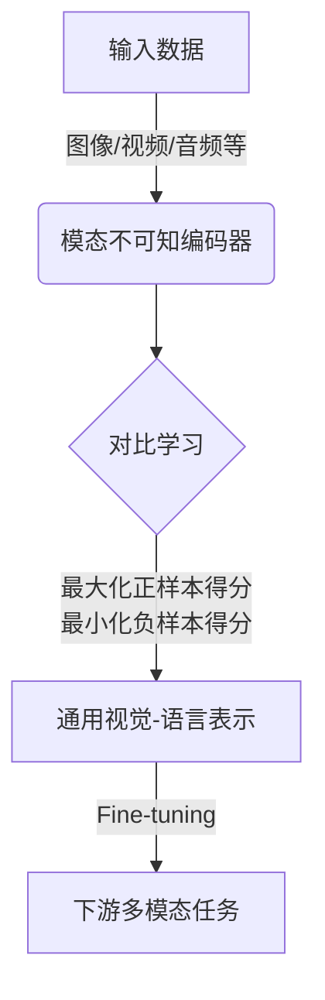

# 多模态大模型：技术原理与实战 OpenAI成功的因素

## 1.背景介绍

### 1.1 大模型的兴起

近年来,随着人工智能技术的不断发展,大型神经网络模型在自然语言处理、计算机视觉等领域展现出了令人惊叹的能力。这些被称为"大模型"的巨型神经网络,通过在海量数据上进行预训练,学习到了丰富的知识和语义表示,从而能够在下游任务中发挥出强大的泛化能力。

大模型的核心思想是"先学会做事,再学习如何做"。它们首先在通用的、非结构化的大规模数据集(如网页数据、书籍等)上进行自监督预训练,获取通用的知识和语义表示能力。然后,在特定的下游任务上进行少量的微调(fine-tuning),即可将通用的表示能力转移到特定的应用场景中,展现出令人惊艳的性能表现。

代表性的大模型有GPT(Generative Pre-trained Transformer)系列、BERT(Bidirectional Encoder Representations from Transformers)等,它们在自然语言理解、生成、问答等任务上取得了突破性的进展。与此同时,大模型在计算机视觉、多模态等领域也逐渐崭露头角。

### 1.2 多模态大模型的重要性

在真实世界中,信息通常以多种形式同时存在,如文本、图像、视频、音频等。而人类能够自然地整合和理解这些异构信息。因此,构建能够同时处理多种模态数据的人工智能系统,对于实现真正的通用人工智能至关重要。

多模态大模型旨在集成视觉、语言、音频等多种模态的表示和处理能力,实现跨模态的知识迁移和推理。相比于单一模态的模型,多模态大模型能够捕捉更丰富的语义信息,更好地模拟人类的认知过程,从而在多模态任务上展现出卓越的性能。

典型的多模态大模型包括OpenAI的CLIP(Contrastive Language-Image Pre-training)、Google的Flamingo、Meta的Data2Vec等。它们通过设计新颖的预训练目标和架构,实现了跨模态的表示学习,为多模态任务的解决提供了强大的基础模型。

本文将重点介绍OpenAI的CLIP模型,剖析其核心技术原理,并探讨在实际应用中的实战经验和挑战,为读者提供多模态大模型的理论基础和实践指导。

## 2.核心概念与联系

### 2.1 CLIP模型概述

CLIP(Contrastive Language-Image Pre-training)是OpenAI于2021年提出的一种新型多模态大模型,旨在学习视觉和语言之间的联系。它通过对成对的图像-文本数据进行对比式预训练,学习到了视觉和语言的共享语义空间表示,从而能够实现跨模态的理解和推理。

CLIP的核心思想是:给定一个图像和一个文本描述,模型应该能够判断它们是否是一对相关的图像-文本对。通过最大化相关对的相似性得分,最小化不相关对的相似性得分,模型就能够学习到视觉和语言之间的语义对应关系。

CLIP的预训练过程不需要任何人工标注的数据,而是利用了来自互联网的大规模图像-文本对作为训练数据。这种自监督的预训练方式,使得CLIP能够从海量的非结构化数据中学习到丰富的视觉和语言知识。

预训练完成后,CLIP可以被用作强大的视觉-语言模型,支持多种下游任务,如图像分类、检索、视觉问答等。由于模型学习到了通用的视觉-语言表示,只需要少量的任务特定fine-tuning,即可在新的应用场景中发挥出极佳的性能。

### 2.2 视觉-语言对比学习

CLIP的核心创新在于提出了一种新颖的视觉-语言对比学习(Contrastive Learning)范式。传统的监督学习方法需要大量的人工标注数据,而对比学习则能够利用大规模的非结构化数据进行自监督预训练。

对比学习的基本思想是:从数据中采样一个正样本对(如相关的图像-文本对)和多个负样本对(如不相关的图像-文本对),然后最大化正样本对的相似性得分,最小化负样本对的相似性得分。通过这种方式,模型就能够学习到样本对之间的语义关联,从而获取有意义的表示。

在CLIP中,对比学习的具体实现是:给定一个图像-文本对作为正样本,从数据集中采样多个其他图像-文本对作为负样本。然后,通过一个双塔(Two-Stream)的编码器架构,将图像和文本分别编码为向量表示。接着,计算正样本对的向量相似性得分,以及所有负样本对的相似性得分。最后,使用对比损失函数(Contrastive Loss),最大化正样本得分,最小化负样本得分,从而实现对比式预训练。

通过大规模的对比式预训练,CLIP能够学习到视觉和语言的共享语义空间表示,捕捉两种模态之间的内在联系。这种通用的跨模态表示,为下游的多模态任务奠定了坚实的基础。

### 2.3 多模态融合与泛化

作为一种多模态大模型,CLIP不仅能够处理图像和文本两种模态,还能够将其扩展到其他模态,如视频、音频等。这种跨模态的泛化能力,源自于CLIP的对比学习范式和通用的表示学习方式。

具体而言,CLIP的编码器架构采用了模态不可知(Modality-Agnostic)的设计,即对于不同的模态输入,都使用相同的Transformer编码器结构进行编码。这种统一的编码方式,使得CLIP能够自然地融合多种模态的信息,实现跨模态的表示学习和知识迁移。

例如,在处理视频数据时,CLIP可以将视频分解为一系列的图像帧,并将每一帧的图像特征序列作为输入,通过Transformer编码器捕捉时序信息,从而实现对视频的理解和表示。同样地,对于音频数据,CLIP也可以将其转换为频谱图的序列,并通过相同的编码器架构进行处理。

通过这种统一的多模态融合方式,CLIP能够充分利用不同模态之间的互补信息,提高模型的泛化能力和鲁棒性。这种强大的跨模态泛化能力,为CLIP在多种实际应用场景中的部署奠定了基础。

## 3.核心算法原理具体操作步骤

### 3.1 CLIP的对比学习算法

CLIP的对比学习算法可以概括为以下几个关键步骤:

1. **数据采样**:从训练数据集中采样一个图像-文本对作为正样本,以及多个其他图像-文本对作为负样本。

2. **编码**:使用双塔(Two-Stream)的编码器架构,将图像和文本分别编码为向量表示。具体来说,图像通过视觉编码器(如ResNet)编码,文本通过文本编码器(如Transformer)编码。

3. **相似性计算**:计算正样本对的向量相似性得分,以及所有负样本对的相似性得分。相似性得分通常使用向量点积或余弦相似度来计算。

4. **对比损失计算**:使用对比损失函数(Contrastive Loss)来优化模型参数。对比损失的目标是最大化正样本对的相似性得分,最小化负样本对的相似性得分。常用的对比损失函数包括NT-Xent Loss和Aligned Loss等。

5. **模型优化**:使用梯度下降等优化算法,根据对比损失的梯度更新模型参数,实现端到端的对比式预训练。

6. **迭代训练**:重复上述步骤,不断地从训练数据中采样新的正负样本对,进行多轮的对比式预训练,直至模型收敛。

通过上述对比学习算法,CLIP能够从大规模的非结构化图像-文本对数据中学习到视觉和语言的共享语义空间表示,捕捉两种模态之间的内在联系。

### 3.2 NT-Xent Loss

NT-Xent Loss(Noise-Contrastive Estimation Loss)是CLIP中使用的一种常见对比损失函数。它的目标是最大化正样本对的相似性得分,同时最小化所有负样本对的相似性得分。

给定一个正样本对$(i, j)$,其中$i$表示图像,$j$表示文本,以及一组负样本对$(i, k)$,其中$k \neq j$。我们定义正样本对的相似性得分为:

$$
\text{sim}(i, j) = \frac{\exp(\text{sim}(z_i, z_j) / \tau)}{\sum_{k=1}^{K} \exp(\text{sim}(z_i, z_k) / \tau)}
$$

其中$z_i$和$z_j$分别表示图像$i$和文本$j$的向量表示,$\tau$是一个温度超参数,用于控制相似性分数的尺度。$K$是负样本的数量。

NT-Xent Loss的公式如下:

$$
\mathcal{L}_\text{NT-Xent} = -\mathbb{E}_{(i, j) \sim p_\text{pos}} \log \text{sim}(i, j)
$$

其中$p_\text{pos}$表示正样本对的数据分布。

实际操作中,NT-Xent Loss的计算过程如下:

1. 从训练数据中采样一个小批量(mini-batch)的图像-文本对作为正负样本。
2. 对于每个正样本对$(i, j)$,计算它与所有负样本对$(i, k)$的相似性得分$\text{sim}(i, j)$和$\text{sim}(i, k)$。
3. 根据上述公式计算NT-Xent Loss,并对整个小批量求平均。
4. 使用梯度下降等优化算法,根据NT-Xent Loss的梯度更新模型参数。

通过最小化NT-Xent Loss,CLIP能够学习到视觉和语言的共享语义空间表示,使得相关的图像-文本对具有高的相似性得分,而不相关的对具有低的相似性得分。

### 3.3 Aligned Loss

Aligned Loss是CLIP中另一种常用的对比损失函数,它旨在进一步提高模型的对比学习能力。

Aligned Loss的基本思想是:不仅要最大化正样本对的相似性得分,还要最小化正样本对与其他正样本对之间的相似性得分。这样可以使得模型学习到更加discriminative的表示,提高对比学习的效果。

具体来说,给定一个小批量的正样本对$(i_1, j_1), (i_2, j_2), \ldots, (i_N, j_N)$,其中$N$是小批量大小。我们定义Aligned Loss如下:

$$
\begin{aligned}
\mathcal{L}_\text{Aligned} &= \frac{1}{N} \sum_{n=1}^{N} \Big[ -\log \frac{\exp(\text{sim}(z_{i_n}, z_{j_n}) / \tau)}{\sum_{m=1}^{N} \exp(\text{sim}(z_{i_n}, z_{j_m}) / \tau)} \\
&\qquad\qquad -\log \frac{\exp(\text{sim}(z_{i_n}, z_{j_n}) / \tau)}{\sum_{m=1}^{N} \exp(\text{sim}(z_{i_m}, z_{j_n}) / \tau)} \Big]
\end{aligned}
$$

其中$z_{i_n}$和$z_{j_n}$分别表示第$n$个图像和文本的向量表示,$\tau$是温度超参数。

Aligned Loss的计算过程包括两个部分:

1. 对于每个正样本对$(i_n, j_n)$,最大化它与自身的相似性得分,最小化它与其他正样本对$(i_m, j_m)$的相似性得分,其中$m \neq n$。
2. 对于每个正样本对$(i_n, j_n)$,最大化它与自身的相似性得分,最小化它与其他正样本对$(i_m, j_n)