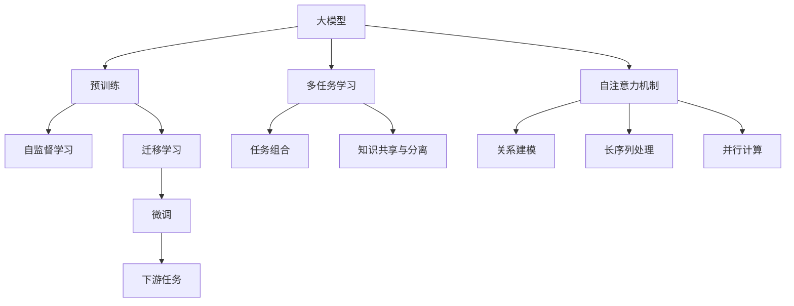
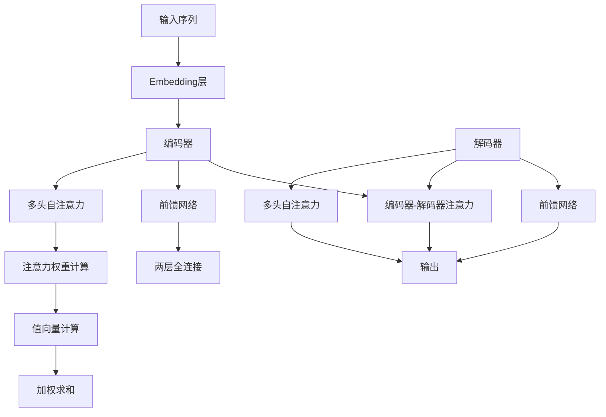
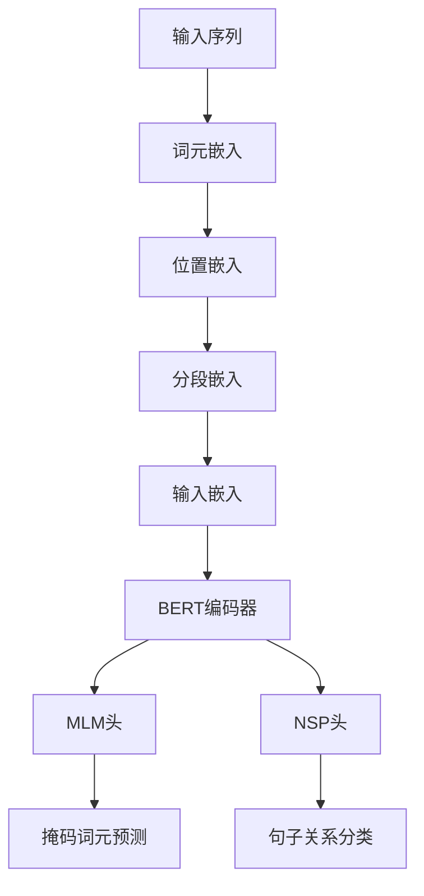
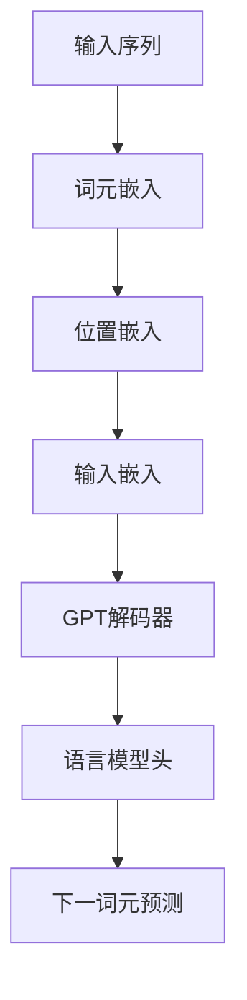

# 多模态大模型：技术原理与实战 从BERT模型到ChatGPT

## 1.背景介绍

### 1.1 人工智能的发展历程

人工智能(Artificial Intelligence, AI)是当代科技领域最具革命性和颠覆性的技术之一。自20世纪50年代AI概念被正式提出以来,AI技术经历了几个重要的发展阶段。

- **第一阶段(1950s-1970s)**: 专家系统时代。这一时期的AI系统主要依赖人工编写的规则和知识库,缺乏学习和推理能力。
- **第二阶段(1980s-2000s)**: 统计学习时代。机器学习算法(如决策树、支持向量机等)开始被广泛应用,AI系统可以从数据中学习模式。
- **第三阶段(2010s至今)**: 深度学习时代。受到大数据和算力的驱动,深度神经网络展现出强大的表示学习能力,在计算机视觉、自然语言处理等领域取得突破性进展。

### 1.2 大模型的兴起

在深度学习时代,模型规模和数据规模不断扩大,催生了大模型(Large Model)的兴起。大模型通过增加模型参数数量和训练数据量,显著提升了模型性能。以下是一些具有里程碑意义的大模型:

- **2018年**: Google推出BERT(Bidirectional Encoder Representations from Transformers),是首个在自然语言处理领域取得巨大成功的大型预训练语言模型。
- **2020年**: OpenAI发布GPT-3(Generative Pre-trained Transformer 3),参数量高达1750亿,在多项自然语言任务上展现出惊人的泛化能力。
- **2022年**: OpenAI推出多模态大模型DALL-E,能够根据自然语言描述生成逼真的图像。
- **2022年**: Anthropic公司推出对话型AI助手Claude,展现出强大的推理和交互能力。
- **2022年**: OpenAI发布ChatGPT,这个对话式大语言模型在短时间内引发了全球范围内的热潮。

### 1.3 多模态大模型的重要性

多模态大模型是指能够同时处理多种模态(如文本、图像、视频、语音等)输入的大规模预训练模型。相比单一模态模型,多模态大模型具有以下优势:

1. **更强的理解能力**: 通过融合多源异构信息,模型能够获得更全面、更丰富的知识表示,提高对复杂场景的理解能力。
2. **更广阔的应用前景**: 多模态模型可广泛应用于多媒体内容分析、人机交互、智能助理等多个领域。
3. **更自然的人机交互体验**: 人类与世界的交互本质上是多模态的,多模态模型有望实现更自然、更智能的人机交互。

## 2.核心概念与联系

### 2.1 预训练与微调

大模型通常采用"预训练+微调"的范式。预训练阶段是在大规模无标注数据上进行自监督学习,获得通用的模型参数;微调阶段则是在有标注的下游任务数据上,基于预训练模型进行进一步的监督微调,使模型适应特定任务。

预训练的目标是获得对通用知识和能力的有效编码,而微调则是将这些通用的知识和能力转移到特定的下游任务。这种"预训练+微调"范式已被广泛应用于自然语言处理、计算机视觉等领域。

### 2.2 自注意力机制

自注意力机制(Self-Attention)是大模型中的关键技术,特别是在Transformer架构中发挥了重要作用。与传统的RNN或CNN不同,自注意力机制可以直接捕获输入序列中任意两个位置之间的关系,避免了传统模型中的局部性和路径长度限制。

自注意力机制的核心思想是将序列中的每个元素映射为一个向量,然后通过计算每对向量之间的相似性,捕获它们之间的关系。这种灵活的关系建模方式使得Transformer能够高效地处理长序列,并在并行计算上具有优势。

### 2.3 迁移学习

迁移学习(Transfer Learning)是大模型的另一个关键技术。大模型通过在大规模无标注数据上预训练,学习到通用的知识表示和能力。然后,通过在有标注的下游任务数据上进行微调,可以将这些通用知识和能力迁移到特定任务。

迁移学习的优势在于,通过利用预训练模型中的知识,可以显著减少下游任务所需的标注数据量,提高模型的泛化能力。同时,迁移学习还可以加速模型训练,降低计算成本。

### 2.4 多任务学习

多任务学习(Multi-Task Learning)是指在同一个模型中同时学习多个相关任务,利用不同任务之间的相关性提高模型的泛化能力。在大模型中,多任务学习可以帮助模型获得更丰富、更通用的知识表示,从而提高模型在各种下游任务上的性能。

多任务学习的关键是设计合理的任务组合和权重,以及如何在不同任务之间共享和分离知识。通过合理的多任务学习策略,大模型可以更好地利用有限的数据和计算资源,提高模型的效率和性能。

### 2.5 Mermaid流程图

上图展示了大模型中的核心概念及其相互关系。预训练通过自监督学习获得通用的模型参数,然后通过迁移学习和微调将这些知识迁移到下游任务。多任务学习可以帮助模型获得更丰富的知识表示。自注意力机制则是大模型中的关键技术,支持高效的关系建模、长序列处理和并行计算。

## 3.核心算法原理具体操作步骤

### 3.1 Transformer模型

Transformer是大模型中广泛采用的核心架构,最早由Google在2017年提出,用于机器翻译任务。Transformer完全基于注意力机制,摒弃了传统序列模型中的循环和卷积结构,大大提高了并行计算能力。

Transformer的主要组成部分包括:

1. **Embedding层**: 将输入序列(如文本或图像)映射为向量表示。
2. **编码器(Encoder)**: 由多个相同的编码器层堆叠而成,每个编码器层包含一个多头自注意力子层和一个前馈网络子层。编码器捕获输入序列的上下文信息。
3. **解码器(Decoder)**: 与编码器类似,也由多个解码器层堆叠而成。不同之处在于,解码器层除了包含编码器中的两个子层外,还包含一个额外的注意力子层,用于关注编码器的输出。
4. **输出层**: 根据解码器的输出,生成最终的预测序列。

Transformer的自注意力机制使其能够直接捕获输入序列中任意两个位置之间的关系,从而有效地处理长序列输入。此外,Transformer的结构设计也使其在并行计算上具有优势。

上图展示了Transformer模型的核心操作步骤。输入序列首先通过Embedding层映射为向量表示,然后送入编码器进行编码。编码器中的多头自注意力子层捕获输入序列中元素之间的关系,前馈网络子层则对每个位置的表示进行非线性变换。解码器除了包含与编码器类似的子层外,还引入了一个额外的注意力子层,用于关注编码器的输出。最终,解码器的输出经过输出层生成预测序列。

### 3.2 BERT模型

BERT(Bidirectional Encoder Representations from Transformers)是一种基于Transformer的预训练语言模型,由Google在2018年提出。BERT的创新之处在于采用了双向编码器,能够同时捕获序列中每个位置的前后上下文信息。

BERT的预训练过程包括两个主要任务:

1. **掩码语言模型(Masked Language Model, MLM)**: 随机掩码输入序列中的一些词元,模型需要基于剩余的上下文预测被掩码的词元。
2. **下一句预测(Next Sentence Prediction, NSP)**: 判断两个句子是否为连续的句子对。

通过上述两个预训练任务,BERT可以学习到丰富的语义和上下文表示。预训练完成后,BERT可以在各种下游任务上进行微调,展现出出色的性能。

上图展示了BERT模型的核心操作步骤。输入序列首先通过词元嵌入、位置嵌入和分段嵌入得到输入嵌入表示,然后送入BERT编码器进行编码。编码器的输出连接到两个预训练任务头:掩码语言模型头用于预测被掩码的词元,下一句预测头用于判断两个句子是否为连续的句子对。通过这两个预训练任务,BERT可以学习到丰富的语义和上下文表示。

### 3.3 GPT模型

GPT(Generative Pre-trained Transformer)是另一种基于Transformer的预训练语言模型,由OpenAI提出。与BERT不同,GPT采用了单向解码器结构,只能捕获序列中每个位置的前向上下文信息。

GPT的预训练任务是语言模型(Language Model),即基于序列的前缀预测下一个词元。通过这种自回归的方式,GPT可以学习到语言的概率分布,并具备生成式的能力。

GPT的后续版本GPT-2和GPT-3在规模上不断扩大,参数量从原始的1.5亿增长到了1750亿,展现出了惊人的泛化能力。GPT-3不仅能够完成自然语言生成任务,还可以解决诸如问答、代码生成等多种形式的任务。

上图展示了GPT模型的核心操作步骤。输入序列首先通过词元嵌入和位置嵌入得到输入嵌入表示,然后送入GPT解码器进行编码。解码器的输出连接到语言模型头,用于预测下一个词元。通过这种自回归的方式,GPT可以学习到语言的概率分布,并具备生成式的能力。

## 4.数学模型和公式详细讲解举例说明

### 4.1 自注意力机制

自注意力机制是Transformer模型的核心,它能够直接捕获输入序列中任意两个位置之间的关系。给定一个长度为$n$的输入序列$X = (x_1, x_2, \dots, x_n)$,自注意力机制的计算过程如下:

1. **线性投影**:将输入序列$X$通过三个不同的线性变换$W^Q$、$W^K$和$W^V$映射为查询(Query)、键(Key)和值(Value)向量:

$$
Q = XW^Q, K = XW^K, V = XW^V
$$

其中$Q \