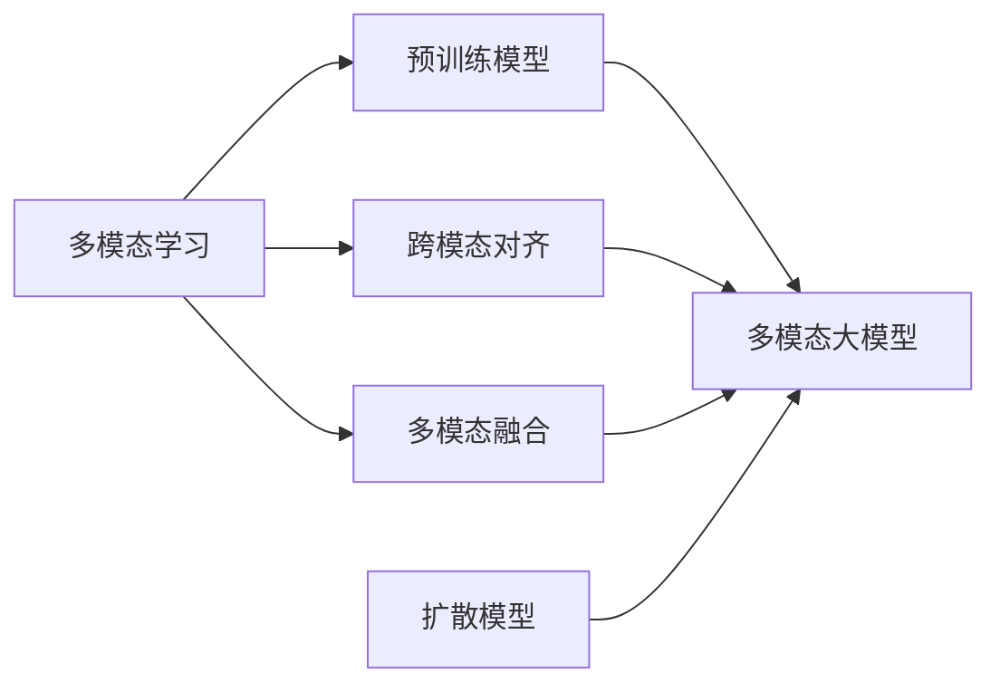

# 多模态大模型：技术原理与实战 国内多模态大模型介绍

## 1. 背景介绍
### 1.1 多模态大模型概述
#### 1.1.1 多模态大模型的定义
多模态大模型是指能够处理和理解多种不同模态数据的大规模预训练模型。这些模态包括文本、图像、音频、视频等。多模态大模型通过在海量多模态数据上进行预训练，学习不同模态之间的关联和表示，从而具备跨模态理解和生成的能力。

#### 1.1.2 多模态大模型的发展历程
多模态大模型的研究起源于单模态的预训练语言模型如BERT、GPT等。随着研究的深入，人们意识到单一模态的信息是有限的，融合多模态信息能够让模型获得更全面的认知能力。从早期的多模态融合模型如ViLBERT、LXMERT，到最新的多模态大模型如CLIP、DALL·E、Florence等，多模态大模型的性能不断提升，应用领域也在不断拓展。

#### 1.1.3 多模态大模型的意义
多模态大模型具有重要的研究意义和应用价值：

1. 促进人工智能向通用智能发展：多模态大模型能够像人一样理解和处理多种形式的信息，是迈向通用人工智能的重要一步。

2. 拓展人机交互的形式：多模态大模型支持文本、图像、语音等多种人机交互方式，使人机交互更加自然和便捷。

3. 赋能众多垂直应用：多模态大模型可应用于智能问答、视觉搜索、内容生成、医疗诊断等众多领域，为行业智能化注入新动能。

### 1.2 国内多模态大模型发展现状
#### 1.2.1 国内多模态大模型的代表性工作
近年来，国内也涌现出许多优秀的多模态大模型，代表性的工作包括：

- Wukong(悟空)：由华为诺亚方舟实验室开发，支持图文生成、视觉问答等任务，具备强大的中文理解能力。

- R-VLM：由复旦大学开发，在图文检索、视觉问答等跨模态任务上取得了优异成绩。

- BriVL：由中科院自动化所等单位联合开发，在视觉-语言预训练和下游任务如图像字幕生成等方面表现出色。

- M6：由阿里达摩院开发，是一个全面的多模态预训练模型，支持多种任务如图文生成、视频问答等。

#### 1.2.2 国内多模态大模型的发展特点
总结国内多模态大模型的发展，呈现出以下特点：

1. 重视中文场景：国内的多模态大模型普遍具备强大的中文理解和生成能力，更贴合国内用户需求。

2. 注重垂直行业应用：国内的多模态大模型研究更加注重落地应用，在教育、医疗、金融等领域均有布局。 

3. 开源共享：国内的一些顶尖研究机构如华为诺亚方舟实验室等，主动开源多模态大模型，促进了技术的普及和发展。

4. 多方协同创新：国内的多模态大模型研究呈现出产学研用协同创新的特点，高校、企业、科研院所通力合作，共同推动技术进步。

## 2. 核心概念与联系
### 2.1 多模态学习
多模态学习是指利用多种模态的数据进行机器学习的方法。与单模态学习相比，多模态学习能够从不同角度感知和理解世界，获得更全面、更准确的认知。多模态学习的核心是将不同模态的数据映射到一个共同的语义空间，学习它们之间的关联和互补信息。

### 2.2 预训练模型
预训练模型是指在大规模数据集上进行预训练，学习通用的数据表示，再针对下游任务进行微调的模型范式。预训练模型能够有效缓解标注数据缺乏、提升模型泛化能力的问题。从BERT到GPT，再到多模态预训练模型，预训练范式已成为大模型的重要特征。

### 2.3 跨模态对齐
跨模态对齐是指将不同模态的数据对齐到同一个语义空间，建立它们之间的关联。常见的跨模态对齐任务包括图文匹配、视频-文本匹配等。通过对齐学习，模型能够在不同模态之间进行信息的传递和融合，实现跨模态的理解和生成。

### 2.4 多模态融合
多模态融合是指将多个模态的信息进行整合，形成一个联合的多模态表示。常见的多模态融合方法包括早期融合、晚期融合和混合融合。通过有效的多模态融合，模型能够充分利用不同模态的互补信息，提升下游任务的性能。

### 2.5 扩散模型
扩散模型是一类生成模型，通过逐步向数据分布添加噪声，再学习如何去噪，从而生成高质量的样本。扩散模型在图像、音频等领域取得了显著成果，最新的多模态大模型如DALL·E 2、Stable Diffusion等都基于扩散模型实现图文生成。

### 2.6 概念之间的联系
以上核心概念之间存在密切的联系。多模态学习是多模态大模型的理论基础，指引如何学习和融合不同模态的信息。预训练模型是构建多模态大模型的重要范式，使其具备强大的跨模态理解和生成能力。跨模态对齐和多模态融合是实现多模态学习的两大关键技术，前者负责建立模态间的语义关联，后者负责整合不同模态的互补信息。扩散模型则是多模态大模型的重要技术手段，尤其在图像生成任务上表现突出。

下图展示了多模态大模型的核心概念之间的关系：

## 3. 核心算法原理具体操作步骤
下面以跨模态对比学习算法CLIP为例，介绍多模态大模型的核心算法原理和操作步骤。

### 3.1 CLIP简介
CLIP (Contrastive Language-Image Pre-training)是由OpenAI提出的一种跨模态对比学习算法。它通过在大规模图文对数据上进行预训练，学习图像和文本的对齐表示，从而实现零样本图像分类、图文检索等任务。

### 3.2 CLIP的核心思想
CLIP的核心思想是最大化匹配的图文对的相似度，最小化不匹配的图文对的相似度。通过这种对比学习，CLIP能够将图像和文本映射到一个共同的特征空间，使得语义相似的图像和文本在该空间中距离较近。

### 3.3 CLIP的训练过程
CLIP的训练过程可分为以下几个步骤：

1. 数据准备：收集大规模的图文对数据，如互联网上的图文对、图像标题对等。

2. 图像编码：使用卷积神经网络如ResNet对图像进行特征提取，得到图像特征向量。

3. 文本编码：使用Transformer等语言模型对文本进行特征提取，得到文本特征向量。

4. 对比学习：对于每个图文对，计算图像特征向量和文本特征向量的余弦相似度，构造对比损失函数，最大化匹配图文对的相似度，最小化不匹配图文对的相似度。

5. 模型优化：使用梯度下降等优化算法，最小化对比损失函数，更新图像编码器和文本编码器的参数。

6. 迭代训练：重复步骤4-5，直到模型收敛或达到预设的训练轮数。

### 3.4 CLIP的推理过程
CLIP训练完成后，可用于各种下游任务的推理，如零样本图像分类、图文检索等。以零样本图像分类为例，其推理过程如下：

1. 提取图像特征：使用训练好的图像编码器对待分类图像提取特征，得到图像特征向量。

2. 提取文本特征：使用训练好的文本编码器对类别名称（如"猫"、"狗"）提取特征，得到文本特征向量。

3. 计算相似度：计算图像特征向量与各个类别文本特征向量的余弦相似度。

4. 预测类别：将相似度最高的类别作为图像的预测类别。

通过上述推理过程，CLIP可以在无需训练的情况下，直接对新图像进行分类。这展现了CLIP强大的迁移学习和泛化能力。

## 4. 数学模型和公式详细讲解举例说明
本节以CLIP中的对比损失函数为例，详细讲解其数学模型和公式。

### 4.1 符号定义
首先定义符号：

- $I$：图像
- $T$：文本
- $f_i$：图像编码器，将图像映射为特征向量
- $f_t$：文本编码器，将文本映射为特征向量
- $\theta_i$：图像编码器参数
- $\theta_t$：文本编码器参数
- $\tau$：温度超参数，控制相似度分布的平滑程度

### 4.2 图文特征表示
给定一个图文对$(I, T)$，CLIP首先使用图像编码器$f_i$和文本编码器$f_t$提取其特征表示：

$$
\mathbf{v}_I = f_i(I; \theta_i) \\
\mathbf{v}_T = f_t(T; \theta_t)
$$

其中$\mathbf{v}_I$和$\mathbf{v}_T$分别表示图像和文本的特征向量。

### 4.3 对比损失函数
CLIP的目标是最大化匹配图文对的相似度，最小化不匹配图文对的相似度。这可以通过对比损失函数来实现。给定一批图文对$(I_i, T_i)$，其对比损失函数定义为：

$$
\mathcal{L}(\theta_i, \theta_t) = -\frac{1}{N} \sum_{i=1}^N \log \frac{\exp(\mathrm{sim}(\mathbf{v}_{I_i}, \mathbf{v}_{T_i}) / \tau)}{\sum_{j=1}^N \exp(\mathrm{sim}(\mathbf{v}_{I_i}, \mathbf{v}_{T_j}) / \tau)}
$$

其中$N$为批大小，$\mathrm{sim}(\mathbf{u}, \mathbf{v})$表示向量$\mathbf{u}$和$\mathbf{v}$的余弦相似度：

$$
\mathrm{sim}(\mathbf{u}, \mathbf{v}) = \frac{\mathbf{u}^\top \mathbf{v}}{\|\mathbf{u}\| \|\mathbf{v}\|}
$$

直观地理解，对比损失函数的分子项计算匹配图文对$(I_i, T_i)$的相似度，分母项计算图像$I_i$与所有文本$T_j$的相似度之和。最小化该损失函数，相当于最大化匹配图文对的相似度在所有图文对相似度中的占比，从而达到对齐图像和文本特征表示的目的。

### 4.4 训练目标
CLIP的训练目标是最小化对比损失函数，即：

$$
\min_{\theta_i, \theta_t} \mathcal{L}(\theta_i, \theta_t)
$$

通过梯度下降等优化算法，不断更新图像编码器参数$\theta_i$和文本编码器参数$\theta_t$，使得匹配图文对的相似度不断提高，不匹配图文对的相似度不断降低，最终使图像和文本在共同的特征空间中对齐。

### 4.5 示例说明
下面以一个简单的例子说明CLIP的对比学习过程。假设有以下三个图文对：

- (图像1, "一只猫") 
- (图像2, "一只狗")
- (图像3, "一辆车")

CLIP的目标是使得匹配的图文对（如图像1和"一只猫"）的相似度高于不匹配的图文对（如图像1和"一只狗"、"一辆车"）的相似度。

在训练过程中，CLIP首先提取每个图像和文本的