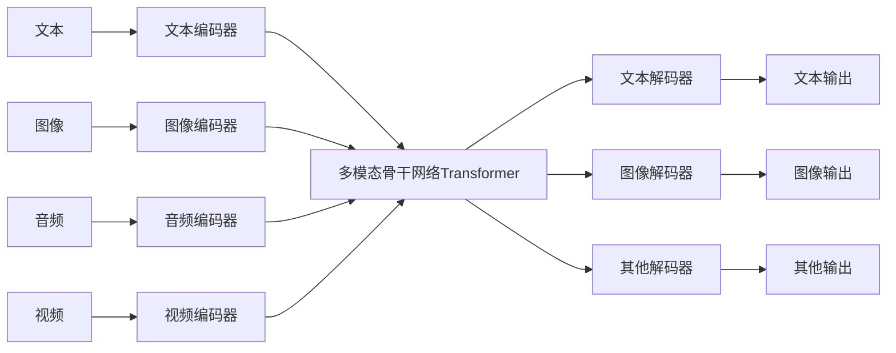

# 多模态大模型：技术原理与实战 国外多模态大模型介绍

## 1. 背景介绍
### 1.1 多模态大模型的兴起
近年来,随着深度学习技术的飞速发展,以及计算能力和数据规模的不断提升,多模态大模型开始崭露头角。多模态大模型是指能够同时处理文本、图像、音频、视频等多种模态数据的大规模预训练模型。相比单模态模型,多模态大模型可以更好地理解和表达丰富的真实世界信息,在跨模态理解、生成等任务上展现出巨大的潜力。

### 1.2 多模态大模型的重要意义
多模态大模型对于人工智能领域具有重要意义:

1. 更接近人类认知方式。人类感知世界信息本就是多模态的,多模态大模型更符合人类认知规律。
2. 实现更强大的AI系统。多模态融合有助于不同模态信息的互补,从而构建更加智能、鲁棒的AI系统。 
3. 拓展更广阔的应用场景。多模态模型在智能问答、内容生成、信息检索等领域大有可为。

### 1.3 国外多模态大模型发展概况
国外科技巨头和学术机构是多模态大模型研究的主力军。谷歌、Meta、OpenAI、DeepMind等公司和斯坦福、麻省理工等高校纷纷推出了自己的多模态大模型,如CLIP、DALL·E、Flamingo、Gato等,在业界产生了广泛影响。本文将重点介绍几个代表性的国外多模态大模型,剖析其技术原理和实践案例,以期为国内相关研究提供有益参考。

## 2. 核心概念与联系
### 2.1 多模态学习
多模态学习(Multimodal Learning)是指利用多种模态的数据(如文本、图像、音频等)进行机器学习的方法。其核心是通过学习不同模态数据之间的联系,实现跨模态的信息融合与理解。多模态学习可分为多模态融合(Multimodal Fusion)和跨模态映射(Cross-modal Mapping)两大类任务。

### 2.2 多模态融合 
多模态融合旨在将多个模态的信息整合到一个联合表示中,捕捉不同模态间的互补与关联信息,从而完成分类、回归等下游任务。常见的融合策略包括:

1. 早期融合:在特征层面直接拼接不同模态的特征向量
2. 晚期融合:对每个模态分别建模,之后在决策层融合
3. 混合融合:在网络的中间层引入交互,实现更细粒度的多模态融合

### 2.3 跨模态映射
跨模态映射则是学习不同模态空间之间的转换,如将图像映射到文本语义空间,或将文本查询映射到图像特征空间等。跨模态映射是实现多模态检索、生成等任务的基础。

### 2.4 多模态预训练
多模态预训练(Multimodal Pre-training)是指在大规模多模态数据上进行自监督学习,让模型自动学习不同模态之间的对齐和表示。其核心思想借鉴了自然语言处理领域的预训练范式,即先在大规模无监督数据上进行预训练,再在特定任务上进行微调。多模态预训练使得模型能学到更加通用、鲁棒的多模态表示,有利于下游任务的迁移学习。

### 2.5 视觉-语言预训练模型
视觉-语言预训练模型专注于图像和文本模态,通过对齐视觉和语言表示,实现跨模态的理解和生成。代表性的视觉-语言预训练模型包括:

- CLIP (Contrastive Language-Image Pre-training): 通过对比学习,将图像和文本映射到一个共同空间
- DALL·E: 给定文本生成对应图像的多模态生成模型
- Flamingo: 融合视觉、语言理解和语言生成的大规模多模态模型

### 2.6 通用多模态模型
通用多模态模型进一步扩展到多个模态,如文本、图像、视频、音频等,旨在构建一个统一的模型框架来处理所有模态的任务。DeepMind提出的Gato模型就是一个典型代表,可以用单个模型执行视觉、语言、控制等多种任务。

### 2.7 多模态大模型技术架构
下图展示了多模态大模型的一般技术架构。多个模态的数据首先通过各自的编码器提取特征,然后送入一个统一的骨干网络进行跨模态交互和融合。骨干网络一般采用Transformer等注意力机制模型。之后根据任务需求,通过解码器模块生成特定模态的输出,如文本、图像等。整个模型在大规模多模态语料上进行端到端的预训练,再针对下游任务进行微调。

## 3. 核心算法原理具体操作步骤
本节将详细介绍几个代表性多模态大模型的核心算法原理和操作步骤。

### 3.1 CLIP
CLIP (Contrastive Language-Image Pre-training)是由OpenAI提出的视觉-语言预训练模型。其核心思想是通过对比学习,将图像和文本表示映射到一个共同的特征空间,使得语义相似的图像和文本在该空间中距离更近。

CLIP的训练分为两个阶段:
1. 预训练阶段:在大规模图文对数据上进行无监督预训练
   - 随机采样一批图像和对应的文本描述
   - 图像通过视觉编码器(如ResNet)提取特征向量$v_i$
   - 文本通过文本编码器(如Transformer)提取特征向量$t_i$
   - 计算图文对$(v_i,t_i)$的对比损失,使得匹配的图文对相似度高于非匹配对
   - 损失函数采用交叉熵,对所有图文对进行对比:
    $$
    L = -\frac{1}{N}\sum_{i=1}^{N}\log\frac{\exp(\mathrm{sim}(v_i,t_i)/\tau)}{\sum_{j=1}^{N}\exp(\mathrm{sim}(v_i,t_j)/\tau)}
    $$
    其中$\mathrm{sim}$表示余弦相似度,$\tau$是温度超参数
   - 反向传播优化模型参数,使损失最小化
2. 微调阶段:在下游任务数据上进行有监督微调
   - 固定预训练好的图像编码器和文本编码器参数
   - 在特定任务上添加新的输出层,并微调该层参数
   - 如对于图像分类任务,使用预训练的图像编码器提取图像特征,再通过新的分类层预测类别
   - 微调使模型适应具体任务,提高性能

### 3.2 DALL·E
DALL·E是一个多模态生成模型,给定文本描述,可以生成与之匹配的图像。其主要分为两个阶段:

1. 文本到图像特征映射:
   - 将输入的文本描述通过一个预训练的语言模型(如GPT-3)编码为隐空间向量$z$
   - 隐空间向量$z$通过一系列解码器层解码为图像特征表示$f$
   - 特征表示$f$与一个可学习的codebook进行最近邻匹配,得到离散的图像tokens $t_1,\dots,t_n$
2. 图像tokens到像素解码:
   - 将离散的图像tokens $t_1,\dots,t_n$输入到一个自回归模型(如变压器)中
   - 自回归模型通过因果自注意力机制,逐个预测下一个图像token,得到完整的tokens序列
   - 最后通过一个解码器网络(如CNN)将图像tokens解码为RGB像素值,生成最终的图像
   
DALL·E的训练采用两阶段过程:
1. 分别预训练文本编码器和图像解码器
   - 文本编码器在大规模文本语料上进行自监督预训练,学习文本的语义表示
   - 图像解码器在大规模图像数据上进行自监督预训练,学习图像的生成建模
2. 联合训练文本到图像映射和图像tokens预测
   - 在配对的图文数据上进行端到端的联合训练
   - 优化文本到图像特征映射网络和图像tokens自回归模型的参数
   - 采用重建损失和对抗损失,使生成的图像与真实图像在视觉和语义上尽可能相似

### 3.3 Flamingo 
Flamingo是一个融合视觉、语言理解和语言生成的大规模多模态模型。其核心是将视觉和语言统一到一个序列到序列框架中,实现图文问答、视觉对话、图像描述等多种任务。

Flamingo的主要组件包括:
1. 视觉编码器:使用预训练的视觉Transformer模型(如ViT)提取图像特征
2. 语言编码器:使用预训练的语言模型(如GPT)编码文本输入
3. 多模态解码器:使用一个大规模的自回归语言模型(如GPT)作为主干,接收视觉特征和文本特征,并生成目标文本输出

Flamingo的训练过程如下:
1. 在web抓取的大规模图文对数据上进行预训练
   - 随机采样一个图像和与之相关的文本
   - 图像通过视觉编码器提取特征,文本通过语言编码器提取特征
   - 将图像特征和文本特征拼接后输入到多模态解码器中
   - 解码器预测下一个文本token,采用交叉熵损失优化
   - 预训练使模型学习到通用的视觉-语言表示和生成能力
2. 在下游任务数据上进行微调
   - 将任务输入(如图像和问题)编码后输入到多模态解码器
   - 解码器生成任务输出(如答案),计算损失并优化
   - 微调使模型适应具体任务,提高性能

Flamingo在预训练阶段引入了几个关键技术:
- 视觉特征量化:将连续的视觉特征离散化,以减小计算开销
- 稀疏注意力:在解码器中引入稀疏注意力机制,提高计算效率
- 差分数据增强:通过对比学习,使模型学习视觉-语言的一致性表示

### 3.4 Gato
Gato是一个通用的多模态模型,旨在用单个模型处理多种模态的任务。其核心思想是将所有模态的数据转化为统一的序列形式,然后用一个序列到序列的Transformer模型建模。

具体来说,Gato将每个任务的数据转化为一系列的"提示-动作"对,其中:
- 提示(prompt):包含了状态观测(如图像、文本等)和任务目标描述
- 动作(action):包含了模型针对当前提示应该采取的行为(如输出文本、动作等)

在训练时,Gato将不同任务的数据混合在一起,统一输入到Transformer模型中。模型通过自注意力机制建模不同模态数据之间的交互,并预测下一个动作token。损失函数采用交叉熵,优化模型在所有任务上的联合概率。

推理时,给定一个新的任务提示,Gato可以自回归地生成一系列动作tokens,完成对应的任务。

Gato的一个关键设计是提示工程(prompt engineering),即如何将任务数据转化为统一的提示-动作序列。这需要针对每个任务设计合适的提示模板和动作空间,以适配Transformer模型的输入输出接口。

总的来说,Gato通过将多模态数据统一建模,实现了一个通用的模型框架。但其在不同任务上的性能还有待进一步提升,也面临着样本效率、鲁棒性等挑战。

## 4. 数学模型和公式详细讲解举例说明
本节将详细讲解多模态大模型中