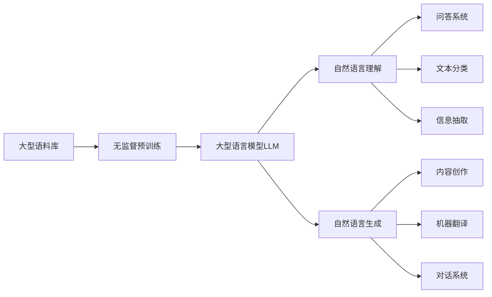
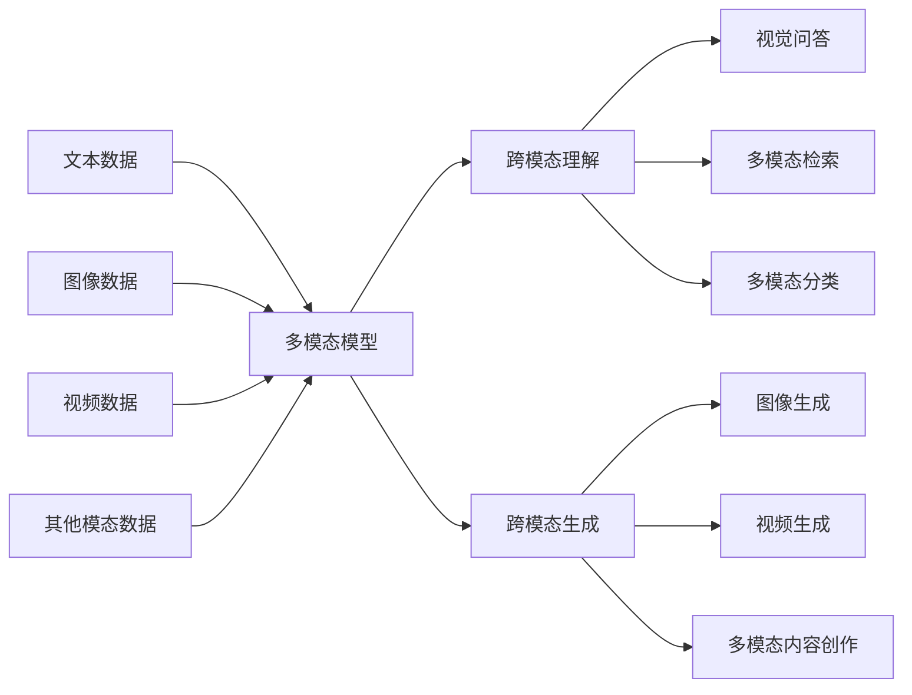
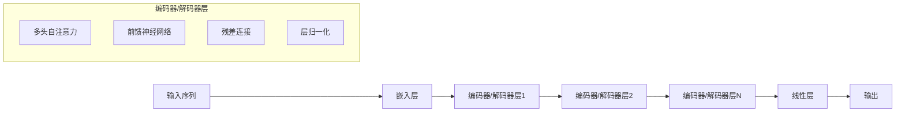

# 多模态大模型：技术原理与实战 在LLM时代，对软件研发的更多思考

## 1. 背景介绍

### 1.1 人工智能的新时代

人工智能(AI)的发展已经进入了一个新的里程碑时代。近年来,大型语言模型(LLM)和多模态AI模型的出现,为人工智能领域带来了革命性的变化。这些先进的AI模型不仅能够理解和生成自然语言,还能够处理图像、视频和其他模态数据,展现出前所未有的能力。

### 1.2 LLM和多模态模型的兴起

LLM(Large Language Model)是一种基于自然语言处理(NLP)技术训练的大型语言模型,具有出色的文本生成和理解能力。代表性模型包括GPT-3、PaLM、ChatGPT等。与此同时,多模态AI模型则能够融合多种模态数据(如文本、图像、视频等),实现跨模态的理解和生成。著名的多模态模型包括DALL-E、Stable Diffusion、Flamingo等。

### 1.3 对软件研发的影响

LLM和多模态模型的出现对软件研发产生了深远的影响。它们不仅能够辅助开发人员进行编码、调试和文档编写,还能够为用户提供更加智能和人性化的交互体验。同时,这些模型也带来了新的挑战,如隐私和安全问题、偏见和不确定性等,需要开发人员和研究人员共同努力解决。

## 2. 核心概念与联系

### 2.1 大型语言模型(LLM)

大型语言模型(LLM)是一种基于自然语言处理(NLP)技术训练的大型神经网络模型。它们通过在海量文本数据上进行无监督预训练,学习到了丰富的语言知识和上下文理解能力。

LLM的核心思想是利用自注意力(Self-Attention)机制和transformer架构,捕捉文本中的长程依赖关系,从而更好地理解和生成自然语言。常见的LLM包括GPT系列(GPT-3)、PaLM、ChatGPT等。



### 2.2 多模态模型

多模态模型是一种能够处理多种模态数据(如文本、图像、视频等)的人工智能模型。它们通过融合不同模态的信息,实现跨模态的理解和生成。

多模态模型的核心思想是利用统一的表示空间和注意力机制,捕捉不同模态之间的相关性和依赖关系。常见的多模态模型包括DALL-E、Stable Diffusion、Flamingo等。



### 2.3 LLM与多模态模型的关系

LLM和多模态模型虽然有所不同,但它们之间存在着密切的联系。一方面,LLM可以作为多模态模型的重要组成部分,用于处理文本模态数据。另一方面,多模态模型也可以利用LLM的语言理解和生成能力,提高跨模态任务的性能。

未来,LLM和多模态模型有望进一步融合,形成更加通用和强大的人工智能系统,为各种应用场景提供智能化支持。

## 3. 核心算法原理具体操作步骤

### 3.1 自注意力机制(Self-Attention)

自注意力机制是LLM和多模态模型的核心算法之一。它能够捕捉序列数据(如文本、图像等)中的长程依赖关系,从而更好地理解和生成数据。

自注意力机制的具体操作步骤如下:

1. 将输入序列映射为查询(Query)、键(Key)和值(Value)向量。
2. 计算查询和键之间的相似性得分(注意力分数)。
3. 使用注意力分数对值向量进行加权求和,得到注意力输出。
4. 将注意力输出与查询向量相加,得到最终的输出表示。

$$
\begin{aligned}
\text{Attention}(Q, K, V) &= \text{softmax}\left(\frac{QK^T}{\sqrt{d_k}}\right)V \\
\text{Output} &= \text{Attention}(Q, K, V) + Q
\end{aligned}
$$

其中,$ Q $、$ K $和$ V $分别表示查询、键和值向量,$ d_k $是缩放因子。

### 3.2 transformer架构

transformer架构是LLM和多模态模型中广泛采用的另一种核心算法。它基于自注意力机制和残差连接,能够有效地建模序列数据。

transformer架构的具体操作步骤如下:

1. 将输入序列映射为嵌入向量。
2. 通过多层编码器(Encoder)或解码器(Decoder)进行处理。
3. 每一层包含多头自注意力(Multi-Head Attention)和前馈神经网络(Feed-Forward Neural Network)。
4. 使用残差连接和层归一化(Layer Normalization)来提高模型的稳定性和收敛性。
5. 最终输出经过线性层和softmax层,得到预测结果。



### 3.3 预训练与微调

LLM和多模态模型通常采用两阶段训练策略:预训练(Pre-training)和微调(Fine-tuning)。

预训练阶段:

1. 收集大量无标注的原始数据(如文本语料、图像等)。
2. 设计自监督任务(如掩码语言模型、图像重建等)。
3. 在自监督任务上训练模型,学习通用的表示能力。

微调阶段:

1. 收集与目标任务相关的标注数据。
2. 在预训练模型的基础上,使用目标任务的标注数据进行进一步训练。
3. 通过微调,模型可以适应特定任务,提高性能。

## 4. 数学模型和公式详细讲解举例说明

### 4.1 transformer中的注意力计算

transformer中的注意力计算是一个关键步骤,用于捕捉序列数据中的长程依赖关系。具体计算过程如下:

1. 将输入序列$ X = (x_1, x_2, \dots, x_n) $映射为查询(Query)、键(Key)和值(Value)向量:

$$
\begin{aligned}
Q &= X W_Q \\
K &= X W_K \\
V &= X W_V
\end{aligned}
$$

其中,$ W_Q $、$ W_K $和$ W_V $是可学习的权重矩阵。

2. 计算查询和键之间的相似性得分(注意力分数):

$$
\text{Attention}(Q, K, V) = \text{softmax}\left(\frac{QK^T}{\sqrt{d_k}}\right)V
$$

其中,$ d_k $是缩放因子,用于防止内积过大导致梯度消失。

3. 将注意力输出与查询向量相加,得到最终的输出表示:

$$
\text{Output} = \text{Attention}(Q, K, V) + Q
$$

通过注意力计算,transformer能够自适应地捕捉序列数据中的重要信息,从而提高模型的表现。

### 4.2 多头注意力机制

为了进一步提高模型的表示能力,transformer引入了多头注意力机制(Multi-Head Attention)。多头注意力机制将注意力计算分成多个"头"(Head),每个头捕捉不同的依赖关系,最终将所有头的输出进行拼接。

具体计算过程如下:

1. 将查询(Query)、键(Key)和值(Value)向量分别线性投影到$ h $个子空间:

$$
\begin{aligned}
\text{head}_i &= \text{Attention}(QW_i^Q, KW_i^K, VW_i^V) \\
\text{MultiHead}(Q, K, V) &= \text{Concat}(\text{head}_1, \dots, \text{head}_h)W^O
\end{aligned}
$$

其中,$ W_i^Q $、$ W_i^K $、$ W_i^V $和$ W^O $是可学习的权重矩阵。

2. 将所有头的输出拼接起来,并经过一个线性变换得到最终的多头注意力输出。

通过多头注意力机制,transformer能够从不同的子空间捕捉序列数据的不同特征,提高模型的表示能力和泛化性能。

## 5. 项目实践:代码实例和详细解释说明

在本节中,我们将提供一个基于PyTorch实现的transformer模型代码示例,并详细解释其中的关键部分。

### 5.1 导入所需库

```python
import math
import torch
import torch.nn as nn
```

### 5.2 定义缩放点积注意力层

```python
class ScaledDotProductAttention(nn.Module):
    def __init__(self, d_k):
        super().__init__()
        self.d_k = d_k

    def forward(self, q, k, v, attn_mask=None):
        scores = torch.matmul(q, k.transpose(-2, -1)) / math.sqrt(self.d_k)
        if attn_mask is not None:
            scores = scores.masked_fill(attn_mask == 0, -1e9)
        attn_weights = nn.functional.softmax(scores, dim=-1)
        output = torch.matmul(attn_weights, v)
        return output, attn_weights
```

这个层实现了缩放点积注意力机制,其中:

- `q`、`k`和`v`分别表示查询(Query)、键(Key)和值(Value)向量。
- `attn_mask`是一个可选的注意力掩码,用于防止注意力分数计算时考虑无关的位置。
- 首先计算查询和键之间的点积,并除以缩放因子`sqrt(d_k)`。
- 如果提供了注意力掩码,则将无关位置的分数设置为一个非常小的值(-1e9)。
- 使用softmax函数计算注意力权重。
- 最后,将注意力权重与值向量相乘,得到注意力输出。

### 5.3 定义多头注意力层

```python
class MultiHeadAttention(nn.Module):
    def __init__(self, d_model, num_heads):
        super().__init__()
        self.num_heads = num_heads
        self.head_dim = d_model // num_heads
        self.q_linear = nn.Linear(d_model, d_model)
        self.k_linear = nn.Linear(d_model, d_model)
        self.v_linear = nn.Linear(d_model, d_model)
        self.attention = ScaledDotProductAttention(self.head_dim)
        self.out_linear = nn.Linear(d_model, d_model)

    def forward(self, q, k, v, attn_mask=None):
        batch_size = q.size(0)
        q = self.q_linear(q).view(batch_size, -1, self.num_heads, self.head_dim).transpose(1, 2)
        k = self.k_linear(k).view(batch_size, -1, self.num_heads, self.head_dim).transpose(1, 2)
        v = self.v_linear(v).view(batch_size, -1, self.num_heads, self.head_dim).transpose(1, 2)
        attn_output, attn_weights = self.attention(q, k, v, attn_mask)
        attn_output = attn_output.transpose(1, 2).contiguous().view(batch_size, -1, self.num_heads * self.head_dim)
        output = self.out_linear(attn_output)
        return output, attn_weights
```

这个层实现了多头注意力机制,其中:

- `d_model`是模型的输入和输出维度。
- `num_heads`是