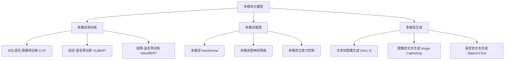

# 多模态大模型：技术原理与实战 大模型+多模态产生的化学反应

## 1. 背景介绍
### 1.1 大模型的发展历程
#### 1.1.1 早期的神经网络模型
#### 1.1.2 Transformer的出现
#### 1.1.3 预训练语言模型的崛起
### 1.2 多模态学习的兴起 
#### 1.2.1 图像与文本的跨模态理解
#### 1.2.2 语音与文本的跨模态转换
#### 1.2.3 视频与文本的跨模态分析
### 1.3 多模态大模型的诞生
#### 1.3.1 大模型与多模态学习的结合 
#### 1.3.2 多模态大模型的优势
#### 1.3.3 多模态大模型的应用前景

## 2. 核心概念与联系
### 2.1 大模型的核心概念
#### 2.1.1 自监督学习
#### 2.1.2 迁移学习
#### 2.1.3 零样本/少样本学习
### 2.2 多模态学习的核心概念  
#### 2.2.1 模态对齐
#### 2.2.2 模态融合
#### 2.2.3 模态转换
### 2.3 多模态大模型的核心概念
#### 2.3.1 多模态预训练
#### 2.3.2 多模态推理
#### 2.3.3 多模态生成

## 3. 核心算法原理具体操作步骤
### 3.1 多模态预训练算法
#### 3.1.1 对比语言-图像预训练(CLIP)
#### 3.1.2 视觉-语言预训练(ViLBERT)
#### 3.1.3 视频-语言预训练(VideoBERT) 
### 3.2 多模态推理算法
#### 3.2.1 多模态Transformer
#### 3.2.2 多模态图神经网络
#### 3.2.3 多模态注意力机制
### 3.3 多模态生成算法
#### 3.3.1 文本到图像生成(DALL-E)
#### 3.3.2 图像到文本生成(Image Captioning)
#### 3.3.3 语音到文本生成(Speech2Text)

## 4. 数学模型和公式详细讲解举例说明
### 4.1 多模态表示学习的数学建模
#### 4.1.1 多模态嵌入空间映射
#### 4.1.2 多模态对齐损失函数
#### 4.1.3 多模态融合策略
### 4.2 多模态生成的数学建模
#### 4.2.1 文本到图像生成的潜变量模型 
#### 4.2.2 图像到文本生成的序列到序列模型
#### 4.2.3 语音到文本生成的声学模型与语言模型
### 4.3 多模态推理的数学建模
#### 4.3.1 多模态知识图谱推理
#### 4.3.2 多模态问答系统建模 
#### 4.3.3 多模态对话系统建模

## 5. 项目实践：代码实例和详细解释说明
### 5.1 基于CLIP的图像分类实践
#### 5.1.1 CLIP模型的代码实现
#### 5.1.2 基于CLIP的零样本图像分类
#### 5.1.3 CLIP在图像检索中的应用
### 5.2 基于DALL-E的文本到图像生成实践
#### 5.2.1 DALL-E模型的代码实现
#### 5.2.2 使用DALL-E进行文本引导的图像生成
#### 5.2.3 DALL-E在创意设计中的应用
### 5.3 基于VideoBERT的视频问答实践
#### 5.3.1 VideoBERT模型的代码实现
#### 5.3.2 构建视频问答数据集
#### 5.3.3 使用VideoBERT进行视频问答

## 6. 实际应用场景
### 6.1 多模态大模型在智能搜索中的应用
#### 6.1.1 多模态语义检索
#### 6.1.2 跨模态信息匹配与排序
#### 6.1.3 个性化搜索与推荐
### 6.2 多模态大模型在智能创作中的应用
#### 6.2.1 AI绘画与设计
#### 6.2.2 智能视频创作
#### 6.2.3 智能音乐生成
### 6.3 多模态大模型在智能交互中的应用  
#### 6.3.1 多模态对话系统
#### 6.3.2 虚拟数字人
#### 6.3.3 智能客服与助手

## 7. 工具和资源推荐
### 7.1 多模态数据集
#### 7.1.1 MS COCO
#### 7.1.2 Visual Genome
#### 7.1.3 VQA 
### 7.2 多模态开源模型
#### 7.2.1 CLIP
#### 7.2.2 DALL-E
#### 7.2.3 VideoBERT
### 7.3 多模态开发工具
#### 7.3.1 OpenAI CLIP
#### 7.3.2 Hugging Face Transformers
#### 7.3.3 MMF

## 8. 总结：未来发展趋势与挑战
### 8.1 多模态大模型的未来发展趋势
#### 8.1.1 更大规模与更强能力
#### 8.1.2 更广泛的模态覆盖
#### 8.1.3 更紧密的人机协同
### 8.2 多模态大模型面临的挑战
#### 8.2.1 计算与存储瓶颈
#### 8.2.2 数据隐私与安全
#### 8.2.3 伦理与法律问题
### 8.3 多模态大模型的研究方向
#### 8.3.1 多模态知识表示与推理
#### 8.3.2 多模态信息压缩与传输
#### 8.3.3 多模态模型的可解释性

## 9. 附录：常见问题与解答
### 9.1 多模态大模型与传统机器学习方法相比有何优势？
### 9.2 多模态预训练需要多大规模的数据和计算资源？  
### 9.3 如何评估多模态大模型的性能表现？
### 9.4 多模态大模型在实际应用中可能面临哪些部署难题？
### 9.5 多模态大模型会对传统行业带来哪些冲击与变革？

多模态大模型是人工智能领域的前沿方向，它通过将大规模预训练与多模态学习相结合，实现了跨模态的理解、推理和生成等多种能力。多模态预训练利用海量的图文、视频、音频等异构数据，学习不同模态之间的对齐与融合；多模态推理基于预训练模型，实现跨模态的知识推理与问答；多模态生成则探索了文本、图像、语音等模态之间的相互转换与创作。

在技术实现上，多模态大模型采用了一系列创新的算法与架构。对比语言-图像预训练(CLIP)通过对比学习，将图像与文本映射到同一个语义空间；视觉-语言预训练(ViLBERT)利用自注意力机制，建模图像区域与文本词汇之间的交互；视频-语言预训练(VideoBERT)则进一步引入时序建模，捕捉视频帧与语句之间的对应关系。在推理阶段，多模态Transformer、图神经网络、注意力机制等技术被广泛应用，以实现模态间的信息传递与融合。而在生成任务中，DALL-E、Image Captioning、Speech2Text等模型则分别探索了从文本到图像、从图像到文本、从语音到文本的跨模态映射。

多模态大模型在智能搜索、创意设计、人机交互等领域展现出了广阔的应用前景。比如，多模态语义检索可以实现图文匹配、以图搜图等多种检索方式；AI绘画与智能视频创作助力设计师高效生成图像与视频内容；多模态对话系统与虚拟数字人则为人机交互带来更自然、丰富的体验。

展望未来，多模态大模型将向着更大规模、更强能力、更广覆盖、更紧密人机协同的方向发展。同时，它也面临着计算存储瓶颈、数据隐私安全、伦理法律等多重挑战。未来的研究方向可能集中在多模态知识表示与推理、多模态信息压缩与传输、多模态模型可解释性等前沿问题上。

总之，多模态大模型代表了人工智能技术的新范式，它有望打破传统的模态边界，实现真正的通用智能。随着多模态大模型的不断发展与成熟，我们有理由相信，它必将在智能搜索、智能创作、智能交互等领域掀起新的变革浪潮，为人类社会智能化进程带来深远影响。

作者：禅与计算机程序设计艺术 / Zen and the Art of Computer Programming