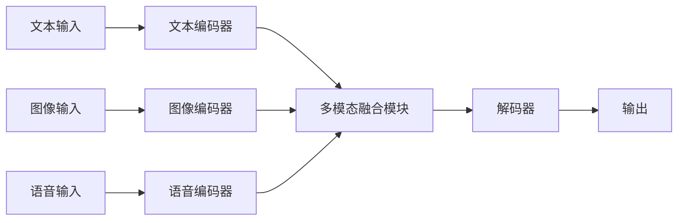

# 多模态大模型：技术原理与实战 智能客服

## 1. 背景介绍
### 1.1 多模态大模型的兴起
近年来,随着人工智能技术的飞速发展,大模型(Large Language Models)在自然语言处理领域取得了突破性进展。而多模态大模型作为大模型的延伸,通过融合文本、语音、图像等多种模态信息,进一步拓展了人工智能的应用边界。多模态大模型能够更全面地理解和分析复杂场景,为智能化应用提供更强大的支持。

### 1.2 智能客服的需求与挑战
在当前的商业环境下,企业面临着海量的客户咨询和服务需求。传统的人工客服模式已经难以满足快速响应、全天候服务的要求。智能客服应运而生,通过引入人工智能技术,实现客服业务的自动化和智能化。然而,智能客服也面临着诸多挑战,例如语义理解的准确性、多轮对话的连贯性、个性化服务的实现等。多模态大模型为解决这些挑战提供了新的思路和方法。

### 1.3 多模态大模型在智能客服中的应用价值
将多模态大模型应用于智能客服,可以显著提升客服系统的理解能力和服务质量。多模态大模型能够综合利用文本、语音、图像等多种信息,深入理解用户意图,准确把握对话语境。同时,多模态大模型还可以生成流畅自然的回复,提供个性化的服务建议,大大改善用户体验。此外,多模态大模型还能够持续学习和优化,不断提升智能客服的性能表现。

## 2. 核心概念与联系
### 2.1 多模态学习
多模态学习(Multimodal Learning)是指利用多种不同形式的数据(如文本、图像、音频等)进行联合建模和学习的方法。不同模态的数据蕴含着互补的信息,通过多模态学习可以更全面地理解和表征复杂场景。多模态学习的核心在于如何有效地融合不同模态的特征,挖掘它们之间的关联和互动。

### 2.2 大模型
大模型是指参数量巨大(数亿到上千亿)的深度学习模型,尤其是自然语言处理领域的预训练语言模型(如BERT、GPT等)。大模型通过在海量数据上进行预训练,能够学习到丰富的语言知识和常识,具有强大的语义理解和生成能力。大模型的出现极大地推动了人工智能技术的进步。

### 2.3 多模态大模型
多模态大模型是大模型的延伸,旨在将多模态学习与大模型相结合。通过引入多种模态的数据(如图像、语音等),多模态大模型能够学习到更加全面和准确的语义表征。多模态大模型不仅继承了大模型的语言理解能力,还能够利用视觉、听觉等信息进行跨模态推理和生成。

### 2.4 智能客服
智能客服是指利用人工智能技术,实现客服业务自动化和智能化的系统。智能客服能够通过自然语言交互,理解用户意图,提供相应的咨询和服务。智能客服的核心目标是提高客服效率,改善用户体验,降低人工成本。多模态大模型为智能客服提供了更强大的语义理解和生成能力,使其能够处理更加复杂的客户需求。

## 3. 核心算法原理与具体操作步骤
### 3.1 多模态大模型的整体架构
多模态大模型通常采用编码器-解码器(Encoder-Decoder)的架构。编码器负责将不同模态的输入数据映射到一个共享的语义空间,解码器则根据编码的语义表征生成相应的输出。具体而言,多模态大模型的架构可以分为以下几个关键组件:

1. 文本编码器:负责将文本输入转换为语义向量表示。常用的文本编码器包括BERT、RoBERTa等预训练语言模型。
2. 图像编码器:负责将图像输入转换为语义向量表示。常用的图像编码器包括CNN(卷积神经网络)、ViT(Vision Transformer)等。
3. 语音编码器:负责将语音输入转换为语义向量表示。常用的语音编码器包括SincNet、Wav2Vec等。
4. 多模态融合模块:负责将不同模态的语义表征进行融合,生成一个统一的多模态表示。常用的融合方法包括注意力机制、双线性池化等。
5. 解码器:根据多模态表示生成相应的输出,如文本回复、图像描述等。常用的解码器包括Transformer、LSTM等。

下面是多模态大模型的整体架构示意图(使用Mermaid绘制):



### 3.2 预训练阶段
多模态大模型的训练通常分为两个阶段:预训练阶段和微调阶段。预训练阶段的目标是在大规模多模态数据上学习通用的语义表征。具体步骤如下:

1. 数据准备:收集和清洗大规模的文本、图像、语音等多模态数据,构建预训练数据集。
2. 模型初始化:根据多模态大模型的架构,初始化各个组件的参数。
3. 预训练任务设计:设计合适的预训练任务,如掩码语言建模(Masked Language Modeling)、图像-文本匹配(Image-Text Matching)等,以促进模型学习跨模态的语义表征。
4. 模型训练:使用预训练数据集,通过优化预训练任务的目标函数,对多模态大模型进行训练。常用的优化算法包括Adam、AdamW等。
5. 模型评估:在验证集上评估模型的性能,选择最优的模型参数。

### 3.3 微调阶段
在预训练的基础上,微调阶段针对具体的下游任务(如智能客服)对多模态大模型进行调整和优化。具体步骤如下:

1. 任务定义:明确智能客服的输入和输出形式,定义任务的目标函数。
2. 数据准备:收集和标注智能客服领域的多模态数据,构建微调数据集。
3. 模型微调:使用预训练的多模态大模型作为初始化参数,在微调数据集上对模型进行训练。通过优化任务的目标函数,调整模型参数以适应智能客服场景。
4. 模型评估:在测试集上评估微调后的模型性能,选择最优的模型参数。
5. 模型部署:将微调后的多模态大模型集成到智能客服系统中,实现客服业务的自动化和智能化。

## 4. 数学模型和公式详细讲解举例说明
### 4.1 文本编码器
文本编码器的目标是将文本输入 $x_t$ 转换为语义向量表示 $h_t$。以BERT为例,其编码过程可以表示为:

$$h_t = \text{BERT}(x_t)$$

其中,$\text{BERT}(\cdot)$ 表示BERT模型的前向计算过程,包括词嵌入、位置嵌入、多头注意力机制和前馈神经网络等。

### 4.2 图像编码器
图像编码器的目标是将图像输入 $x_i$ 转换为语义向量表示 $h_i$。以CNN为例,其编码过程可以表示为:

$$h_i = \text{CNN}(x_i)$$

其中,$\text{CNN}(\cdot)$ 表示卷积神经网络的前向计算过程,包括卷积层、池化层和全连接层等。

### 4.3 语音编码器
语音编码器的目标是将语音输入 $x_s$ 转换为语义向量表示 $h_s$。以SincNet为例,其编码过程可以表示为:

$$h_s = \text{SincNet}(x_s)$$

其中,$\text{SincNet}(\cdot)$ 表示SincNet模型的前向计算过程,包括Sinc卷积层、池化层和全连接层等。

### 4.4 多模态融合
多模态融合的目标是将不同模态的语义表征 $h_t$、$h_i$、$h_s$ 融合为一个统一的多模态表示 $h_m$。常用的融合方法包括注意力机制和双线性池化。

以注意力机制为例,其融合过程可以表示为:

$$\alpha_t = \frac{\exp(W_t h_t)}{\sum_{k\in\{t,i,s\}}\exp(W_k h_k)}$$
$$\alpha_i = \frac{\exp(W_i h_i)}{\sum_{k\in\{t,i,s\}}\exp(W_k h_k)}$$
$$\alpha_s = \frac{\exp(W_s h_s)}{\sum_{k\in\{t,i,s\}}\exp(W_k h_k)}$$
$$h_m = \alpha_t h_t + \alpha_i h_i + \alpha_s h_s$$

其中,$W_t$、$W_i$、$W_s$ 是可学习的注意力权重矩阵,$\alpha_t$、$\alpha_i$、$\alpha_s$ 是归一化的注意力权重,表示不同模态对最终表示的贡献程度。

### 4.5 解码器
解码器的目标是根据多模态表示 $h_m$ 生成相应的输出 $y$。以Transformer解码器为例,其生成过程可以表示为:

$$y = \text{TransformerDecoder}(h_m)$$

其中,$\text{TransformerDecoder}(\cdot)$ 表示Transformer解码器的前向计算过程,包括自注意力机制、编码-解码注意力机制和前馈神经网络等。

## 5. 项目实践：代码实例和详细解释说明
下面是一个简化版的多模态大模型在智能客服中应用的PyTorch代码示例:

```python
import torch
import torch.nn as nn

class MultimodalModel(nn.Module):
    def __init__(self, text_encoder, image_encoder, audio_encoder, fusion_method, decoder):
        super(MultimodalModel, self).__init__()
        self.text_encoder = text_encoder
        self.image_encoder = image_encoder
        self.audio_encoder = audio_encoder
        self.fusion_method = fusion_method
        self.decoder = decoder
    
    def forward(self, text_input, image_input, audio_input):
        text_embedding = self.text_encoder(text_input)
        image_embedding = self.image_encoder(image_input)
        audio_embedding = self.audio_encoder(audio_input)
        
        if self.fusion_method == 'attention':
            attn_weights = torch.softmax(torch.cat([text_embedding, image_embedding, audio_embedding], dim=-1), dim=-1)
            multimodal_embedding = attn_weights[:, 0:1] * text_embedding + \
                                   attn_weights[:, 1:2] * image_embedding + \
                                   attn_weights[:, 2:3] * audio_embedding
        elif self.fusion_method == 'concatenation':
            multimodal_embedding = torch.cat([text_embedding, image_embedding, audio_embedding], dim=-1)
        
        output = self.decoder(multimodal_embedding)
        return output

# 实例化各个组件
text_encoder = BertModel.from_pretrained('bert-base-uncased')
image_encoder = ResNet50(pretrained=True)
audio_encoder = SincNet()
fusion_method = 'attention'
decoder = TransformerDecoder(d_model=512, nhead=8, num_layers=6)

# 构建多模态大模型
model = MultimodalModel(text_encoder, image_encoder, audio_encoder, fusion_method, decoder)

# 定义损失函数和优化器
criterion = nn.CrossEntropyLoss()
optimizer = torch.optim.AdamW(model.parameters(), lr=1e-4)

# 训练循环
for epoch in range(num_epochs):
    for batch in dataloader:
        text_input, image_input, audio_input, target = batch
        output = model(text_input, image_input, audio_input)
        loss = criterion(output, target)
        
        optimizer.zero_grad()
        loss.backward()
        optimizer.step()
```

代码解释:
1. 定义了一个 `MultimodalModel` 类,其中包含文本编码器、图像编码器、语音编码器、融合方法和解码器等组件。
2. 在 `forward` 方法中,分别使用文本编码器、图像编码器和语音编码器对输入进行编码,得到对应的语义表征。
3. 根据选择的融合方法(如注意力机制或拼接),将不同模态的语义表征融合为一