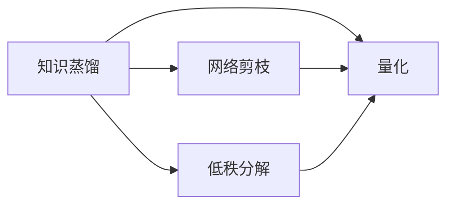

# 多模态大模型：技术原理与实战 模型压缩技术介绍

## 1. 背景介绍

### 1.1 多模态大模型的兴起与挑战
近年来,随着深度学习技术的快速发展,多模态大模型(Multimodal Large Models)得到了广泛关注和应用。多模态大模型能够同时处理文本、图像、语音等多种模态的数据,在智能问答、视觉问答、语音识别等任务上取得了显著的性能提升。然而,多模态大模型通常包含数以亿计的参数,模型体积庞大,给模型的存储和推理带来了巨大挑战。

### 1.2 模型压缩技术的重要意义
为了让多模态大模型能够在资源受限的场景下(如移动设备、嵌入式系统)高效运行,模型压缩技术应运而生。模型压缩旨在在尽量保持模型性能的同时,最大程度地减小模型体积,降低计算和存储开销。模型压缩不仅能让大模型在边缘设备上实时推理,还能节省云端推理的成本,对于多模态大模型的落地应用具有重要意义。

### 1.3 本文的主要内容
本文将重点介绍多模态大模型压缩的几种主流技术,包括知识蒸馏、网络剪枝、低秩分解和量化等。我们将分别阐述各种技术的核心原理、数学模型、实现细节,并给出具体的代码实例。同时,本文还将讨论模型压缩技术在实际应用中的场景和挑战,为读者提供全面的技术指导和实践参考。

## 2. 核心概念与联系

### 2.1 知识蒸馏(Knowledge Distillation)
知识蒸馏是一种通过teacher模型(大模型)指导student模型(小模型)训练的方法,旨在将大模型学到的知识"蒸馏"到小模型中。具体来说,知识蒸馏利用teacher模型的soft target(即模型输出的概率分布)作为student模型学习的目标,使得student模型能模仿teacher模型的行为。通过蒸馏,小模型能达到与大模型相近的性能。

### 2.2 网络剪枝(Network Pruning) 
网络剪枝通过移除神经网络中冗余和不重要的连接或神经元,从而得到一个更紧凑的网络结构。剪枝后的模型参数量大幅减少,但仍能保持较高的性能。剪枝可分为非结构化剪枝和结构化剪枝。非结构化剪枝任意移除连接,而结构化剪枝按照某种结构(如通道、层)移除连接,更有利于硬件加速。

### 2.3 低秩分解(Low-Rank Decomposition)
低秩分解基于这样一个假设:神经网络的权重矩阵可以分解为若干个低秩矩阵的乘积。通过低秩分解,我们用多个小矩阵来近似大矩阵,从而减小模型参数量。以矩阵奇异值分解(SVD)为例,一个矩阵可分解为两个小矩阵和一个对角阵,然后用小矩阵重构原矩阵,达到参数压缩的效果。

### 2.4 量化(Quantization)
量化是一种降低神经网络数值精度的技术。一般的神经网络使用32位浮点数(FP32)表示,量化后可以用更低位宽的定点数如INT8、INT4、二值甚至三值(-1,0,1)等来表示。定点数运算速度更快,所需存储空间也大幅减小。但量化会带来一定的精度损失,因此需要在压缩率和性能间权衡。

### 2.5 各种技术之间的联系
上述四种模型压缩技术并非独立的,而是可以相互结合,取长补短。例如:
- 可先用剪枝移除冗余结构,再用量化压缩剩余权重,达到事半功倍的效果。
- 可用知识蒸馏指导剪枝过程,先蒸馏再剪枝,使剪枝更加稳定高效。
- 低秩分解与剪枝都是基于权重稀疏性的假设,因此可将二者联合应用。
- 量化与其他三种方法正交,量化后的模型仍可继续蒸馏、剪枝和分解。

下图展示了四种技术的内在联系:

## 3. 核心算法原理与具体操作步骤

### 3.1 知识蒸馏算法

#### 3.1.1 软目标蒸馏
软目标蒸馏的核心思想是让student模型去模仿teacher模型软化后的输出概率分布。具体步骤如下:
1. 训练一个高性能的大模型作为teacher模型。
2. 固定teacher模型参数,用teacher模型的软化输出作为student模型的训练目标。软化输出通过在原始输出上除以一个温度系数T得到。
3. 训练student模型,其损失函数为student预测与teacher软化输出的交叉熵。公式如下:
$$ \mathcal{L}_{KD} = \alpha T^2 \cdot \mathcal{H}(y_s, \sigma(\frac{z_t}{T})) + (1-\alpha) \cdot \mathcal{H}(y_s, y) $$
其中$y_s$为student预测,$z_t$为teacher原始输出,$\sigma$为softmax函数,$y$为真实标签,$\alpha$为蒸馏损失的权重。
4. 蒸馏完成后,得到的student模型在体积小的同时,性能接近teacher模型。

#### 3.1.2 关系蒸馏
除了蒸馏软目标,我们还可以蒸馏不同样本间的相对关系。以两个样本为例:
1. 用teacher模型提取两个样本的特征,并计算特征的内积或欧氏距离,作为表征样本间关系的teacher关系。
2. 类似地,用student模型提取特征并计算student关系。
3. 训练student模型,使其student关系与teacher关系尽量一致。常用的损失函数有平方损失、huber损失等。
4. 通过关系蒸馏,student模型可以学到样本间的重要关系信息。

### 3.2 网络剪枝算法

#### 3.2.1 基于权重大小的剪枝
最简单的剪枝策略是基于权重大小,即认为权重绝对值小的连接是冗余的,可以直接移除。具体步骤如下:
1. 训练原始的大模型。
2. 计算每个权重的绝对值大小,设定一个阈值,将小于阈值的权重置零。
3. 在剪枝后的稀疏模型上进行若干轮微调,使其恢复性能。
4. 最后再将稀疏模型压缩成紧凑的模型,即移除被置零的权重,得到最终的小模型。

#### 3.2.2 基于梯度的剪枝 
相比权重大小,权重的梯度可以更好地反映其重要性。基于梯度的剪枝步骤如下:
1. 正常训练若干轮,计算每个权重的梯度累积值(绝对值之和)。  
2. 将梯度累积值从小到大排序,根据设定的稀疏度,将梯度最小的一部分权重置零。
3. 继续训练若干轮,同时保持被剪枝的权重始终为零。
4. 重复上述步骤,每隔一定轮次更新一次剪枝掩码,直到达到目标稀疏度。
5. 最后再将模型压缩成紧凑的形式。

### 3.3 低秩分解算法

#### 3.3.1 SVD分解
对于一个$m\times n$的矩阵$W$,其SVD分解为:
$$W=U\Sigma V^T$$
其中$U$是$m \times m$阶正交矩阵,$\Sigma$是$m \times n$阶对角矩阵,$V$是$n \times n$阶正交矩阵。
SVD分解的步骤如下:
1. 对神经网络每一层的权重矩阵做SVD分解。
2. 取前$r$个最大的奇异值,其中$r$远小于$m$和$n$,得到截断的$U_r, \Sigma_r, V_r$。
3. 用$U_r, \Sigma_r, V_r$重构原矩阵$\hat{W} \approx U_r\Sigma_rV_r^T$。
4. 微调整个网络,使其适应新的低秩权重。

#### 3.3.2 Tucker分解
Tucker分解可看作SVD在高维张量上的推广。对于一个三维张量$\mathcal{W} \in \mathbb{R}^{m \times n \times p}$,Tucker分解为:
$$\mathcal{W} \approx \mathcal{G} \times_1 A \times_2 B \times_3 C$$
其中$\mathcal{G} \in \mathbb{R}^{r_1 \times r_2 \times r_3}$称为核心张量,$A \in \mathbb{R}^{m \times r_1}, B \in \mathbb{R}^{n \times r_2}, C \in \mathbb{R}^{p \times r_3}$称为因子矩阵。
Tucker分解的步骤与SVD类似:
1. 对网络中的张量做Tucker分解,得到核心张量和因子矩阵。
2. 降低核心张量的秩$r_1,r_2,r_3$,得到压缩后的张量。
3. 微调网络适应新的张量。

### 3.4 量化算法

#### 3.4.1 二值量化
最极端的量化是二值量化,即将浮点权重和激活量化为$\{-1,+1\}$。二值网络可用如下步骤得到:
1. 正常训练浮点网络。
2. 前向传播时,用$sign$函数将权重和激活二值化:
$$ W_b = sign(W), \quad A_b = sign(A) $$
3. 反向传播时,仍将梯度回传到原始的浮点权重上,即STE(Straight-Through Estimator)。
4. 测试时,所有运算均为二值运算,极大提升速度。

#### 3.4.2 三值/四值量化
与二值量化类似,三值/四值量化将权重量化为$\{-1,0,+1\}$或$\{-2,-1,+1,+2\}$。相比二值量化,三值/四值量化多了一个或两个可学习的缩放因子。量化步骤如下:
1. 初始化缩放因子$\alpha$和$\beta$。
2. 前向传播时,用$\alpha$和$\beta$对原始权重做归一化,再用阈值函数量化。例如,四值量化为:
$$ \hat{W} = \alpha \cdot W / \max(|W|) $$
$$ W_q = \begin{cases} 
-2, & \hat{W} \leq -0.5 \\
-1, & -0.5 < \hat{W} \leq 0 \\
+1, & 0 < \hat{W} \leq 0.5 \\
+2, & \hat{W} > 0.5
\end{cases} $$
3. 反向传播时,同样用STE将梯度回传到浮点权重,同时学习缩放因子。
4. 测试时,用定点运算加速推理。

#### 3.4.3 任意位宽量化
为支持任意位宽的定点表示,我们可以采用非均匀量化。常见的方法有:
1. 对数量化:将权重取对数,再做线性量化。取对数可以自动将更多比特分配给小权重。
2. k-means聚类量化:用k-means将权重聚为$k$类,每一类共享同一个聚类中心值。
3. 乘积量化:将矩阵分块,每个块用一个标量和一个低位矩阵的乘积来表示。

非均匀量化能在相同位宽下达到更高的精度,但计算开销也更大一些。

## 4. 数学模型与公式详解

### 4.1 SVD分解的低秩重构误差
在SVD分解中,我们用前$r$个奇异值重构原矩阵。设原矩阵为$A$,重构矩阵为$\hat{A}$,则重构误差为:
$$ \|A-\hat{A}\|_F^2 = \sum_{i=r+1}^n \sigma_i^2 $$
其中$\sigma_i$为第$i$大的奇异值,$\